# GPU 原理

> 来源：GPU 原理与分布式训练基础 3/36 — 大模型基础与分词技术

---

## 名词解释

| 缩写 | 全称 | 含义 |
|------|------|------|
| **FLOP** | Floating Point Operations | 浮点运算（次数） |
| **FLOPS** | Floating Point Operations Per Second | 每秒浮点运算次数（性能单位） |
| **FLOPs** | Floating Point Operations | 浮点运算次数（常用于表示模型计算量） |

## 从问题开始

1. 为什么有类似波浪的性能曲线？
2. 如何做快速算法？
   - **Flash Attention**：通过计算 attention operation 实现更长的 context

---

## 一、硬件概述

GPU 作为深度学习加速器，与 CPU、TPU 共同构成 hardware stack 的非并行部分。

### 1.1 CPU vs. GPU

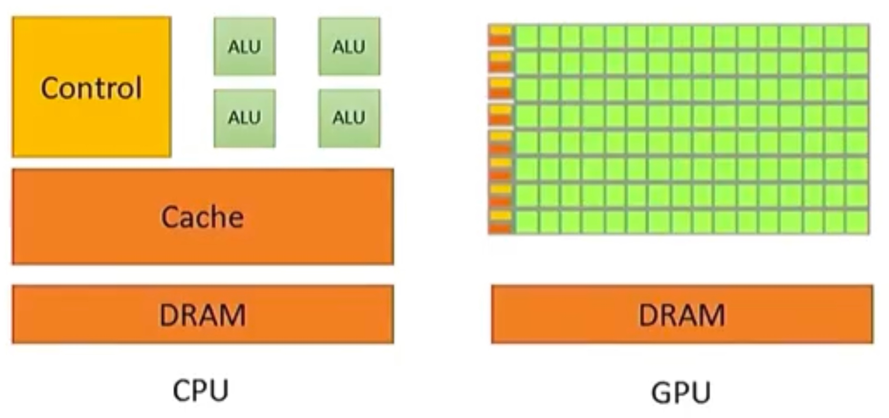
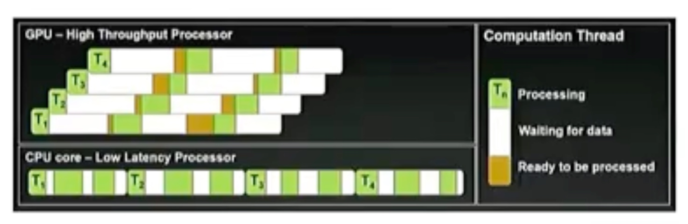

| 特性 | CPU | GPU |
|------|-----|-----|
| **优化目标** | 针对时延优化 | 为大量线程优化吞吐（总处理数据量） |
| **线程策略** | 少量、快速线程（每个线程结束更快） | 大量小型计算单元（ALUs） |
| **擅长** | control、cache，处理更多的条件控制逻辑 | 大规模并行计算 |

### 1.2 GPU 架构核心组件

#### 执行单元 Execution Units

##### Streaming Multiprocessor（SM）

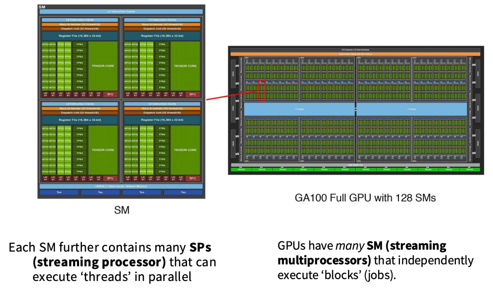

- 每个 GPU 有多个 SM，SM 能独立执行 blocks（jobs），是任务的最小执行单元
- SM 有大量控制逻辑，例如做 branching
- 每个 SM 包含多个 **SPs（Streaming Processor）**，SP 支持并行执行 threads
- ALU 是逻辑概念，SP 是 NVIDIA 的实现

#### Memory

**memory 离 SM 越近就越快**

- L1、Shared Memory 在 SM 内部
- L2 on die
- Global Memory（DRAM）是 GPU 旁边的 memory chips

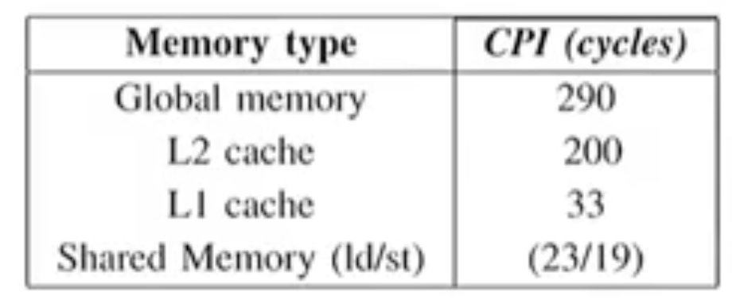

---

## 二、执行模型 Execution Model

### 2.1 Threads

- **SIMT**：thread 并行执行，所有 threads 对不同 input 执行相同指令

### 2.2 Blocks

- Blocks 是一组 threads，每个 block 运行在一个 SM，拥有自己的 shared memory

### 2.3 Warp

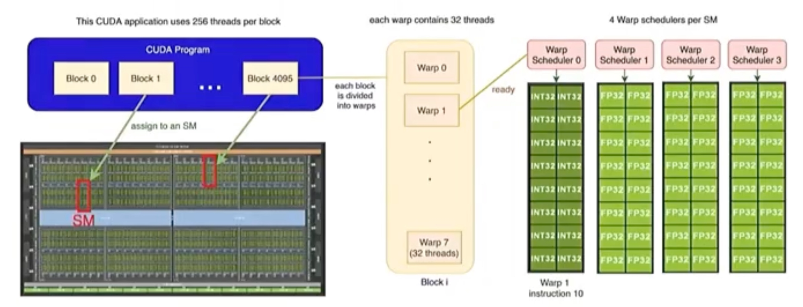

执行粒度
- 1 个 block 含 32 个线程（8 个 warp），线程连续编号
- 每 4 个线程组成一个 **warp scheduler**，共同调度到一个 SM

### 2.4 内存模型 Memory Model

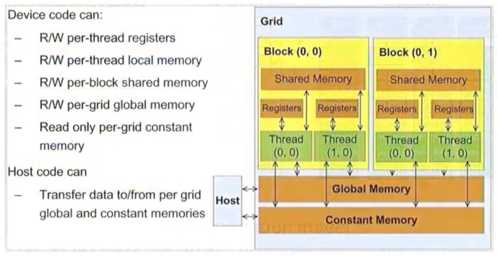

- thread 访问自己的 register，在 block 内共享内存
- block 间通过读写 global memory 传递信息

---

## 三、TPUs 工作原理

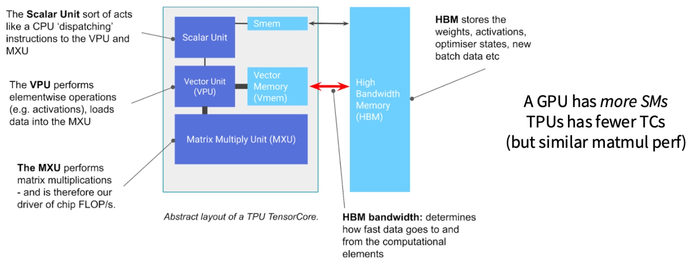

> GPU、TPU 和其它 accelerators 都在 high level 工作
> side thread

### 3.1 标量单元 Scalar Unit

- **定义**：一次操作处理单个数据的计算单元，原子操作
- **特点**：
  - GPU 的每个 CUDA Core 本质上是一个标量单元，专门负责一个 thread 内的计算
  - CPU 本质上是一个高度优化的 Scalar Unit
  - 向 VPU、MXU 分发指令
  - Smem

### 3.2 向量单元 Vector Unit

- **定义**：一次操作处理一组数据的计算单元，实现数据级并行，将相同操作应用于一组数据
- **特点**：SIMD（单指令多数据）
- **应用**：
  - CPU 中的 SSE/AVX 指令集是 Vector Unit
  - 一个 AVX-512 指令可以同时处理 16 个 32bit 浮点数
  - GPU SIMT 模型可以看作更灵活、更细粒度的向量处理
- **高效原因**：取指令、解码开销均摊到 N 个数据上，能效比高
- **高吞吐**：处理图像、音频、科学计算等数据密集型任务时，吞吐量是 Scalar Unit 的 N 倍
- **Vector Memory（Vmem）**

#### 理论上能 N 倍提升，实际上能吗？

**理论上可以**，以 N 个数相加为例：

1. **Scalar Unit**：取指 N 次 + 译码 N 次 + 执行 N 次
2. **Vector Unit**：取值 1 次 + 译码 1 次 + 执行 N 次

**实际上不能**，原因如下：

1. **内存带宽**：需要先从主存加载数据至缓存，再进行计算，瓶颈是 `min(内存带宽, 计算单元峰值)`
2. **数据依赖与流水线停顿**：计算不是独立的，依赖上轮计算结果（如 `A[i] = A[i-1] + B[i]`），迫使计算变成串行
3. **控制流**：代码存在条件判断（if/else），而 SIMD 要求所有数据通道执行相同指令。遇到 branch 时，处理器需要先为所有满足的元素执行 then 路径，再为所有不满足的元素执行 else 路径，最后合并结果，会产生大量冗余计算，降低效率
4. **数据对齐与连续访问**：内存数据布局不理想，而 Vector Unit 希望一次抓取一个连续、对齐的内存块。如果数据稀疏、非连续、未对齐，硬件需要执行多次内存访问来拼凑出完整向量，性能会急剧下降
5. **阿姆达尔定律**：理论上的终极上限
   - 公式：`Speedup = 1 / ((1 - P) + P / N)`
   - 假设 90% 代码可以向量化（P = 0.9），向量宽度 N = 8，则 `Speedup = 1 / ((1 - 0.9) + 0.9 / 8) = 4.7 倍`
   - 即使 Vector 无限强大（N → +∞），`Speedup 上限 = 1 / (1 - P) = 10 倍`

### 3.3 矩阵乘法单元 Matrix Multiply Unit（MXU）

- **定义**：专门为矩阵乘法设计的专用硬件电路，适合 AI、HPC 计算，是芯片 FLOP/s 的 driver
- **特点**：
  - 一条指令执行一个完整的小矩阵块的乘加运算，数据并行度极高
  - 不是通用 ALU，而是专门通过硬连线电路来执行 `D = A * B + C` 这个特定操作
  - 通常支持混合精度计算，例如用 FP16 乘法，用 FP32 累加，保证精度同时大幅提升性能和降低带宽
- **代表技术**：NVIDIA 的 Tensor Core，Google 的 TPU 的 MXU

#### 标量 / 向量 / 矩阵单元示例对比

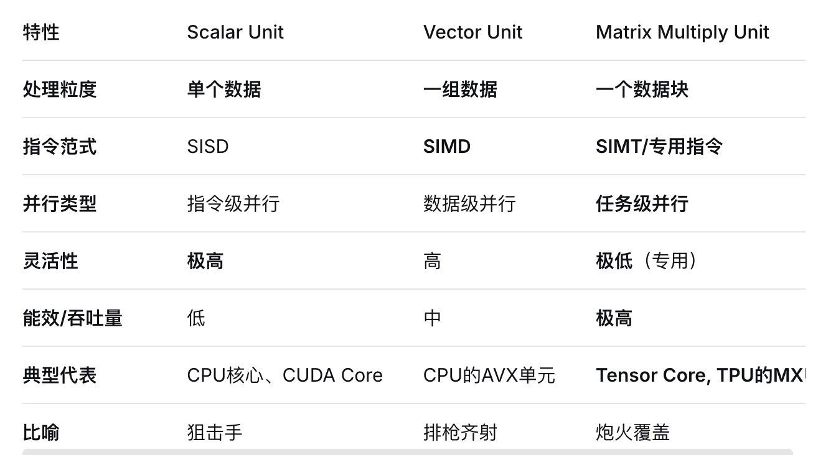

---

## 四、GPU Model 的特点

- **大规模并行**
    - 容易 scale up，通过增加 SMs
    - 容易编程，由于 SIMT 模型（指令相同）
    - thread 容易开始、终止
- **内存墙**
    - compute scale 比 memory scale 快得多
        - 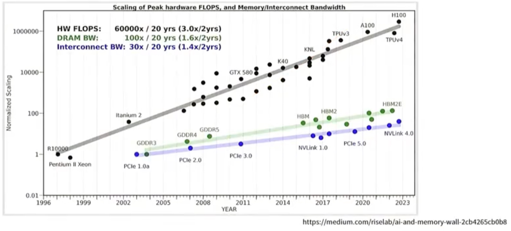
    - 需要理论内存架构来加速执行
- **matmul 硬件**

### 驱动力

- 更快的硬件
- 更好地利用改进的并行化

### Roofline Model

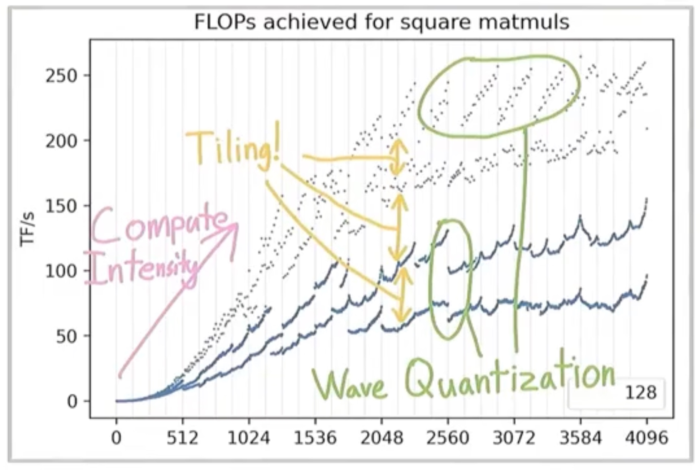

- x-矩阵乘法平方（square matrix multiply）的大小
- y-TF/s，通过 FLOPs（？）衡量硬件利用率

**思想**：左侧 memory 瓶颈，右侧达到 ALU 算力上限；优化左侧，来到右侧

---

## 五、如何加速 GPUs

**思想：减少访问 memory**

### 5.1 Control Divergence（控制分支发散问题）

- **定义**：warp 内所有线程必须执行相同指令（SIMT model），如果存在 branching，且 warp 内线程有不同 branch，则线程必须串行执行所有分支路径
- **问题**：会显著降低 GPU 执行效率，因为 warp 必须执行所有分支指令（虽然每个线程只执行其中一条路径），但线程在不需要执行的分支上会被屏蔽（masked out）

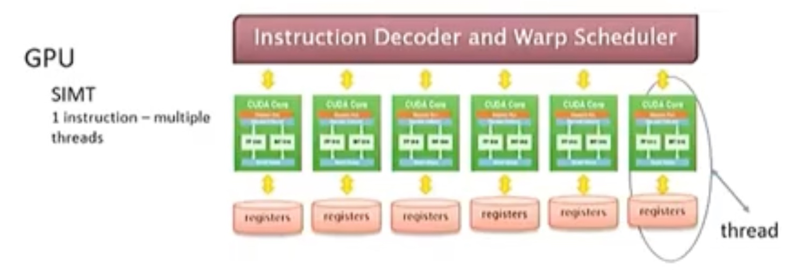
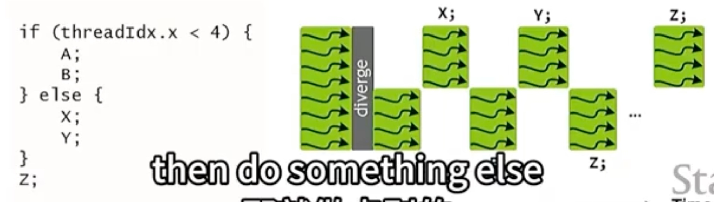

### 5.2 Low Precision Computation（低精度运算）

- 使用低精度 FP16、INT8，而非标准的 FP32
- 低精度空间占用更小，通过降低内存占用和带宽压力来提高计算吞吐
    - 现代 GPU 有专门的低精度运算单元（NVIDIA Tensor Core）加速运算
        - 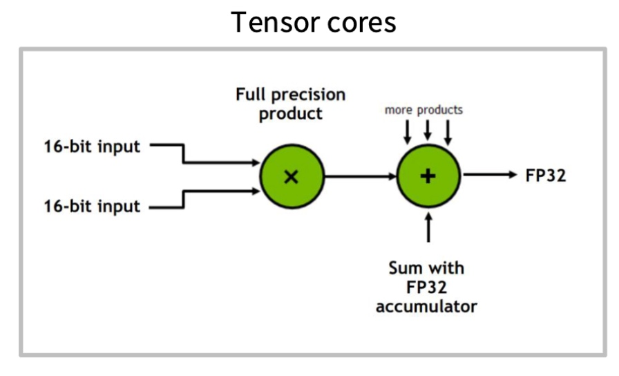
    - 算术强度
        - 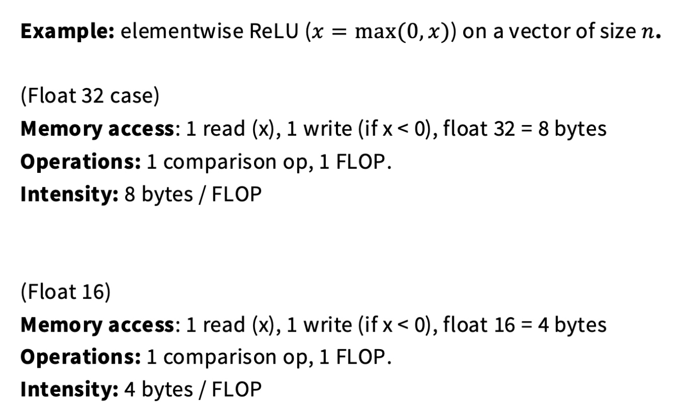
        - element-wise 逐元素操作
            - 由于每个计算独立，是并行计算完美场景
            - 激活函数
            - 张量加法、残差连接
            - dropout 随机屏蔽神经元
            - 归一化：对每个元素进行缩放和平移
            - eg，假设有两个数组（张量）A = [1, 3, 5, 7], B = [2, 4, 6, 8]，则
(A + B) = [1+2, 3+4, 5+6, 7+8]
(A * B) = [1*2, 3*4, 5*6, 7*8]

注意，element-wise 与矩阵乘法完全不同
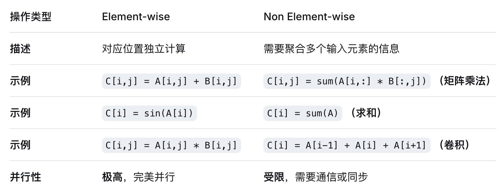

附：激活函数

| 函数 | 公式 | 类比 | 说明 |
|------|------|------|------|
| **ReLU** | `max(0, x)` | 过滤器 | 正数通过，负数归零；由于每个计算独立，是并行计算完美场景 |
| **Sigmoid** | `f(x) = 1 / (1 + e^(-x))` | 平滑开关 | 输入压缩到 (0, 1)，主要用于二分类输出层 |
| **Tanh** | `f(x) = (e^x - e^(-x)) / (e^x + e^(-x))` | 升级版 Sigmoid | 输入压缩到 (-1, 1)，主要用于循环神经网络 |

#### 混合精度使用示例

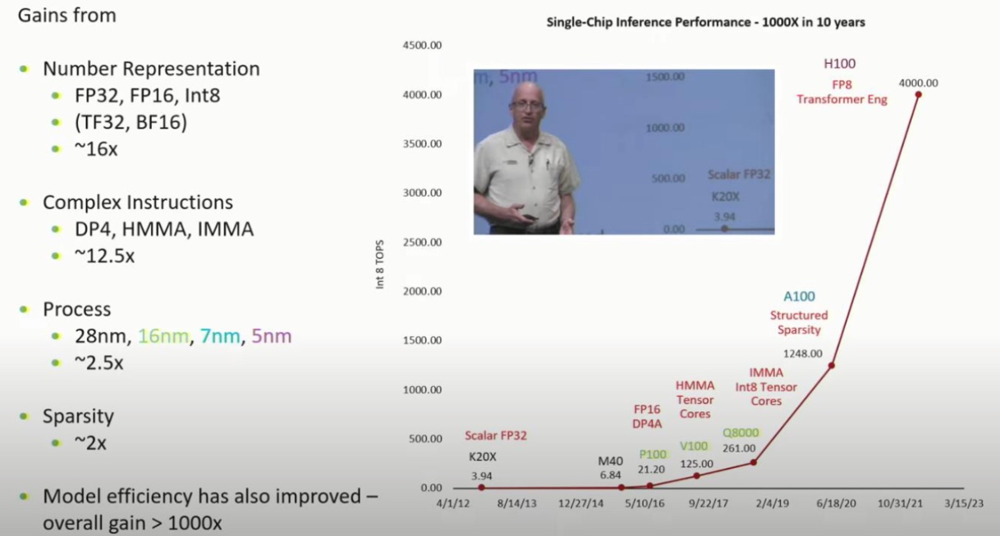

- **训练 NN** 时用混合精度（Mixed Precision），即前向、反向传播用 FP16，权重更新时用 FP32 以保持数值稳定性
- **推理时** 用 INT8 量化模型，加快推理速度

### 5.3 Operator Fusion（算子融合）

- 将多个操作（算子）合并成一个内核执行，减少内核启动开销、中间结果存储
- 中间结果保存在 register 或 shared memory，不写回 global memory

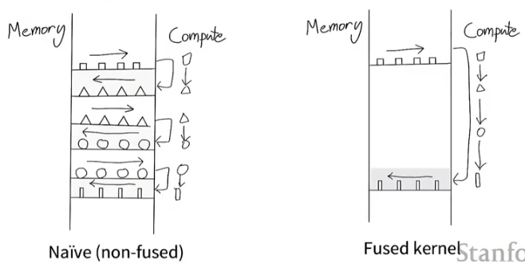

**示例**：在 NN 反向传播过程中，通常需要向前传播中间结果（激活值）来计算梯度。保存中间结果内存占用大，可以在反向传播时重计算激活值、不保存

### 5.4 Recomputation（重计算）

- **定义**：不保存计算过程中间结果，而在需要时重新计算（计算换内存）
- **意义**：GPU 内存有限，尤其训练大型 NN 时，重计算可以减少内存占用，从而允许训练更大的模型或用更大的批量大小

**示例**：
中间结果保存至 memory
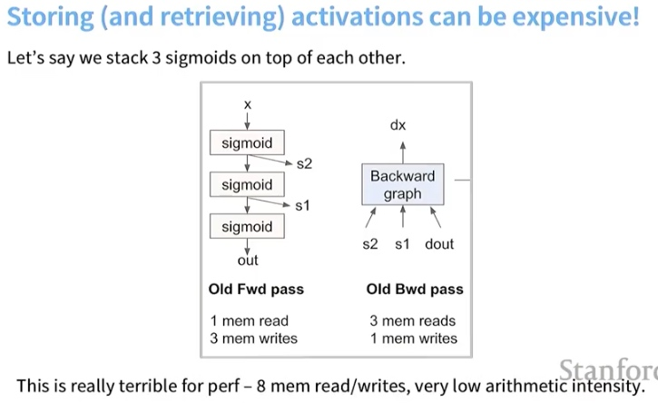

Recomputation 不保存，需要时重新计算
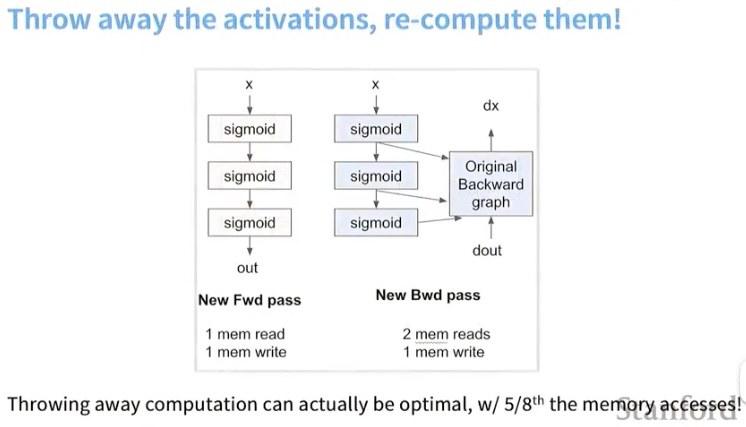

### 5.5 Coalescing Memory And DRAM（合并内存访问）

- GPU 多线程访问 global memory 时，如果内存地址连续，且满足特定对齐条件，则可以合并访问为一个或多个**内存事务（memory transaction）**
- 通过减少内存事务数量，提高带宽利用率
    - 理想情况下，1 个 warp（32 线程）合并访问只需要一次内存事务

#### Burst Mode

- DRAM（global memory）以 burst mode 方式读取数据，每次读取大量字节
- 每个地址空间被分成多个 burst sections，访问任意位置，同一 section 的剩余数据也会被传递给 processor
    - 通常是 4GB 地址空间，128B+ burst section
    - 假设 16B 地址空间，4B burst section
    - 

- **思想**：访问局部性（"来都来了"）

#### DRAM 物理结构

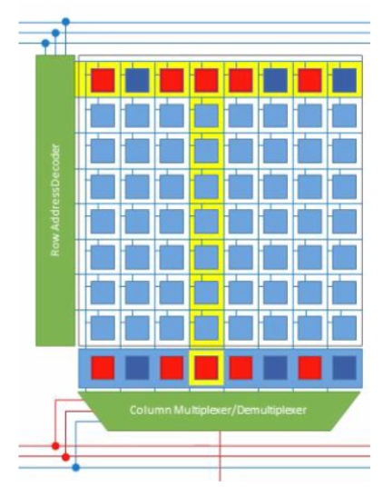

- Bank 结构
- 突发读取

> JEDEC DDR Timing Diagram
> DRAM Burst Operation

##### 内存访问过程

1. **选中一行**：RAS（行选通）→ 相对慢 & 耗电
2. **从被选中的行里选中一列**：CAS（列选通）→ 非常快

##### 为什么使用 Burst Mode？

| 原因 | 说明 |
|------|------|
| **分摊寻址延迟** | DRAM 物理结构导致访问延迟主要在内存寻址，将一次高延迟 RAS 分摊到多个连续数据传输，大幅降低平均访问延迟 |
| **提高总线效率** | 为了提升有效带宽，会在寻址后连续读取同一行中相邻数据。有效带宽 = 有效数据传输量 / 总周期数 |
| **利用空间局部性** | 数据访问具有空间局部性特征 |
| **匹配 CPU Cacheline** | CPU 每次读取一个 Cacheline，用 burst mode 一次性传输整个 Cacheline 满足 CPU 需求，减少总线事务次数 |
| **DRAM 芯片接口优化** | 一次发送起始地址后，DRAM 控制器就能自动递增列地址连续输出数据，不用反复发送，简化了控制逻辑，提高了总线利用率 |

#### 合并访问示例

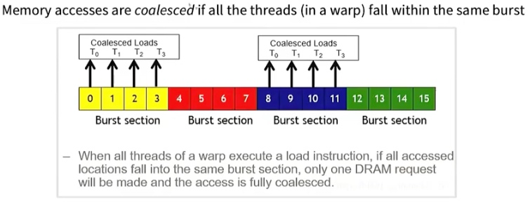

- 一个 warp 中 32 个线程依次访问 float 数组，每个线程访问一个相邻元素（即 t0 访问 addr0，t32 访问 addr32），可以合并成 128B 的内存事务
- 当 1 个 warp 内所有线程都执行 load 指令，如果所有访问都落在同一个 burst section 内，则只需要 1 个 DRAM 请求，访问完全聚合

### 5.6 Tiling（分块）

- **定义**：将数据或计算分解成更小的块（tile/block），以便更好利用 global memory 的局部性和并行性
- **应用**：矩阵乘法、卷积中，将大矩阵分成小矩阵，使得每个 thread block 可以处理一个数据块，利用 shared memory 减少对 global memory 的访问次数，从而加速计算

#### 矩阵乘法分块示例

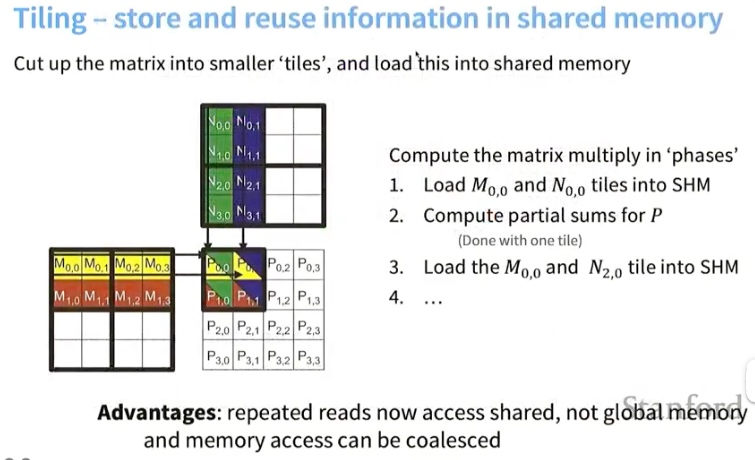

- `C = A * B`，将 A、B 分块，每个线程计算 C 的一个子矩阵
- threadblock 内的 thread 协作将 A、B 的子矩阵加载到共享内存后计算

#### Tiling 复杂度对比

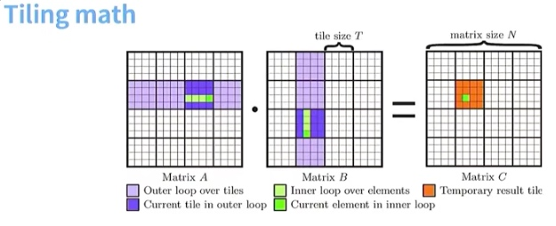

| 方式 | Global Memory 读取次数 |
|------|----------------------|
| **Non-tiled** | 每次 input 读取 N 次 global memory |
| **Tiled** | 每次 input 读取 N/T 次 global memory，每个 tile 内 T 次 shared memory |

---

## 六、组合使用策略

| 组合 | 效果 |
|------|------|
| **Tiling + Coalescing** | 高效内存访问 |
| **Operator Fusion + Low Precision** | 高计算密度 |
| **Recomputation** | 突破内存限制 |
| **避免 Control Divergence** | 保持并行效率 |

---

## 七、相关扩展

- **Flash Attention** — 高效 Attention 计算
- **Fast Matrix Multiplies using Graphics Hardware** — 图形硬件矩阵乘法加速（ref）
- **内核优化与 Triton 框架应用**
- **NLP Scaling Laws**
- **其它**：Single Thread Scaling / DeepLearning & NN Scale / Parallel Scaling

