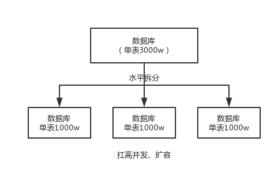
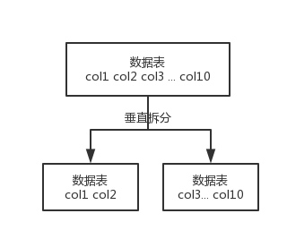
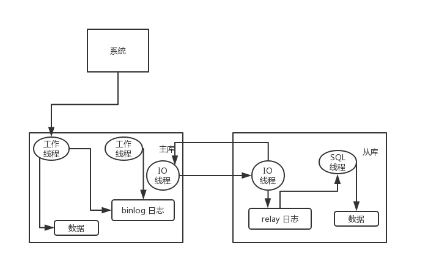

# Database

## 分库分表

1. 为什么要分库分表

	为什么要分库分表（设计高并发系统的时候，数据库层面该如何设计）？用过哪些分库分表中间件？不同的分库分表中间件都有什么优点和缺点？你们具体是如何对数据库如何进行垂直拆分或水平拆分的？

	单表数据量太大，会极大影响你的 sql 执行的性能。

	一个库一般最多支撑到并发 2000，而且一个健康的单库并发值最好保持在每秒 1000 左右。

2. 平滑过渡到分库分表
	
	现在有一个未分库分表的系统，未来要分库分表，如何设计才可以让系统从未分库分表动态切换到分库分表上？
	
	* 停机迁移
	* 双写迁移新数据，洗数据迁移老数据，做好数据校验，开关控制切写切读

3. 如何设计一个动态扩缩容的分库分表方案
	
	不能停机扩容，因为分库分表后还需要扩容一般是因为数据量过大，再停机迁移耗时过长，也容易出意外影响服务。
	
	可以一次性给够，一开始就分 32 个库，每个库 32 个表，总共是 1024 张表，并且一开始作为逻辑库，改由 DBA 成倍扩容缩容。
	
	* 假设单库 TPS=1000，32 个库能承载 TPS=32000；假设单库 TPS=1500，32 个库能承载 TPS=48000，再加上 MQ 削峰，能解决大多数业务场景。如果写入量超过 5w，可以按 128 个库，256 个库，512 个库继续拆。
		
	* 1024 张表，假设单表 500w 数据，可以放 5G（50亿） 条数据。

### 分库分表中间件

* Cobar

	属于 proxy 层方案，介于应用服务器和数据库服务器之间。应用程序通过 JDBC 驱动访问 Cobar 集群，Cobar 根据 SQL 和分库规则对 SQL 做分解，然后分发到 MySQL 集群不同的数据库实例上执行。最近几年都没更新了，算是被抛弃的状态吧。而且不支持读写分离、存储过程、跨库 join 和分页等操作。

* TDDL

	属于 client 层方案。支持基本的 crud 语法和读写分离，但不支持 join、多表查询等语法。目前使用的也不多，因为还依赖淘宝的 diamond 配置管理系统。

* Sharding-jdbc

	属于 client 层方案，是 ShardingSphere 的 client 层方案， ShardingSphere 还提供 proxy 层的方案 Sharding-Proxy。之前用的比较多，因为 SQL 语法支持也比较多，没有太多限制，而且截至 2019.4，已经推出到了 4.0.0-RC1 版本，支持分库分表、读写分离、分布式 id 生成、柔性事务（最大努力送达型事务、TCC 事务）。而且确实之前使用的公司会比较多一些（这个在官网有登记使用的公司，可以看到从 2017 年一直到现在，是有不少公司在用的），目前社区也还一直在开发和维护，还算是比较活跃，是现在也可以选择的方案。
	client 层方案的优点在于不用部署，运维成本低，不需要代理层的二次转发请求，性能很高，但是如果遇到升级啥的需要各个系统都重新升级版本再发布，各个系统都需要耦合 Sharding-jdbc 的依赖。
	
* Mycat
	
	基于 Cobar 改造的，属于 proxy 层方案，支持的功能非常完善，而且目前应该是非常火的而且不断流行的数据库中间件，社区很活跃。
	proxy 层方案的缺点在于需要部署，自己运维一套中间件，运维成本高，但是好处在于对于各个项目是透明的，如果遇到升级之类的都是自己中间件那里搞就行了。

### 垂直拆分或水平拆分

水平拆分的意思，就是把一个表的数据给弄到多个库的多个表里去，但是每个库的表结构都一样，只不过每个库表放的数据是不同的，所有库表的数据加起来就是全部数据。水平拆分的意义，就是**将数据均匀放更多的库里，然后用多个库来扛更高的并发，还有就是用多个库的存储容量来进行扩容**。



垂直拆分的意思，就是**把一个有很多字段的表给拆分成多个表，或者是多个库上**。每个库表的结构都不一样，每个库表都包含部分字段。一般来说，**会将较少的访问频率很高的字段放到一个表里去，然后将较多的访问频率很低的字段放到另外一个表里去**。因为**数据库是有缓存的，你访问频率高的行字段越少，就可以在缓存里缓存更多的行，性能就越好**。这个一般在**表层面做**的较多一些。



还有表层面的拆分，就是分表，将一个表变成 N 个表，就是让每个表的数据量控制在一定范围内，保证 SQL 的性能。否则单表数据量越大，SQL 性能就越差。一般是 200 万行左右，不要太多，但是也得看具体你怎么操作，也可能是 500 万，或者是 100 万。你的 SQL 越复杂，就最好让单表行数越少。

一般来说，垂直拆分，可以在表层面来做，对一些字段特别多的表做一下拆分；水平拆分，可以是并发承载不了或者是数据量太大容量承载不了；分表，你考虑一下，你如果哪怕是拆到每个库里去，并发和容量都 ok 了，但是每个库的表还是太大了，那么你就分表，将这个表分开，保证每个表的数据量并不是很大。

两种分库分表的方式

* 按照 range 分，一般是按时间范围，扩容简单，按时建库建表就行，但容易产生热点问题，大量的流量都打在最新的数据上了。
* 按照某个字段 hash 一下均匀分散，可以平均分配每个库的数据量和请求压力，较为常用，但扩容麻烦，需要数据迁移，重新计算hash后分配到不同的库表。

### 分库分表后如何处理主键id

1. 基于数据库的实现方案
	
	1. 数据库自增 id
		
		适合并发不高（几百），但数据量大的场景
	
	2. 设置数据库 sequence 或者表自增字段步长
		
		适合只需要防止重复ID的场景，但服务节点、步长固定，不好扩展
		
2. UUID
	
	优点是本地生成，缺点是 UUID 过长占用空间，**作为主键性能差**，且不具备有序性，会导致 B+ 树索引在写的时候有过多的随机写操作（连续的 ID 可以产生部分顺序写），还有，由于在写的时候不能产生有顺序的 append 操作，而需要进行 insert 操作，将会读取整个 B+ 树节点到内存，在插入这条记录后会将整个节点写回磁盘，这种操作在记录占用空间比较大的情况下，性能下降明显。
	
	适合随机生成文件名、编号等的场景，但不适合作为主键。
	
3. 获取系统当前时间
	
	适合“时间戳+其他阢字段”，但并发高时要避免重复。
	
4. snowflake 算法
	
	twitter 开源的分布式 id 生成算法，采用 Scala 语言实现，是把一个 64 位的 long 型的 id，1 个 bit 是不用的，用其中的 41 bits 作为毫秒数，用 10 bits 作为工作机器 id，12 bits 作为序列号。
	
	* 1 bit：不用，为啥呢？因为二进制里第一个 bit 为如果是 1，那么都是负数，但是我们生成的 id 都是正数，所以第一个 bit 统一都是 0。
	* 41 bits：表示的是时间戳，单位是毫秒。41 bits 可以表示的数字多达 2^41 - 1 ，也就是可以标识 2^41 - 1 个毫秒值，换算成年就是表示 69 年的时间。
	* 10 bits：记录工作机器 id，代表的是这个服务最多可以部署在 2^10 台机器上，也就是 1024 台机器。但是 10 bits 里 5 个 bits 代表机房 id，5 个 bits 代表机器 id。意思就是最多代表 2^5 个机房（32 个机房），每个机房里可以代表 2^5 个机器（32 台机器）。
	* 12 bits：这个是用来记录同一个毫秒内产生的不同 id，12 bits 可以代表的最大正整数是 2^12 - 1 = 4096 ，也就是说可以用这个 12 bits 代表的数字来区分同一个毫秒内的 4096 个不同的 id。
	
	```
	0 | 0001100 10100010 10111110 10001001 01011100 00 | 10001 | 1 1001 | 0000 00000000
	```
	
	``` java
	public class IdWorker {
	
	    private long workerId;
	    private long datacenterId;
	    private long sequence;
	
	    public IdWorker(long workerId, long datacenterId, long sequence) {
	        // sanity check for workerId
	        // 这儿不就检查了一下，要求就是你传递进来的机房id和机器id不能超过32，不能小于0
	        if (workerId > maxWorkerId || workerId < 0) {
	            throw new IllegalArgumentException(
	                    String.format("worker Id can't be greater than %d or less than 0", maxWorkerId));
	        }
	        if (datacenterId > maxDatacenterId || datacenterId < 0) {
	            throw new IllegalArgumentException(
	                    String.format("datacenter Id can't be greater than %d or less than 0", maxDatacenterId));
	        }
	        System.out.printf(
	                "worker starting. timestamp left shift %d, datacenter id bits %d, worker id bits %d, sequence bits %d, workerid %d",
	                timestampLeftShift, datacenterIdBits, workerIdBits, sequenceBits, workerId);
	
	        this.workerId = workerId;
	        this.datacenterId = datacenterId;
	        this.sequence = sequence;
	    }
	
	    private long twepoch = 1288834974657L;
	
	    private long workerIdBits = 5L;
	    private long datacenterIdBits = 5L;
	
	    // 这个是二进制运算，就是 5 bit最多只能有31个数字，也就是说机器id最多只能是32以内
	    private long maxWorkerId = -1L ^ (-1L << workerIdBits);
	
	    // 这个是一个意思，就是 5 bit最多只能有31个数字，机房id最多只能是32以内
	    private long maxDatacenterId = -1L ^ (-1L << datacenterIdBits);
	    private long sequenceBits = 12L;
	
	    private long workerIdShift = sequenceBits;
	    private long datacenterIdShift = sequenceBits + workerIdBits;
	    private long timestampLeftShift = sequenceBits + workerIdBits + datacenterIdBits;
	    private long sequenceMask = -1L ^ (-1L << sequenceBits);
	
	    private long lastTimestamp = -1L;
	
	    public long getWorkerId() {
	        return workerId;
	    }
	
	    public long getDatacenterId() {
	        return datacenterId;
	    }
	
	    public long getTimestamp() {
	        return System.currentTimeMillis();
	    }
	
	    public synchronized long nextId() {
	        // 这儿就是获取当前时间戳，单位是毫秒
	        long timestamp = timeGen();
	
	        if (timestamp < lastTimestamp) {
	            System.err.printf("clock is moving backwards.  Rejecting requests until %d.", lastTimestamp);
	            throw new RuntimeException(String.format(
	                    "Clock moved backwards.  Refusing to generate id for %d milliseconds", lastTimestamp - timestamp));
	        }
	
	        if (lastTimestamp == timestamp) {
	            // 这个意思是说一个毫秒内最多只能有4096个数字
	            // 无论你传递多少进来，这个位运算保证始终就是在4096这个范围内，避免你自己传递个sequence超过了4096这个范围
	            sequence = (sequence + 1) & sequenceMask;
	            if (sequence == 0) {
	                timestamp = tilNextMillis(lastTimestamp);
	            }
	        } else {
	            sequence = 0;
	        }
	
	        // 这儿记录一下最近一次生成id的时间戳，单位是毫秒
	        lastTimestamp = timestamp;
	
	        // 这儿就是将时间戳左移，放到 41 bit那儿；
	        // 将机房 id左移放到 5 bit那儿；
	        // 将机器id左移放到5 bit那儿；将序号放最后12 bit；
	        // 最后拼接起来成一个 64 bit的二进制数字，转换成 10 进制就是个 long 型
	        return ((timestamp - twepoch) << timestampLeftShift) | (datacenterId << datacenterIdShift)
	                | (workerId << workerIdShift) | sequence;
	    }
	
	    private long tilNextMillis(long lastTimestamp) {
	        long timestamp = timeGen();
	        while (timestamp <= lastTimestamp) {
	            timestamp = timeGen();
	        }
	        return timestamp;
	    }
	
	    private long timeGen() {
	        return System.currentTimeMillis();
	    }
	
	    // ---------------测试---------------
	    public static void main(String[] args) {
	        IdWorker worker = new IdWorker(1, 1, 1);
	        for (int i = 0; i < 30; i++) {
	            System.out.println(worker.nextId());
	        }
	    }
	
	}
	```
		
## 读写分离

有没有做 MySQL 读写分离？如何实现 MySQL 的读写分离？MySQL 主从复制原理的是啥？如何解决 MySQL 主从同步的延时问题？

### 主从复制原理

主库将变更写入 binlog 日志，然后从库连接到主库后，从库的 IO 线程将主库的 binlog 日志拷贝到自己本地，写入一个 relay 中继日志中。接着从库中有一个 SQL 线程会从中继日志读取 binlog，然后执行 binlog 日志中的内容，也就是在自己本地再次执行一遍 SQL，这样就可以保证自己跟主库的数据是一样的。



有一个非常重要的一点，就是从库同步主库数据的过程是串行化的，也就是说主库上并行的操作，在从库上会串行执行。由于从库从主库拷贝日志以及串行执行 SQL 的特点，在高并发场景下，从库的数据一定会比主库慢一些，是有延时的。所以经常出现，刚写入主库的数据可能是读不到的，要过几十毫秒，甚至几百毫秒才能读取到。

还有另外一个问题，就是如果主库突然宕机，然后恰好数据还没同步到从库，那么有些数据可能在从库上是没有的，有些数据可能就丢失了。

* 半同步复制，也叫 semi-sync 复制，指的就是主库写入 binlog 日志之后，就会**强制**此时立即将数据同步到从库，从库将日志写入自己本地的 relay log 之后，接着会返回一个 ack 给主库，主库接收到至少一个从库的 ack 之后才会认为写操作完成了。
* 并行复制，指的是从库开启多个线程，并行读取 relay log 中不同库的日志，然后并行重放不同库的日志，这是库级别的并行。

```
show slave status
```

可以查看 Seconds_Behind_Master ，可以看到从库复制主库的数据落后了几 ms。

如果主从延迟较为严重，有以下解决方案

* 分库，将一个主库拆分为多个主库，每个主库的写并发就减少了几倍，此时主从延迟可以忽略不计。
* 打开 MySQL 支持的并行复制，多个库并行复制。如果说某个库的写入并发就是特别高，单库写并发达到了 2000/s，并行复制还是没意义。
* 重写代码，写代码的同学，要慎重，插入数据时立马查询可能查不到。
* 如果确实是存在必须先插入，立马要求就查询到，然后立马就要反过来执行一些操作，对这个查询设置直连主库。

## 设计一个高并发系统

系统啥架构？怎么部署的？部署了多少台机器？缓存咋用的？MQ 咋用的？数据库咋用的？就是深挖你到底是如何扛住高并发的。

* 系统拆分
* 缓存
* MQ
* 分库分表
* 读写分离
* ElasticSearch


