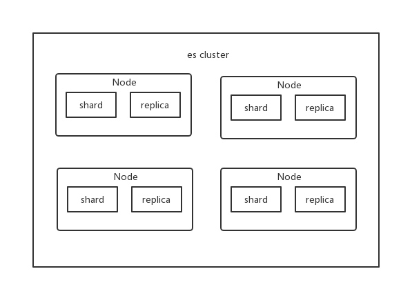
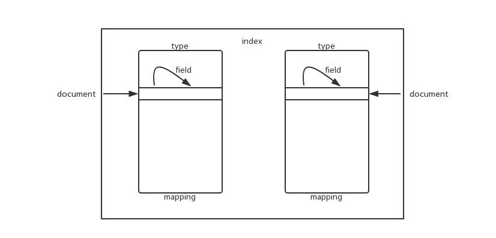
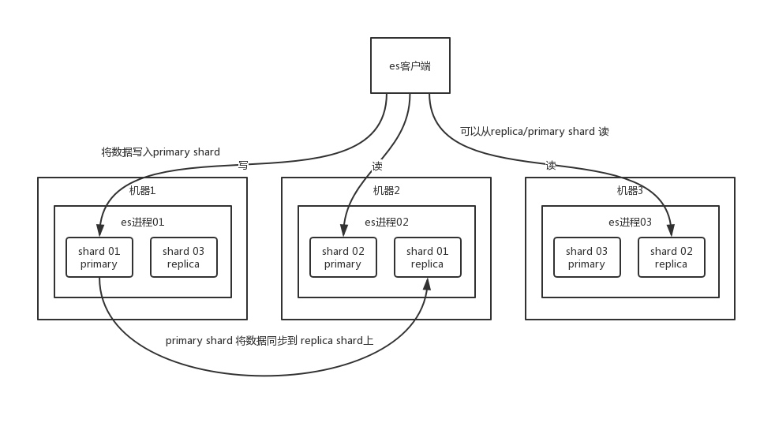
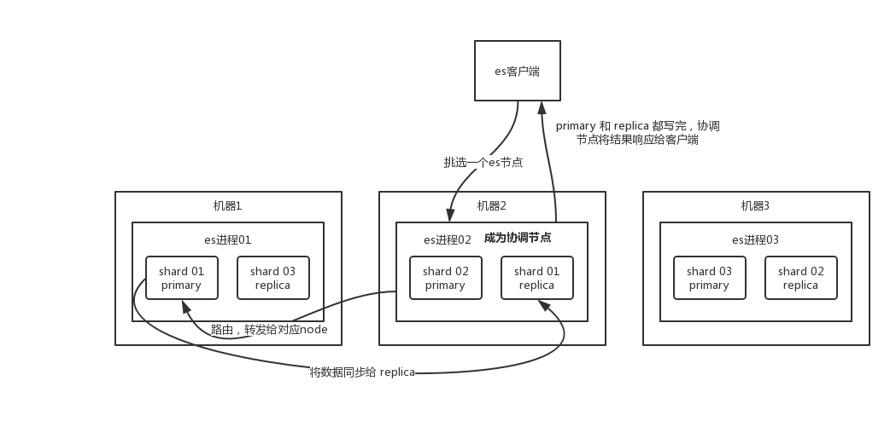
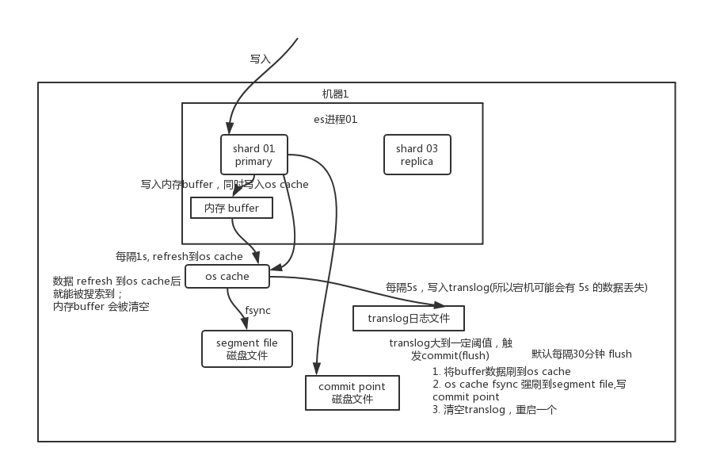
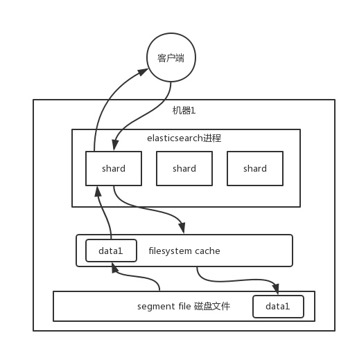

# 全文检索

## ES 基本概念

1. Near Realtime
	
	* 从写入数据到数据可以被搜索到有一个小延迟（大概是 1s）
	* 基于 ES 执行搜索和分析可以达到秒级

2. Cluster

	集群包含多个节点，每个节点属于哪个集群都是通过一个配置来决定的，对于中小型应用来说，刚开始一个集群就一个节点。

3. Node
	
	Node 是集群中的一个节点，节点也有一个名称，默认是随机分配的。默认节点会去加入一个名称为 elasticsearch 的集群。如果直接启动一堆节点，那么它们会自动组成一个 elasticsearch 集群，当然一个节点也可以组成 elasticsearch 集群。

4. Document & field

	每个 index 下的 type，都可以存储多条 document。一个 document 里面有多个 field，每个 field 就是一个数据字段。
	
5. Index

6. Type

7. shard

	单台机器无法存储大量数据，ES 可以将一个索引中的数据切分为多个 shard，分布在多台服务器上存储。有了 shard 就可以横向扩展，存储更多数据，让搜索和分析等操作分布到多台服务器上去执行，提升吞吐量和性能。每个 shard 都是一个 lucene index。

8. replica
	
	任何一个服务器随时可能故障或宕机，此时 shard 可能就会丢失，因此可以为每个 shard 创建多个 replica 副本。replica 可以在 shard 故障时提供备用服务，保证数据不丢失，多个 replica 还可以提升搜索操作的吞吐量和性能。primary shard（建立索引时一次设置，不能修改，默认 5 个），replica shard（随时修改数量，默认 1 个），默认每个索引 10 个 shard，5 个 primary shard，5 个 replica shard，最小的高可用配置，是 2 台服务器。

	shard 分为 primary shard 和 replica shard。而 primary shard 一般简称为 shard，而 replica shard 一般简称为 replica。

	
	
## ES 分布式架构原理

> 多级组织数据（index, type(mapping), document, field） + 主从保证可用(primary shard, replica shard)

ElasticSearch 设计的理念就是分布式搜索引擎，底层其实还是基于 lucene 的。核心思想就是在多台机器上启动多个 ES 进程实例，组成了一个 ES 集群。

ES 中存储数据的**基本单位是索引**，比如说你现在要在 ES 中存储一些订单数据，你就应该在 ES 中**创建一个索引 order_idx**，所有的订单数据就都写到这个索引里面去，一个索引差不多就是相当于是 mysql 里的一张**表**。

```
index -> type -> mapping -> document -> field
```

index 相当于 mysql 里的一张表。而 type 没法跟 mysql 里去对比，一个 index 里可以有多个 type，每个 type 的字段都是差不多的，但是有一些略微的差别。假设有一个 index，是订单 index，里面专门是放订单数据的。就好比说你在 mysql 中建表，有些订单是实物商品的订单，比如一件衣服、一双鞋子；有些订单是虚拟商品的订单，比如游戏点卡，话费充值。就两种订单大部分字段是一样的，但是少部分字段可能有略微的一些差别。

所以就会在订单 index 里，建两个 type，一个是实物商品订单 type，一个是虚拟商品订单 type，这两个 type 大部分字段是一样的，少部分字段是不一样的。

很多情况下，一个 index 里可能就一个 type，但是确实如果说是一个 index 里有多个 type 的情况（注意， mapping types 这个概念在 ElasticSearch 7. X 已被完全移除），你可以认为 index 是一个类别的表，具体的每个 type 代表了 mysql 中的一个表。每个 type 有一个 mapping，如果你认为一个 type 是具体的一个表，**index 就代表多个 type 同属于的一个类型，而 mapping 就是这个 type 的表结构定义**，你在 mysql 中创建一个表，肯定是要定义表结构的，里面有哪些字段，每个字段是什么类型。实际上你往 index 里的一个 type 里面写的一条数据，叫做一条 document，一条 document 就代表了 mysql 中某个表里的一行，每个 document 有多个 field，每个 field 就代表了这个 document 中的一个字段的值。



一个索引可以拆分成多个 shard ，每个 shard 存储部分数据。

* 支持横向扩展。比如你数据量是 3T，3 个 shard，每个 shard 就 1T 的数据，若现在数据量增加到 4T，只要重新建一个有 4 个 shard 的索引后导数据
* 提高性能。数据分布在多个 shard，所有的操作都会在多台机器上并行分布式执行，提高了吞吐量和性能

接着就是这个 shard 的数据实际是有多个备份，就是说每个 shard 都有一个 primary shard ，负责写入数据，但是还有几个 replica shard 。 primary shard 写入数据之后，会将数据同步到其他几个 replica shard 上去。



## ES 读写数据的工作原理

ES 写入数据的工作原理是什么啊？ES 查询数据的工作原理是什么啊？底层的 Lucene 介绍一下呗？倒排索引了解吗？

### ES 写数据

1. 客户端选择一个 node **发送请求**，这个 node 就是 **coordinating node （协调节点）**
2. coordinating node **对 document 进行路由**，将请求转发给对应的 node（有 primary shard）
3. 实际的 **node 上的 primary shard 处理请求**，然后将数据**同步到 replica node**
4. coordinating node 如果发现 primary node 和所有 replica node 都搞定之后，就返回**响应**结果给客户端



1. 数据先写入内存 buffer
2. 后每隔 1s，将数据 refresh 到 os cache，到了 os cache 数据就能被搜索到（所以我们才说 es 从写入到能被搜索到，中间有 1s 的延迟）
3. 每隔 5s，将数据写入 translog 文件（这样如果机器宕机，内存数据全没，最多会有 5s 的数据丢失）
4. translog 大到一定程度，或者默认每隔 30mins，会触发 commit 操作，将缓冲区的数据都 flush 到 segment file 磁盘文件中
5. 数据写入 segment file 之后，同时就建立好了倒排索引。



如果是删除操作，commit 的时候会生成一个 .del 文件，里面将某个 doc 标识为 deleted 状态，那么搜索的时候根据 .del 文件就知道这个 doc 是否被删除了。

如果是更新操作，就是将原来的 doc 标识为 deleted 状态，然后新写入一条数据。

buffer 每次 refresh 都产生一个 segment file ，默认 1 秒钟一个 segment file ，这样下来 segment file 会越来越多，此时会定期执行 merge。每次 merge 的时候，会将多个 segment file 合并成一个，同时这里会将标识为 deleted 的 doc 给物理删除掉，然后将新的 segment file 写入磁盘，这里会写一个 commit point ，标识所有新的 segment file ，然后打开 segment file 供搜索使用，同时删除旧的 segment file 。

### ES 读数据过程

可以通过 doc id 查询，会根据 doc id 进行 hash，判断出来当时把 doc id 分配到了哪个 shard 上面去，从那个 shard 去查询。

1. 客户端发送请求到**任意**一个 node，成为 coordinate node
2. coordinate node **对 doc id 进行哈希路由到对应 node 后随机轮询 primary shard 及其所有 replica**，让读请求负载均衡
3. 接收请求的 node **返回** document 给 coordinate node
4. coordinate node **返回** document 给客户端

### ES 搜索数据过程

根据关键词来搜索，将包含关键词的 document 搜索出来。

1. 客户端**发送请求到一个 coordinate node**
2. 协调节点将搜索请求转发到**所有的 shard 对应的 primary shard 或 replica shard** ，都可以
3. query phase：**每个 shard 将自己的搜索结果，就是一些 doc id，返回给协调节点，由协调节点进行数据的合并、排序、分页等操作，产出最终结果**
4. fetch phase：**由协调节点根据 doc id 去各个节点上拉取实际的 document 数据，最终返回给客户端**

> 写请求是写入 primary shard，然后同步给所有的 replica shard；读请求可以从 primary shard 或 replica shard 读取，采用的是随机轮询算法。

### Lucene

简单来说，lucene 就是一个 jar 包，里面包含了封装好的各种建立倒排索引的算法代码。我们用 Java 开发的时候，引入 lucene jar，然后基于 lucene 的 api 去开发就可以了。

通过 lucene，我们可以将已有的数据建立索引，lucene 会在本地磁盘上面，给我们组织索引的数据结构。

### 倒排索引

在搜索引擎中，每个文档都有一个对应的文档 ID，文档内容被表示为一系列关键词的集合。例如，文档 1 经过分词，提取了 20 个关键词，每个关键词都会记录它在文档中出现的次数和出现位置。

那么，**倒排索引就是关键词到文档 ID 的映射**，每个关键词都对应着一系列的文件，这些文件中都出现了关键词。

> 倒排索引中的所有词项对应一个或多个文档
> 倒排索引中的词项根据字典顺序升序排列

另外，实用的倒排索引还可以记录更多的信息，比如文档频率信息，表示在文档集合中有多少个文档包含某个单词。

## ES 查询性能优化

数据实际写到磁盘文件，查询时操作系统会将磁盘文件里的数据自动缓存到 filesystem cache 。



es 的搜索引擎严重依赖于底层的 filesystem cache ，你如果给 filesystem cache 更多的内存，尽量让内存可以容纳所有的 idx segment file  索引数据文件，那么搜索的时候就基本都是走内存的，性能会非常高。

磁盘搜搜一般秒级，内存搜索几毫秒到几百毫秒不等。

常用搜索优化方案

1. 索引存 es 走操作系统内存访问 + 其它字段走 mysql/hbase

	最佳情况是仅仅在 **es 中只存少数几个字段**，即要用来搜索的索引，保证走操作系统内存。其他的字段数据存在 mysql/hbase 里。
	
	hbase 的特点是适用于海量数据的在线存储，就是对 hbase 可以写入海量数据，但是不要做复杂的搜索，做很简单的一些根据 id 或者范围进行查询的这么一个操作就可以了。从 es 中根据 name 和 age 去搜索，拿到的结果可能就 20 个 doc id ，然后根据 doc id 到 hbase 里去查询每个 doc id 对应的完整的数据，给查出来，再返回给前端。
	
	写入 es 的数据最好小于等于，或者是略微大于 es 的 filesystem cache 的内存容量。然后你从 es 检索可能就花费 20ms，然后再根据 es 返回的 id 去 hbase 里查询，查 20 条数据，可能也就耗费个 30ms，可能你原来那么玩儿，1T 数据都放 es，会每次查询都是 5~10s，现在可能性能就会很高，每次查询就是 50ms。

2. 数据预热

	对于那些你觉得比较热的、经常会有人访问的数据，可以做一个专门的缓存预热子系统，每隔一段时间提前访问热数据，让数据进入 filesystem cache 。下次真实访问时性能好很多。
	
3. 冷热分离

	类似 mysql 的水平拆分，冷数据写入一个索引中，然后热数据写入另外一个索引中，确保热数据在被预热之后，尽量留在 filesystem os cache 里，不让冷数据给冲刷掉。

## ES 分页性能优化

分页查询**必须从每个 shard 都查足够数据，再按需排序、筛选等，最后再次分页拿到所需数据**，翻页越深，每个shard 返回的数据越多，协调节点处理越久。

1. 不允许深度分页

2. scroll api

	适用于下拉翻页场景，不能随意跳

3. search_after

	使用前一页的结果来帮助检索下一页的数据，显然，这种方式也不允许你随意翻页

## ES 部署架构

ES 生产集群的部署架构是什么？每个索引的数据量大概有多少？每个索引大概有多少个分片？


