# MQ

## 场景

1. 解耦
2. 异步
3. 削峰

## 缺点

1. 可用性降低
2. 复杂度提高
3. 一致性问题

## 对比

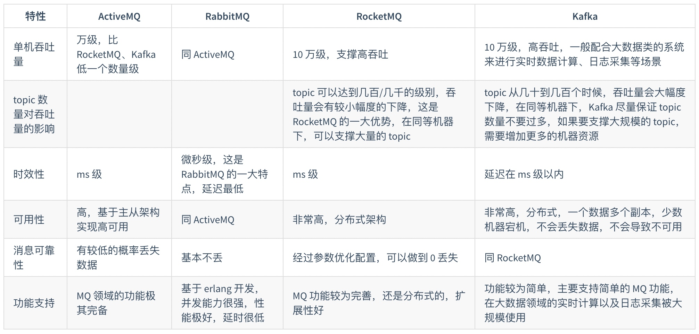

## 可用性

### 主从/复制

RabbitMQ基于主从（非分布式）做高可用。
	
1. 单机模式
	
2. 普通集群模式（无高可用）

	在多台机器上启动多个 RabbitMQ 实例，每台机器启动一个。你**创建的 queue，只会放在一个 RabbitMQ 实例上，但是每个实例都同步 queue 的元数据（**元数据可以认为是 queue 的一些配置信息，通过元数据，可以找到 queue 所在实例）。你消费的时候，实际上如果连接到了另外一个实例，那么那个实例会从 queue 所在实例上拉取数据过来。
	
	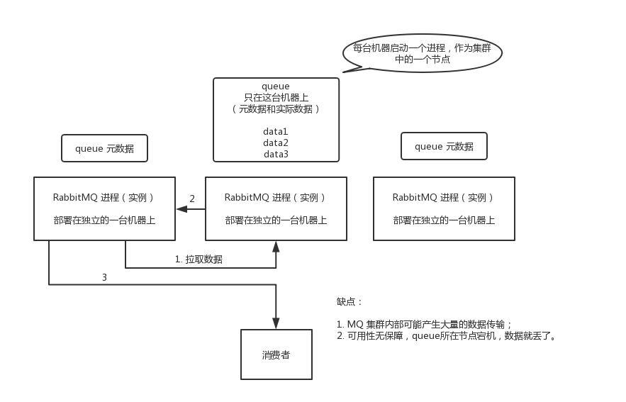
	
	没做到所谓的分布式，就是个普通集群。因为这导致你要么消费者每次随机连接一个实例然后拉取数据，要么固定连接那个 queue 所在实例消费数据，前者有**数据拉取的开销**，后者导致**单实例性能瓶颈**。
	
	而且如果那个放 queue 的实例宕机了，会导致接下来其他实例就无法从那个实例拉取，如果你**开启了消息持久化**，让 RabbitMQ 落地存储消息的话，消息不一定会丢，得等这个实例恢复了，然后才可以继续从这个 queue 拉取数据。

	主要是**提高吞吐量**，就是说让集群中多个节点来服务某个 queue 的读写操作。

3. 镜像集群模式（高可用）

	跟普通集群模式不一样的是，在镜像集群模式下，你创建的 queue，无论是元数据还是 queue 里的消息都会存在于多个实例上，就是说，**每个 RabbitMQ 节点都有这个 queue 的一个完整镜像**，包含 queue 的全部数据的意思。然后每次你写消息到 queue 的时候，都会自动把消息同步到多个实例的 queue 上。
	
	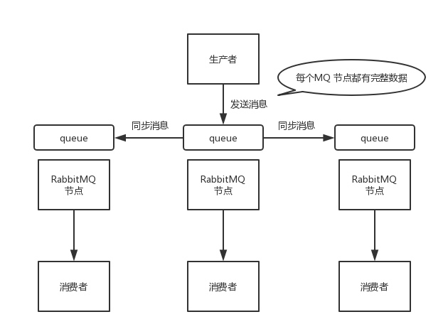
	
	那么如何开启这个镜像集群模式呢？RabbitMQ 的管理控制台新增镜像集群模式的策略，指定的时候是可以要求数据同步到所有节点的，也可以要求同步到指定数量的节点，再次创建 queue 的时候，应用这个策略，就会自动将数据同步到其他的节点上去了。

	好处在于任何一个机器宕机了，其它机器（节点）还包含了这个 queue 的完整数据，别的 consumer 都可以到其它节点上去消费数据。坏处在于，第一，这个**性能开销太大，消息需要同步到所有机器上，导致网络带宽压力和消耗很重**。第二，这么玩儿，不是分布式的，就没有扩展性可言了，如果某个 queue 负载很重，你加机器，新增的机器也包含了这个 queue 的所有数据，并**没有办法线性扩展**你的 queue。你想，如果这个 queue 的数据量很大，大到这个机器上的容量无法容纳了，此时该怎么办呢？
	
### 数据分布式/sharding + replica + ack

Kafka 由多个 broker 组成，每个 broker 是一个节点。创建一个 topic，这个 topic 可以划分为多个 partition，每个 partition 可以存在于不同的 broker 上，每个 partition 就放一部分数据。

这就是天然的分布式消息队列，就是说一个 topic 的数据，是分散放在多个机器上的，每个机器就放一部分数据。

Kafka 0.8 以前，是没有 HA 机制的，就是任何一个 broker 宕机了，那个 broker 上的 partition 就废了，没法写也没法读，没有什么高可用性可言。

比如说，我们假设创建了一个 topic，指定其 partition 数量是 3 个，分别在三台机器上。但是，如果第二台机器宕机了，会导致这个 topic 的 1/3 的数据就丢了，因此这个是做不到高可用的。

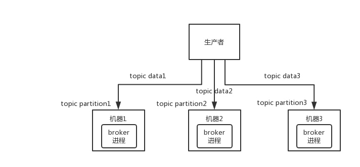

Kafka 0.8 以后，提供了 HA 机制，就是 **replica 副本机制**。每个 partition 的数据都会同步到其它机器上，形成自己的多个 replica 副本。所有 replica 会选举一个 leader 出来，那么生产和消费都跟这个 leader 打交道，然后其他 replica 就是 follower。**写的时候，leader 会负责把数据同步到所有 follower 上去，读的时候就直接读 leader 上的数据即可**。只能读写 leader？很简单，**要是你可以随意读写每个 follower，那么就要 care 数据一致性的问题**，系统复杂度太高，很容易出问题。Kafka 会均匀地将一个 partition 的所有 replica 分布在不同的机器上，这样才可以提高容错性。

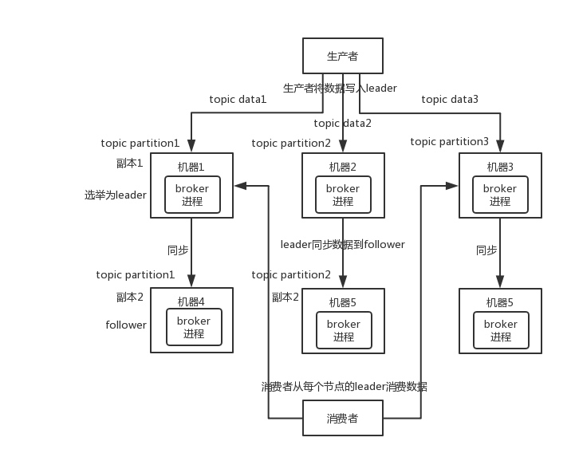

这么搞，就有所谓的高可用性了，因为如果某个 broker 宕机了，没事儿，那个 broker 上面的 partition 在其他机器上都有副本的。如果这个宕机的 broker 上面有某个 partition 的 leader，那么此时会从 follower 中重新选举一个新的 leader 出来，大家继续读写那个新的 leader 即可。这就有所谓的高可用性了。

写数据的时候，生产者就写 leader，然后 leader 将数据落地写本地磁盘，接着其他 follower 自己主动从 leader 来 pull 数据。一旦所有 follower 同步好数据了，就会发送 ack 给 leader，leader 收到所有 follower 的 ack 之后，就会返回写成功的消息给生产者。（当然，这只是其中一种模式，还可以适当调整这个行为）

消费的时候，只会从 leader 去读，但是只有当一个消息已经被所有 follower 都同步成功返回 ack 的时候，这个消息才会被消费者读到。

## 幂等性/不重复消费

RabbitMQ、RocketMQ、Kafka，都有可能会出现消息重复消费的问题，正常。因为这问题通常不是 MQ 自己保证的，是由我们开发来保证的。

Kafka 实际上有个 offset 的概念，就是每个消息写进去，都有一个 offset，代表消息的序号，然后 consumer 消费了数据之后，每隔一段时间（定时定期），会把自己消费过的消息的 offset 提交一下，表示“我已经消费过了，下次我要是重启啥的，你就让我继续从上次消费到的 offset 来继续消费吧”。

但是凡事总有意外，比如我们之前生产经常遇到的，就是你有时候重启系统，看你怎么重启了，如果碰到点着急的，直接 kill 进程了，再重启。这会导致 consumer 有些消息处理了，但是没来得及提交 offset，重启之后，少数消息会再次消费一次。

注意：新版的 Kafka 已经将 offset 的存储从 Zookeeper 转移至 Kafka brokers，并使用内部位移主题 __consumer_offsets 进行存储。

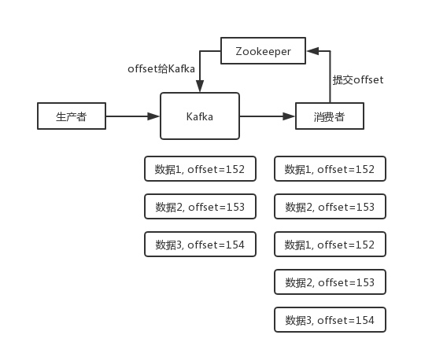

其实重复消费不可怕，可怕的是你没考虑到重复消费之后，怎么保证幂等性。

举个例子吧。假设你有个系统，消费一条消息就往数据库里插入一条数据，要是你一个消息重复两次，你不就插入了两条，这数据不就错了？但是你要是消费到第二次的时候，自己判断一下是否已经消费过了，若是就直接扔了，这样不就保留了一条数据，从而保证了数据的正确性。

其实还是得结合业务来思考，我这里给几个思路：

* 比如你拿个数据要写库，你先根据主键查一下，如果这数据都有了，你就别插入了，update 一下好吧。
* 比如你是写 Redis，那没问题了，反正每次都是 set，天然幂等性。
* 比如你不是上面两个场景，那做的稍微复杂一点，你需要让生产者发送每条数据的时候，里面加一个全局唯一的 id，类似订单 id 之类的东西，然后你这里消费到了之后，先根据这个 id 去比如 Redis 里查一下，之前消费过吗？如果没有消费过，你就处理，然后这个 id 写 Redis。如果消费过了，那你就别处理了，保证别重复处理相同的消息即可。
* 比如基于数据库的唯一键来保证重复数据不会重复插入多条。因为有唯一键约束了，重复数据插入只会报错，不会导致数据库中出现脏数据。

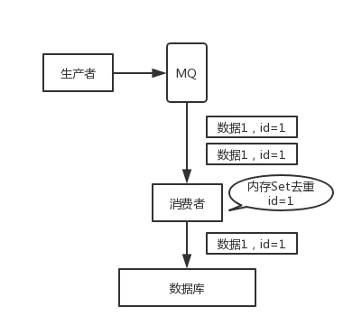

当然，如何保证 MQ 的消费是幂等性的，在实际应用中需要结合具体的业务来看。

## 可靠性

用 MQ 有个基本原则，就是数据不能多一条，也不能少一条，不能多，就是前面说的重复消费和幂等性问题。不能少，就是说这数据别搞丢了。

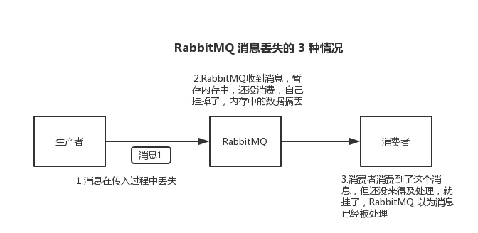

### RabbitMQ

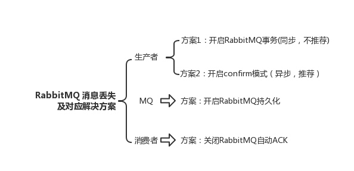

#### Producer丢数据
	
生产者将数据发送到 RabbitMQ 的时候，可能数据就在半路给搞丢了，因为网络问题啥的，都有可能。

此时可以选择用 RabbitMQ 提供的事务功能，就是生产者发送数据之前开启 RabbitMQ 事务 channel.txSelect() ，然后发送消息，如果消息没有成功被 RabbitMQ 接收到，那么生产者会收到异常报错，此时就可以回滚事务 channel.txRollback() ，然后重试发送消息；如果收到了消息，那么可以提交事务 channel.txCommit() 。

``` java
try {
    // 通过工厂创建连接
    connection = factory.newConnection();
    // 获取通道
    channel = connection.createChannel();
    // 开启事务
    channel.txSelect();
	
    // 这里发送消息
    channel.basicPublish(exchange, routingKey, MessageProperties.PERSISTENT_TEXT_PLAIN, msg.getBytes());
	
    // 模拟出现异常
    int result = 1 / 0;
	
    // 提交事务
    channel.txCommit();
} catch (IOException | TimeoutException e) {
    // 捕捉异常，回滚事务
    channel.txRollback();
}
```

但是问题是，RabbitMQ 事务机制（同步）一搞，基本上**吞吐量会下来，因为太耗性能**。

所以一般来说，如果你要确保说写 RabbitMQ 的消息别丢，可以开启 confirm 模式，在生产者那里设置开启 confirm 模式之后，你每次写的消息都会分配一个唯一的 id，然后如果写入了 RabbitMQ 中，RabbitMQ 会给你回传一个 ack 消息，告诉你说这个消息 ok 了。如果 RabbitMQ 没能处理这个消息，会回调你的一个 nack 接口，告诉你这个消息接收失败，你可以重试。而且你可以结合这个机制自己在内存里维护每个消息 id 的状态，如果超过一定时间还没接收到这个消息的回调，那么你可以重发。

事务机制和 confirm 机制最大的不同在于，事务机制是同步的，你提交一个事务之后会阻塞在那儿，但是 confirm 机制是异步的，你发送个消息之后就可以发送下一个消息，然后那个消息 RabbitMQ 接收了之后会异步回调你的一个接口通知你这个消息接收到了。

所以一般在生产者这块避免数据丢失，都是用 confirm 机制的。

> 已经在 transaction 事务模式的 channel 是不能再设置成 confirm 模式的，即这两种模式是不能共存的。

客户端实现生产者 confirm 有 3 种方式。

1. 普通 confirm 模式：每发送一条消息后，调用 waitForConfirms() 方法，等待服务器端 confirm，如果服务端返回 false 或者在一段时间内都没返回，客户端可以进行消息重发。

	``` java
	channel.basicPublish(ConfirmConfig.exchangeName, ConfirmConfig.routingKey, MessageProperties.PERSISTENT_TEXT_PLAIN, ConfirmConfig.msg_10B.getBytes());
	if (!channel.waitForConfirms()) {
	    // 消息发送失败
	    // ...
	}
	```

2. 批量 confirm 模式：每发送一批消息后，调用 waitForConfirms() 方法，等待服务端 confirm。

	``` java
	channel.confirmSelect();
	for (int i = 0; i < batchCount; ++i) {
	    channel.basicPublish(ConfirmConfig.exchangeName, ConfirmConfig.routingKey, MessageProperties.PERSISTENT_TEXT_PLAIN, ConfirmConfig.msg_10B.getBytes());
	}
	if (!channel.waitForConfirms()) {
	    // 消息发送失败
	    // ...
	}
	```
	
3. 异步 confirm 模式：提供一个回调方法，服务端 confirm 了一条或者多条消息后客户端会回调这个方法。

	``` java
	SortedSet<Long> confirmSet = Collections.synchronizedSortedSet(new TreeSet<Long>());
	channel.confirmSelect();
	channel.addConfirmListener(new ConfirmListener() {
	    public void handleAck(long deliveryTag, boolean multiple) throws IOException {
	        if (multiple) {
	            confirmSet.headSet(deliveryTag + 1).clear();
	        } else {
	            confirmSet.remove(deliveryTag);
	        }
	    }
	
	    public void handleNack(long deliveryTag, boolean multiple) throws IOException {
	        System.out.println("Nack, SeqNo: " + deliveryTag + ", multiple: " + multiple);
	        if (multiple) {
	            confirmSet.headSet(deliveryTag + 1).clear();
	        } else {
	            confirmSet.remove(deliveryTag);
	        }
	    }
	});
	
	while (true) {
	    long nextSeqNo = channel.getNextPublishSeqNo();
	    channel.basicPublish(ConfirmConfig.exchangeName, ConfirmConfig.routingKey, MessageProperties.PERSISTENT_TEXT_PLAIN, ConfirmConfig.msg_10B.getBytes());
	    confirmSet.add(nextSeqNo);
	}
	```
	
#### RabbitMQ 弄丢了数据

就是 RabbitMQ 自己弄丢了数据，这个你必须**开启 RabbitMQ 的持久化**，就是消息写入之后会持久化到磁盘，哪怕是 RabbitMQ 自己挂了，**恢复之后会自动读取之前存储的数据**，一般数据不会丢。除非极其罕见的是，RabbitMQ 还没持久化，自己就挂了，**可能导致少量数据丢失**，但是这个概率较小。

设置持久化有两个步骤

* 创建 queue 的时候将其设置为持久化。这样就可以保证 RabbitMQ 持久化 queue 的元数据，但是它是不会持久化 queue 里的数据的。

* 第二个是发送消息的时候将消息的 deliveryMode 设置为 2。就是将消息设置为持久化的，此时 RabbitMQ 就会将消息持久化到磁盘上去。

必须**同时设置这两个持久化**才行，RabbitMQ 哪怕是挂了，再次重启，也会从磁盘上重启恢复 queue，恢复这个 queue 里的数据。

注意，哪怕是你给 RabbitMQ 开启了持久化机制，也有一种可能，就是这个消息写到了 RabbitMQ 中，但是还没来得及持久化到磁盘上，结果不巧，此时 RabbitMQ 挂了，就会导致内存里的一点点数据丢失。

所以，**持久化可以跟生产者那边的 confirm 机制配合起来，只有消息被持久化到磁盘之后，才会通知生产者 ack 了**，所以哪怕是在持久化到磁盘之前，RabbitMQ 挂了，数据丢了，**生产者收不到 ack ，也是可以自己重发的**。

#### Consumer丢数据

RabbitMQ 如果丢失了数据，主要是因为你消费的时候，刚消费到，还没处理，结果进程挂了，比如重启了，那么就尴尬了，RabbitMQ 认为你都消费了，这数据就丢了。

这个时候得用 RabbitMQ 提供的 ack 机制，简单来说，就是你必须**关闭 RabbitMQ 的自动 ack ，可以通过一个 api 来调用**就行，然后每次你自己代码里确保处理完的时候，再在程序里 ack 一把。这样的话，如果你还没处理完，不就没有 ack 了？那 RabbitMQ 就认为你还没处理完，这个时候 RabbitMQ 会把这个消费分配给别的 consumer 去处理，消息是不会丢的。

> 为了保证消息从队列种可靠地到达消费者，RabbitMQ 提供了消息确认机制。消费者在声明队列时，可以指定 noAck 参数，当 noAck=false，RabbitMQ 会等待消费者显式发回 ack 信号后，才从内存（和磁盘，如果是持久化消息）中移去消息。否则，一旦消息被消费者消费，RabbitMQ 会在队列中立即删除它。

### Kafka

#### Consumer丢数据

唯一可能导致消费者弄丢数据的情况，就是**消费到了这个消息，然后消费者那边自动提交了 offset，让 Kafka 以为你已经消费好了这个消息，但其实还没处理就挂了**，此时这条消息就丢咯。

这不是跟 RabbitMQ 差不多吗，大家都知道 Kafka 会自动提交 offset，那么只要**关闭自动提交 offset，在处理完之后自己手动提交 offset**，就可以保证数据不会丢。但是此时确实还是**可能会有重复消费**，比如你刚处理完，还没提交 offset，结果自己挂了，此时肯定会重复消费一次，自己保证幂等性就好了。

生产环境碰到的一个问题，就是说我们的 Kafka 消费者消费到了数据之后是写到一个内存的 queue 里先缓冲一下，结果有的时候，你刚把消息写入内存 queue，然后消费者会自动提交 offset。然后此时我们重启了系统，就会导致内存 queue 里还没来得及处理的数据就丢失了。

#### Kafka丢数据

这块比较常见的一个场景，就是 Kafka 某个 broker 宕机，然后**重新选举 partition 的 leader**。大家想想，要是此时其他的 follower 刚好还有些数据没有同步，结果此时 leader 挂了，然后选举某个 follower 成 leader 之后，不就少了一些数据？这就丢了一些数据啊。

生产环境也遇到过，我们也是，之前 Kafka 的 leader 机器宕机了，将 follower 切换为 leader 之后，就会发现说这个数据就丢了。

所以此时一般是要求起码设置如下 4 个参数：

* 给 topic 设置 replication.factor 参数：这个值必须大于 1，要求每个 partition 必须有至少 2 个副本。
* 在 Kafka 服务端设置 min.insync.replicas 参数：这个值必须大于 1，这个是要求一个 leader 至少感知到有至少一个 follower 还跟自己保持联系，没掉队，这样才能确保 leader 挂了还有一个 follower 吧。
* 在 producer 端设置 acks=all ：这个是要求每条数据，必须是写入所有 replica 之后，才能认为是写成功了。
* 在 producer 端设置 retries=MAX （很大很大很大的一个值，无限次重试的意思）：这个是要求一旦写入失败，就无限重试，卡在这里了。

我们生产环境就是按照上述要求配置的，这样配置之后，至少在 Kafka broker 端就可以保证在 leader 所在 broker 发生故障，进行 leader 切换时，数据不会丢失。

#### Producer丢数据

acks = all
retries = MAX

## 顺序性

### RabbitMQ

一个 queue，多个 consumer，RabbitMQ 落内存有序，consumer 消费有序，但 consumer 处理业务落库时乱序。
	
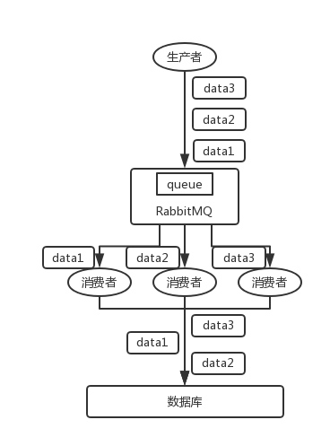

可以拆分多个 queue，每个 queue 一个 consumer，就是多一些 queue 而已，确实是麻烦点；或者就一个 queue 但是对应一个 consumer，然后这个 consumer 内部用内存队列做排队，然后分发给底层不同的 worker 来处理。

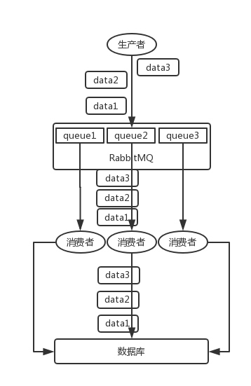

### Kafka

分发到同一个 partition 有序，consumer 消费有序，但 consumer 多线程时业务落库乱序。

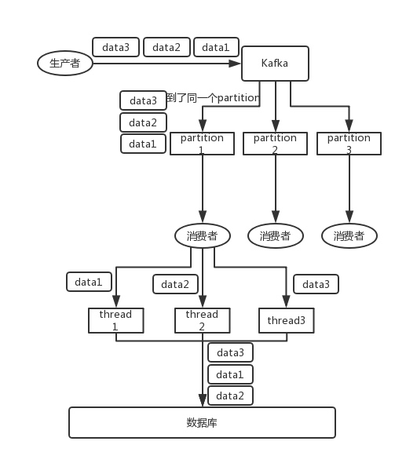

方案

* 一个 topic，一个 partition，一个 consumer，内部单线程消费，单线程吞吐量太低，一般不会用这个。
* 写 N 个内存 queue，具有相同 key 的数据都到同一个内存 queue；然后对于 N 个线程，每个线程分别消费一个内存 queue 即可，这样就能保证顺序性。
	
	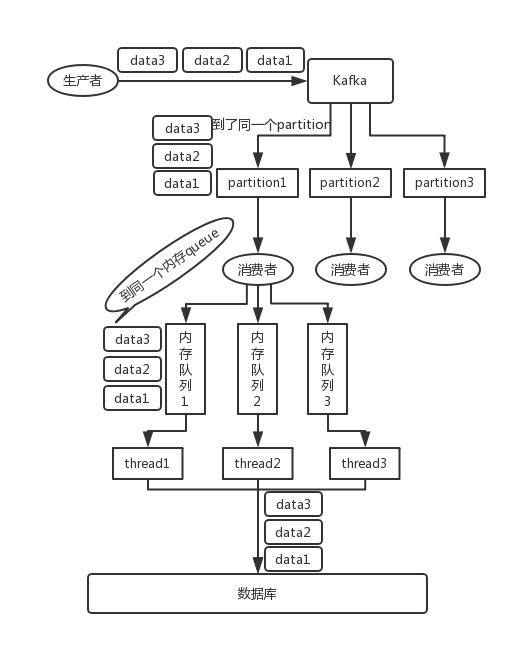

## 延迟和过期失效/队列满/堆积（先恢复再查 eg：文件同步堆积）

你看这问法，其实本质针对的场景，都是说，可能你的消费端出了问题，不消费了；或者消费的速度极其慢。接着就坑爹了，可能你的消息队列集群的磁盘都快写满了，都没人消费，这个时候怎么办？或者是这整个就积压了几个小时，你这个时候怎么办？或者是你积压的时间太长了，导致比如 RabbitMQ 设置了消息过期时间后就没了怎么办？

所以就这事儿，其实线上挺常见的，一般不出，一出就是大 case。一般常见于，举个例子，消费端每次消费之后要写 mysql，结果 mysql 挂了，消费端 hang 那儿了，不动了；或者是消费端出了个什么岔子，导致消费速度极其慢。

### 大量消息在 mq 里积压了几个小时了还没解决

一般这个时候，只能临时紧急扩容了，具体操作步骤和思路如下

* 先修复 consumer 的问题，确保其恢复消费速度，然后将现有 consumer 都停掉。
* 新建一个 topic，partition 是原来的 10 倍，临时建立好原先 10 倍的 queue 数量。
* 然后写一个临时的分发数据的 consumer 程序，这个程序部署上去消费积压的数据，**消费之后不做耗时的处理**，直接均匀轮询写入临时建立好的 10 倍数量的 queue。
* 接着临时征用 10 倍的机器来部署 consumer，每一批 consumer 消费一个临时 queue 的数据。这种做法相当于是临时将 queue 资源和 consumer 资源扩大 10 倍，以正常的 10 倍速度来消费数据。
* 等**快速消费完积压数据之后，得恢复原先部署的架构**，重新用原先的 consumer 机器来消费消息。

### mq 中的消息过期失效了

假设你用的是 RabbitMQ，RabbtiMQ 是可以设置过期时间的，也就是 TTL。如果消息在 queue 中积压超过一定的时间就会被 RabbitMQ 给清理掉，这个数据就没了。那这就是第二个坑了。这就不是说数据会大量积压在 mq 里，而是**大量的数据会直接搞丢**。

这个情况下，就不是说要增加 consumer 消费积压的消息，因为实际上没啥积压，而是丢了大量的消息。我们可以采取一个方案，就是**批量重导**，这个我们之前线上也有类似的场景干过。就是大量积压的时候，我们当时就直接丢弃数据了，然后等过了高峰期以后写程序，将丢失的那批数据重新灌入 mq 。

假设 1 万个订单积压在 mq 里面，没有处理，其中 1000 个订单都丢了，你只能手动写程序把那 1000 个订单给查出来，手动发到 mq 里去再补一次。

### mq 都快写满了

如果消息积压在 mq 里，你很长时间都没有处理掉，此时导致 mq 都快写满了，咋办？这个还有别的办法吗？没有，谁让你第一个方案执行的太慢了，你临时写程序，接入数据来消费，消费一个丢弃一个，都不要了，快速消费掉所有的消息。然后走第二个方案，到了晚上再补数据吧。

对于 RocketMQ，官方针对消息积压问题，提供了解决方案。

1. 提高消费并行度

2. 批量方式消费

3. 跳过非重要消息
	
## 如何设计 MQ

基本原理、核心组成部分、基本架构构成，然后参照开源说系统设计思路。

* 支持可伸缩性。
	需要的时候快速扩容，就可以增加吞吐量和容量，那怎么搞？设计个分布式的系统，参照一下 kafka 的设计理念，broker -> topic -> partition，每个 partition 放一个机器，就存一部分数据。如果现在资源不够了，给 topic 增加 partition，然后做数据迁移，增加机器，就可以存放更多数据，提供更高的吞吐量。

* 考虑落盘。
	落磁盘才能保证别进程挂了数据就丢了。那落磁盘的时候顺序写，没有磁盘随机读写的寻址开销，磁盘顺序读写的性能是很高的，是 kafka 的思路。

* 考虑可用性。
	参考之前可用性那个环节讲解的 kafka 的高可用保障机制。多副本 -> leader & follower -> broker 挂了重新选举 leader 即可对外服务。

* 支持数据 0 丢失。
	参考 kafka 数据零丢失方案。

