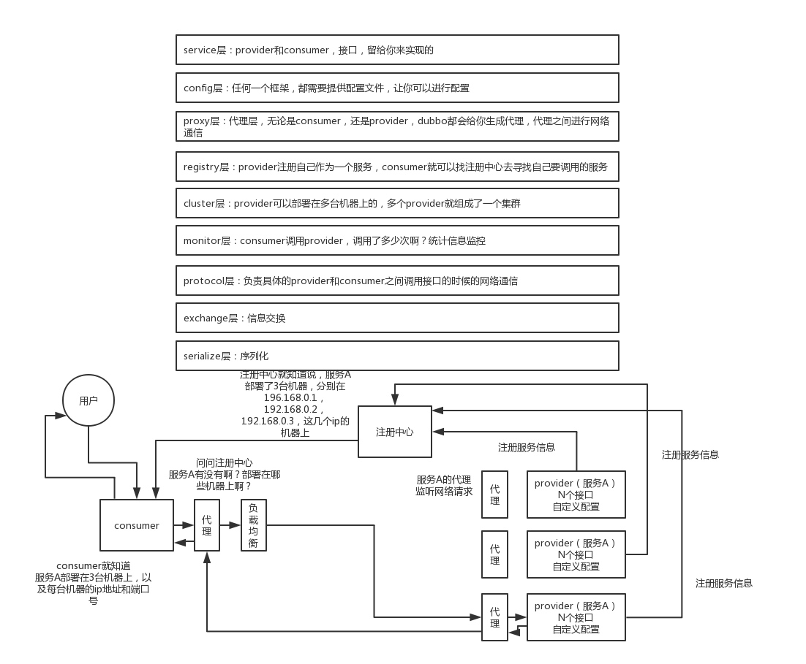

# RPC

说一下的 dubbo 的工作原理？注册中心挂了可以继续通信吗？说说一次 rpc 请求的流程？

MQ、ES、Redis、Dubbo，上来先问你一些思考性的问题、原理，比如 kafka 高可用架构原理、es 分布式架构原理、redis 线程模型原理、Dubbo 工作原理；之后就是生产环境里可能会碰到的一些问题，因为每种技术引入之后生产环境都可能会碰到一些问题；再来点综合的，就是系统设计，比如让你设计一个 MQ、设计一个搜索引擎、设计一个缓存、设计一个 rpc 框架等等。

## dubbo

* dubbo 工作原理
	
	服务注册、注册中心、消费者、代理通信、负载均衡

* 网络通信、序列化

	dubbo 协议、长连接、NIO、hessian 序列化协议

* 负载均衡策略
	
	* RandomLoadBalance
	* RoundRobinLoadBalance
	* LeastActiveLoadBalance（加权最小活跃数，活跃调用数越小，说明 Provider 效率越高）
	* ConsistentHashLoadBalance

* 集群容错策略
	
	* Failover Cluster（默认，失败自动切换重试）
	* Failfast Cluster（一次调用失败就立即失败，常见于非幂等性的写操作）
	* Failsafe Cluster（出现异常时忽略掉，常用于不重要的接口调用）
	* Failback Cluster（失败了后台自动记录请求，然后定时重发）
	* Forking Cluster（并行调用多个 provider，只要一个成功就立即返回，常用于实时性要求比较高的读操作，但是会浪费更多的服务资源）
	* Broadcast Cluster 模式（逐个调用所有的 provider。任何一个 provider 出错则报错，通常用于通知所有提供者更新缓存或日志等本地资源信息）
	
* 动态代理策略

	dubbo 跑起来的时候一些功能是如何运转的？怎么做负载均衡？怎么做集群容错？怎么生成动态代理？
	
	默认使用 javassist 动态字节码生成，创建代理类。但是可以通过 spi 扩展机制配置自己的动态代理策略。

* dubbo SPI 机制

	dubbo 的 SPI 机制？如何基于 SPI 机制对 dubbo 进行扩展？

### dubbo 工作原理

* 第一层：service 层，接口层，给服务提供者和消费者来实现的
* 第二层：config 层，配置层，主要是对 dubbo 进行各种配置的
* 第三层：proxy 层，服务代理层，无论是 consumer 还是 provider，dubbo 都会给你生成代理，代理之间进行网络通信
* 第四层：registry 层，服务注册层，负责服务的注册与发现
* 第五层：cluster 层，集群层，封装多个服务提供者的路由以及负载均衡，将多个实例组合成一个服务
* 第六层：monitor 层，监控层，对 rpc 接口的调用次数和调用时间进行监控
* 第七层：protocal 层，远程调用层，封装 rpc 调用
* 第八层：exchange 层，信息交换层，封装请求响应模式，同步转异步
* 第九层：transport 层，网络传输层，抽象 mina 和 netty 为统一接口
* 第十层：serialize 层，数据序列化层

### dubbo 工作流程

* provider 向注册中心去注册
* consumer 从注册中心订阅服务，注册中心会通知 consumer 注册好的服务
* consumer 调用 provider
* consumer 和 provider 都异步通知监控中心



注册中心挂了可以继续通信，消费者初始化时会将提供者的地址等信息拉取到本地缓存。

### 序列化协议

dubbo 支持哪些通信协议？支持哪些序列化协议？说一下 Hessian 的数据结构？PB 知道吗？为什么 PB 的效率是最高的？

1. 通信协议

	* dubbo 协议（默认）
	
		使用长连接，基于 NIO 异步通信，基于 hessian 作为序列化协议。适合传输数据量小（每次请求在 100kb 以内），但是并发量很高，以及服务消费者机器数远大于服务提供者机器数的情况。
	
	* rmi 协议
	
		RMI 协议采用 JDK 标准的 java.rmi.* 实现，采用阻塞式短连接和 JDK 标准序列化方式。多个短连接，适合消费者和提供者数量差不多的情况，适用于文件的传输，一般较少用。
	
	* hessian 协议
		
		Hessian 1 协议用于集成 Hessian 的服务，Hessian 底层采用 Http 通讯，采用 Servlet 暴露服务，Dubbo 缺省内嵌 Jetty 作为服务器实现。走 hessian 序列化协议，多个短连接，适用于提供者数量比消费者数量还多的情况，适用于文件的传输，一般较少用。
	
	* http 协议
	
		基于 HTTP 表单的远程调用协议，采用 Spring 的 HttpInvoker 实现。走表单序列化。
	
	* thrift 协议
	
		是对 thrift 原生协议的扩展，在原生协议的基础上添加了一些额外的头信息，比如 service name，magic number 等。
	
	* webservice 协议
	
		基于 WebService 的远程调用协议，基于 Apache CXF 的 frontend-simple 和 transports-http 实现。走 SOAP 文本序列化。
	
	* memcached 协议
	* redis 协议
	* rest 协议
	* grpc 协议
	
		自 2.7.5 版本开始支持 gRPC 协议，对于计划使用 HTTP/2 通信，或者想利用 gRPC 带来的 Stream、反压、Reactive 编程等能力的开发者来说， 都可以考虑启用 gRPC 协议。

2. 序列化协议

	dubbo 支持 hession、Java 二进制序列化、json、SOAP 文本序列化多种序列化协议。但是 hessian 是其默认的序列化协议。
	
	Hessian 的数据结构
	
	* Hessian 的对象序列化机制有 8 种原始类型
		* 原始二进制数据
		* boolean
		* 64-bit date（64 位毫秒值的日期）
		* 64-bit double
		* 32-bit int
		* 64-bit long
		* null
		* UTF-8 编码的 string
	* 3 种递归类型
		* list for lists and arrays
		* map for maps and dictionaries
		* object for objects
	* 1 种特殊的类型
		* ref：用来表示对共享对象的引用
	
3. pb 效率高的原因
	
	* 使用 proto 编译器，自动进行序列化和反序列化，速度非常快，应该比 XML 和 JSON 快上了 20~100 倍
	* 数据压缩效果好，就是说它序列化后的数据量体积小，传输的带宽和速度上会有优化

### dubbo SPI

基于接口的编程＋策略模式＋配置文件 实现动态加载机制，适用于调用者根据实际使用需要，启用、扩展、或者替换框架的实现策略，一般用在插件扩展的场景。

需要遵守如下约定

1. 当服务提供者提供了接口的一种具体实现后，在jar包的META-INF/services目录下创建一个以“接口全限定名”为命名的文件，内容为实现类的全限定名
2. 接口实现类所在的jar包放在主程序的classpath中
3. 主程序通过java.util.ServiceLoder动态装载实现模块，它通过扫描META-INF/services目录下的配置文件找到实现类的全限定名，把类加载到JVM
4. SPI的实现类必须携带一个不带参数的构造方法

``` java
public final class ServiceLoader<S> implements Iterable<S>{
private static final String PREFIX = "META-INF/services/";

    // 代表被加载的类或者接口
    private final Class<S> service;

    // 用于定位，加载和实例化providers的类加载器
    private final ClassLoader loader;

    // 创建ServiceLoader时采用的访问控制上下文
    private final AccessControlContext acc;

    // 缓存providers，按实例化的顺序排列
    private LinkedHashMap<String,S> providers = new LinkedHashMap<>();

    // 懒加载迭代器
    private LazyIterator lookupIterator;
  
    ......
}
```

1. 应用程序调用ServiceLoader.load方法，创建一个新的ServiceLoader，并实例化该类中的成员变量，包括 loader、acc、providers、lookupIterator
2. 应用程序通过迭代器接口获取对象实例
	
	如果 providers 已缓存实例对象，则直接返回，没缓存则读取 `META-INF/services/` 下的配置文件，获取所有能被实例化的类的名称，通过反射加载类对象，并通过 `instance()` 实例化，并缓存到 providers 中。
	此外，ServiceLoader可以跨越jar包获取META-INF下的配置文件。

缺点是通过 SPI 查找具体的实现的时候，需要**遍历并实例化所有实现类**，然后循环查找所需实现。

spi 经典的思想体现在 jdbc，Java 定义了一套 jdbc 的接口，但是并没有提供 jdbc 的实现类，需要根据自己使用的数据库引入实现类，如 mysql 引入 mysql-jdbc-connector.jar，oracle 引入 oracle-jdbc-connector.jar。运行时如果要使用 jdbc 接口，会在底层使用引入的 jar 中提供的实现类。Spring 的自动类型转换 Converter SPI 和 common-logging 也类似。

dubbo 也用了 spi 思想，不过没有用 jdk 的 spi 机制，是自己实现的一套 spi 机制。

``` java
Protocol protocol = ExtensionLoader.getExtensionLoader(Protocol.class).getAdaptiveExtension();
```

Protocol 接口，在系统运行的时候，dubbo 会判断一下应该选用接口的哪个实现类来实例化对象。会去找一个你配置的 Protocol，将你配置的 Protocol 实现类，加载到 jvm 中来，然后实例化对象，就用你的那个 Protocol 实现类就可以了。

@SPI("dubbo") 指通过 SPI 机制来提供实现类，实现类是通过 dubbo 作为默认 key 去配置文件里找到的，配置文件名称与接口全限定名一样的，通过 dubbo 作为 key 可以找到默认的实现类.

``` java
@SPI("dubbo")
public interface Protocol {

    int getDefaultPort();

    @Adaptive
    <T> Exporter<T> export(Invoker<T> invoker) throws RpcException;

    @Adaptive
    <T> Invoker<T> refer(Class<T> type, URL url) throws RpcException;

    void destroy();

}
```

在 dubbo 的 jar 里，/META_INF/dubbo/internal/com.alibaba.dubbo.rpc.Protocol 文件中

``` xml
dubbo=com.alibaba.dubbo.rpc.protocol.dubbo.DubboProtocol
http=com.alibaba.dubbo.rpc.protocol.http.HttpProtocol
hessian=com.alibaba.dubbo.rpc.protocol.hessian.HessianProtocol
```

### 基于 dubbo 的服务治理

1. 服务治理
	
	1. 生成各个服务之间的依赖关系和调用链路。
	2. 服务访问压力以及时长统计

		自动统计各个接口和服务之间的调用次数以及访问延时，并分为接口、链路两个粒度。
	
		* 接口粒度。每个服务的每个接口每天被调用多少次，TP50/TP90/TP99，三个档次的请求延时分别是多少
		* 从源头入口开始，一个完整的请求链路经过几十个服务之后，完成一次请求，每天全链路走多少次，全链路请求延时的 TP50/TP90/TP99，分别是多少
	3. 其它
		* 服务分层（避免循环依赖）
		* 调用链路失败监控和报警
		* 服务鉴权
		* 每个服务的可用性的监控（接口调用成功率？几个 9？99.99%，99.9%，99%）

2. 服务降级
	
3. 失败重试和超时重试

## API 幂等性、顺序性

1. 幂等性

	应该结合业务来保证幂等性，简单的如视频微博防重发，复杂的如分片断点续传，高并发如媒体状态更新。
	
	* 对于每个请求必须有一个唯一的标识，如订单ID
	* 每次处理完请求之后，必须有一个记录标识这个请求处理过了，如在 MySQL 中记录状态或支付流水
	* 每次接收请求需要进行判断，判断之前是否处理过

2. 顺序性

	尽量从业务逻辑上避免需要保证顺序性，因为一旦引入顺序性，比如使用分布式锁，会导致系统复杂度上升，而且会带来效率低下，热点数据压力过大等问题。
	
	确实需要顺序性时，可以通过 请求hash到机器 + 内存队列 保证。但容易造成单机热点，会引入新问题。

## 设计 RPC

设计思路 vintage + 动态代理 + 负载均衡 + netty nio + hessian，对应 服务发现 + Endpoint管理 + 负载均衡 + 连接层 + 协议层 + 业务层。

* 引入注册中心，保留各个服务的信息，可以用 zookeeper 来做
* 消费者需要去注册中心拿对应的服务信息，每个服务可能会存在于多台机器上
* 面向接口获取到一个动态代理，这个动态代理就是接口在本地的一个代理，然后这个代理会找到服务对应的机器地址，基于动态代理发起请求
* 负载均衡
* 基于 netty 的 nio 发送请求，通过 hessian 序列化协议
* 服务器针对自己的服务生成一个动态代理，监听某个网络端口，然后代理本地的服务代码，接收到请求的时候，就调用对应的服务代码


