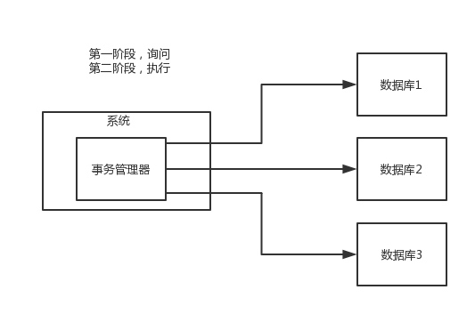
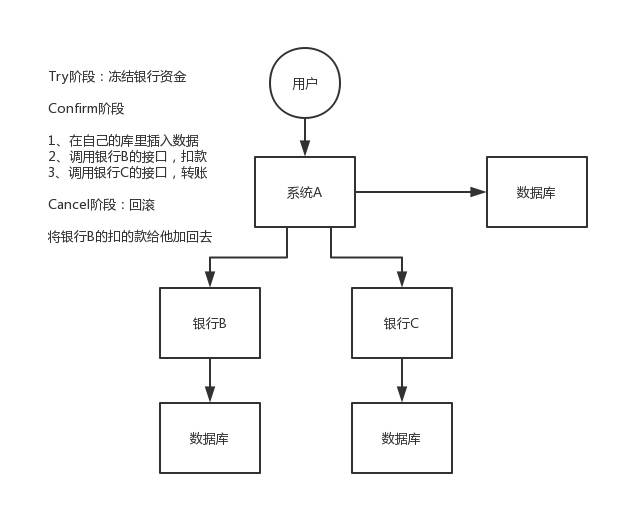
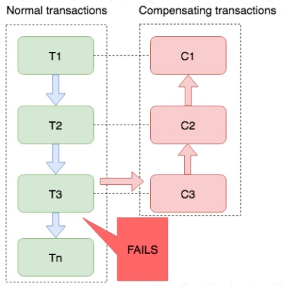
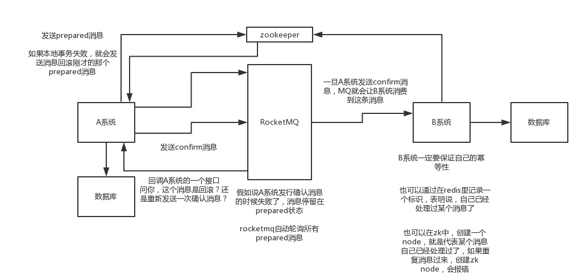

# Transaction

分布式事务了解吗？你们是如何解决分布式事务问题的？有哪些方案？每个方案的优缺点是什么？每种方案可能有啥坑？比如 TCC 方案的网络问题、XA 方案的一致性问题。

## 两阶段提交方案/XA 方案

事务管理器询问所有库是否ready，都ready就正式提交事务，任何一个不ready就回滚事务。

## TCC 方案

Try、Confirm、Cancel。

* Try 阶段：这个阶段说的是对各个服务的资源做检测以及对资源进行**锁定或者预留**。
* Confirm 阶段：这个阶段说的是在各个服务中**执行实际的操作**。
* Cancel 阶段：如果任何一个服务的业务方法执行出错，那么这里就需要**进行补偿**，就是执行已经执行成功的业务逻辑的回滚操作。（把那些执行成功的回滚）

因为**事务回滚**实际上是**严重依赖于你自己写代码来回滚和补偿**，会造成补偿代码巨大，非常之恶心。

适合一致性要求高、短流程、并发高的金融核心系统（支付、交易等）场景，严格保证分布式事务要么全部成功，要么全部自动回滚，严格保证资金的正确性，保证在资金上不会出现问题。而且最好是你的各个业务执行的时间都比较短。

## Saga 方案

对于更多的金融核心以上的业务系统往往会选择补偿事务，补偿事务处理在 30 多年前就提出了 Saga 理论，随着微服务的发展，近些年才逐步受到大家的关注。目前业界比较公认的是采用 Saga 作为长事务的解决方案。

### 基本原理

业务流程中每个参与者都提交本地事务，若某一个参与者失败，则补偿前面已经成功的参与者。

下图左侧是正常的事务流程，当执行到 T3 时发生了错误，则开始执行右边的事务补偿流程，反向执行 T3、T2、T1 的补偿服务 C3、C2、C1，将 T3、T2、T1 已经修改的数据补偿掉。

### 使用场景

不需要强一致性，只需要保证最终一致性的场景。

* 业务流程长、业务流程多
* 参与者包含其它公司或遗留系统服务，无法提供 TCC 模式要求的三个接口

优势

* 一阶段提交本地事务，无锁，高性能
* 参与者可异步执行，高吞吐
* 补偿服务易于实现，因为一个更新操作的反向操作是比较容易理解的

缺点

* 不保证事务的隔离性

## 本地消息表

* A 系统在自己本地一个事务里操作同时，插入一条数据到消息表
* 接着 A 系统将这个消息发送到 MQ 中去
* B 系统接收到消息之后，在一个事务里，往自己本地消息表里插入一条数据，同时执行其他的业务操作，如果这个消息已经被处理过了，那么此时这个事务会回滚，这样保证不会重复处理消息
* B 系统执行成功之后，就会更新自己本地消息表的状态以及 A 系统消息表的状态
* 如果 B 系统处理失败了，那么就不会更新消息表状态，那么此时 A 系统会定时扫描自己的消息表，如果有未处理的消息，会再次发送到 MQ 中去，让 B 再次处理
* 这个方案保证了最终一致性，哪怕 B 事务失败了，但是 A 会不断重发消息，直到 B 那边成功为止

最大的问题就在于**严重依赖于数据库的消息表来管理事务**，如果是高并发场景咋办呢？咋扩展呢？所以一般确实很少用。

## 可靠消息最终一致性方案

干脆不要用本地的消息表了，直接基于 MQ 来实现事务。比如阿里的 RocketMQ 就支持消息事务。

* A 系统先发送一个 prepared 消息到 mq，如果这个 prepared 消息发送失败那么就直接取消操作别执行了
* 如果这个消息发送成功过了，那么接着执行本地事务，如果成功就告诉 mq 发送确认消息，如果失败就告诉 mq 回滚消息
* 如果发送了确认消息，那么此时 B 系统会接收到确认消息，然后执行本地的事务
* mq 会自动定时轮询所有 prepared 消息回调你的接口，问你，这个消息是不是本地事务处理失败了，所有没发送确认的消息，是继续重试还是回滚？一般来说这里你就可以查下数据库看之前本地事务是否执行，如果回滚了，那么这里也回滚吧。这个就是避免可能本地事务执行成功了，而确认消息却发送失败了
* 这个方案里，要是系统 B 的事务失败了咋办？重试咯，自动不断重试直到成功，如果实在是不行，要么就是针对重要的资金类业务进行回滚，比如 B 系统本地回滚后，想办法通知系统 A 也回滚；或者是发送报警由人工来手工回滚和补偿

这个还是比较合适的，要不你就用 RocketMQ 支持的，要不你就自己基于类似 ActiveMQ？RabbitMQ？自己封装一套类似的逻辑出来，总之思路就是这样子的

## 最大努力通知方案

* 系统 A 本地事务执行完之后，发送个消息到 MQ
* 这里会有个专门消费 MQ 的**最大努力通知服务**，这个服务会消费 MQ 然后写入数据库中记录下来，或者是放入个内存队列也可以，接着调用系统 B 的接口
* 要是系统 B 执行成功就 ok 了；要是系统 B 执行失败了，那么最大努力通知服务就定时尝试重新调用系统 B，反复 N 次，最后还是不行就放弃

