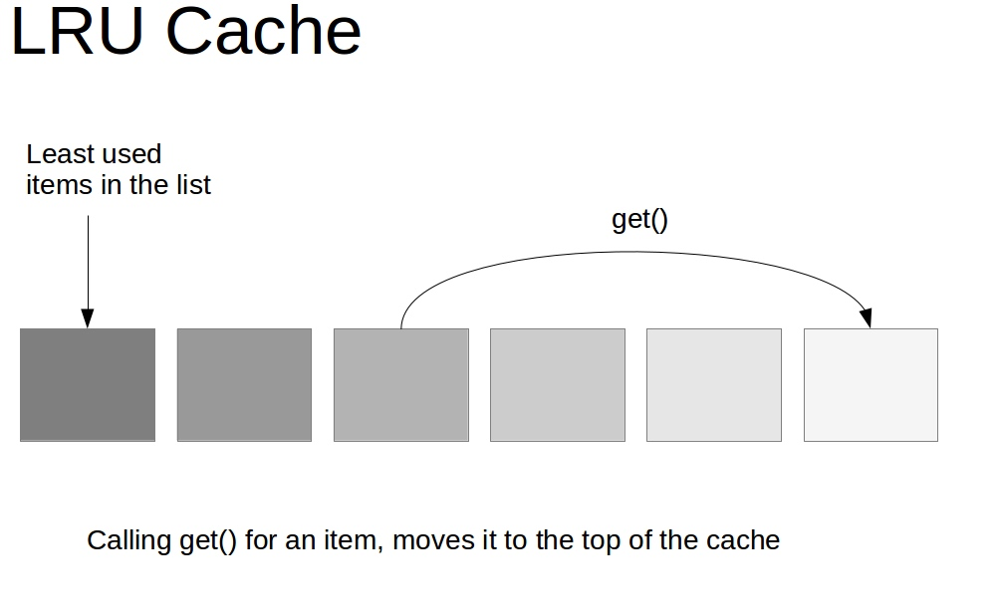
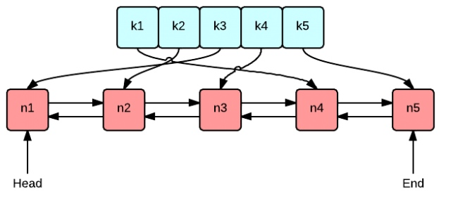
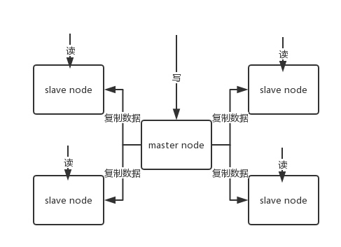

# Cache

项目中缓存是如何使用的？为什么要用缓存？缓存使用不当会造成什么后果？

## 优点

高性能，高并发。

## 对比（Redis vs. Memcache）

Redis 和 Memcached 有什么区别？Redis 的线程模型是什么？为什么 Redis 单线程却能支撑高并发？

Redis 实际上是个单线程工作模型

1. Redis 支持复杂的数据结构
	* string(set k v)
	* hash(map, hset k field v)
	* list(有序列表, lpush k v1 v2, rpop k, lrange k start_idx end_idx) 分页列表，消息队列
	* set(无序集合, sadd k v, srem k v1 v2, smembers k, scard k, spop k(随机删), smove k1 k2 count, sinter k1 k2, sunion k1 k2, sdiff k1 k2) 集合操作
	* sorted set(zadd k score member, zrevrange k score1 score2, zrank k member) 延迟队列
	* bitmap
	* pub/sub 消息
	* json
2. Redis 原生支持集群模式 cluster
3. 性能
	
	由于 Redis 只使用**单核**，而 Memcached 可以使用**多核**，所以平均每一个核上 Redis 在存储小数据时比 Memcached 性能更高。而在 100k 以上的数据中，Memcached 性能要高于 Redis。虽然 Redis 最近也在存储大数据的性能上进行优化，但是比起 Memcached，还是稍有逊色。

## Redis

### 常用命令

info, client list, config get k

### 单线程文件事件处理器 + 多线程I/O处理器

Redis 内部使用文件事件处理器 file event handler ，这个文件事件处理器是单线程的，所以 Redis 才叫做单线程的模型。

文件事件处理器的结构包含 4 个部分

* 多个 socket
* IO 多路复用程序
* 文件事件分派器
* 事件处理器（连接应答处理器、命令请求处理器、命令回复处理器）

多个 socket 可能会并发产生不同的操作，每个操作对应不同的文件事件，但是 IO 多路复用程序会监听多个 socket，会将产生事件的 socket 压入内存队列，事件分派器每次从队列中取出一个 socket 根据事件类型交给对应的事件处理器进行处理。

客户端与 Redis 的一次通信过程


Redis 单线程模型也能效率高的原因

* 纯内存操作。
* 核心是基于非阻塞的 IO 多路复用机制。
* C 语言实现，执行速度相对会更快。
* 单线程反而避免了多线程的频繁上下文切换问题，预防了多线程可能产生的竞争问题。

Redis 6.0 开始引入多线程

Redis 6.0 之后的版本抛弃了单线程模型这一设计，原本使用单线程运行的 Redis 也开始**选择性地使用多线程模型**。由于读写网络的 Read/Write 系统调用在 Redis 执行期间占用了大部分 CPU 时间，如果把网络读写做成多线程的方式对性能会有很大提升。

**Redis 的多线程部分只是用来处理网络数据的读写和协议解析，执行命令仍然是单线程**。 之所以这么设计是不想 Redis 因为多线程而变得复杂，需要去控制 key、lua、事务、LPUSH/LPOP 等等的并发问题。

Redis 选择使用单线程模型处理客户端的请求主要还是因为 **CPU 不是 Redis 服务器的瓶颈，所以使用多线程模型带来的性能提升并不能抵消它带来的开发成本和维护成本，系统的性能瓶颈也主要在网络 I/O 操作上**；而 Redis 引入多线程操作也是出于性能上的考虑，对于一些**大键值对的删除操作，通过多线程非阻塞地释放内存空间**(释放操作不会阻塞网络IO读写,因为网络IO读写与释放的命令执行不是同一个线程)也能减少对 Redis 主线程阻塞的时间，提高执行的效率。

### Redis 过期策略

（热点、业务变更引发的血泪史）

Redis 的过期策略都有哪些？内存淘汰机制都有哪些？手写一下 LRU 代码实现？

Redis 过期策略 **定期删除+惰性删除**。

所谓定期删除，指的是 Redis 默认是每隔 100ms 就随机抽取一些设置了过期时间的 key，检查其是否过期，如果过期就删除。

但是可能会导致很多过期 key 到了时间并没有被删除掉，所以需要惰性删除。获取 key 的时候，如果此时 key 已经过期，就删除，不会返回任何东西。

但是实际上这还是有问题的，如果定期删除漏掉了很多过期 key，然后你也没及时去查，也就没走惰性删除，此时会怎么样？如果大量过期 key 堆积在内存里，导致 Redis 内存块耗尽了，咋整？

就要走内存淘汰机制。

### 内存淘汰机制

config get maxmemory-policy

1. noeviction（playlist item）

	不淘汰，内存不足时写报错
	
2. allkeys-lru（file meta）

	键空间中移除最近最少使用的key
	
3. allkeys-random

	键空间中移除随机的key
	
4. volatile-lru（media status, biz info）

	设置了过期时间的键空间中，移除最近最少使用的key
	
5. volatile-random

	设置了过期时间的键空间中，移除随机的key
	
6. volatile-ttl(piece cache)

	设置了过期时间的键空间中，移除最早过期的key

## 手写 LRU 算法





``` java
public class LRUCache<K, V> extends LinkedHashMap<K, V> {
    private int capacity;

    /**
     * 传递进来最多能缓存多少数据
     *
     * @param capacity 缓存大小
     */
    public LRUCache(int capacity) {
        super(capacity, 0.75f, true);
        this.capacity = capacity;
    }

    /**
     * 如果map中的数据量大于设定的最大容量，返回true，再新加入对象时删除最老的数据
     *
     * @param eldest 最老的数据项
     * @return true则移除最老的数据
     */
    @Override
    protected boolean removeEldestEntry(Map.Entry<K, V> eldest) {
        // 当 map中的数据量大于指定的缓存个数的时候，自动移除最老的数据
        return size() > capacity;
    }
}
```

## 如何保证高并发、高可用

redis 单机能承载多高并发？如果单机扛不住如何扩容扛更多的并发？redis 会不会挂？既然 redis 会挂那怎么保证 redis 是高可用的？

### 主从架构实现高并发

单机的 Redis，能够承载的 QPS 大概就在上万到几万不等。对于缓存来说，一般都是用来支撑读高并发的。因此架构做成主从(master-slave)架构，一主多从，主负责写，并且将数据复制到其它的 slave 节点，从节点负责读。所有的读请求全部走从节点。这样也可以很轻松实现水平扩容，支撑读高并发。



Redis replication -> 主从架构 -> 读写分离 -> 水平扩容支撑读高并发

1. Redis replication 的核心机制

	* Redis 采用**异步方式**复制数据到 slave 节点，不过 Redis2.8 开始，slave node 会周期性地确认自己每次复制的数据量；
	* 一个 master node 是可以配置多个 slave node 的；
	* slave node 也可以连接其他的 slave node；
	* slave node 做复制的时候，不会 block master node 的正常工作；
	* slave node 在做复制的时候，也不会 block 对自己的查询操作，它会用旧的数据集来提供服务；但是**复制完成的时候，需要删除旧数据集，加载新数据集，这个时候就会暂停对外服务**；
	* slave node 主要用来进行横向扩容，做读写分离，扩容的 slave node 可以提高读的吞吐量。
	
	注意，如果采用了主从架构，那么建议必须**开启 master node 的持久化**，不建议用 slave node 作为 master node 的数据热备，因为那样的话，如果你关掉 master 的持久化，可能在 master 宕机重启的时候数据是空的，然后可能一经过复制， slave node 的数据也丢了。
	
	另外，master 的各种备份方案，也需要做。万一本地的所有文件丢失了，从备份中挑选一份 rdb 去恢复 master，这样才能**确保启动的时候有数据**，即使采用了后续讲解的高可用机制，slave node 可以自动接管 master node，但也可能 sentinel 还没检测到 master failure，master node 就自动重启了，还是可能导致上面所有的 slave node 数据被清空。

2. Redis 主从复制的核心原理
	
	

### 基于哨兵实现高可用


## Cache DB 数据一致性

## 雪崩、穿透、击穿

## 并发竞争

