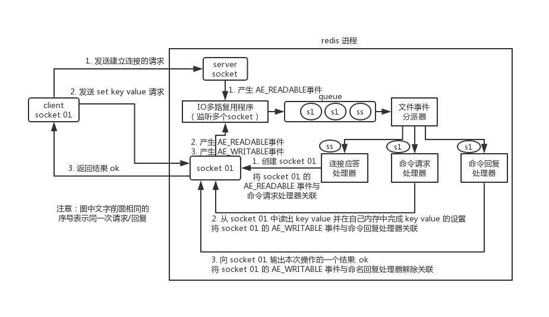

# Cache

项目中缓存是如何使用的？为什么要用缓存？缓存使用不当会造成什么后果？

## 优点

高性能，高并发。

## 对比（Redis vs. Memcache）

Redis 和 Memcached 有什么区别？Redis 的线程模型是什么？为什么 Redis 单线程却能支撑高并发？

Redis 实际上是个单线程工作模型

1. Redis 支持复杂的数据结构
	* string(set k v)
	* hash(map, hset k field v)
	* list(有序列表, lpush k v1 v2, rpop k, lrange k start_idx end_idx) 分页列表，消息队列
	* set(无序集合, sadd k v, srem k v1 v2, smembers k, scard k, spop k(随机删), smove k1 k2 count, sinter k1 k2, sunion k1 k2, sdiff k1 k2) 集合操作
	* sorted set(zadd k score member, zrevrange k score1 score2, zrank k member) 延迟队列
	* bitmap
	* pub/sub 消息
	* json
2. Redis 原生支持集群模式 cluster
3. 性能
	
	由于 Redis 只使用**单核**，而 Memcached 可以使用**多核**，所以平均每一个核上 Redis 在存储小数据时比 Memcached 性能更高。而在 100k 以上的数据中，Memcached 性能要高于 Redis。虽然 Redis 最近也在存储大数据的性能上进行优化，但是比起 Memcached，还是稍有逊色。

## Redis

### 常用命令

info, client list, config get k

### 单线程文件事件处理器 + 多线程I/O处理器

Redis 内部使用文件事件处理器 file event handler ，这个文件事件处理器是单线程的，所以 Redis 才叫做单线程的模型。

文件事件处理器的结构包含 4 个部分

* 多个 socket
* IO 多路复用程序
* 文件事件分派器
* 事件处理器（连接应答处理器、命令请求处理器、命令回复处理器）

多个 socket 可能会并发产生不同的操作，每个操作对应不同的文件事件，但是 IO 多路复用程序会监听多个 socket，会将产生事件的 socket 压入内存队列，事件分派器每次从队列中取出一个 socket 根据事件类型交给对应的事件处理器进行处理。

客户端与 Redis 的一次通信过程



Redis 单线程模型也能效率高的原因

* 纯内存操作。
* 核心是基于非阻塞的 IO 多路复用机制。
* C 语言实现，执行速度相对会更快。
* 单线程反而避免了多线程的频繁上下文切换问题，预防了多线程可能产生的竞争问题。

Redis 6.0 开始引入多线程

Redis 6.0 之后的版本抛弃了单线程模型这一设计，原本使用单线程运行的 Redis 也开始**选择性地使用多线程模型**。由于读写网络的 Read/Write 系统调用在 Redis 执行期间占用了大部分 CPU 时间，如果把网络读写做成多线程的方式对性能会有很大提升。

**Redis 的多线程部分只是用来处理网络数据的读写和协议解析，执行命令仍然是单线程**。 之所以这么设计是不想 Redis 因为多线程而变得复杂，需要去控制 key、lua、事务、LPUSH/LPOP 等等的并发问题。

Redis 选择使用单线程模型处理客户端的请求主要还是因为 **CPU 不是 Redis 服务器的瓶颈，所以使用多线程模型带来的性能提升并不能抵消它带来的开发成本和维护成本，系统的性能瓶颈也主要在网络 I/O 操作上**；而 Redis 引入多线程操作也是出于性能上的考虑，对于一些**大键值对的删除操作，通过多线程非阻塞地释放内存空间**(释放操作不会阻塞网络IO读写,因为网络IO读写与释放的命令执行不是同一个线程)也能减少对 Redis 主线程阻塞的时间，提高执行的效率。

### Redis 过期策略

（热点、业务变更引发的血泪史）

Redis 的过期策略都有哪些？内存淘汰机制都有哪些？手写一下 LRU 代码实现？

Redis 过期策略 **定期删除+惰性删除**。

所谓定期删除，指的是 Redis 默认是每隔 100ms 就随机抽取一些设置了过期时间的 key，检查其是否过期，如果过期就删除。

但是可能会导致很多过期 key 到了时间并没有被删除掉，所以需要惰性删除。获取 key 的时候，如果此时 key 已经过期，就删除，不会返回任何东西。

但是实际上这还是有问题的，如果定期删除漏掉了很多过期 key，然后你也没及时去查，也就没走惰性删除，此时会怎么样？如果大量过期 key 堆积在内存里，导致 Redis 内存块耗尽了，咋整？

就要走内存淘汰机制。

### 内存淘汰机制

config get maxmemory-policy

1. noeviction（playlist item）

	不淘汰，内存不足时写报错
	
2. allkeys-lru（file meta）

	键空间中移除最近最少使用的key
	
3. allkeys-random

	键空间中移除随机的key
	
4. volatile-lru（media status, biz info）

	设置了过期时间的键空间中，移除最近最少使用的key
	
5. volatile-random

	设置了过期时间的键空间中，移除随机的key
	
6. volatile-ttl(piece cache)

	设置了过期时间的键空间中，移除最早过期的key

## 手写 LRU 算法


``` java
public class LRUCache<K, V> extends LinkedHashMap<K, V> {
    private int capacity;

    /**
     * 传递进来最多能缓存多少数据
     *
     * @param capacity 缓存大小
     */
    public LRUCache(int capacity) {
        super(capacity, 0.75f, true);
        this.capacity = capacity;
    }

    /**
     * 如果map中的数据量大于设定的最大容量，返回true，再新加入对象时删除最老的数据
     *
     * @param eldest 最老的数据项
     * @return true则移除最老的数据
     */
    @Override
    protected boolean removeEldestEntry(Map.Entry<K, V> eldest) {
        // 当 map中的数据量大于指定的缓存个数的时候，自动移除最老的数据
        return size() > capacity;
    }
}
```

## 如何保证高并发、高可用

redis 单机能承载多高并发？如果单机扛不住如何扩容扛更多的并发？redis 会不会挂？既然 redis 会挂那怎么保证 redis 是高可用的？

### 主从架构实现高并发

单机的 Redis，能够承载的 QPS 大概就在上万到几万不等。对于缓存来说，一般都是用来支撑读高并发的。因此架构做成主从(master-slave)架构，一主多从，主负责写，并且将数据复制到其它的 slave 节点，从节点负责读。所有的读请求全部走从节点。这样也可以很轻松实现水平扩容，支撑读高并发。


Redis replication -> 主从架构 -> 读写分离 -> 水平扩容支撑读高并发

1. Redis replication 的核心机制

	* Redis 采用**异步方式**复制数据到 slave 节点，不过 Redis2.8 开始，slave node 会周期性地确认自己每次复制的数据量；
	* 一个 master node 是可以配置多个 slave node 的；
	* slave node 也可以连接其他的 slave node；
	* slave node 做复制的时候，不会 block master node 的正常工作；
	* slave node 在做复制的时候，也不会 block 对自己的查询操作，它会用旧的数据集来提供服务；但是**复制完成的时候，需要删除旧数据集，加载新数据集，这个时候就会暂停对外服务**；
	* slave node 主要用来进行横向扩容，做读写分离，扩容的 slave node 可以提高读的吞吐量。
	
	注意，如果采用了主从架构，那么建议必须**开启 master node 的持久化**，不建议用 slave node 作为 master node 的数据热备，因为那样的话，如果你关掉 master 的持久化，可能在 master 宕机重启的时候数据是空的，然后可能一经过复制， slave node 的数据也丢了。
	
	另外，master 的各种备份方案，也需要做。万一本地的所有文件丢失了，从备份中挑选一份 rdb 去恢复 master，这样才能**确保启动的时候有数据**，即使采用了后续讲解的高可用机制，slave node 可以自动接管 master node，但也可能 sentinel 还没检测到 master failure，master node 就自动重启了，还是可能导致上面所有的 slave node 数据被清空。

2. Redis 主从复制的核心原理
	
	
	
	当启动一个 slave node 的时候，它会发送一个 PSYNC 命令给 master node。

	如果这是 slave node 初次连接到 master node，那么会触发一次 full resynchronization 全量复制。此时 master 会启动一个后台线程，开始生成一份 RDB 快照文件，同时还会将从客户端 client 新收到的所有写命令缓存在内存中。 RDB 文件生成完毕后， master 会将这个 RDB 发送给 slave，slave 会先写入本地磁盘，然后再从本地磁盘加载到内存中，接着 master 会将内存中缓存的写命令发送到 slave，slave 也会同步这些数据。slave node 如果跟 master node 有网络故障，断开了连接，会自动重连，连接之后 master node 仅会复制给 slave 部分缺少的数据。

	* 断点续传

		从 Redis2.8 开始，就支持主从复制的断点续传，如果主从复制过程中，网络连接断掉了，那么可以接着上次复制的地方，继续复制下去，而不是从头开始复制一份。

		master node 会在内存中维护一个 backlog，master 和 slave 都会保存一个 replica offset 还有一个 master run id，offset 就是保存在 backlog 中的。如果 master 和 slave 网络连接断掉了，slave 会让 master 从上次 replica offset 开始继续复制，如果没有找到对应的 offset，那么就会执行一次 resynchronization 。
		
		如果根据 host+ip 定位 master node，是不靠谱的，如果 master node 重启或者数据出现了变化，那么 slave node 应该根据不同的 run id 区分。

	* 无磁盘化复制

		```
		# master 在内存中直接创建 RDB ，然后发送给 slave，不在本地落地磁盘了
		repl-diskless-sync yes

		# 等待 5s 后再开始复制，因为要等更多 slave 重新连接过来
		repl-diskless-sync-delay 5
		```
	
	* 过期 key 处理

		slave 不会过期 key，只会等待 master 过期 key。如果 master 过期了一个 key，或者通过 LRU 淘汰了一个 key，那么会模拟一条 del 命令发送给 slave。
		
3. 复制的完整流程

	
	
	slave node 启动时，会在自己本地保存 master node 的信息，包括 master node 的 host 和 ip ，但是复制流程没开始。

	slave node 内部有个定时任务，每秒检查是否有新的 master node 要连接和复制，如果发现，就跟 master node 建立 socket 网络连接。然后 slave node 发送 ping 命令给 master node。如果 master 设置了 requirepass，那么 slave node 必须发送 masterauth 的口令过去进行认证。master node 第一次执行全量复制，将所有数据发给 slave node。而在后续，master node 持续将写命令，异步复制给 slave node。
	
	1. 全量复制

		* master 执行 bgsave ，在本地生成一份 rdb 快照文件。
		* master node 将 rdb 快照文件发送给 slave node，如果 rdb 复制时间超过 60 秒（repl-timeout），那么 slave node 就会认为复制失败，可以适当调大这个参数(对于千兆网卡的机器，一般每秒传输 100MB，6G 文件，很可能超过 60s)
		* master node 在生成 rdb 时，会将所有新的写命令缓存在内存中，在 slave node 保存了 rdb 之后，再将新的写命令复制给 slave node。
		* 如果在复制期间，内存缓冲区持续消耗超过 64MB，或者一次性超过 256MB，那么停止复制，复制失败。client-output-buffer-limit slave 256MB 64MB 60
		* slave node 接收到 rdb 之后，清空自己的旧数据，然后重新加载 rdb 到自己的内存中，同时基于旧的数据版本对外提供服务。
		* 如果 slave node 开启了 AOF，那么会立即执行 BGREWRITEAOF，重写 AOF。
	
	2. 增量复制
	
		* 如果全量复制过程中，master-slave 网络连接断掉，那么 slave 重新连接 master 时，会触发增量复制。
		* master 直接从自己的 backlog 中获取部分丢失的数据，发送给 slave node，默认 backlog 就是 1MB。
		* master 就是根据 slave 发送的 psync 中的 offset 来从 backlog 中获取数据的。
	
	3. heartbeat

		主从节点互相都会发送 heartbeat 信息。

		master 默认每隔 10 秒发送一次 heartbeat，slave node 每隔 1 秒发送一个 heartbeat。
		
	4. 异步复制
		
		master 每次接收到写命令之后，先在内部写入数据，然后异步发送给 slave node。
		
### 基于哨兵实现高可用

1. 介绍

	功能

	* 集群监控：负责监控 Redis master 和 slave 进程是否正常工作。
	* 消息通知：如果某个 Redis 实例有故障，那么哨兵负责发送消息作为报警通知给管理员。
	* 故障转移：如果 master node 挂掉了，会自动转移到 slave node 上。
	* 配置中心：如果故障转移发生了，通知 client 客户端新的 master 地址。

	哨兵用于实现 Redis 集群的高可用，本身也是分布式的，作为一个哨兵集群去运行，互相协同工作。
	
	* 故障转移时，判断一个 master node 是否宕机了，需要大部分的哨兵都同意才行，涉及到了分布式选举的问题。
	* 即使部分哨兵节点挂掉了，哨兵集群还是能正常工作的，因为如果一个作为高可用机制重要组成部分的故障转移系统本身是单点的，那就很坑爹了。

2. 核心知识
	
	* 哨兵至少需要 3 个实例来保证自己的健壮性。
	* 哨兵 + Redis 主从的部署架构，是**不保证数据零丢失的，只保证 Redis 集群的高可用性**。
	* 对于哨兵 + Redis 主从这种复杂的部署架构，尽量在测试环境和生产环境，都进行充足的测试和演练。

3. 哨兵主备切换的数据丢失问题

	1. 异步复制导致的数据丢失
		
		因为 master->slave 的复制是异步的，所以可能有部分数据还没复制到 slave，master 就宕机了，此时这部分数据就丢失了。
		
	2. 脑裂导致的数据丢失

		脑裂后，虽然某个 slave 被切换成了 master，但是可能 client 还没来得及切换到新的 master，还继续向旧 master 写数据。因此旧 master 再次恢复的时候，会被作为一个 slave 挂到新的 master 上去，自己的数据会清空，重新从新的 master 复制数据。而新的 master 并没有后来 client 写入的数据，因此，这部分数据也就丢失了。
		

	3. 数据丢失问题的解决方案
		
		一旦所有的 slave，数据复制和同步的延迟都超过了 10 秒钟，那么这个时候，master 就不会再接收任何请求了。

		```
		# 至少有 1 个 slave
		min-slaves-to-write 1
		# 数据复制和同步的延迟不能超过 10 秒
		min-slaves-max-lag 10
		```
		
	4. sdown 和 odown 转换机制

		sdown 达成的条件很简单，如果一个哨兵 ping 一个 master，超过了 is-master-down-after-milliseconds 指定的毫秒数之后，就主观认为 master 宕机了；如果一个哨兵在指定时间内，收到了 quorum 数量的其它哨兵也认为那个 master 是 sdown 的，那么就认为是 odown 了。

4. 哨兵集群的自动发现机制
	
	哨兵互相之间的发现，是通过 Redis 的 **pub/sub** 系统实现的，每个哨兵都会往 __sentinel__:hello 这个 channel 里发送一个消息，这时候所有其他哨兵都可以消费到这个消息，并感知到其他的哨兵的存在。

	每隔两秒钟，每个哨兵都会往自己监控的某个 master+slaves 对应的 __sentinel__:hello channel 里发送一个消息，内容是自己的 host、ip 和 runid 还有对这个 master 的监控配置。

	每个哨兵也会去监听自己监控的每个 master+slaves 对应的 __sentinel__:hello channel，然后去感知到同样在监听这个 master+slaves 的其他哨兵的存在。

	每个哨兵还会跟其他哨兵交换对 master 的监控配置，互相进行监控配置的同步。
	
5. slave 配置的自动纠正
		
	哨兵会负责自动纠正 slave 的一些配置，比如 slave 如果要成为潜在的 master 候选人，哨兵会确保 slave 复制现有 master 的数据；如果 slave 连接到了一个错误的 master 上，比如故障转移之后，那么哨兵会确保它们连接到正确的 master 上。

6. slave->master 选举算法 
	
	如果一个 master 被认为 odown 了，而且 majority 数量的哨兵都允许主备切换，那么某个哨兵就会执行主备切换操作，此时首先要选举一个 slave 来，会考虑 slave 的一些信息：

	* 跟 master 断开连接的时长
	* slave 优先级
	* 复制 offset
	* run id
	
	如果一个 slave 跟 master 断开连接的时间已经超过了 down-after-milliseconds 的 10 倍，外加 master 宕机的时长，那么 slave 就被认为不适合选举为 master。

	``` java
	(down-after-milliseconds * 10) + milliseconds_since_master_is_in_SDOWN_state
	```
	
	接下来会对 slave 进行排序：

	* 按照 slave 优先级进行排序，slave priority 越低，优先级就越高。
	* 如果 slave priority 相同，那么看 replica offset，哪个 slave 复制了越多的数据，offset 越靠后，优先级就越高。
	* 如果上面两个条件都相同，那么选择一个 run id 比较小的那个 slave。
	
7. quorum 和 majority

	需要 max(quorum, majority) 数量的哨兵都同意才能主备切换。
	
8. configuration epoch
	
	哨兵会对一套 Redis master+slaves 进行监控，有相应的监控的配置。

	执行切换的那个哨兵，会从要切换到的新 master（salve->master）那里得到一个 configuration epoch，这就是一个 version 号，每次切换的 version 号都必须是唯一的。
	
	如果第一个选举出的哨兵切换失败了，那么其他哨兵，会等待 failover-timeout 时间，然后接替继续执行切换，此时会重新获取一个新的 configuration epoch，作为新的 version 号。
	
9. configuration 传播
	
	哨兵完成切换之后，会在自己本地更新生成最新的 master 配置，然后同步给其他的哨兵，就是通过之前说的 pub/sub 消息机制。

	这里之前的 version 号就很重要了，因为各种消息都是通过一个 channel 去发布和监听的，所以一个哨兵完成一次新的切换之后，新的 master 配置是跟着新的 version 号的。其他的哨兵都是根据版本号的大小来更新自己的 master 配置的。
	
### 持久化方式

Redis 的持久化有哪几种方式？不同的持久化机制都有什么优缺点？持久化机制具体底层是如何实现的？

持久化主要是做灾难恢复、数据恢复，也可以归类到高可用的一个环节，比如 Redis 整个挂了，然后就不可用了，要做的事情就是让 Redis 尽快变得可用，避免缓存雪崩影响数据库。

* RDB：RDB 持久化机制，是对 Redis 中的数据执行周期性的持久化。
* AOF：AOF 机制对每条写入命令作为日志，以 append-only 的模式写入一个日志文件中，在 Redis 重启的时候，可以通过回放 AOF 日志中的写入指令来重新构建整个数据集。

如果同时使用 RDB 和 AOF，在 Redis 重启时会使用 AOF 来重新构建数据，因为 AOF 中的数据更加完整。

RDB 优缺点

* RDB 会生成多个数据文件，每个数据文件都代表了某一个时刻中 Redis 的数据，这种多个数据文件的方式，**非常适合做冷备**，可以将这种完整的数据文件发送到一些远程的安全存储上去。
* RDB 对 Redis 对外提供的读写服务，影响非常小，可以让 Redis 保持高性能，因为 Redis 主进程只需要 **fork 一个子进程执行磁盘 IO 操作来进行 RDB 持久化即可**。
* 相对于 AOF 持久化机制来说，直接基于 RDB 数据文件来重启和恢复 Redis 进程，更加快速。
* 如果想要在 Redis 故障时，尽可能少的丢失数据，那么 RDB 没有 AOF 好。一般来说，RDB 数据快照文件**每隔 5 分钟或更长**生成一次，得接受一旦 Redis 进程宕机会丢失最近 5 分钟或更长时间的数据。
* RDB 每次生成 RDB 时，如果数据文件特别大，可能会导致对客户端提供的服务**暂停数毫秒甚至数秒**。

AOF 优缺点

* AOF 可以更好的保护数据不丢失，一般 AOF 会**每隔 1 秒**，通过一个后台线程执行一次 **fsync** 操作，最多丢失 1 秒钟的数据。
* AOF 日志文件以 append-only 模式写入，所以**没有任何磁盘寻址开销**，写入性能非常高，而且**文件不容易破损，即使文件尾部破损，也很容易修复**。
* AOF 日志文件即使过大的时候，出现后台重写操作，也不会影响客户端的读写。因为在 **rewrite log 的时候，会对其中的指令进行压缩，创建出一份需要恢复数据的最小日志出来**。在创建新日志文件的时候，老的日志文件还是照常写入。当新的 merge 后的日志文件 ready 的时候，再交换新老日志文件即可。
* AOF 日志文件的命令通过**可读较强的方式记录，非常适合做灾难性的误删除的紧急恢复**。比如某人不小心用 flushall 命令清空了所有数据，只要这个时候后台 rewrite 还没有发生，那么就可以立即拷贝 AOF 文件，将最后一条 flushall 命令给删了，然后再将该 AOF 文件放回去，就可以通过恢复机制，自动恢复所有数据。
* 对于同一份数据来说，AOF 日志文件通常比 RDB 数据快照文件**更大**。
* AOF 开启后，支持的**写 QPS 比 RDB 低**，因为 AOF 一般会配置成每秒 fsync 一次日志文件，当然，每秒一次 fsync ，性能也还是很高的。（如果实时写入，那么 QPS 会大降，Redis 性能会大大降低）
* 以前 AOF 发生过 bug，就是通过 AOF 记录的日志，进行数据恢复的时候，没有恢复一模一样的数据出来。所以说，**类似 AOF 这种较为复杂的基于命令日志 merge 回放的方式，比基于 RDB 每次持久化一份完整的数据快照文件的方式更加脆弱**，容易有 bug。不过 AOF 就是为了避免 rewrite 过程导致的 bug，因此每次 rewrite 并不是基于旧的指令日志进行 merge 的，而是基于当时内存中的数据进行指令的重新构建，这样健壮性会好很多。

RDB 和 AOF 到底该如何选择

不要仅仅使用 RDB，会导致丢失很多数据；也不要仅仅使用 AOF，通过 AOF 做冷备没有 RDB 恢复快，RDB 每次简单粗暴生成数据快照更健壮，可以避免 AOF 这种复杂的备份和恢复机制的 bug。
Redis 支持同时开启开启两种持久化方式，我们可以综合使用 AOF 和 RDB 两种持久化机制，用 AOF 来保证数据不丢失，作为数据恢复的第一选择；用 RDB 来做不同程度的冷备，在 AOF 文件都丢失或损坏不可用的时候，还可以使用 RDB 来进行快速的数据恢复。

### 集群模式工作原理

Redis 集群模式的工作原理能说一下么？在集群模式下，Redis 的 key 是如何寻址的？分布式寻址都有哪些算法？了解一致性 hash 算法吗？

在前几年，Redis 如果要搞几个节点，每个节点存储一部分的数据，得借助一些中间件来实现，比如说有 codis ，或者 twemproxy ，都有。有一些 Redis 中间件，你读写 Redis 中间件，Redis 中间件负责将你的数据分布式存储在多台机器上的 Redis 实例中。

这两年，Redis 不断在发展，Redis 也不断有新的版本，现在的 Redis 集群模式，可以做到在多台机器上，部署多个 Redis 实例，每个实例存储一部分的数据，同时每个 Redis 主实例可以挂 Redis 从实例，自动确保如果 Redis 主实例挂了，会自动切换到 Redis 从实例上来。

现在 Redis 的新版本，大家都是用 Redis cluster 的，也就是 Redis 原生支持的 Redis 集群模式，那么面试官肯定会就 Redis cluster 对你来个几连炮。要是你没用过 Redis cluster，正常，以前很多人用 codis 之类的客户端来支持集群，但是起码你得研究一下 Redis cluster 吧。

如果你的数据量很少，主要是承载高并发高性能的场景，比如你的缓存一般就几个 G，单机就足够了，可以使用 replication，一个 master 多个 slaves，要几个 slave 跟你要求的读吞吐量有关，然后自己搭建一个 sentinel 集群去保证 Redis 主从架构的高可用性。

Redis cluster，主要是针对**海量数据+高并发+高可用**的场景。Redis cluster 支撑 N 个 Redis master node，每个 master node 都可以挂载多个 slave node。这样整个 Redis 就可以横向扩容了。如果你要支撑更大数据量的缓存，那就横向扩容更多的 master 节点，每个 master 节点就能存放更多的数据了。

1. Redis cluster 介绍

	* 自动将数据进行分片，每个 master 上放一部分数据
	* 提供内置的高可用支持，部分 master 不可用时，还是可以继续工作的

	在 Redis cluster 架构下，每个 Redis 要放开两个端口号，比如一个是 6379，另外一个就是 加 1w 的端口号，比如 16379。
	
	16379 端口号是用来进行节点间通信的，也就是 cluster bus 的东西，cluster bus 的通信，用来进行故障检测、配置更新、故障转移授权。cluster bus 用了另外一种二进制的协议， **gossip 协议**，用于节点间进行高效的数据交换，占用更少的网络带宽和处理时间。

2. 节点间的内部通信机制
	
	1. 基本通信原理
			
		集群元数据的维护方式：集中式、Gossip 协议。
		
		Redis cluster 节点间采用 gossip 协议进行通信。

		集中式是将集群元数据（节点信息、故障等等）集中存储在某个节点上。集中式元数据集中存储的一个典型代表，就是大数据领域的 storm 。它是分布式的大数据实时计算引擎，是集中式的元数据存储的结构，底层基于 zookeeper（分布式协调的中间件）对所有元数据进行存储维护。

		
		
		Redis 维护集群元数据采用另一个方式， gossip 协议，所有节点都持有一份元数据，不同的节点如果出现了元数据的变更，就不断将元数据发送给其它的节点，让其它节点也进行元数据的变更。

		
		
		集中式的好处在于，**元数据的读取和更新时效性非常好**，一旦元数据出现了变更，就立即更新到集中式的存储中，其它节点读取的时候就可以感知到；不好在于，所有元数据的**更新压力全部集中**，可能会导致元数据的存储有压力。

		gossip 好处在于，元数据的更新比较分散，不是集中在一个地方，更新请求会陆陆续续打到所有节点上去更新，**降低了压力**；不好在于，元数据的更新有延时，可能导致集群中的一些操作会有一些滞后。

		* 10000 端口：每个节点都有一个专门用于节点间通信的端口，就是自己提供服务的端口号+10000，比如 7001，那么用于节点间通信的就是 17001 端口。每个节点每隔一段时间都会往另外几个节点发送 ping 消息，同时其它几个节点接收到 ping 之后返回 pong 。
		* 交换的信息：信息包括故障信息，节点的增加和删除，hash slot 信息等等。
	
	2. gossip 协议
		
		gossip 协议包含 ping , pong , meet , fail 等多种消息。
		
		* meet：某个节点发送 meet 给新加入的节点，让新节点加入集群中，然后新节点就会开始与其它节点进行通信。
		* ping：每个节点都会频繁给其它节点发送 ping，其中包含自己的状态还有自己维护的集群元数据，互相通过 ping 交换元数据。
		* pong：返回 ping 和 meeet，包含自己的状态和其它信息，也用于信息广播和更新。
		* fail：某个节点判断另一个节点 fail 之后，就发送 fail 给其它节点，通知其它节点说，某个节点宕机啦。
	
	3. ping 消息探入
		
		ping 时要携带一些元数据，如果很频繁，可能会加重网络负担。

		每个节点每秒会执行 10 次 ping，每次会选择 5 个最久没有通信的其它节点。当然如果发现某个节点通信延时达到了 **cluster_node_timeout / 2** ，那么立即发送 ping，避免数据交换延时过长，落后的时间太长了。比如说，两个节点之间都 10 分钟没有交换数据了，那么整个集群处于严重的元数据不一致的情况，就会有问题。所以 **cluster_node_timeout** 可以调节，如果调得比较大，那么会降低 ping 的频率。

		每次 ping，会带上自己节点的信息，还有就是带上 1/10 其它节点的信息，发送出去，进行交换。至少包含 3 个其它节点的信息，最多包含 **总节点数 - 2** 个其它节点的信息。
		
3. 分布式寻址算法

	1. hash 算法（大量缓存重建）
	
		
		
		一旦某一个 master 节点宕机，所有请求过来，都会基于最新的剩余 master 节点数去取模，尝试去取数据。这会导致**大部分的请求过来，全部无法拿到有效的缓存**，导致大量的流量涌入数据库。
	
	2. 一致性 hash 算法（自动缓存迁移）+ 虚拟节点（自动负载均衡）

		
		
		一致性 hash 算法将整个 hash 值空间组织成一个**虚拟圆环**，整个空间按顺时针方向组织，下一步将各个 master 节点（使用服务器的 ip 或主机名）进行 hash。这样就能确定每个节点在其哈希环上的位置。

		来了一个 key，首先计算 hash 值，并确定此数据在环上的位置，**从此位置沿环顺时针“行走”，遇到的第一个 master 节点就是 key 所在位置**。

		在一致性哈希算法中，如果一个节点挂了，**受影响的数据仅仅是此节点到环空间前一个节点**（沿着逆时针方向行走遇到的第一个节点）之间的数据，其它不受影响。增加一个节点也同理。

		然而，一致性哈希算法**在节点太少时，容易因为节点分布不均匀而造成缓存热点的问题**。为了解决这种热点问题，一致性 hash 算法**引入虚拟节点机制**，即对每一个节点计算多个 hash，每个计算结果位置都放置一个虚拟节点。这样就实现了数据的均匀分布，负载均衡。

	3. Redis cluster 的 hash slot 算法
		
		
		
		Redis cluster 有固定的 16384 个 hash slot，对每个 key 计算 CRC16 值，然后对 16384 取模，可以获取 key 对应的 hash slot。

		Redis cluster 中每个 master 都会持有部分 slot，比如有 3 个 master，那么可能每个 master 持有 5000 多个 hash slot。hash slot 让 node 的增加和移除很简单，增加一个 master，就将其他 master 的 hash slot 移动部分过去，减少一个 master，就将它的 hash slot 移动到其他 master 上去。移动 hash slot 的成本是非常低的。客户端的 api，可以对指定的数据，让他们走同一个 hash slot，通过 hash tag 来实现。

		任何一台机器宕机，另外两个节点，不影响的。因为 key 找的是 hash slot，不是机器。

4. Redis cluster 的高可用与主备切换原理
	
	几乎跟哨兵类似。
	
	1. 判断节点宕机

		* pfail ，主观宕机。在 cluster-node-timeout 内，某个节点一直没有返回 pong ，那么就被认为 pfail 。
		* fail ，客观宕机。如果一个节点认为某个节点 pfail 了，那么会在 gossip ping 消息中， ping 给其他节点，如果超过半数的节点都认为 pfail 了，那么就会变成 fail 。
	
	2. 从节点过滤
	
		检查每个 slave node 与 master node 断开连接的时间，如果超过了 **cluster-node-timeout * cluster-slave-validity-factor** ，那么就没有资格切换成 master 。

	3. 从节点选举
		
		每个从节点根据对 master 复制数据的 offset，来设置一个选举时间，offset 越大（复制数据越多）的从节点，选举时间越靠前，优先进行选举。

		所有的 master node 开始 slave 选举投票，给要进行选举的 slave 进行投票，如果大部分 master node **（N/2 + 1）** 都投票给了某个从节点，那么选举通过，那个从节点可以切换成 master。

		从节点执行主备切换，从节点切换为主节点。
		
	4. 与哨兵比较
		
		非常类似，所以说，Redis cluster 功能强大，直接集成了 replication 和 sentinel 的功能。

## 雪崩、穿透、击穿

### 缓存雪崩

数据库立马又被新流量打死。

* 事前：Redis 高可用，主从+哨兵，Redis cluster，避免全盘崩溃。
* 事中：本地 ehcache 缓存 + hystrix 限流&降级，避免 MySQL 被打死。
* 事后：Redis 持久化，一旦重启，自动从磁盘上加载数据，快速恢复缓存数据。

### 缓存穿透

不可能存在的key。

* 种空值+设过期
* bloomfilter 初筛不存在的 key

### 缓存击穿

个 key 非常热点，访问非常频繁，处于集中式高并发访问的情况，当这个 key 在失效的瞬间，大量的请求就击穿了缓存，直接请求数据库。

* 若缓存的数据是**基本不更新**，则可尝试将该热点数据设置为**永不过期**。
* 若缓存的数据**更新不频繁，且缓存刷新的整个流程耗时较少**的情况下，则可以采用基于 Redis、zookeeper 等分布式中间件的**分布式互斥锁或本地互斥锁**以保证仅少量的请求能请求数据库并重新构建缓存，其余线程则在锁释放后能访问到新缓存。
* 若缓存的数据**更新频繁或者在缓存刷新的流程耗时较长**的情况下，可以利用**定时线程在缓存过期前主动地重新构建缓存或者延后缓存的过期时间**，以保证所有的请求能一直访问到对应的缓存。

### 缓存错

ms级时间窗口种下默认key，导致默认行为出错。

## Cache DB 双写一致性

如果你的系统不是严格要求 “缓存+数据库” 必须保持一致性的话，最好不要做 *读请求和写请求串行化到一个内存队列里* 。可以保证一定不会出现不一致的情况，但是它也会导致系统的吞吐量大幅度降低，用比正常情况下多几倍的机器去支撑线上的一个请求。

### Cache Aside

1. 写请求先更新db再删缓存，读请求穿透时先查db再更新缓存（Cache Aside）
	
	* 删缓存失败时，缓存和DB数据不一致
	* DB一般有主从结构，数据更新有主从延迟，读请求从从库读了一个旧数据回种缓存，从而导致缓存数据一直不更新

2. 写请求先更新db再更新缓存（正常时长）（除非过期/首次，否则缓存一直有数据），读请求穿透时先查db再更新缓存

	* 冷数据可能占用缓存空间
	* 读写并发+读请求碰上gc时，可能回种旧数据，从而导致缓存数据一直不更新
	* DB一般有主从结构，数据更新有主从延迟，读请求从从库读了一个旧数据回种缓存，从而导致缓存数据一直不更新

3. 写请求先更新DB再种短缓存，避开读写状态不一致的窗口期，读请求穿透时先查db再更新缓存
	
	* 复杂

4. 写请求先更新DB再删缓存再延迟双删缓存，读请求穿透时先查db再更新缓存

	* 内存延迟队列的事件没有来得及处理，然后进程就挂了，那么对应的key就没有机会纠正
	* 放 MQ，系统复杂度增加
	* 复杂

5. 类 ConcurrentHashMap 方案，hash key 交由不同的队列排队处理，轻度异步化读请求的缓存更新操作
		
	* 需要实际测算和压测，做好扩容方案
	* 多实例时，即使扩缩容也要保证hash到同一个实例
	* 热点key的请求倾斜

### Write Through/Behind

TBC

## Redis 并发竞争

Redis 的并发竞争问题是什么？如何解决这个问题？了解 Redis 事务的 CAS 方案吗？

某个时刻，多个系统实例都去更新某个 key。可以基于 zookeeper 实现分布式锁。每个系统通过 zookeeper 获取分布式锁，确保同一时间，只能有一个系统实例在操作某个 key，别人都不允许读和写。


你要写入缓存的数据，都是从 mysql 里查出来的，都得写入 mysql 中，写入 mysql 中的时候必须保存一个时间戳，从 mysql 查出来的时候，时间戳也查出来。

每次要写之前，先判断一下当前这个 value 的时间戳是否比缓存里的 value 的时间戳要新。如果是的话，那么可以写，否则，就不能用旧的数据覆盖新的数据。

## 生产环境中 Redis 部署

你的 Redis 是主从架构？集群架构？用了哪种集群方案？有没有做高可用保证？有没有开启持久化机制确保可以进行数据恢复？线上 Redis 给几个 G 的内存？设置了哪些参数？压测后你们 Redis 集群承载多少 QPS？

机器是什么配置？

你往内存里写的是什么数据？每条数据的大小是多少？


