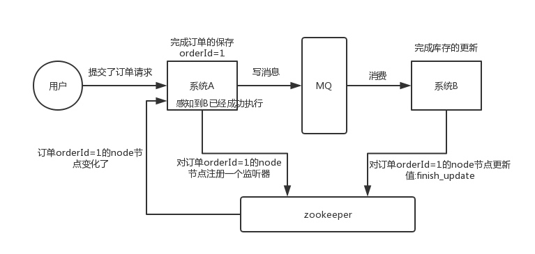
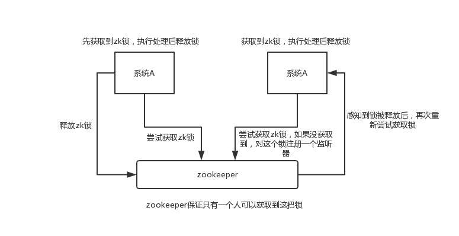
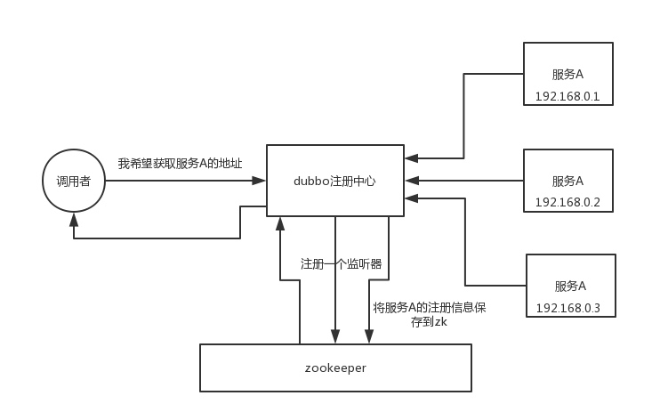
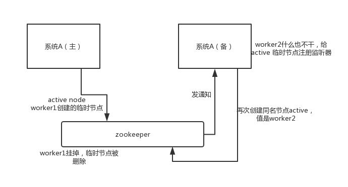

# Lock

## ZooKeeper

### 分布式协调

A 系统发送个请求到 mq，然后 B 系统消息消费之后处理了。那 A 系统如何知道 B 系统的处理结果？用 zookeeper 就可以实现分布式系统之间的协调工作。A 系统发送请求之后可以在 zookeeper 上**对某个节点的值注册个监听器**，一旦 B 系统处理完了就修改 zookeeper 那个节点的值，A 系统立马就可以收到通知。



### 分布式锁

对某一个数据连续发出两个修改操作，两台机器同时收到了请求，但是只能一台机器先执行完另外一个机器再执行。那么此时就可以使用 zookeeper 分布式锁，一个机器接收到了请求之后先获取 zookeeper 上的一把分布式锁，就是可以去创建一个 znode，接着执行操作；然后另外一个机器**也尝试去创建那个 znode**，结果发现自己创建不了，因为被别人创建了，那只能等着，等第一个机器执行完了自己再执行。



### 元数据/配置信息管理

可以用作很多系统的配置信息的管理，比如 kafka、storm 等等很多分布式系统都会选用 zookeeper 来做一些元数据、配置信息的管理。



### HA 高可用性

hadoop、hdfs 等很多大数据系统，都选择基于 zookeeper 来开发 HA 高可用机制，就是一个重要进程一般会做主备两个，主进程挂了立马通过 zookeeper 感知到切换到备用进程。



## 分布式锁

一般实现分布式锁都有哪些方式？使用 Redis 如何设计分布式锁？使用 zk 来设计分布式锁可以吗？这两种分布式锁的实现方式哪种效率比较高？

### Redis 分布式锁

1. 普通分布式锁
	
	`SET key random_value [EX seconds] [PX milliseconds] NX` 创建一个 key 加锁。
	
	* NX：表示只有 key 不存在的时候才会设置成功，如果此时 redis 中存在这个 key，那么设置失败，返回 nil。
	* EX seconds：设置 key 的过期时间，精确到秒级。意思是 seconds 秒后锁自动释放，别人创建的时候如果发现已经有了就不能加锁了。
	* PX milliseconds：同样是设置 key 的过期时间，精确到毫秒级。
	* value：random或ID，避免锁过期释放后，有新线程获取到锁，却被误解锁
	
	类 CAS 方案解锁。
	
	``` lua
	-- 删除锁的时候，找到 key 对应的 value，跟自己传过去的 value 做比较，如果是一样的才删除。
	if redis.call("get",KEYS[1]) == ARGV[1] then
	    return redis.call("del",KEYS[1])
	else
	    return 0
	end
	```
	
	但是，如果是单实例 Redis 会有单点故障，主从架构会因为主从延迟或切主来不及同步 key 导致意外获取锁，不能保证互斥性。

2. RedLock 算法
	
	算法依赖于这样一个假设：虽然进程之间没有同步时钟，但每个进程中的本地时间仍然以大致相同的速率流动，与锁的自动释放时间相比，误差很小。

	此时，需要更好地指定互斥规则：只要持有锁的客户端会在锁的有效期内终止其工作，减去一些时间（仅几毫秒），就可以保证互斥规则，补偿进程之间的时钟漂移。

	假设有一个 Redis cluster，有 5 个 Redis master 实例，执行如下步骤获取锁
	
	* 获取当前时间戳，单位毫秒
	* 跟上面类似，轮流尝试在每个 master 节点上创建锁，超时时间较短，一般就几十毫秒（客户端为了获取锁而使用的超时时间比自动释放锁的总时间要小。例如，如果自动释放时间是 10 秒，那么超时时间可能在 5~50 毫秒范围内）
	* 尝试在**大多数节点**上建立一个锁，比如 5 个节点就要求是 3 个节点 n / 2 + 1
	* 客户端计算建立好锁的时间，如果建立锁的时间小于超时时间，就算建立成功了
	* 要是锁建立失败了，那么就依次之前建立过的锁删除
	* 只要别人建立了一把分布式锁，你就得不断轮询去尝试获取锁
	
	当客户端无法获取锁时，它应该在随机延迟后再次尝试。
	
	https://redis.io/topics/distlock
	
### ZK 分布式锁

某个节点尝试创建临时 znode，此时创建成功了就获取了这个锁；这个时候别的客户端来创建锁会失败，只能注册个监听器监听这个锁。释放锁就是删除这个 znode，一旦释放掉就会通知客户端，然后有一个等待着的客户端就可以再次重新加锁。

``` java
/**
 * ZooKeeperSession
 */
public class ZooKeeperSession {

    private static CountDownLatch connectedSemaphore = new CountDownLatch(1);

    private ZooKeeper zookeeper;
    private CountDownLatch latch;

    public ZooKeeperSession() {
        try {
            this.zookeeper = new ZooKeeper("127.0.0.1:2181", 50000, new ZooKeeperWatcher());
            try {
                connectedSemaphore.await();
            } catch (InterruptedException e) {
                e.printStackTrace();
            }

            System.out.println("ZooKeeper session established......");
        } catch (Exception e) {
            e.printStackTrace();
        }
    }

    /**
     * 获取分布式锁
     *
     * @param productId
     */
    public Boolean acquireDistributedLock(Long productId) {
        String path = "/product-lock-" + productId;

        try {
            zookeeper.create(path, "".getBytes(), Ids.OPEN_ACL_UNSAFE, CreateMode.EPHEMERAL);
            return true;
        } catch (Exception e) {
            while (true) {
                try {
                    // 相当于是给node注册一个监听器，去看看这个监听器是否存在
                    Stat stat = zk.exists(path, true);

                    if (stat != null) {
                        this.latch = new CountDownLatch(1);
                        this.latch.await(waitTime, TimeUnit.MILLISECONDS);
                        this.latch = null;
                    }
                    zookeeper.create(path, "".getBytes(), Ids.OPEN_ACL_UNSAFE, CreateMode.EPHEMERAL);
                    return true;
                } catch (Exception ee) {
                    continue;
                }
            }

        }
        return true;
    }

    /**
     * 释放掉一个分布式锁
     *
     * @param productId
     */
    public void releaseDistributedLock(Long productId) {
        String path = "/product-lock-" + productId;
        try {
            zookeeper.delete(path, -1);
            System.out.println("release the lock for product[id=" + productId + "]......");
        } catch (Exception e) {
            e.printStackTrace();
        }
    }

    /**
     * 建立 zk session 的 watcher
     */
    private class ZooKeeperWatcher implements Watcher {

        public void process(WatchedEvent event) {
            System.out.println("Receive watched event: " + event.getState());

            if (KeeperState.SyncConnected == event.getState()) {
                connectedSemaphore.countDown();
            }

            if (this.latch != null) {
                this.latch.countDown();
            }
        }

    }

    /**
     * 封装单例的静态内部类
     */
    private static class Singleton {

        private static ZooKeeperSession instance;

        static {
            instance = new ZooKeeperSession();
        }

        public static ZooKeeperSession getInstance() {
            return instance;
        }

    }

    /**
     * 获取单例
     *
     * @return
     */
    public static ZooKeeperSession getInstance() {
        return Singleton.getInstance();
    }

    /**
     * 初始化单例的便捷方法
     */
    public static void init() {
        getInstance();
    }

}
```
	
也可以采用另一种方式，创建临时顺序节点。
	
如果有一把锁，被多个人给竞争，此时多个人会排队，第一个拿到锁的人会执行，然后释放锁；后面的每个人都会去监听排在自己前面的那个人创建的 node 上，一旦某个人释放了锁，排在自己后面的人就会被 ZooKeeper 给通知，一旦被通知了之后，就 ok 了，自己就获取到了锁，就可以执行代码了。

``` java
public class ZooKeeperDistributedLock implements Watcher {

    private ZooKeeper zk;
    private String locksRoot = "/locks";
    private String productId;
    private String waitNode;
    private String lockNode;
    private CountDownLatch latch;
    private CountDownLatch connectedLatch = new CountDownLatch(1);
    private int sessionTimeout = 30000;

    public ZooKeeperDistributedLock(String productId) {
        this.productId = productId;
        try {
            String address = "192.168.31.187:2181,192.168.31.19:2181,192.168.31.227:2181";
            zk = new ZooKeeper(address, sessionTimeout, this);
            connectedLatch.await();
        } catch (IOException e) {
            throw new LockException(e);
        } catch (KeeperException e) {
            throw new LockException(e);
        } catch (InterruptedException e) {
            throw new LockException(e);
        }
    }

    public void process(WatchedEvent event) {
        if (event.getState() == KeeperState.SyncConnected) {
            connectedLatch.countDown();
            return;
        }

        if (this.latch != null) {
            this.latch.countDown();
        }
    }

    public void acquireDistributedLock() {
        try {
            if (this.tryLock()) {
                return;
            } else {
                waitForLock(waitNode, sessionTimeout);
            }
        } catch (KeeperException e) {
            throw new LockException(e);
        } catch (InterruptedException e) {
            throw new LockException(e);
        }
    }

    public boolean tryLock() {
        try {
             // 传入进去的locksRoot + “/” + productId
            // 假设productId代表了一个商品id，比如说1
            // locksRoot = locks
            // /locks/10000000000，/locks/10000000001，/locks/10000000002
            lockNode = zk.create(locksRoot + "/" + productId, new byte[0], ZooDefs.Ids.OPEN_ACL_UNSAFE, CreateMode.EPHEMERAL_SEQUENTIAL);

            // 看看刚创建的节点是不是最小的节点
             // locks：10000000000，10000000001，10000000002
            List<String> locks = zk.getChildren(locksRoot, false);
            Collections.sort(locks);

            if(lockNode.equals(locksRoot+"/"+ locks.get(0))){
                //如果是最小的节点,则表示取得锁
                return true;
            }

            //如果不是最小的节点，找到比自己小1的节点
      int previousLockIndex = -1;
            for(int i = 0; i < locks.size(); i++) {
        if(lockNode.equals(locksRoot + “/” + locks.get(i))) {
                     previousLockIndex = i - 1;
            break;
        }
       }

       this.waitNode = locks.get(previousLockIndex);
        } catch (KeeperException e) {
            throw new LockException(e);
        } catch (InterruptedException e) {
            throw new LockException(e);
        }
        return false;
    }

    private boolean waitForLock(String waitNode, long waitTime) throws InterruptedException, KeeperException {
        Stat stat = zk.exists(locksRoot + "/" + waitNode, true);
        if (stat != null) {
            this.latch = new CountDownLatch(1);
            this.latch.await(waitTime, TimeUnit.MILLISECONDS);
            this.latch = null;
        }
        return true;
    }

    public void unlock() {
        try {
            // 删除/locks/10000000000节点
            // 删除/locks/10000000001节点
            System.out.println("unlock " + lockNode);
            zk.delete(lockNode, -1);
            lockNode = null;
            zk.close();
        } catch (InterruptedException e) {
            e.printStackTrace();
        } catch (KeeperException e) {
            e.printStackTrace();
        }
    }

    public class LockException extends RuntimeException {
        private static final long serialVersionUID = 1L;

        public LockException(String e) {
            super(e);
        }

        public LockException(Exception e) {
            super(e);
        }
    }
}
```

但是，使用 zk 临时节点会存在另一个问题：由于 zk 依靠 session 定期的心跳来维持客户端，如果客户端进入长时间的 GC，可能会导致 zk 认为客户端宕机而释放锁，让其他的客户端获取锁，但是客户端在 GC 恢复后，会认为自己还持有锁，从而可能出现多个客户端同时获取到锁的情形。

针对这种情况，可以通过 JVM 调优，尽量避免长时间 GC 的情况发生。

### Redis 分布式锁和 ZK 分布式锁的对比

* redis 分布式锁，其实需要自己不断去尝试获取锁，比较消耗性能。
* zk 分布式锁，获取不到锁，注册个监听器即可，不需要不断主动尝试获取锁，性能开销较小。

如果是 Redis 获取锁的那个客户端 出现 bug 挂了，那么只能等待超时时间之后才能释放锁；而 zk 的话，因为创建的是临时 znode，只要客户端挂了，znode 就没了，此时就自动释放锁。
	
	
	


