# DDIA 学习笔记

---

## 目录

- [1. 数据模型与编码](#1-数据模型与编码)
- [2. 数据流与服务通信](#2-数据流与服务通信)
- [3. 分布式系统的核心问题](#3-分布式系统的核心问题)
- [4. 数据库架构演进](#4-数据库架构演进)
- [5. 复制（Replication）](#5-复制replication)
- [6. 分布式系统的麻烦](#6-分布式系统的麻烦)
- [7. 事务与隔离级别](#7-事务与隔离级别)
- [8. 一致性与共识](#8-一致性与共识)
- [9. 顺序保证与全序广播](#9-顺序保证与全序广播)

---

## 0. 数据模型

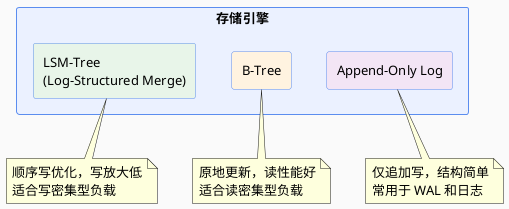

- AppendOnly
- LSM
- BTree

## 1. 编码

### 1.1 影响

效率、应用程序体系结构、部署

### 1.2 编码格式

| 类别 | 格式 | 特点 |
|------|------|------|
| **编程语言特定的编码** | - | 仅限于单一编程语言，且往往无法提供向前、向后兼容性 |
| **文本格式** | XML / JSON / CSV | 可读性好，但体积大、解析慢 |
| **二进制模式** | Protocol Buffers / Thrift / Avro | Avro 紧凑高效，但可读性不好 |

兼容性

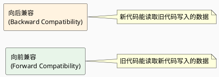

---

## 2. 数据流

### 2.1 数据库

中心化多版本编码库，写入进程编码时记录版本号，读取进程根据版本号解码

### 2.2 服务

#### 3.1 REST

基于 HTTP 原则的设计哲学，强调简单数据格式，使用 URL 标识资源，使用 HTTP 控制缓存、验证身份、协商内容类型。**REST 不是一个协议，而是一种设计风格。**

适用于**跨组织服务集成**。

#### 3.2 RPC

- **Cons**：跨语言、平台的兼容性问题

### 2.3 异步消息

节点间发消息通信，由发送者编码、接收者解码。

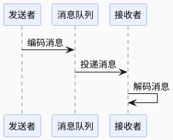

**结论**：向前兼容、滚动升级在某种程度上可以实现。

---

## 3. 分布式系统的核心问题

### 3.1 为什么需要分布式

| 问题 | 描述 |
|------|------|
| **可扩展性** | 数据量、读写负载超出单机处理上限，可以分散负载到多机 |
| **容错 / 高可用性** | 单机 / 局部网络 / 单数据中心故障时，通过冗余继续提供服务 |
| **延迟** | 全球范围多数据中心部署，用户就近访问 |

### 3.2 扩展方式

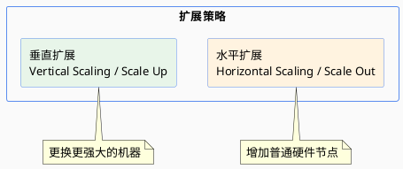

---

## 4. 数据库架构演进

### 4.1 架构对比总览

| 架构 | 定义 | Pros | Cons | 示例 |
|------|------|------|------|------|
| **共享内存 Shared-Memory** | 所有 CPU 共享物理内存，通过高速总线（PCIe）互联，通常是 SMP 系统，内存访问均匀时间，通过内存锁和缓存一致性协议保证一致性 | 编程模型简单、通信延迟低 | 成本高、单点故障、扩展性不足（8-16 CPU） | 对比 NUMA 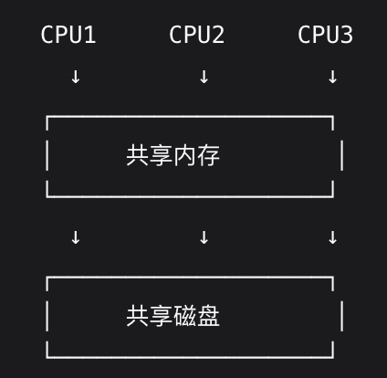 |
| **共享磁盘 Shared Disk** | 多个计算节点共享一套磁盘阵列，每个节点有独立内存/CPU，磁盘通过快速网络连接，通过分布式锁管理协调磁盘访问 | 高可用、读扩展好、存储集中管理 | 竞争和锁开销、网络开销、对网络性能和稳定性要求高 | 数仓 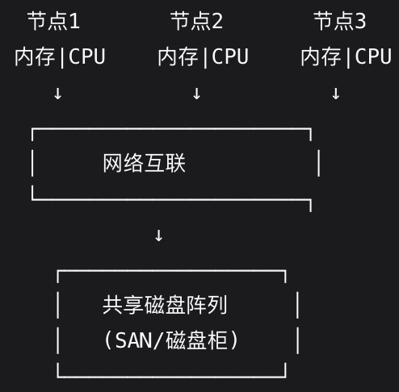 |
| **共享存储 Shared Storage** | 计算节点、存储节点分离，通过 SAN/NAS 访问共享存储，通常 Active-Standby 模式 | 存储集中管理、计算节点故障快速恢复、存储可独立扩展 | 存储成为单点故障、存储网络瓶颈、成本高 | 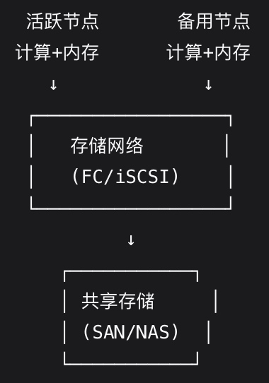 |
| **无共享 Shared Nothing** | 每台机器使用各自的处理器、内存、磁盘，节点间通过软件层经网络协调 | 线性扩展、高可用无单点故障、成本低、支持地理分布 | 数据模型表达能力差、数据一致性复杂（CAP）、跨分片事务挑战、运维复杂 | Spanner / TiDB / HDFS / Spark / Cassandra / MongoDB 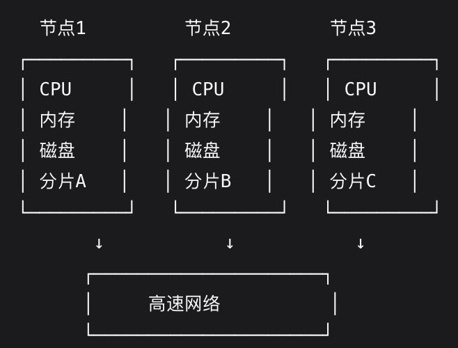 |
| **云原生 + 存算分离** | 计算与存储彻底分离，基于云基础设施的弹性架构 | 计算无状态（但也受缓存命中率影响）、存储云化、极致弹性（秒级扩缩容）、微服务化 | — | Snowflake / TiDB Cloud / PolarDB 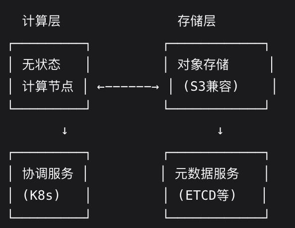 |

### 4.2 架构演进趋势

* 紧耦合 -> 松耦合
* 垂直扩展 -> 水平扩展
* 专用硬件 -> 通用硬件 + 软件
* 单机可靠性 -> 分布式可用性
* CAP 取舍 -> 新硬件突破限制

**关键技术驱动**：

- **网络**：RDMA、高速以太网
- **存储**：NVMe、持久内存
- **软件技术**：容器化、服务网格
- **硬件技术**：SmartNIC、DPU

---

## 5. 复制（Replication）

> 由于网络的基本约束不变，数据库复制的基本原则也不变。
> 
> 需要考量：节点故障、不可靠网络、副本一致性、持久性、可用性、延迟。

### 5.1 Leader-based Replication（单主复制）

也称 Active/Passive、Master/Slave。

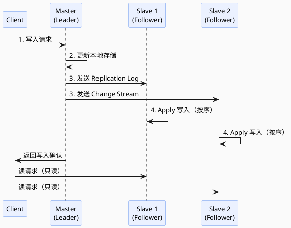

1. 写 Master；
2. Master 更新本地存储、将数据变更发送给 Slave，称为复制日志（Replication Log）记录或变更流（Change Stream）； 
3. Slave 拉取日志并更新本地副本，按相同顺序 Apply 写入；
4. Master 读写，Slave 只读。

**复制模式对比**：

| 模式 | 描述 | Pros | Cons |
|------|------|------|------|
| **同步复制 Synchronous** | 主库等待从库确认 | 持久性好，主库失效后有最新副本 | 可用性差，写 SLA 受从库影响 |
| **异步复制 Asynchronous** | 主库不等待从库 | 写入快速 | 可能丢数据 |
| **半同步 Semi-Synchronous** | 一个从库同步，其余异步 | 至少两个节点有最新数据 | 折中方案 |
| **链式复制** | 将副本组织成链，依次传播到链尾复制，再反向传播回链头确认 | 读性能高、强一致，写顺序传播易实现 | 写时延高，链重新分配复杂 |

**如何处理失败副本**：

1. 设置新从库
    1. 目标：不停拉起
    2. 过程
        1. 获取主库 snapshot
        2. 快照复制到从库
        3. 从库从主库拉取快照后所有数据变更（依据 LSN/Binlog Coordinates）
        4. 从库 catch up
2. 处理节点宕机
    1. 目标：个别节点失效，也能保持整个系统运行，并尽可能控制影响
    2. 从库失效：追赶恢复
        1. 从库知道本地 LSN，可以拉取数据变更 catch up
    3. 主库失效：故障切换
        1. 过程
            1. 确认主库失效
            2. 选择新主库（选举或控制节点指定，注意最小化数据损失）
            3. 启用新主库、禁用老主库
        2. 问题
            1. 异步复制、重新选主后旧主重新加入集群带来的数据冲突和数据丢失
                1. LWW，可能破坏持久性
            2. 脑裂，但无冲突解决机制（Multi-Leader 支持）或安全防范措施本身导致所有主库被关闭
            3. 主库死亡前如何正确配置超时，来减少不必要的故障切换和超时的影响

**复制日志实现**：

| 方式 | 说明 | 优劣 |
|------|------|------|
| **基于 Statement** | 复制 SQL 语句 | 非确定性函数（Now/Rand）、自增列、有副作用语句（触发器、UDF）会导致不一致 |
| **WAL 复制** | 传输物理 WAL | 非常底层（含磁盘块字节变更），与存储引擎紧耦合，升级困难 |
| **逻辑日志复制（基于行）** | 日志与存储引擎解耦 | 容易向后兼容，主从可运行不同版本存储引擎 |
| **基于触发器** | 注册自定义程序监听变更 | 灵活但开销大、易出错，如 Databus |

**复制延迟**：

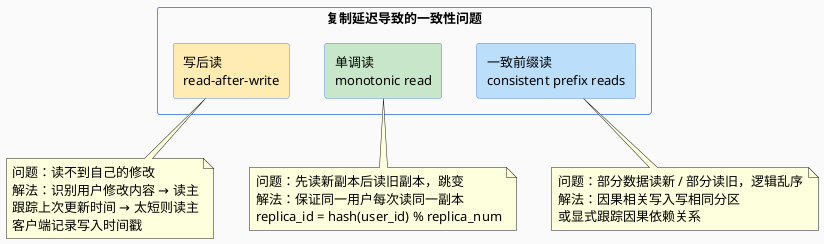

### 5.2 Multi-Leader Replication（多主复制）

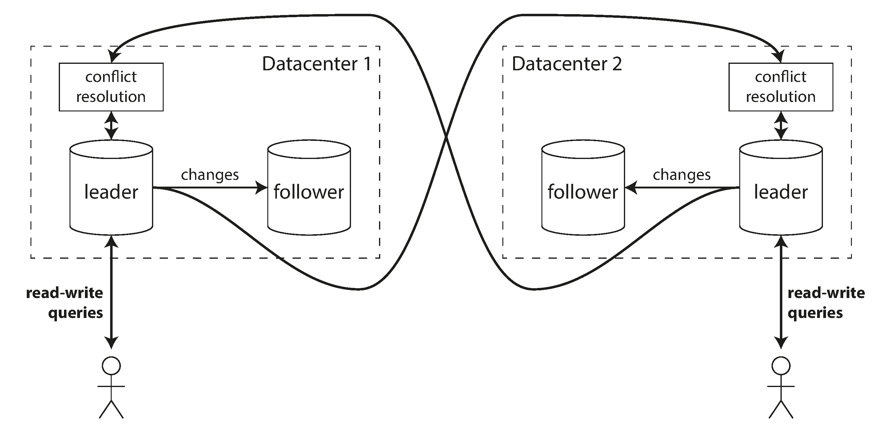

**应用场景**：
- **多数据中心**：数据库自身支持多主，或利用外部工具实现
- **需要离线操作的客户端**：如 CouchDB，本地设备相当于数据中心
- **协同编辑**：将更改单位设置非常小（如单次按键）并避免加锁

**Pros**：写入吞吐更高、就近写入网络延迟更低、容忍单数据中心故障

**Cons**：冲突处理复杂

#### 处理写入冲突

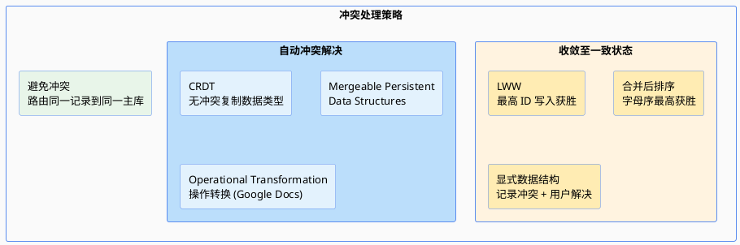

- **同步冲突检测**：等待写入复制到所有副本再返回，但会丧失多主优势
- **避免冲突**：应用层确保特定记录所有写入路由到相同主库
- **LWW**：每个写入分配唯一 ID，最高 ID 写入获胜 — 容易丢数据
- **CRDT**（Conflict-free Replicated Data Types）：集合、映射、计数器等，自动合理解决冲突（如 Riak 2.0）
- **Operational Transformation**：Google Docs 等协同编辑背后的算法

#### 多主复制拓扑

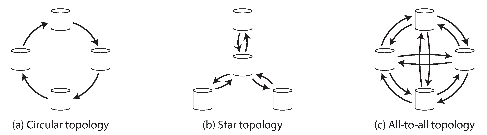

- **环形拓扑**（如 MySQL）：节点有唯一标识符，写入复制日志用于破环
- **星形拓扑**：中心节点转发
- **All-to-All**：容错更好，但可能因网络质量不同导致消息乱序

> 环形、星形拓扑在单节点故障下会中断复制消息流，通常要人工修改拓扑配置。

### 5.3 Leaderless Replication（无主复制）

应用：Dynamo、Riak、Cassandra、Voldemort

#### 节点故障时写入

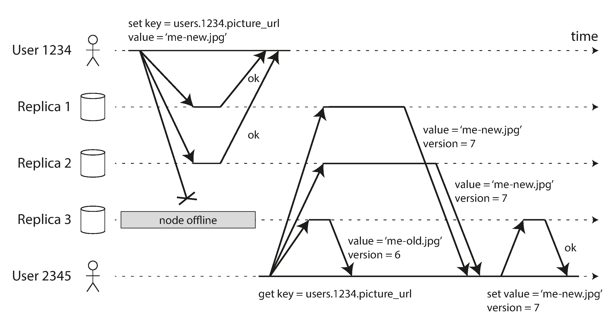

#### 读修复和反熵

- **读修复 Read Repair**：客户端并行读多个节点，检测修复有旧值的节点
- **反熵过程 Anti-entropy Process**：后台进程扫描对比多副本并进行修复

#### Quorum 机制

如果有 n 个副本，每个写入必须由 w 个节点确认，每个读取必须查询 r 个节点。只要 **w + r > n**，读取的节点中至少有一个包含最新写入。
遵循 r、w 的读写称为 Quorum 的读写，可以认为 r、w 是有效读写所需最低票数。

**可以通过调节 w、r 调整读到旧值的概率，但不提供绝对保证**

`w + r > n`

* 通常设置 n 为奇数，w = r = (n + 1) / 2，向上取整
* 允许的不可用节点
    * 如果 w < n，则节点不可用时，仍然可以处理写入
    * 如果 r < n，则节点不可用时，仍然可以处理读取
    * 对于 n = 3，w = 2，r = 2，可以容忍 1个不可用节点
    * 对于 n = 5，w = 3，r = 3，可以容忍 2个不可用节点
    * 通常，读写并行发送到所有 n 个副本，w、r 决定等待多少节点响应
* 可能存在返回旧值的边缘情况
    * 如果使用宽松法定人数（Sloppy Quorum），w、r 可能落在不同节点，w、r 不保证有重叠节点
        * 提示移交（hinted handoff）：网络中断期间，对于无法达到 w、r 要求的请求，允许暂时写入其它可达节点（不在常规主库范围内），待网络恢复后发送到合适主节点
        * 效果
            * 只要任何 w 个节点可用，数据库就能接受写入
            * 但即使 w + r > n，也不能确保读到最新值，因为新值可能临时写入 n 之外的节点
        * 宽松法定人数实际上只是持久性保证，即数据存储在 w 个节点，不能保证 r 个节点必定读到，除非 hinted handoff 已完成
    * 如果写写并发，不确定先后顺序，唯一安全的方式是合并并发写入
        * LWW 可能由于时钟偏差丢数据
    * 如果读写并发，写可能仅反映在某些副本，不确定读取返回的是否新值
    * 如果写在小于 w 个副本上成功，整体写入失败但没在写成功副本上回滚，后续仍旧可能读到错误数据
    * 如果携带新值的节点故障，需要从其它有旧值副本恢复，则存储新值的副本数可能小于 w，打破 Quorum 条件
    *  即使一切正常，可能也会出现时序相关边缘情况

---

## 6. 分区

**本质：分而治之**

思路：将大数据集划分为更小子集，在多机上均匀分布数据和查询负载，从而突破单机性能瓶颈

### 6.1 数据分区方式

1. 按关键字
2. 哈希
    1. 预创建足够多、数量固定的 partition，每个实例承担多个 partition

### 6.2 相关功能如何适配

1. 局部索引：基于分区的二级索引
    1. Pros：本地维护，写延迟低
    2. Cons：scatter/gather 导致读延迟显著高
2. 全局索引：基于词条的二级索引，也叫全局索引
    1. Pros：只对包含词条的索引分区发起请求
    2. Cons：更新可能涉及多个二级索引，分区可能不同甚至在不同节点，写放大显著高

> MongoDB 怎么分区，如何考量，怎么实现动态分区？

### 6.3 如何路由查询

1. 分区感知负载均衡器
2. 并行查询执行引擎

## 6. 分布式系统的麻烦

### 6.1 不可靠的网络

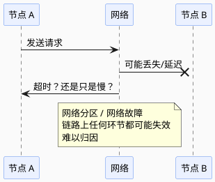

- **检测故障**：动态监测或超时重试
- **网络拥塞和排队**：链路上任何环节都可能拥塞和排队，影响延迟
- **TCP vs. UDP**：可靠性 vs. 实时性

#### 同步网络与异步网络

| 网络类型 | Workload 特征 | 设计理念 | 示例 |
|----------|--------------|----------|------|
| 同步网络 | 相对确定（语音） | 预分配带宽，可预测低延迟 | 电话网络 |
| 异步网络 | 不确定，突变流量 | 尽最大努力传递，资源利用率高 | 互联网 |
| HPC 内部网络 | 计算负载确定 | 可预测低延迟 + 并行计算 | NVLink |

### 6.2 不可靠的时钟

#### 时钟类型

| 类型 | 实现 | 用途 | 同步 |
|------|------|------|------|
| **日历时钟 time-of-day** | `clock_gettime(CLOCK_REALTIME)` / `System.currentTimeMillis()` | 返回自 epoch 起的 ms | 需要 NTP 同步 |
| **单调钟 monotonic** | `clock_gettime(CLOCK_MONOTONIC)` / `System.nanoTime()` | 测量 elapsed time | 不用同步，μs 级分辨率 |

#### 时钟同步与准确性问题

- 石英钟不精确，会漂移（drifts），取决于机器温度
- 本地与 NTP 相差过大时，会拒绝同步或本地强制重置
- NTP 被防火墙阻塞时容易被忽略
- NTP 依赖存在可变数据包延迟的拥塞网络
- 虚拟机上硬件时钟被虚拟化，时钟可能突然跳跃
- 闰秒会打破未考虑闰秒的系统的时序假设

#### LWW 的基本问题

- 时钟滞后的节点，无法覆盖正常节点写入的值，表现为写入消失
- 无法区分高频顺序写和并发写，需要引入额外因果关系跟踪机制（如版本向量）
- 两个节点可能独立生成相同 ts 的写入

#### 时钟置信区间

不确定性来源：
1. **时间源本身**：
    1. GPS：接收器或原子钟分辨率
    2. 服务器：取决于上次与 NTP 同步、石英钟漂移的期望值 + NTP 的不确定性 + RTT
2. **大多 API 不告知置信区间**（如 `clock_gettime` 未告知预期误差）
    1. **例外**：Spanner TrueTime API 明确告知置信区间，返回 [最早, 最晚]

#### 全局快照的时钟同步

Spanner TrueTime 通过以下方式保证全局快照一致：
1. 部署 GPS 接收器或原子钟保证尽可能小（7ms 内）的时钟不确定性
2. 提交读写事务前等待置信区间长度的时间避免重叠
3. 判断两个置信区间是否重叠来保证因果一致

### 6.3 进程暂停

一个节点如何知道它仍是 Leader 可以安全写入？

一种选择是 Leader 从其它节点获取 lease（类似带超时的锁），任意时刻只有一个节点可以持有 lease，需要周期性续租。

**Lease 机制的问题**：

1. 依赖时钟同步：租约到期时间由另一台机器设置（如，到期时间 = cur + 30s），与本地系统时钟相比较。如果时钟不同步达到秒级，则会提前终止租约（无主，不可写），或延后终止租约（多主，写冲突）；
2. 即使改为仅适用本地单调时钟，假设执行 System.currentTimeMillis() 和 process(request) 期间程序暂停，暂停时长 > 租期（多主，写冲突）。

**程序暂停原因**：
1. GC STW
2. VM Suspend（挂起虚机并恢复）
3. 用户终端设备暂停（如笔记本待机）
4. OS 线程切换（Steal Time）
5. 应用程序同步磁盘访问（如 ClassLoader 首次 Lazy Load）
6. OS Swap
7. SIGSTOP 等

**影响**：
1. 不保证响应时间
2. 没有真实时间

### 6.4 拜占庭问题

**真相由多数定义**

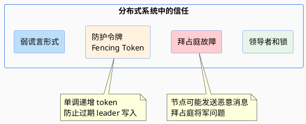

系统模型与现实
- 算法正确性
- 安全性和活性
- 将系统模型映射到现实世界

---

## 7. 事务

问题：如何跨分区写入

思路：事务作为抽象层，将某些并发问题、软硬件故障简化为事务中止，上层应用只需要重试

### 7.1 基本概念

#### 7.1.1 ACID

1. 原子性

    用户多次写入，但一些写操作处理后出现故障时，能在错误时中止事务，丢弃该事务进行的所有写入变更的能力。（可中止性，all-or-nothing）
	
    辨析：并发编程的原子性指多个进程同时访问相同数据时的问题。该问题在数据库隔离性中考虑。

2. 一致性
    
    对数据的一组特定约束必须始终成立，即不变式（invariants），更偏应用程序的属性。如，账户整体借贷相抵，外键约束。
		
    辨析：CAP 一致性指线性一致，一致性哈希指一种分区方法
    
1. 隔离性

    竞争条件（race conditions）下，同时执行的事务互相隔离。要么看到全部写入结果，要么什么都看不到。
    
4. 持久性

    一旦事务完成，即使发生硬件故障或数据库崩溃，也不会丢失。
    
    * 单节点数据库，持久性通常指写入非易失存储（HDD、SSD），通常还包括 WAL 或类似文件；
    * 带复制的数据库，持久性通常指数据复制到一些节点；
    * 数据库要等写入或复制完成后，才能返回事务提交成功。
	
    复制与持久性：没有能提供绝对保证的技术，只有能降低风险的技术

#### 7.1.2 单对象和多对象操作

1. 单对象写入
		目标：对单节点上单个对象提供原子性、隔离性
			原子性：WAL
隔离性：锁对象
其它方式：自增，CAS
		PS：CAS 及其它但对象操作被称为“轻量级事务”，甚至被营销为 ACID，但事务通常被理解为将多个对象上的多个操作合并为一个执行单元的机制

2. 多对象事务需求
		能否只用 KV 数据模型和但对象操作实现所有应用？
不能。
			如，关系数据模型中跨表外键，图数据模型中有同一条边的两个顶点，文档数据模型中更新多个文档，同时更新主索引和二级索引。

3. 处理错误和终止
    
    重试机制
    
    * 事务实际成功，但 Client-DB 网络故障导致未返回时，重试可能导致事务执行两次，除非有额外去重机制
    * 负载过大时，重试事务问题会恶化
    * 仅在临时性错误（如，死锁、异常、临时网络中断和故障切换）时重试，永久性错误（如，违反约束）不重试
    * 无法避免 DB 之外的副作用（如，往外部发邮件），可以通过 2PC 确保多个不同系统一起提交或放弃
    * 客户端在重试时失效，任何写入的数据都会丢失

### 7.2 弱隔离级别

定义：非串行的隔离级别

思路：比起盲目依赖工具，我们需要对存在的各种并发问题，及如何防止问题有深入理解，然后使用我们掌握的工具来构建可靠和正确的应用

问题：

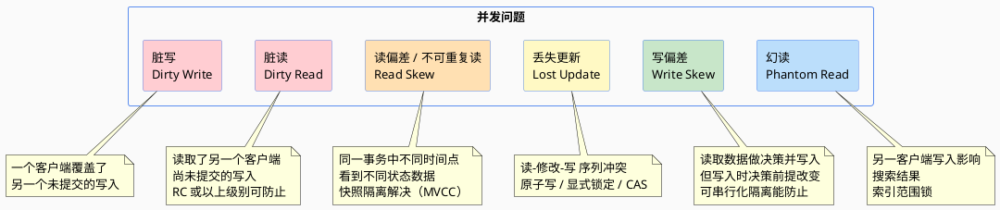

### 7.3 读已提交（Read Committed, RC）

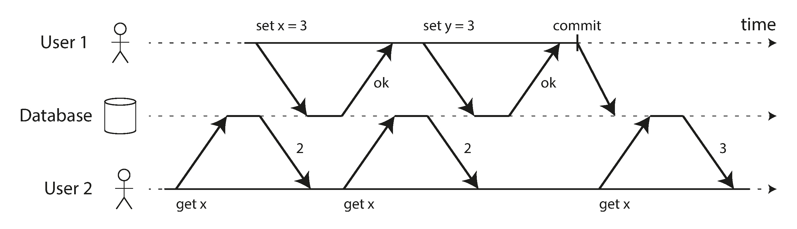

事务提交后，写入操作才会被看见，且立即可见。

**两个保证**：
- **没有脏读**：读只能看到已提交数据
- **没有脏写**：写只会覆盖已提交数据

**问题**：
- **部分更新**
- **可能回滚**

### 7.4 快照隔离与可重复读（RR）

* 实现快照隔离
* 观察一致性快照的可见性规则
* 索引和快照隔离
* 可重复读与命名混淆

### 7.5 防止丢失更新的方法

| 方法 | 说明 |
|------|------|
| 原子写 | 数据库内置原子操作 |
| 显式锁定 | `SELECT FOR UPDATE` |
| 自动检测 | 数据库自动检测丢失的更新 |
| CAS | Compare-And-Set |
| 冲突解决和复制 | 多副本场景下的冲突解决 |

### 7.6 写偏斜与幻读

- **写偏斜 Write Skew**：读取数据做决策，写入时决策前提已改变
- **幻读 Phantom Read**：事务读取符合某些搜索条件的对象，另一客户端写入影响到搜索结果
- **物化冲突**：将幻读转化为对具体行的锁冲突

### 7.7 可串行化

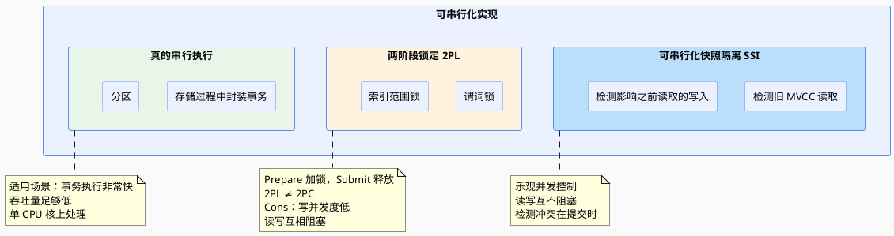

#### 悲观与乐观并发控制

| 策略 | 假设 | 行为 |
|------|------|------|
| **悲观并发控制**（如 2PL） | 事务并发度高 | Prepare 先加锁再执行 |
| **乐观并发控制**（如 SSI） | 事务并发度低 | Prepare 先执行，Submit 再看是否冲突 |

#### SSI 检测方式

1. **检测旧 MVCC 读取**：事务提交时检查是否有并发事务写已经被提交，如果有则中止当前事务
2. **检测影响之前读取的写入**：
   - 读之后发生写入
   - 类似索引范围锁：
       - 在索引项（或表）上记录有事务读，在事务完成（Submit/Abort）且所有并发事务完成后可移除
       - 事务写时，现在索引中查可能受影响的事务读，类似在受影响的索引上获取写锁，但只是通知事务读可能受影响，不阻塞事务写

**SSI 性能优势**：
- 读写互不阻塞，查询延迟更可预测
- 只读查询运行在一致性快照，无锁
- 不局限于单个 CPU 核吞吐量
- 即使数据跨多机分区，事务也可以保证在可串行化隔离级别的同事读写多个分区数据

---

## 8. 一致性与共识

### 8.1 如何让系统线性一致

思路：添加约束，**任何一个读返回新值后，后续读也必须返回新值**。

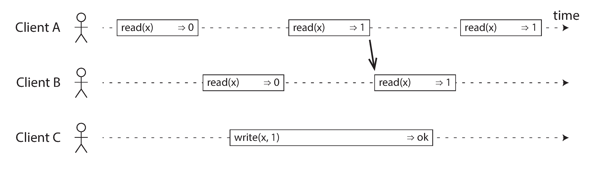

**辨析**：
- **线性一致性**：可线性化是读写寄存器(单个对象)的最新值保证，不要求将操作组合到事务中，因此无法避免写倾斜等问题，除非采取额外措施(如实体化冲突)。
- **可串行化**：可串行化是事务的隔离属性，每个事务可以读写多个对象，用来确保事务执行结果与串行执行结果相同，即使实际执行顺序不同。

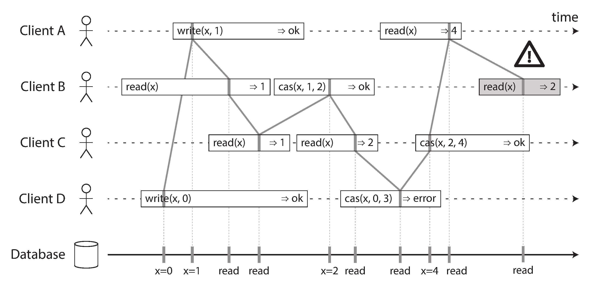

### 8.2 需要线性化的场景

| 场景 | 说明 |
|------|------|
| **加锁与选主** | 不论锁如何实现，需满足可线性化（如 ZK、etcd） |
| **唯一性约束** | 主键唯一性保证 |
| **跨通道的时序依赖** | 不同通道间的因果顺序 |

跨通道的时序依赖示例：

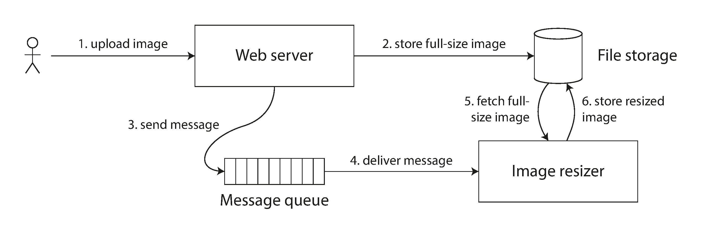

### 8.3 各复制方案的线性一致性

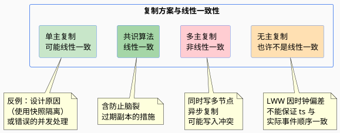

对于无主复制系统：

人们会声称通过要求法定人数读写（$w + r > $n）可以获得强一致性。这取决于法定人数配置，以及强一致性如何定义。

反例1：LWW 冲突解决法由于存在时钟偏差不能保证 ts 与实际事件顺序一致，基本是非线性一致
反例2：宽松的法定人数也破坏了线性一致

即使采用严格的 Quorum，也有反例：

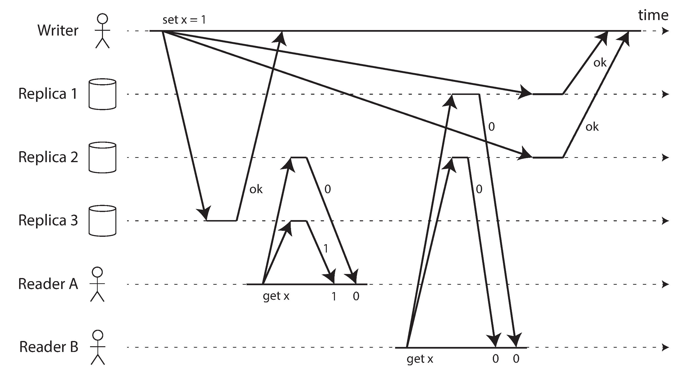

A 先读到新值 1，B 后读到旧值 0。
满足严格 Quorum 条件，但非线性一致。

如何线性化？

通过牺牲性能，可以使 Dynamo 风格的 Quorum 线性化：Reader 必须在返回结果给应用前，同步执行读修复，且 Writer 必须在发送写入前，读取法定数量节点的最新状态。

- **读修复**：客户端并行读，检测陈旧响应并回写新值 — 适用于读频繁的值
- **反熵**：后台查找副本间数据差异并复制缺失值 — 不以特定顺序写入，复制前可能有显著延迟

仍旧有反例：

只能实现线性一致的读写，不能实现线性一致性的 cmp、cas，因为需要共识算法。

**结论**：Dynamo 风格无主复制不能提供线性一致性。

### 8.4 线性一致性的代价

- **CAP 定理**（帮助有限）
- **线性一致性和网络延迟**的权衡

---

## 9. 事件顺序保证

### 9.1 顺序与因果关系

- **因果顺序不是全序**
- **线性一致性强于因果一致性**
- 捕获因果关系

### 9.2 序列号顺序

- 非因果序列号生成器的局限
- **Lamport 时间戳**
- 只有时间戳排序不够，因为唯一约束等需要立即确认冲突的问题，无法通过只有时间戳排序解决

### 9.3 全序广播

顺序保证的范围：
* 每个分区各有一个主库的分区数据库，通常只在分区内维持顺序，跨分区的一致性保证需要额外协调
* 全序广播要满足两个安全属性：**可靠性（reliable delivery）** 和 **有序性（totally ordered delivery）**

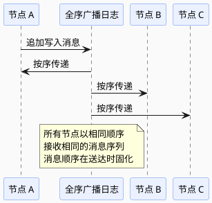

**特性**：
- 消息顺序在送达时固化 — 不允许追溯插入前序消息
- 可以看作一种创建日志方式（复制日志、事务日志、WAL），传递消息就像追加写入日志，由于所有节点必须以相同顺序传递相同消息，因此所有节点都可以读取日志，并看到相同的消息序列

### 9.4 全序广播的用途

| 用途 | 说明 |
|------|------|
| **状态机复制** | 每个消息表示一次数据库写入，所有副本按相同顺序处理 → 副本间保持一致 |
| **可串行化事务** | 每个消息表示一个确定性事务，以存储过程形式执行，且每个节点都以相同顺序处理消息，则数据库的分区和副本可以相互保持一致 |

### 9.5 使用全序广播实现线性一致 CAS 操作

以唯一用户名为例，需求：

* 对于唯一用户名，可以有带 CAS 原子操作的线性一致寄存器，每个寄存器初值为空。
* 首次创建时设置为用户 ID，如果多个用户试图同时获取相同用户名，则只有一个 CAS 成功，其它用户看到非空值（由于线性一致性）。

实现线性一致性 CAS 操作：

1. 日志中追加一条消息，试探性指明要声明的用户名
2. 读日志，等待刚追加的消息被读回
3. 检查是否有消息声称目标用户名的所有权

### 9.6 使用线性一致性存储实现全序广播

不展开。