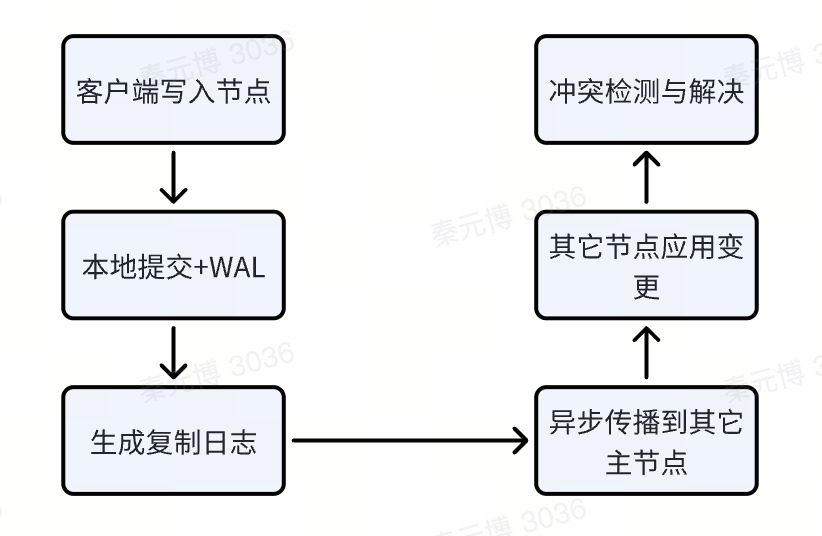

# 多主写入

# 设计要点

1. 定义：多主复制（multi-master replication）。允许多个节点独立接受写入，通过异步复制同步数据。
1. 效果：提高可用性、性能，引入数据冲突、一致性问题
1. 基本设计
   1. 多个节点可写
   1. 每个节点维护一份数据副本
   1. 节点间通过异步复制传播写入操作
   1. 因为多个节点可写，且异步复制，因此不同节点可能同时修改同一数据导致冲突
1. 核心/适用场景
   1. 高可用：单数据中心故障不影响写入
   1. 写扩展：提高吞吐
   1. 全球化部署：不同地域部署多个主节点，允许就近写入降低延迟
   1. 实时协作：多用户同时编辑同一文档
1. 设计难点和技术要点
   1. 冲突检测与解决。冲突类型包括：
      1. 写-写冲突：两个节点更新同一行
      1. 唯一键冲突：两个节点同时插入相同唯一键
   1. 数据一致性：由于异步复制，系统只能提供最终一致性
   1. 复制延迟：节点间的数据同步存在延迟，可能导致读旧数据
   1. 拓扑结构：复制拓扑可以是全连接、星型、环形等，不同拓扑会影响复制效率和一致性
   1. 故障处理：节点故障后重新加入集群时，需要解决数据同步和冲突

# 实现对比

| 数据库 | 类型 | 核心场景 | 设计 | 设计难点 & 技术要点 |
| --- | --- | --- | --- | --- |
| PostgreSQL | 关系型扩展 | | 通过 BDR（Bi-Directional Replication）、Postgres-XL 等扩展或集群方案。基于逻辑复制的异步多主复制。 | 冲突解决：使用全局序列号、触发器和冲突解决函数。提供多种冲突解决策略，如 LWW、自定义函数等。数据一致性：最终一致性。 |
| MySQL Group Replication | | | 通过 Galera Cluster、Group Replication 等。基于 Paxos 协议（具体实现为 Group Communication System）的同步复制，确保在任何节点提交事务前，必须经过组内大多数节点同意。 | 冲突解决：提交时通过原子广播和共识算法避免冲突，实际提供了强一致性，牺牲性能。注意：Group Replication 在单主模式下是默认的，但可以配置为多主模式。多主模式下，由于同步复制，会在事务提交时检测到冲突并导致事务回滚。 |
| Oracle GoldenGate | | | | |
| Microsoft SQL Server | | | 通过对等复制 | |
| Cassandra | 宽列 | | 可用性优先（AP），最终一致性。基于 Dynamo 风格的无主复制。实际上任何节点都可写，类似多主，适用一致性哈希分布数据。原生多主，无中心节点，所有节点平等。 | 冲突解决：写入带时间戳，默认 LWW，或使用客户端提供的版本向量（Vector Clocks）检测冲突，由应用决定解决策略。支持轻量级事务（Paxos）用于关键操作。数据一致性：通过可调的一致性级别（ONE、QUORUM、ALL）权衡一致性和延迟。`CONSISTENCY QUORUM;` |
| CockroachDB | 分布式关系型 | | 强一致性（CP），可串行化隔离级别。宣传为分布式数据库，但其多活特性支持多主写入。使用 Raft 共识算法维护每个数据范围（Range）的多个副本，但支持多区域部署，允许在任何节点写入。全局多主，通过分层数据布局实现。 | 冲突解决：使用 HLC（Hybrid Logical Clocks）为事务分配时间戳确定全局事务顺序。基于时间戳的 MVCC。乐观锁检测，冲突时事务重试。通过 Raft 保证同一 Range 的写入顺序，跨 Range 事务使用 2PC。数据一致性：提供强一致性（Serializable）和最终一致性（Follower Read）的选项。特点：全局有序的时间戳。Raft 共识算法用于数据复制。自动分片和数据重平衡。 |
| Amazon DynamoDB | 键值 | | 可配置的一致性，全球表支持。多区域多主，使用异步复制同步跨区域数据。全球表实现跨区域多主。 | 冲突解决：全球表使用 LWW，基于服务器时间戳。支持应用程序自定义冲突解决策略（通过 Lambda 函数），应用可指定版本条件写入。特点：全球表自动异步复制。条件写入防止意外覆盖。按需配置读写一致性。 |
| Spanner | 分布式关系型 | | 虽然强调全局一致性，但支持多区域写入，但严格来说 Spanner 不是多主，而是分布式数据库。技术上可多区域写入，但有一定限制。 | |
| VoltDB | | | 多主复制 | |
| Couchbase | | | 多主复制 | |
| 其它 | | | | 实时协作场景的特殊方案：操作转换（OT）——用于 Google Docs 等文档协作，操作在传播时进行转换以适应不同顺序；无冲突复制数据类型（CRDTs） |

# 核心设计

## 架构模式

1. 对等架构
   1. 所有节点完全对等，不分主从
   1. 客户端可以读写任何节点
   1. 代表：Cassandra、DynamoDB
1. 分层多主
   1. 逻辑多主，数据在物理上分片
   1. 通过分布式事务协调
   1. 代表：CockroachDB、Spanner

## 数据同步机制

## 核心挑战

| | 问题 | 常用解法 |
| --- | --- | --- |
| 写-写冲突 | 同一数据项在不同节点被并发修改 | LWW：基于时间戳选择最新值。适用于简单计数器、状态更新。可能丢失数据。 应用层解决：业务逻辑决定最终值。适用于购物车、文档协作。实现复杂。 CRDTs：数据上保证收敛。适用于计数器、集合、注册器。数据结构受限。 操作转换：重排操作顺序。适用于文本协作编辑。算法复杂。 可调一致性：按需选择一致性级别。适用于灵活的业务需求。需要业务理解。 |
| 数据一致性 | 异步复制导致读到旧数据。最终一致性 vs. 强一致性。跨节点读取可能不一致。 | 数据分片与路由：一致性哈希——均匀分布，最小化迁移；范围分片——按 key range 分布，利于范围查询；Geo-Partitioning——按地理位置分片，减少跨区流量。 |
| 冲突检测 | 如何及时发现和标识冲突 | 向量时钟（Vector Clocks）：跟踪因果关系。 版本向量（Version Vectors）。 混合逻辑时钟（Hybrid Logical Clocks）：结合物理时钟和逻辑时钟。 Raft/Paxos：用于元数据管理，非数据路径。 |
| 拓扑管理 | 节点增删、网络分区时的处理。成员视图（Membership View）。故障检测。网络分区处理。 | |
