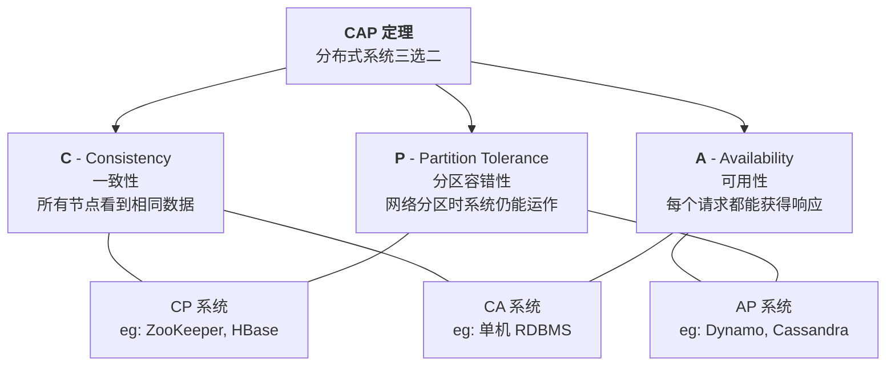
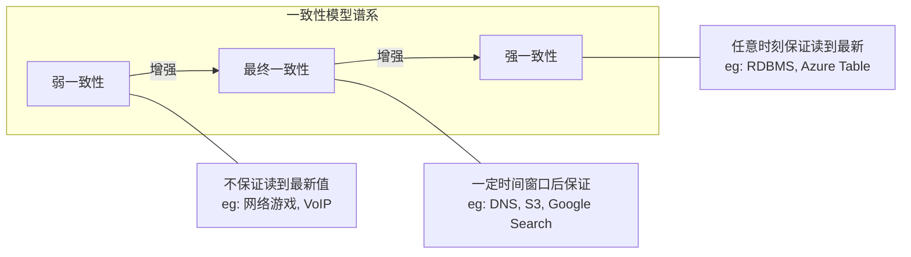
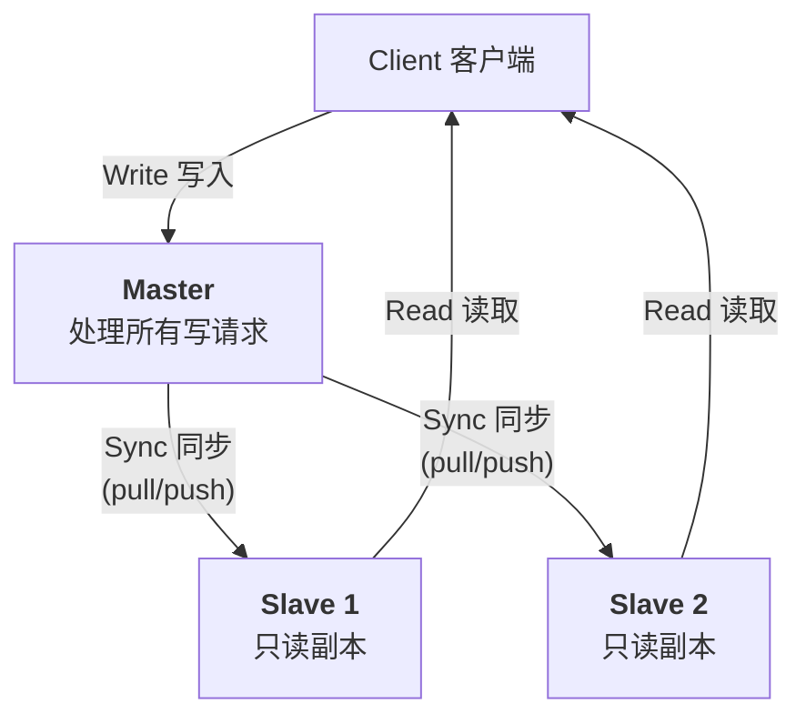
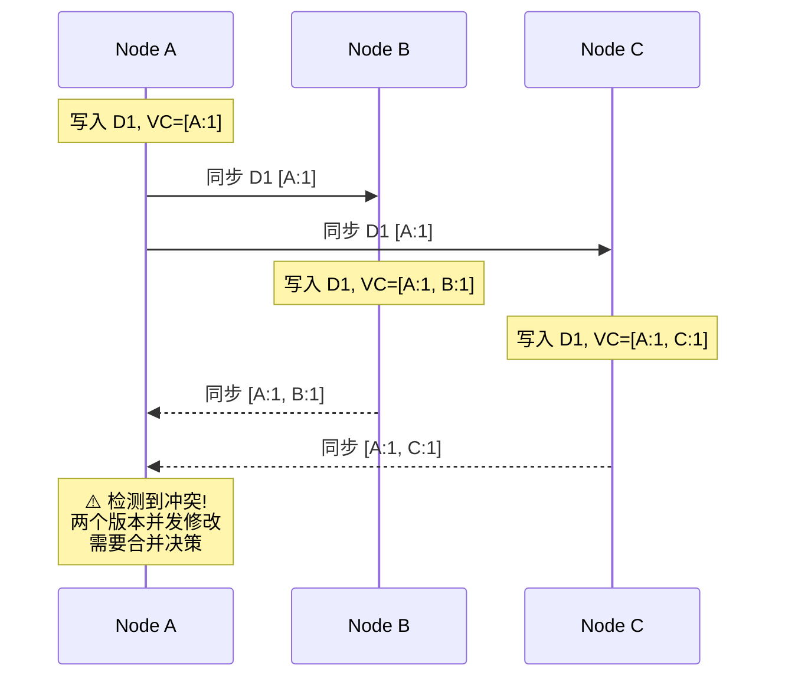
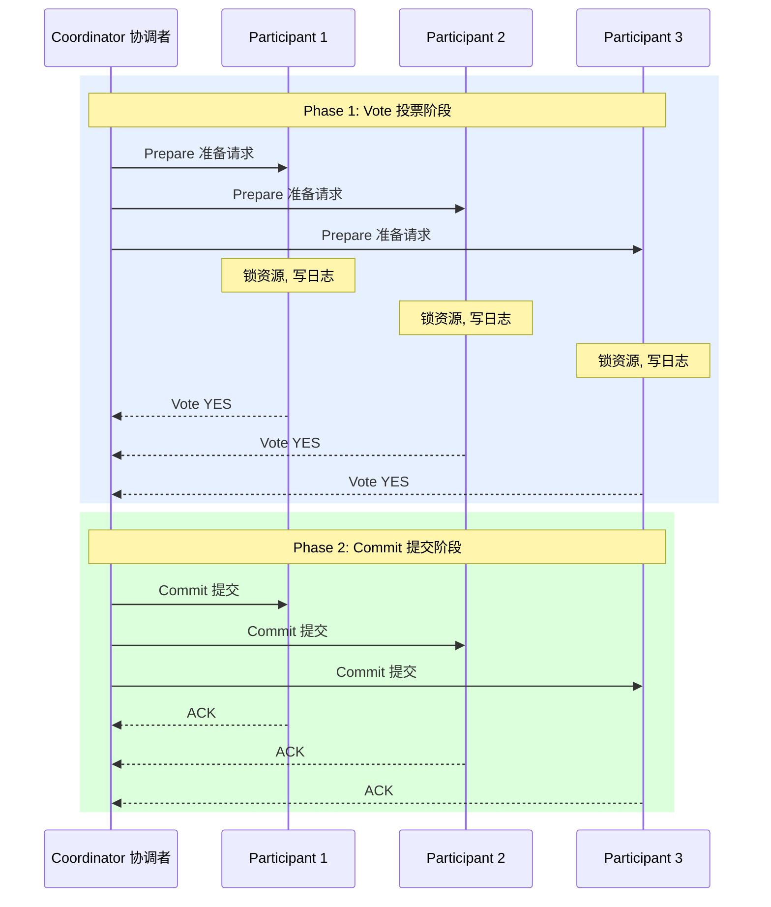
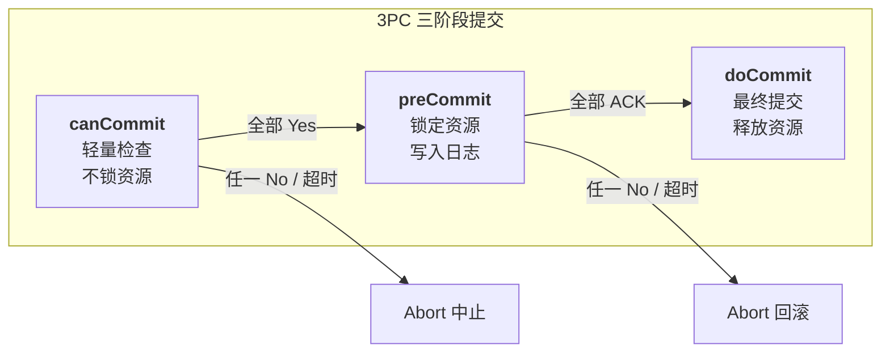
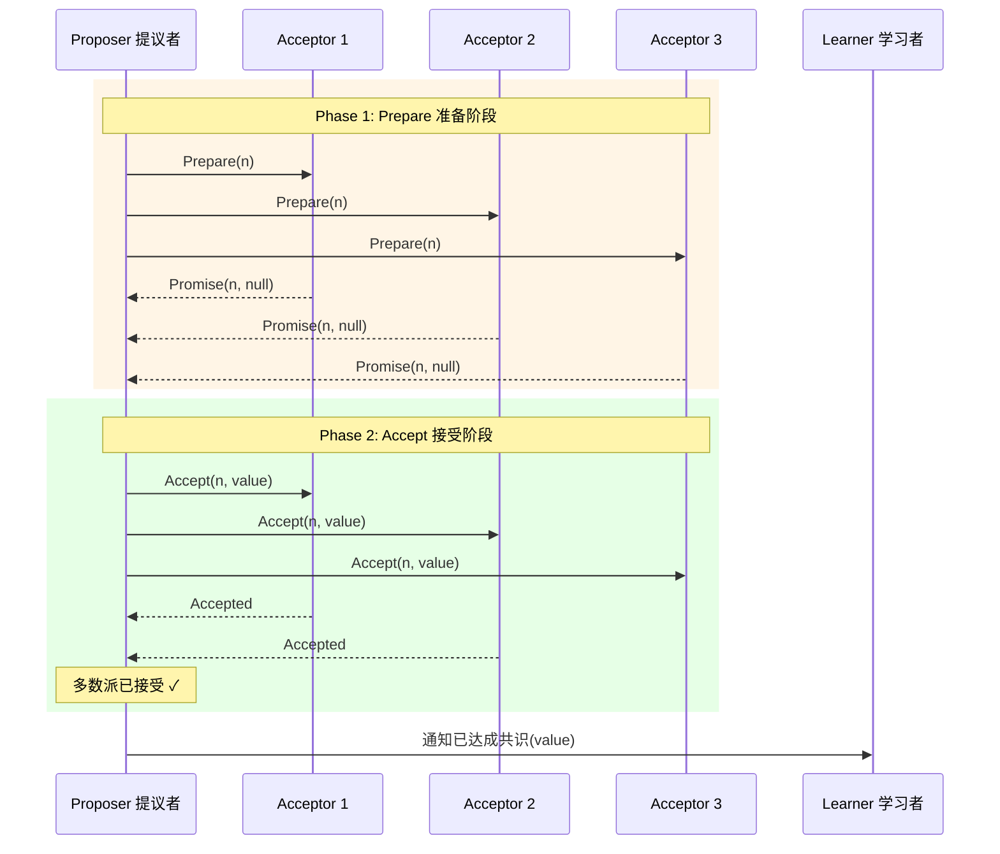
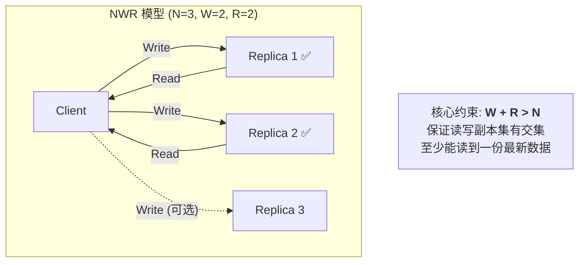
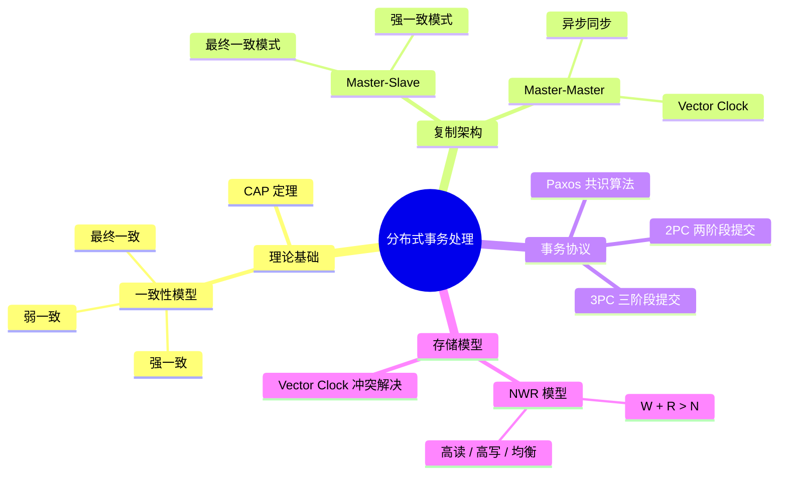

# 分布式事务基础

---

## 一、核心问题：分区思路与镜像问题

分布式系统的设计围绕一个核心矛盾链条展开：

> **高可用 → 多副本 → 一致性问题 → 性能问题**

为了实现高可用，系统需要维护多个数据副本；但多副本又引发了数据一致性的挑战；而保证强一致性往往会牺牲系统性能。这三者之间的权衡，正是分布式系统设计的核心命题。

分布式系统需要同时关注以下三个维度：

| 维度 | 关注点 |
|------|--------|
| **容灾** | 数据不丢失、节点 failover（故障转移）、数据迁移 |
| **一致性** | 事务处理，保证数据在多副本间的正确性 |
| **性能** | 吞吐量（Throughput）、响应时间（Latency） |

### CAP 定理

CAP 定理指出：在分布式系统中，**一致性（C）**、**可用性（A）** 和 **分区容错性（P）** 三者最多只能同时满足两个。这是理解分布式事务处理所有设计决策的理论基石。

---

## 二、一致性模型

根据对一致性要求的严格程度不同，分布式系统的一致性模型可以划分为以下几类：

### 2.1 强一致性（Strong Consistency）

写入新值后，**任意时刻**任何副本都能读取到最新值。

- **典型场景**：文件系统、关系型数据库（RDBMS）、Azure Table
- **优点**：对应用层透明，开发简单
- **缺点**：性能开销大，可用性受限

### 2.2 最终一致性（Eventual Consistency）

写入新值后，经过**一定时间窗口**，所有副本最终会收敛到一致状态。

- **典型场景**：DNS、Amazon S3、Google Search
- **优点**：高可用、高性能
- **缺点**：存在短暂的数据不一致窗口

### 2.3 弱一致性（Weak Consistency）

写入新值后，**不保证**其他副本能读取到最新值。

- **典型场景**：网络游戏（只关注自身数据）、VoIP
- **优点**：最高性能
- **缺点**：一致性无法保障

### 2.4 其他一致性模型

| 模型 | 说明 |
|------|------|
| **顺序一致性** | 所有节点看到的操作顺序一致 |
| **FIFO 一致性** | 同一进程的写操作按顺序可见 |
| **会话一致性** | 同一会话内保证读到自己的写 |
| **单调读一致性** | 一旦读到某个值，后续不会读到更旧的值 |
| **单调写一致性** | 同一进程的写操作按顺序执行 |

---

## 三、复制架构

### 3.1 Master-Slave 架构

Master-Slave 是最常见的分布式复制架构。写操作统一由 Master 处理，Slave 通过 pull 或 push 方式进行数据同步。

#### 最终一致性模式

- Master 写入后，Slave 异步同步
- **风险**：Master 宕机或同步出错会导致**部分数据丢失**
- **恢复策略**：Slave 切换为 Read-Only 后重新同步
- **提升可用性的方法**：
  1. 增加 Slave 副本数量
  2. 对于计算节点，业务允许时可丢弃部分数据

#### 强一致性模式

- Master 写入后，**等待 Slave 也写入成功**才返回 success
- **失败处理**：
  1. 返回 fail 并回滚所有写入
  2. 或标记不可用，继续服务并等待恢复

### 3.2 Master-Master 架构

多个 Master 之间进行**异步同步**，实现最终一致性。

**关键问题：**

1. 同步出错会导致部分数据丢失
2. **多个 Master 修改同一数据**会导致冲突合并问题（这是一个公认的难题）

**解决方案：Vector Clock（向量时钟）**

以 Amazon Dynamo 为例，通过记录每条数据的 **version（版本号）** 和 **editor（编辑者）** 来追踪数据变更历史，在冲突发生时进行合并决策。

> **补充说明**：Vector Clock 的核心思想是为每个节点维护一个逻辑时钟计数器。当数据被修改时，对应节点的计数器递增。通过比较两个 Vector Clock，系统可以判断两个事件是因果关系还是并发关系，从而决定是否需要合并。

---

## 四、分布式事务技术

### 4.1 网络服务的三种状态

在分布式环境中，网络调用的结果只有三种：

| 状态 | 说明 |
|------|------|
| **Success** | 操作成功完成 |
| **Failure** | 操作明确失败 |
| **Timeout** | 超时——最棘手的状态，无法判断对方是成功还是失败 |

Timeout 是分布式系统中最核心的挑战之一，也是各种分布式事务协议需要重点解决的问题。

### 4.2 两阶段提交（2PC）

2PC（Two-Phase Commit）是经典的分布式事务协议，分为两个阶段：

**第一阶段：Vote（投票/准备）**
- 协调者向所有参与者发送准备请求
- 参与者**锁定资源、写入日志**
- 参与者投票 Yes/No

**第二阶段：Commit（提交/回滚）**
- 如果所有参与者投票 Yes → 协调者发送 Commit 命令，参与者执行事务
- 如果有任何参与者投票 No → 协调者发送 Rollback 命令，参与者回滚事务

#### 2PC 的问题

| 阶段 | 问题 | 处理方式 |
|------|------|----------|
| **Vote 阶段超时** | 参与者未响应 | 可以直接 fail 或 retry |
| **Commit 阶段 - 参与者超时** | 参与者执行 commit 时无响应 | fail 或剔除该参与者 |
| **Commit 阶段 - 协调者超时** | 协调者宕机，参与者收不到 commit/rollback 命令 | 参与者陷入"**状态未知**"阶段——只能 **block 等待**或重新 vote |

> **2PC 的核心缺陷**：同步阻塞严重影响性能；协调者单点故障会导致参与者"进退两难"，这在生产环境中是不可接受的。

### 4.3 三阶段提交（3PC）

3PC 在 2PC 的基础上引入了一个额外的预提交阶段，将流程拆分为三步：

1. **canCommit**：协调者询问参与者是否具备提交条件（轻量级检查，不锁资源）
2. **preCommit**：参与者锁定资源，进入预提交状态
3. **doCommit**：执行最终提交

> **3PC 的改进**：通过引入 canCommit 阶段，减少了不必要的资源锁定；参与者在 preCommit 后如果超时，可以选择自动提交（因为已知大多数参与者都同意了），从而避免了 2PC 中协调者宕机导致的无限阻塞问题。但 3PC 仍然无法完全解决网络分区下的一致性问题。

### 4.4 Paxos 协议

Paxos 是解决分布式一致性的经典算法，其背景涉及两个著名的问题：

- **两将军问题**：在不可靠的通信信道上，两支军队如何达成一致行动的协议？（已证明无解）
- **拜占庭将军问题**：部分节点可能出现恶意行为（叛变），如何在存在恶意节点的情况下达成共识？

> **补充说明**：Paxos 由 Leslie Lamport 提出，是一种基于多数派投票的共识算法。它通过 Proposer、Acceptor、Learner 三种角色的协作，保证在不超过半数节点故障的情况下，仍然能够对某个值达成一致。Paxos 是现代分布式系统（如 Google Chubby、Apache ZooKeeper）的理论基石。

---

## 五、分布式存储：NWR 模型

Amazon Dynamo 提出的 **NWR 模型**，将 CAP 三选二的决策权交给了用户，是一种极具弹性的设计。

### 5.1 参数定义

| 参数 | 含义 |
|------|------|
| **N** | 数据的备份总数（副本数） |
| **W** | 一次写操作需要成功写入的最小副本数 |
| **R** | 一次读操作需要至少读取的副本数 |

### 5.2 NWR 读写示意（N=3）

### 5.3 配置要求

核心约束条件：**W + R > N**

只要满足这个条件，读操作和写操作的副本集合**必然存在交集**，从而保证至少能读到一份最新数据。

### 5.4 典型配置

| 场景 | W | R | N | 特点 |
|------|---|---|---|------|
| **高写入性能** | 1 | N | N | 写入只需一个副本确认，速度最快；但读取需要查询所有副本 |
| **高读取性能** | N | 1 | N | 读取只需一个副本，速度最快；但写入需要所有副本确认 |
| **均衡配置** | 2 | 2 | 3 | 读写均需要多数派确认，兼顾一致性和性能 |

### 5.5 NWR 的问题与解决

**问题链条**：

当多个节点并发写入时，可能产生版本冲突。解决方案是使用 **Vector Clock**，由用户自行记录每条数据的 **version no.（版本号）** 和 **editor（编辑者）**，在读取时进行冲突检测和合并。

---

## 六、总结

| 层次 | 内容 | 关键技术 |
|------|------|----------|
| **理论基础** | CAP 定理、一致性模型 | 强一致/最终一致/弱一致 |
| **复制架构** | 数据副本同步策略 | Master-Slave、Master-Master |
| **事务协议** | 分布式事务的正确性保证 | 2PC、3PC、Paxos |
| **存储模型** | 灵活的一致性与性能权衡 | NWR 模型、Vector Clock |

在实际系统设计中，没有"银弹"方案。需要根据业务场景对**一致性**、**可用性**和**性能**进行合理的权衡取舍。理解这些基本原理和协议，是构建可靠分布式系统的基础。

