# DDIA 学习笔记

---

## 目录

- [1. 数据模型与编码](#1-数据模型与编码)
- [2. 数据流与服务通信](#2-数据流与服务通信)
- [3. 分布式系统的核心问题](#3-分布式系统的核心问题)
- [4. 数据库架构演进](#4-数据库架构演进)
- [5. 复制（Replication）](#5-复制replication)
- [6. 分布式系统的麻烦](#6-分布式系统的麻烦)
- [7. 事务与隔离级别](#7-事务与隔离级别)
- [8. 一致性与共识](#8-一致性与共识)
- [9. 顺序保证与全序广播](#9-顺序保证与全序广播)

---

## 1. 数据模型与编码

### 1.1 存储引擎数据结构

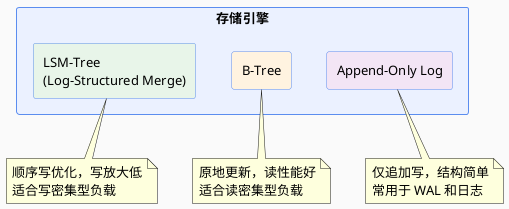

### 1.2 编码格式

| 类别 | 格式 | 特点 |
|------|------|------|
| **文本格式** | XML / JSON / CSV | 可读性好，但体积大、解析慢 |
| **二进制模式** | Protocol Buffers / Thrift / Avro | 紧凑高效，需 Schema |

**编码格式对比：**

- **Protocol Buffers / Thrift**：Pros — 无 tag，可用于代码生成；Cons — 可读性差
- **Avro**：无 tag，紧凑，适合大规模数据；Schema 演进灵活

### 1.3 编码兼容性

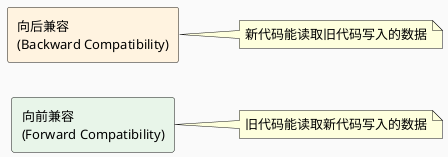

**编程语言特定编码**的局限：
- 仅限于单一编程语言
- 往往无法提供向前、向后兼容性

**数据库中的多版本编码**：中心化多版本编码库，写入进程编码时记录版本号，读取进程根据版本号解码。

---

## 2. 数据流与服务通信

### 2.1 REST

> 基于 HTTP 原则的设计哲学，强调简单数据格式，使用 URL 标识资源，使用 HTTP 控制缓存、验证身份、协商内容类型。**REST 不是一个协议，而是一种设计风格。**

适用于**跨组织服务集成**。

### 2.2 RPC

- **Cons**：跨语言、平台的兼容性问题

### 2.3 异步消息

节点间发消息通信，由发送者编码、接收者解码。

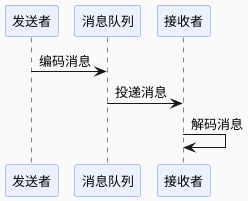

**结论**：向前兼容、滚动升级在某种程度上可以实现。

---

## 3. 分布式系统的核心问题

### 3.1 为什么需要分布式

| 问题 | 描述 |
|------|------|
| **可扩展性** | 数据量、读写负载超出单机处理上限，可以分散负载到多机 |
| **容错 / 高可用性** | 单机 / 局部网络 / 单数据中心故障时，通过冗余继续提供服务 |
| **延迟** | 全球范围多数据中心部署，用户就近访问 |

### 3.2 扩展方式

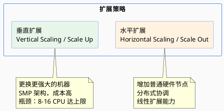

---

## 4. 数据库架构演进

### 4.1 架构对比总览

| 架构 | 定义 | Pros | Cons | 示例 |
|------|------|------|------|------|
| **共享内存 Shared-Memory** | 所有 CPU 共享物理内存，通过高速总线（PCIe）互联，通常是 SMP 系统 | 编程模型简单、通信延迟低 | 成本高、单点故障、扩展性不足（8-16 CPU） | — |
| **共享磁盘 Shared Disk** | 多个计算节点共享一套磁盘阵列，每个节点有独立内存/CPU，磁盘通过快速网络连接 | 高可用、读扩展好、存储集中管理 | 竞争和锁开销、网络开销、对网络性能要求高 | NAS / SAN |
| **共享存储 Shared Storage** | 计算节点、存储节点分离，通过 SAN/NAS 访问共享存储，通常 Active-Standby 模式 | 存储集中管理、故障快速恢复、存储可独立扩展 | 存储成为单点故障、存储网络瓶颈、成本高 | — |
| **无共享 Shared Nothing** | 每台机器使用各自的处理器、内存、磁盘，节点间通过软件层经网络协调 | 线性扩展、高可用无单点故障、成本低 | 数据一致性复杂（CAP）、跨分片事务挑战、运维复杂 | Spanner / TiDB / Cassandra |
| **云原生 + 存算分离** | 计算与存储彻底分离，基于云基础设施的弹性架构 | 极致弹性（秒级扩缩容）、微服务化 | — | Snowflake / Redshift / PolarDB |

### 4.2 架构演进趋势

**关键技术驱动**：

- **网络**：RDMA、高速以太网
- **存储**：NVMe、持久内存
- **软件技术**：容器化、服务网格
- **硬件技术**：SmartNIC、DPU

---

## 5. 复制（Replication）

> 由于网络的基本约束不变，数据库复制的基本原则也不变。需要考量：节点故障、不可靠网络、副本一致性、持久性、可用性、延迟。

### 5.1 Leader-based Replication（单主复制）

也称 Active/Passive、Master/Slave。

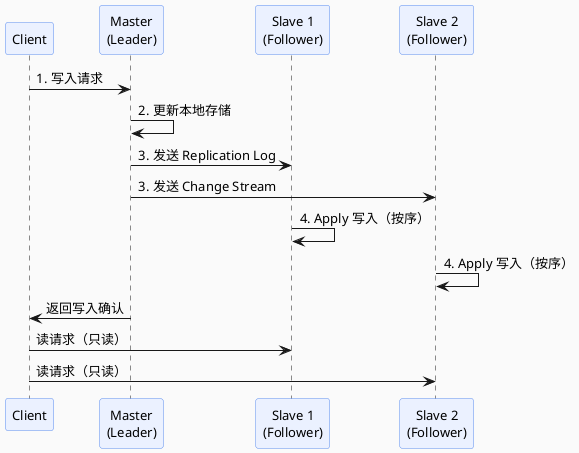

**复制模式对比**：

| 模式 | 描述 | Pros | Cons |
|------|------|------|------|
| **同步复制 Synchronous** | 主库等待从库确认 | 持久性好，主库失效后有最新副本 | 可用性差，写 SLA 受从库影响 |
| **异步复制 Asynchronous** | 主库不等待从库 | 写入快速 | 可能丢数据 |
| **半同步 Semi-Synchronous** | 一个从库同步，其余异步 | 至少两个节点有最新数据 | 折中方案 |

### 5.2 链式复制

1. 将副本组织成链，客户端与链头交互
2. 链头将写传播给链中下一个副本，依次传播直到链尾
3. 链尾确认写操作后，反向传播回链头

- **读**：由链尾提供（保证强一致性）
- **Pros**：读操作性能高、强一致、写操作顺序传播易于管理
- **Cons**：写操作延迟与链长成正比、链重新分配复杂

### 5.3 设置新从库

1. 获取主库 snapshot
2. 快照复制到从库
3. 从库从主库拉取快照后所有数据变更（依据 LSN/Binlog Coordinates）
4. 从库 catch up

### 5.4 处理节点宕机

- **从库失效**：追赶恢复 — 从库知道本地 LSN，可以拉取数据变更 catch up
- **主库失效**：故障切换 — 确认主库失效 → 选择新主库（选举或控制节点指定，注意最小化数据损失） → 启用新主库、禁用老主库

**故障切换的问题**：
- 异步复制 + 重新选主后旧主重新加入集群带来的数据冲突和数据丢失
- LWW 可能破坏持久性
- 脑裂（无冲突解决机制，Multi-Leader 支持）
- 如何正确配置超时，减少不必要的故障切换

### 5.5 复制日志实现

| 方式 | 说明 | 优劣 |
|------|------|------|
| **基于 Statement** | 复制 SQL 语句 | 非确定性函数（Now/Rand）、自增列、有副作用语句（触发器、UDF）会导致不一致 |
| **WAL 复制** | 传输物理 WAL | 非常底层（含磁盘块字节变更），与存储引擎紧耦合，升级困难 |
| **逻辑日志复制（基于行）** | 日志与存储引擎解耦 | 容易向后兼容，主从可运行不同版本存储引擎 |
| **基于触发器** | 注册自定义程序监听变更 | 灵活但开销大、易出错 |

### 5.6 复制延迟与一致性问题

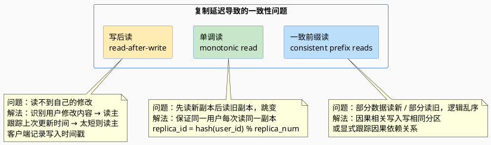

### 5.7 Multi-Leader Replication（多主复制）

**应用场景**：
- **多数据中心**：数据库自身支持多主，或利用外部工具实现
- **需要离线操作的客户端**：如 CouchDB，本地设备相当于数据中心
- **协同编辑**：将更改单位设置非常小（如单次按键）并避免加锁

**Pros**：写入吞吐更高、就近写入网络延迟更低、容忍单数据中心故障

**Cons**：冲突处理复杂

#### 处理写入冲突

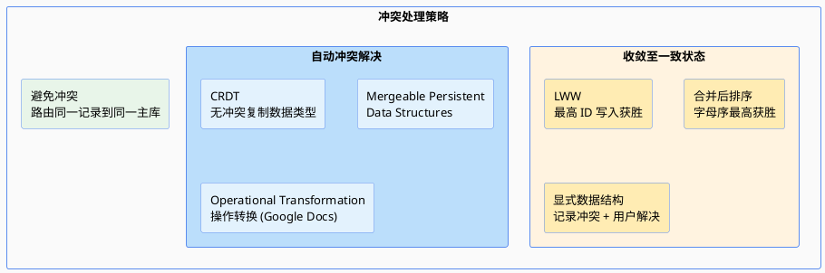

- **同步冲突检测**：等待写入复制到所有副本再返回，但会丧失多主优势
- **避免冲突**：应用层确保特定记录所有写入路由到相同主库
- **LWW**：每个写入分配唯一 ID，最高 ID 写入获胜 — 容易丢数据
- **CRDT**（Conflict-free Replicated Data Types）：集合、映射、计数器等，自动合理解决冲突（如 Riak 2.0）
- **Operational Transformation**：Google Docs 等协同编辑背后的算法

#### 多主复制拓扑

- **环形拓扑**（如 MySQL）：节点有唯一标识符，写入复制日志用于破环
- **星形拓扑**：中心节点转发
- **All-to-All**：容错更好，但可能因网络质量不同导致消息乱序

> 环形、星形拓扑在单节点故障下会中断复制消息流，通常要人工修改拓扑配置。

### 5.8 Leaderless Replication（无主复制）

应用：Dynamo、Riak、Cassandra、Voldemort

#### 读修复和反熵

- **读修复 Read Repair**：客户端并行读多个节点，检测修复有旧值的节点
- **反熵过程 Anti-entropy Process**：后台进程扫描对比多副本并进行修复

#### Quorum 机制

> 如果有 n 个副本，每个写入必须由 w 个节点确认，每个读取必须查询 r 个节点。只要 **w + r > n**，读取的节点中至少有一个包含最新写入。

---

## 6. 分布式系统的麻烦

### 6.1 不可靠的网络

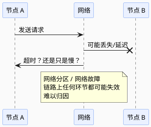

- **检测故障**：动态监测或超时重试
- **网络拥塞和排队**：链路上任何环节都可能拥塞和排队，影响延迟
- **TCP vs. UDP**：可靠性 vs. 实时性

#### 同步网络与异步网络

| 网络类型 | Workload 特征 | 设计理念 | 示例 |
|----------|--------------|----------|------|
| 同步网络 | 相对确定（语音） | 预分配带宽，可预测低延迟 | 电话网络 |
| 异步网络 | 不确定，突变流量 | 尽最大努力传递，资源利用率高 | 互联网 |
| HPC 内部网络 | 计算负载确定 | 可预测低延迟 + 并行计算 | NVLink |

### 6.2 不可靠的时钟

#### 时钟类型

| 类型 | 实现 | 用途 | 同步 |
|------|------|------|------|
| **日历时钟 time-of-day** | `clock_gettime(CLOCK_REALTIME)` / `System.currentTimeMillis()` | 返回自 epoch 起的 ms | 需要 NTP 同步 |
| **单调钟 monotonic** | `clock_gettime(CLOCK_MONOTONIC)` / `System.nanoTime()` | 测量 elapsed time | 不用同步，μs 级分辨率 |

#### 时钟同步与准确性问题

- 石英钟不精确，会漂移（drifts），取决于机器温度
- 本地与 NTP 相差过大时，会拒绝同步或本地强制重置
- NTP 被防火墙阻塞时容易被忽略
- NTP 依赖存在可变数据包延迟的拥塞网络
- 虚拟机上硬件时钟被虚拟化，时钟可能突然跳跃
- 闰秒会打破未考虑闰秒的系统的时序假设

#### LWW 的基本问题

- 时钟滞后的节点，无法覆盖正常节点写入的值，表现为写入消失
- 无法区分高频顺序写和并发写，需要引入额外因果关系跟踪机制（如版本向量）
- 两个节点可能独立生成相同 ts 的写入

#### 时钟置信区间

不确定性来源：
1. **时间源本身**：GPS 接收器或原子钟分辨率
2. **服务器**：取决于上次与 NTP 同步、石英钟漂移的期望值 + NTP 的不确定性 + RTT
3. **大多 API 不告知置信区间**（如 `clock_gettime` 未告知预期误差）
4. **例外**：Spanner TrueTime API 明确告知置信区间，返回 [最早, 最晚]

#### Spanner TrueTime

通过以下方式保证全局快照一致：
1. 部署 GPS 接收器或原子钟保证尽可能小（7ms 内）的时钟不确定性
2. 提交读写事务前等待置信区间长度的时间避免重叠
3. 判断两个置信区间是否重叠来保证因果一致

### 6.3 进程暂停

一个节点如何知道它仍是 Leader 可以安全写入？

**暂停原因**：
1. GC STW
2. VM Suspend（挂起虚机并恢复）
3. 用户终端设备暂停（如笔记本待机）
4. OS 线程切换（Steal Time）
5. 应用程序同步磁盘访问（如 ClassLoader 首次 Lazy Load）
6. OS Swap
7. SIGSTOP 等

**Lease 机制的问题**：
- 依赖时钟同步：租约到期时间由另一台机器设置，时钟不同步可能导致提前/延后终止租约
- 即使使用本地单调时钟，程序暂停时长 > 租期也会导致多主写冲突

### 6.4 真相由多数定义

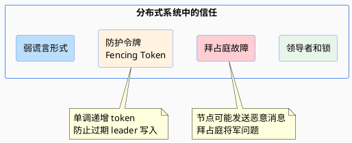

### 6.5 算法的正确性

- **系统模型与现实**
- **安全性和活性**
- 将系统模型映射到现实世界

---

## 7. 事务与隔离级别

### 7.1 事务重试的问题

- 暂时性错误（如，死锁、异常、临时网络中断、故障切换）才值得重试，永久性错误（如，违反约束）不重试
- 事务无法避免 DB 之外的副作用（如，往外部发邮件），可以通过 2PC 确保多个不同系统一起提交或放弃
- 客户端在重试时失效，任何写入的数据都会丢失

### 7.2 并发问题总览

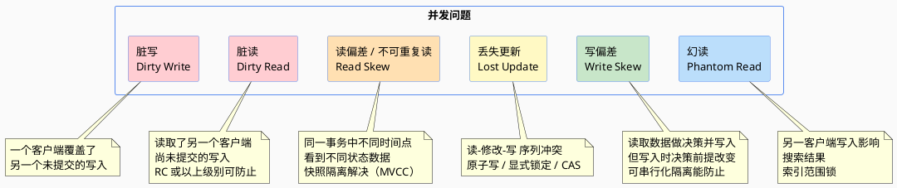

### 7.3 读已提交（Read Committed, RC）

事务提交后，写入操作才会被看见，且立即可见。

**两个保证**：
- **没有脏读**：读只能看到已提交数据
- **没有脏写**：写只会覆盖已提交数据

### 7.4 快照隔离与可重复读（RR）

- 允许事务从一个特定时间点的一致性快照中读取数据
- 通常用 **MVCC**（多版本并发控制）实现
- 观察一致性快照的可见性规则

### 7.5 防止丢失更新的方法

| 方法 | 说明 |
|------|------|
| 原子写 | 数据库内置原子操作 |
| 显式锁定 | `SELECT FOR UPDATE` |
| 自动检测 | 数据库自动检测丢失的更新 |
| CAS | Compare-And-Set |
| 冲突解决和复制 | 多副本场景下的冲突解决 |

### 7.6 写偏斜与幻读

- **写偏斜 Write Skew**：读取数据做决策，写入时决策前提已改变
- **幻读 Phantom Read**：事务读取符合某些搜索条件的对象，另一客户端写入影响到搜索结果
- **物化冲突**：将幻读转化为对具体行的锁冲突

### 7.7 可串行化隔离实现

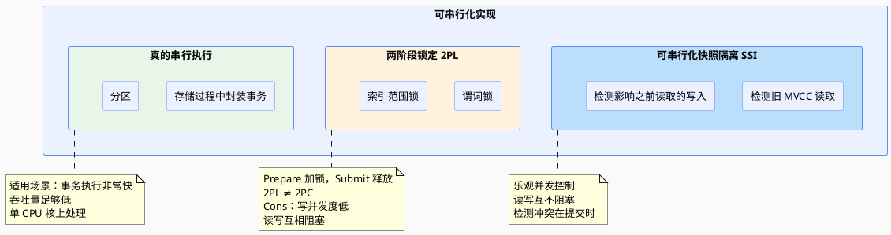

#### 悲观与乐观并发控制

| 策略 | 假设 | 行为 |
|------|------|------|
| **悲观并发控制**（如 2PL） | 事务并发度高 | Prepare 先加锁再执行 |
| **乐观并发控制**（如 SSI） | 事务并发度低 | Prepare 先执行，Submit 再看是否冲突 |

#### SSI 检测方式

1. **检测旧 MVCC 读取**：事务提交时检查是否有并发事务写已经被提交，如果有则中止当前事务
2. **检测影响之前读取的写入**：
   - 在索引项上记录有事务读
   - 事务写时查找可能受影响的事务读（类似写锁但不阻塞）

**SSI 性能优势**：
- 读写互不阻塞，查询延迟更可预测
- 只读查询运行在一致性快照，无锁
- 不局限于单个 CPU 核吞吐量
- 可将冲突检测分布在多机

---

## 8. 一致性与共识

### 8.1 线性一致性

> 线性一致性是读写寄存器（单个对象）的最新值保证 — **任何一个读返回新值后，后续读也必须返回新值**。不要求将操作组合到事务中，因此无法避免写倾斜等问题。

**辨析**：
- **线性一致性**：单个对象的最新值保证
- **可串行化**：事务的隔离属性，确保事务执行结果与串行执行结果相同

### 8.2 需要线性化的场景

| 场景 | 说明 |
|------|------|
| **加锁与选主** | 不论锁如何实现，需满足可线性化（如 ZK、etcd） |
| **唯一性约束** | 主键唯一性保证 |
| **跨通道的时序依赖** | 不同通道间的因果顺序 |

### 8.3 各复制方案的线性一致性

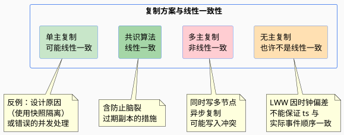

### 8.4 Dynamo 风格 Quorum 的线性化

即使满足严格 Quorum 条件（w + r > n），也**非线性一致**：

- **读修复**：客户端并行读，检测陈旧响应并回写新值 — 适用于读频繁的值
- **反熵**：后台查找副本间数据差异并复制缺失值 — 不以特定顺序写入，复制前可能有显著延迟
- 只能实现线性一致的读写，不能实现线性一致性的 CMP/CAS（需要共识算法）

**结论**：Dynamo 风格无主复制不能提供线性一致性。

### 8.5 线性一致性的代价

- **CAP 定理**（帮助有限）
- **线性一致性和网络延迟**的权衡

---

## 9. 顺序保证与全序广播

### 9.1 顺序与因果关系

- **因果顺序不是全序**
- **线性一致性强于因果一致性**
- 捕获因果关系

### 9.2 序列号顺序

- 非因果序列号生成器的局限
- **Lamport 时间戳**
- 唯一约束等需要立即确认冲突的问题，无法通过只有时间戳排序解决

### 9.3 全序广播

> 全序广播要满足两个安全属性：**可靠性（reliable delivery）** 和 **有序性（totally ordered delivery）**。

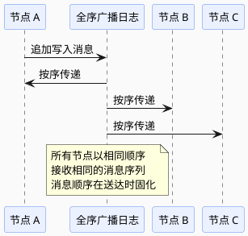

**特性**：
- 可以看作一种创建日志方式（复制日志、事务日志、WAL）
- 消息顺序在送达时固化 — 不允许追溯插入前序消息

### 9.4 全序广播的用途

| 用途 | 说明 |
|------|------|
| **状态机复制** | 每个消息表示一次数据库写入，所有副本按相同顺序处理 → 副本间保持一致 |
| **可串行化事务** | 每个消息表示一个确定性事务，以存储过程形式执行 |

### 9.5 使用全序广播实现线性一致 CAS 操作

以唯一用户名为例：

1. 日志中追加一条消息，试探性指明要声明的用户名
2. 读日志，等待刚追加的消息被读回
3. 检查是否有消息声称目标用户名的所有权

---

## 附录：PDF 原始思维导图

> 以下为原始 XMind 思维导图导出的 PDF 页面渲染图及嵌入的插图。

### 思维导图全图
### 嵌入插图

