| 内存情况 | 线程模型 | 存储引擎三变量 | | | 复制 | | | 事务 |
| :--- | :--- | :--- | :--- | :--- | :--- | :--- | :--- | :--- |
| | | **是否有序** | **是否可变** | **是否缓冲** | **快照原理** | **复制模式** | **一致性** | |
| BTree<br>内存 Page 内松散<br>磁盘 Page 内紧凑 | 多线程<br>无锁并发 | 有序 | 单个内存 page 可变<br>单个磁盘 block 不可变 | 有 | MVCC<br>事务时间戳 | 主从<br>oplog | - | 支持 |

# WiredTiger

MongoDB 是**文档数据库**，以BSON 格式存储文档，底层抽象出存储引擎接口层 **KV Engine**，支持可插拔，目前默认采用 WiredTiger。

> 图 1: RDBMS 与 MongoDB 概念模型对比

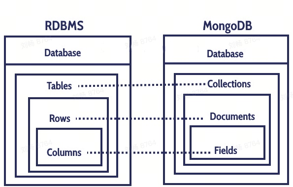

> 图 2: WiredTiger 引擎架构

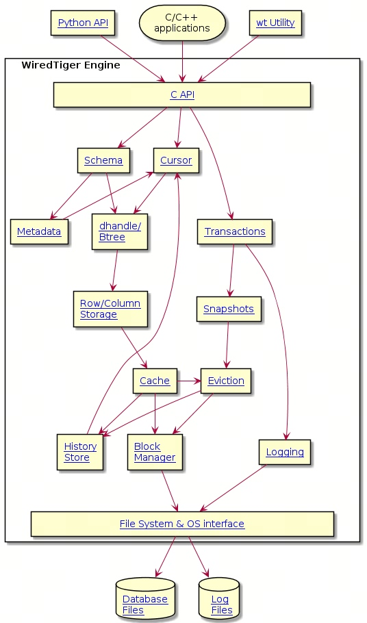

WiredTiger 具有高性能、多核扩展性强、支持事务[等特点](https://source.wiredtiger.com/3.2.1/architecture.html)

- 通过 Page 内的无锁链表，支持对 Page 的并发读写
- 最高支持 SI 隔离级别
- 支持 Checkpoint Durability、Commit-level Durability，并且支持快照语义的事务一致性
- WAL + Checkpoint 支持持久性
- 通过 Hazard Pointer、EBR、Pointer Swizzling 支持多核扩展
- 变长 Page 避免空洞导致的空间放大
- 支持溢出页高达 4GB 超大 KV

本文聚焦 WiredTiger 内部如何通过数据组织、多核编程技术提供去中心化的数据存储与检索。不介绍 MongoDB 的 API、生态，MongoDB 内部实现有关的事务、Oplog、Timestamp，也不介绍 WiredTiger 的 LSMT、列存、Fast-Truncate 等，大家感兴趣可以探索。

# 数据组织
> 一个 BTree 对应一个 Collection（MongoDB），对应一张表（RDBMS）。
>
> 一个 KV Pair 对应一个 Document（MongoDB），对应一行 Row（RDBMS）。

存储引擎常采用 BTree（广义，包含 B+ Tree，后文也如此） 或 LSMT 组织数据，数据的基本单位是 Page，Page 包含多个 KV。Page 的组织关系就是存储引擎的数据组织方式，BTree/LSMT 的访问就是存储引擎主要的数据访问。

1. 传统存储引擎 Page 结构在内存、磁盘上完全一致，同时 Page 大小固定。
	- 同构 Page 内存布局会受磁盘存储方式的影响，例如磁盘顺序读写
	- 定长 Page 能提高 IO 效率，但空洞会导致空间放大，例如 InnoDB Page 16KB

2. 访问时要加读写锁
	- 修改一个页需要获得该页的 x-**latch**
	- 访问一个页是需要获得该页的 s-**latch** 或者 x-**latch**
	- 持有该页的 **latch** 直到修改或者访问该页的操作完成

3. 为进一步提高 IO 性能也会缓存 Page，由**中心化**的 BufferPool + LRU 管理。

读写链路上的 latch、中心化 BufferPool 等因素限制了多核 CPU 的发挥，同构 Page 限制了存储效率。

> 怎么办？
> WiredTiger：异构 Page，去中心化。

## BTree

WiredTiger 支持 BTree、LSMT，本文介绍默认的 BTree。

> 图 3: B+Tree 结构示意图

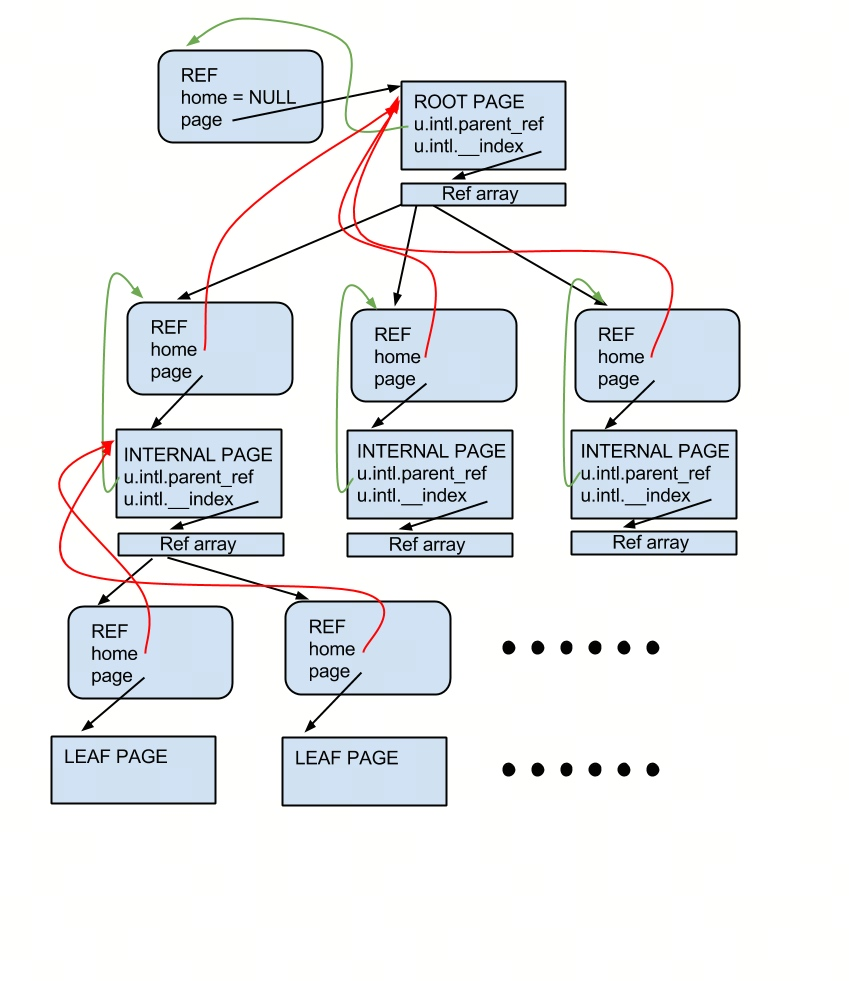

- 以 B+ Tree 形式组织
	- Leaf Page 存数据
	- Internal Page 存指针
	- 没有兄弟指针
	- 有父指针
- 只有分裂，没有合并，且分裂延迟到刷盘
- 支持 Fast-Truncate，支持 Range Delete

## Page

WiredTiger 内存中的 In-Memory Page 是一个松散的数据结构，磁盘上的 Disk Extent 是一个变长数据块，紧凑 KV，支持压缩。

- In-Memory Page 松散，可以不受磁盘存储方式的限制，不加读写锁，可以自由地构建 **Page 无锁多核并发结构**，充分发挥多核 CPU 的算力。
- Disk Extent 可以自由地**压缩**，提高磁盘存储和 IO 效率。

### In-Memory Page

> 设计怎样的数据结构、操作来实现 Page 无锁多核并发？

Internal Page 存 Keys、Leaf Page 存 KV，两者在内存中的组织不同。

> 图 4: Internal Page 中的 WT_REF 指针

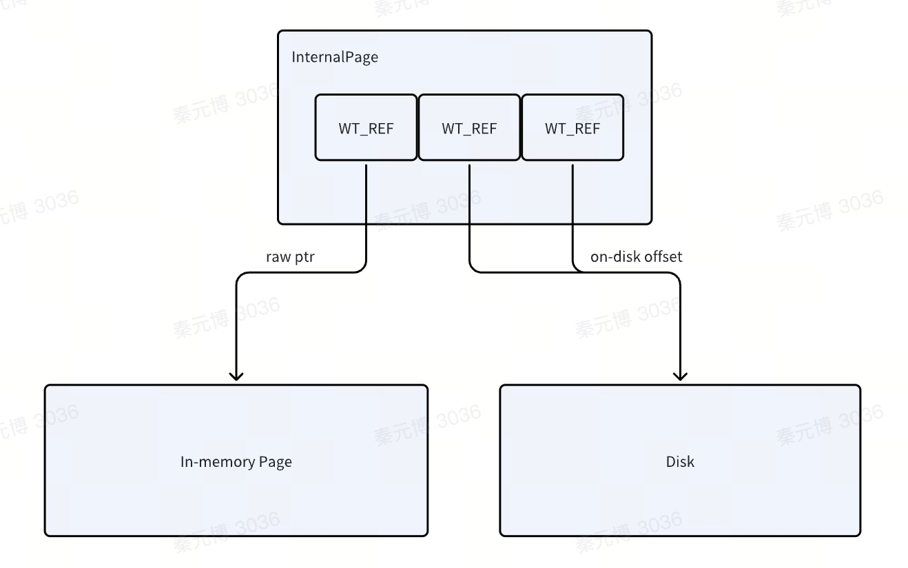

#### Internal Page

Internal Page 存储 WT_REF 数组，每个 WT_REF
- 要么指向内存中的子节点，记录 WT_PAGE 裸指针
- 要么指向磁盘上的数据 Extent，记录磁盘地址

WT_REF 实现了 [Pointer Swizzling](https://en.wikipedia.org/wiki/Pointer_swizzling) 加速内存、磁盘间的指针转换

```cpp
struct __wt_ref {
    wt_shared WT_PAGE *page; /* Page */
    wt_shared void *addr;
    wt_shared volatile WT_REF_STATE __state;
    ...
}

#define WT_REF_DISK 0    /* Page is on disk */
#define WT_REF_DELETED 1 /* Page is on disk, but deleted */
#define WT_REF_LOCKED 2  /* Page locked for exclusive access */
#define WT_REF_MEM 3     /* Page is in cache and valid */
#define WT_REF_SPLIT 4   /* Parent page split (WT_REF dead) */
```

BTree 下降时，如果目标子节点的状态显示
- 不在内存，就从磁盘捞 Page，修改状态并记录内存中的指针
- 在内存，就直接访问裸指针指向的子节点

好处是去除了 BufferPool 等中心化组件带来的同步开销，访问非常轻量，同时也引入一些挑战：
- 不再有中心化的组件管理换入换出，也就没法在内存不足时快速得知哪些 Page 需要换出
- 为了配合去中心化设计，相关链路也必须去中心化，否则 PointerSwizzling 带来的优势会被削弱，同时引入了复杂度

BTree 分裂时，会修改 Internal Page，考虑到分裂低频、读高频，使用 COW（Copy-On-Write）

> 图 5: Internal Page 的 COW (Copy-On-Write)

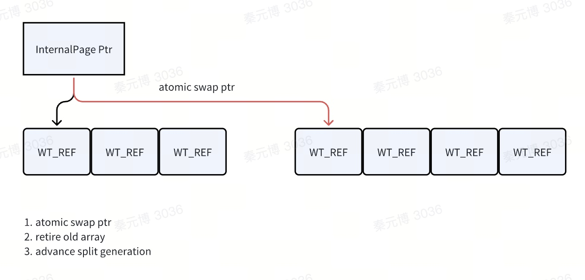

- 拷贝一份相同的 WT_REF 数组
- 在新数组上应用修改
- 通过指针原子地将新数组挂到父节点
- 老数组走 EBR 删除

> EBR（Epoch-Based Reclamation）
>
> 组件：global epoch（通常整数，原子操作保证可见性、避免racing）、thread local state（local epoch、待回收内存列表）、reclaimation（global active threads）
>
> 流程：1. 进入epoch：访问共享数据时，将 local epoch 更新为 global epoch；2. 标记删除：线程要删除内存时，添加到当前 epoch 的待回收内存块列表；3. 推进epoch：检测全局活跃线程列表，当所有线程 local epoch 都是新的，则旧 epoch 的内存块可以安全回收，等3代，惰性检测避免每次推进epoch都立即检测所有进程、防误删；4. 回收内存：回收线程检查哪些 epoch 可以被回收，并释放对应内存块。
>
> > 示例
>
> 问题在于，如果线程数量很多，遍历检查的开销会很大。
>
> Pros：低开销、简单
>
> Cons：延迟回收、内存占用

#### Leaf Page

Leaf Page 主要包括存储 KV Pairs 的 pg_row、disk_image，以及存储数据变更的 modify，后者也是无锁读写的关键。

> 图 6: Leaf Page 内存结构

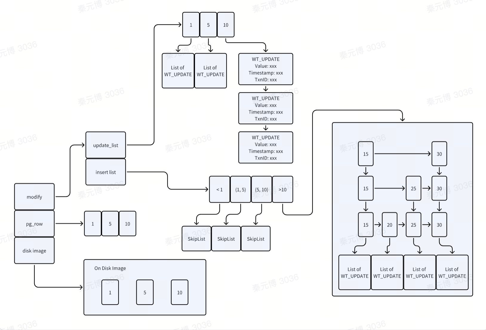

先看数据结构

- KV Pairs
	- pg_row：裸指针，指向 disk_image 中的 offset
	- disk_image：存储从磁盘上读取并反序列化后的裸数据，可由 pg_row 中的 Key 根据 offset 找到该段内存中的数据
- 数据变更相关信息
	- modify
		- update list：记录修改数据，每个 Slot 包含一个版本链（用于 MVCC），用无锁链表实现，从而支持同一行数据的并发读写。版本由 WT_UPDATE 实现，描述对 Key 的一次修改，包含数据（完整 KV）、时间戳、事务 ID。记录删除数据也一样，只是 WT_UPDATE 会被标记为 WT_UPDATE_TOMBSTONE。
		- insert list：记录新增数据，每个 Slot 对应一个 Key Range，Key Range 根据磁盘上的 Row 划分得出，Key Range 由无锁 SkipList 实现，SkipList 每个节点保存新插入的数据，也是一个 WT_UPDATE 版本链。

> 图 7: Insert List 的 SkipList 结构

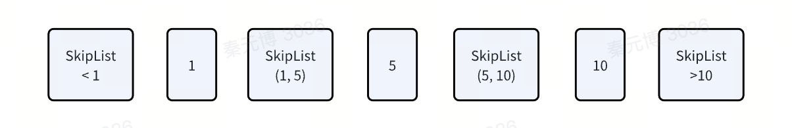

再看读写流程

- 读流程
	- 查 modify（理解为 delta）
		- 交叉遍历 insert list、update list，找到对应版本链，根据事务可见性规则判断可见版本即可
	- 查 pg_row（理解为 base）
	- 结合 pg_row、modify 计算某个版本的 KV 值（理解为 base + delta）
- 写流程
	- key 在 pg_row 中，从 update list 找到对应 Slot，追加新版本
	- key 不在 pg_row 中，从 insert list 找到对应 Slot，修改 skiplist，追加新版本

**至此，通过上述 Page 数据结构，实现了 page 无锁多核并发。**

### Disk Extent

Page 在磁盘文件上对应的结构叫 Extent，标识一块磁盘区域。写入 Page 时，按照写入的大小、当前文件被使用的空间来确定写入的位置（offset）、长度（size）并记录到 Extent。Extent 本身的地址（extent address）也会记录到一个索引空间中。

Extent 由 Page Header、Block Header、Extent Data 组成。变长。

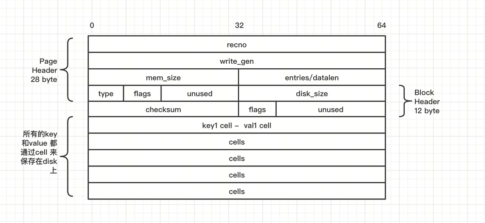

主要字段

- Page Header：保存 Page 的状态信息
	- 在磁盘头部存储列存起始记录编号（recno），快速定位列存数据地址
	- 非事务场景中维护 Page Generation（write_gen），如果数据恢复时发现重叠 Key Range，则据此确定最新 Page
	- 在内存中实际大小（mem_size），数据恢复时可以准确分配、管理内存
	- 一个 union 结构体（entries/datalen），entries 表示 Page 的 Cell 数量，datalen 表示溢出页溢出数据的长度（溢出页指 KV 超过一个 Page 存储上限，溢出，需要设计数据结构分开保存，本文不展开）
	- Page 类型（type），边去区分数据页、索引页后分别处理
	- flags：Page 状态或属性，例如是否压缩
	- version：版本号
- Block Header：保存 Extent 头信息
	- 在磁盘头部存储数据大小（data_size）、校验和（checksum），简化数据恢复过程，尤其是大数据量
	- 标志位（flags），预留 bit 用于扩展
		- 目前只有 WT_BLOCK_DATA_CKSUM 标识部分 checksum 还是对所有数据 checksum，有压缩时只校验前 64 Bytes
	- 填充字节（unused）牺牲空间换取对齐带来的效率、预留扩展性
- Extent Data：保存真正的数据，由多个 Cell 组成，单个 Cell 变长。Cell 保存 Leaf Page 对应的 K、V，或 Internal Page 指向的子 Page 地址。
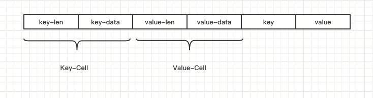

	- 元数据：单个 Cell 内，前 98 Bytes 保存元数据（也预留 bit 支持扩展），例如前缀压缩计数、时间戳、事务 ID、数据长度等
	- 压缩：支持多种压缩算法
	- 实践中需要考虑实际场景权衡 CPU vs. 存储空间/带宽（本文不展开）

**至此，磁盘上的数据紧凑排布，加上压缩（注意按实际场景选择是否压缩），能提高磁盘存储和 IO 效率。**

# 线程模型

## Interface

> 图 8: WiredTiger API 接口层次

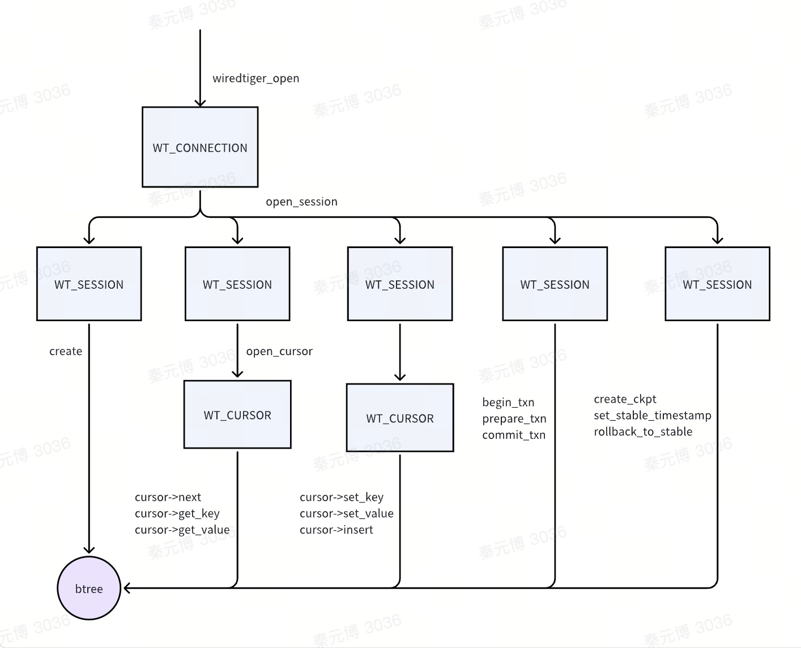

- WT_CONNECTION：管理数据库连接和全局资源，对应一个数据库实例，支持多线程共享
- **WT_SESSION**：
	- 封装操作的**线程和事务的上下文**，所有数据操作都在 WT_SESSION 上下文中执行，包括修改元数据、创建 cursor 访问数据、执行事务、创建 Checkpoint 等，通常不在线程间共享。
	- Mongo 线程和 WT_SESSION 一一对应。
- WT_CURSOR：提供数据访问/CRUD 接口

WiredTiger 使用 EBR/Hazard Pointer 实现无锁并发，由每个线程维护自己在用哪个 Page，有引用的话别人不能释放。检查“Page 被哪个线程引用”就是关键，需要拿到并发线程列表。

WT_SESSION 列表就承担这个角色，是无锁并发的关键。WT_SESSION 一般几千个，实践中和有锁相比性能非常好。

## Evict

BTree 保存全部或部分磁盘数据 Page，由前台线程换入、后台线程换出。Evicit 就是将内存中的 Page 换出。

传统数据库使用中心化的 BufferPoolManager 统一管理 Page，在内存则取出，不在内存则由 BufferPoolManager 换入，内存不足或 Page 很久未使用时由 BufferPoolManager 换出。BufferPoolManager 一般用 LRU + 哈希表 实现，有锁，有同步开销。

WiredTiger 则采用 Pointer Swizzling 技术实现，详见前文。

> 图 9: Eviction 线程模型

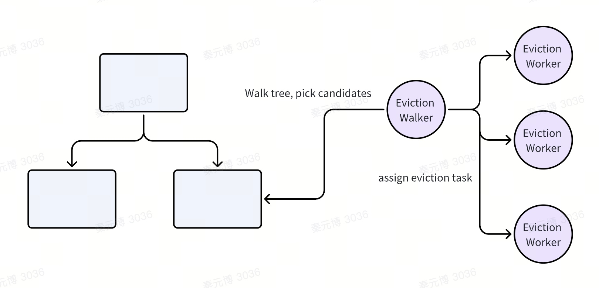

有若干个后台线程作为 Eviction Thread，其中一个作为 Eviction Walker，剩下的是 Eviction Worker。

Eviction Walker 会周期性的遍历 BTree，尝试找出需要被换出的Page，并分发给 Eviction Worker，做真正的Eviction。

- 被选中后表明需要释放内存，可以先独占 Page
- 有个全局 generation，Page 内则维护 read_gen
	- 读取 Page 时，更新 read_gen
	- 换出 Page 时，根据 read_gen 判断是否很久未访问
- 内存压力大的时候，前台线程也会主动 Evict 加速内存释放
- 换出激进程度由占用内存大小、脏页率、换出频率等综合决定，不展开

遍历 BTree 进行 Eviction 的方式下，不会释放一个具有活跃子节点的父节点，所以 Page 释放自底向上。释放具有活跃子节点的父节点也没有意义，因为很快也会被重新换入。

> 图 10: Page 释放流程

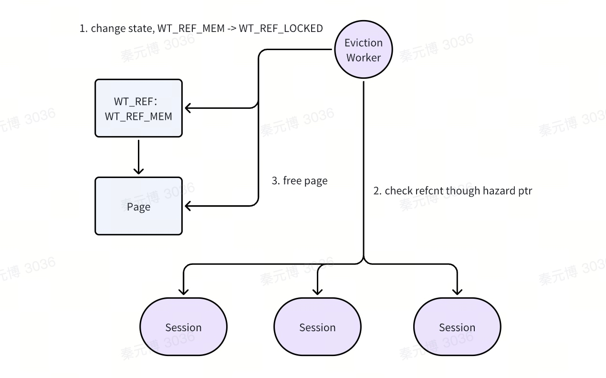

释放 Page 则使用 Hazard Pointer

> Hazard Pointer：一种基于指针标记的内存回收技术。
>
> 主要逻辑
>
> - 每个线程拿着自己的“白名单”（hazard pointer），记录线程自己正在使用、不能被释放的内存
>
> - 当其它线程要释放内存时，要挨个检查所有线程的“白名单”进行豁免，留下来的内存才敢释放
>
> Pros & Cons
>
> - 保证在线程安全的情况下无锁，性能非常好
>
> - 复杂

- 锁 WT_REF，避免后续有线程读写
- 检查 refcnt，为 0 则表明当前 Evict 线程独占访问
- 释放 Page
	- 对于没修改过的 Clean Page，直接释放内存就行
	- 对于有修改的 Dirty Page，则需要序列化后落盘，再释放内存。序列化落盘的过程叫 Reconcile。

## Reconcile

Page 变长，但是会对齐到某个具体的值，比如4K/8K/12K。每次持久化都分配新位置，不会覆盖写，否则可能存不下变长的 Page。持久化后，新的位置更新到 WT_REF 指针中，并等待父节点刷盘。

> 图 11: Reconcile 过程

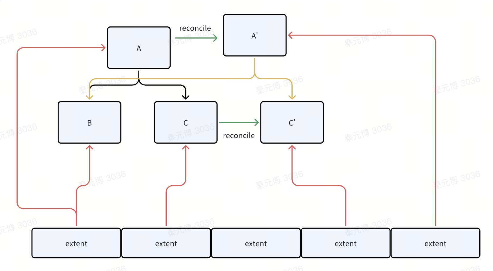

- 例如，修改 C 后，Reconcile 分配一段新地址存放 C'，再修改父节点中的磁盘地址，父节点再 Reconcile 形成 A'。

Reconcile 有两个触发时机：Evict Reconcile、Checkpoint Reconcile。

> 图 12: Evict Reconcile

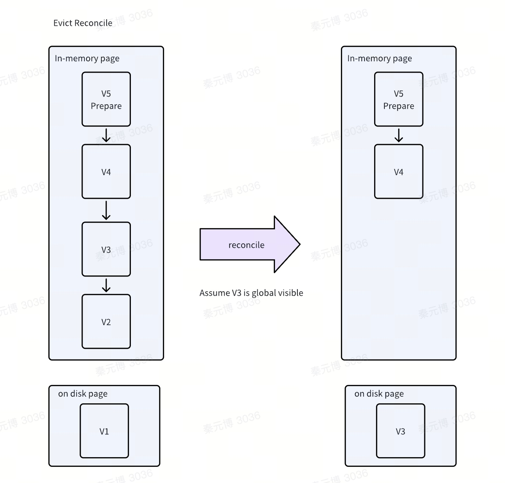

每次 Evict Reconcile 都对应内存中一次重整

- 将全局可见的版本落盘，且磁盘只保留一个版本
	- 假设 V3 全局可见，即任意事务读都最多只能读到 V3，读不到 V2、V1
	- V3 刷盘
- 基于盘上的 V3 构建新的 In-Memory Page，再拷贝内存中保留的 V4、V5 接上

> Reconcile 独占 BTree，可能成为瓶颈，所以 WiredTiger 更适合大内存/换入换出少的场景，不然 Reconcile 的开销大。

> 图 13: Checkpoint Reconcile

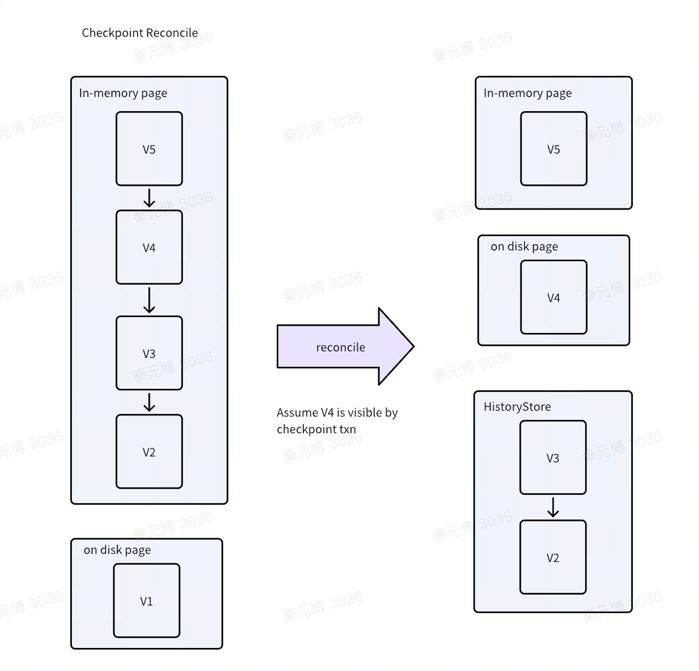

Checkpoint Reconcile 有所不同，刷盘的数据由 Checkpoint Snapshot 决定，最新版本会落盘，旧版本由于仍旧可能被其它事务使用，则保留到 HistoryStore 中，直到由读流程触发换入，再将 V。

HistoryStore 保存历史版本，也是独立 BTree，和上述 BTree 完全一样，本文不扩展。

## SMO

WiredTiger 的 SMO(Structure Modification Operation)只有 Split 没有 Merge，同时因为没限制内存 Page 大小，可以延迟 SMO，否则需要在前台写时先 SMO 再继续写流程，影响性能。

同时由于内存、磁盘 Page 绑定的，对于**关联了磁盘数据的 In-Memory Page**，需要先 Reconcile 再 Split，延后到 Reconcile 是合适的。

> 图 14: Page Split 流程

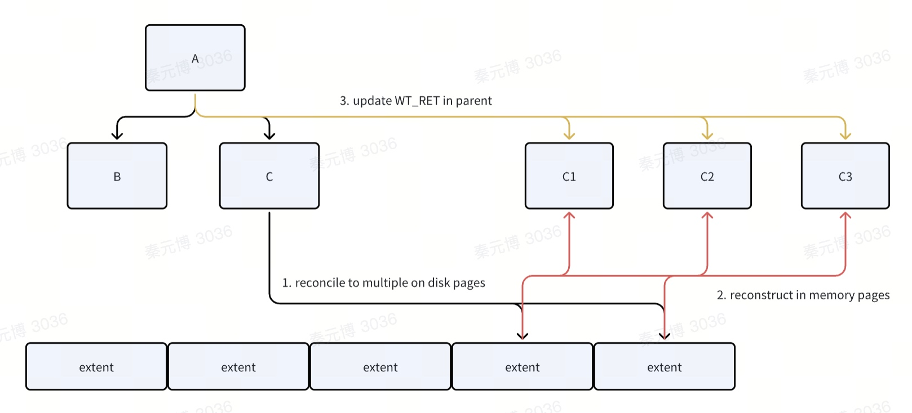

Reconcile Leaf Page 时会触发 Split

- 遍历 Page 中所有数据，当插入数据导致页面条目数超过阈值时，会 Split Page 并写入磁盘，此时内存中仍旧是比较大的 Page
	- 会根据阈值 `WT_INTERNAL_SPLIT_MIN_KEYS` 决定是否 Split
	- 若子页面数量不足阈值 `WT_SPLIT_DEEPEN_MIN_CREATE_CHILD_PAGES` 也可能选择调整树深度而非横向扩展
- 写入磁盘后，会将新写入的若干磁盘块地址记录到 modify 结构中，此时内存 Page 还未分裂
- 根据磁盘内容构建新的 In-Memory Page，并将新的内存/磁盘地址写入父节点，再递归向上原子地 Split Internal Page，过程详见上文。

此外，Evict 时也可能触发 Split。如果 Page 最后一截 skiplist 过大就直接分裂，不会影响当前 Page 的结构，可以优化最右插入，提高插入性能。

## Checkpoint

数据库持久化可以理解为维护：状态 + 操作日志。状态保证数据最终一致性，操作日志保证操作的原子性、可恢复性。

WiredTiger 只有 Redo Log 没有 Undo Log（操作日志），在提交事务后才会落盘数据（状态）。宕机/重启后可基于快照 + Redo Log 恢复。Checkpoint 通过将结构一致、具有快照语义的 BTree 落盘，来减少 Recover 时需要重放的 WAL 数量。

Checkpoint 的基本流程就是遍历 BTree，Reconcile 所有 Dirty Page。Checkpoint 根据快照选择需要落盘的数据，区别于 Evict，不会落盘所有数据。

> 图 15: Checkpoint Barrier


获取快照时，先写 Prepare Log Record 并上锁来构建 Barrier，保证在该 Log 前的事务一定能被快照读到，进而被持久化到盘上，在该 Log 后的事务则不会被快照读到，在后续 Recover 重放 Redo Log 时再恢复。以此保证 Recover 不重不漏。

落盘的 BTree 也需要保证正确，例如并发 Split、Checkpoint 则可能导致持久化错误的 BTree，需要避免。

Checkpoint 开始时，会通过 Evict Generation 等待所有并发 Evict 结束，然后修改 BTree 状态为 Sync（表明正在进行 Checkpoint），后续其它 Evict 发现有并发时会跳过。

> 图 16: Checkpoint 元信息保证原子性

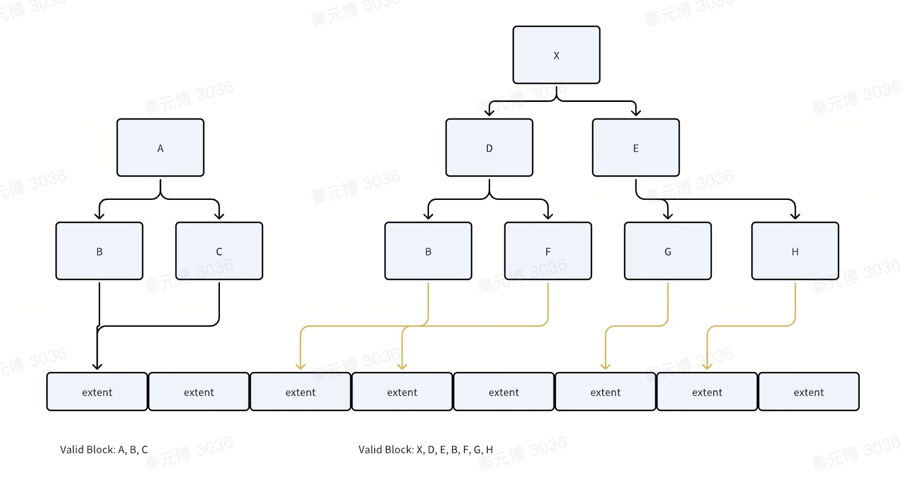

如果 Checkpoint 时宕机，会出现部分状态落盘、部分状态丢失，导致无法还原出正确的 BTree，WiredTiger 通过元信息 meta 来保证 Checkpoint 完整。

- 每次写 Checkpoint 结束时记录 valid block，结束时原子地更新到 meta 并持久化
- 读 Checkpoint 开始时查 meta，只会读到完整的 Checkpoint，宕机前落盘的 BTree Page 相当于都无效

# 应用

## 业界：MongoDB

类似地还有 LeanStore，可以自由探索。

# Reference

> [官网](https://source.wiredtiger.com/3.2.1/index.html)