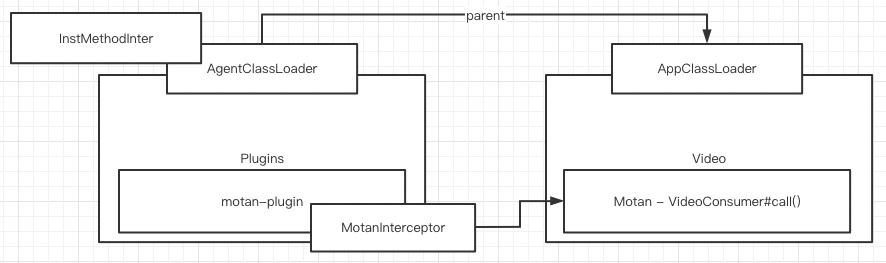

# Bytebuddy

[toc]

## Todos

* [ ] ByteBuddy ElementMatchers
* [ ] BootstrapInstrumentBoost
* [ ] AgentBuilder
* [ ] JDK Instrumentation
* [ ] JDK java.lang.Runtime
* [ ] JDK java.util.ServiceLoader
* [ ] ByteBuddy TypeDescription
* [ ] JDK ManagementFactory.getRuntimeMXBean()
* [ ] JDK URLClassLoader
* [ ] ByteBuddy MethodDelegation
* [ ] Skywalking InterceptorInstanceLoader.load()
* [ ] ByteBuddy SuperMethodCall
* [ ] JDK Class.forName() // Classloader appointment mechanism
	
## 类加载器


``` java
public class AgentClassLoader extends ClassLoader {

    static {
        /*
         * Try to solve the classloader dead lock. See https://github.com/apache/skywalking/pull/2016
         */
        registerAsParallelCapable();
    }
```



``` java

public class InterceptorInstanceLoader {

    private static ConcurrentHashMap<String, Object> INSTANCE_CACHE = new ConcurrentHashMap<String, Object>();
    private static ReentrantLock INSTANCE_LOAD_LOCK = new ReentrantLock();
    private static Map<ClassLoader, ClassLoader> EXTEND_PLUGIN_CLASSLOADERS = new HashMap<ClassLoader, ClassLoader>();

    /**
     * Load an instance of interceptor, and keep it singleton. Create {@link AgentClassLoader} for each
     * targetClassLoader, as an extend classloader. It can load interceptor classes from plugins, activations folders.
     *
     * @param className         the interceptor class, which is expected to be found
     * @param targetClassLoader the class loader for current application context
     * @param <T>               expected type
     * @return the type reference.
     */
    public static <T> T load(String className,
        ClassLoader targetClassLoader) throws IllegalAccessException, InstantiationException, ClassNotFoundException, AgentPackageNotFoundException {
        if (targetClassLoader == null) {
            targetClassLoader = InterceptorInstanceLoader.class.getClassLoader();
        }
        String instanceKey = className + "_OF_" + targetClassLoader.getClass()
                                                                   .getName() + "@" + Integer.toHexString(targetClassLoader
            .hashCode());
        Object inst = INSTANCE_CACHE.get(instanceKey);
        if (inst == null) {
            INSTANCE_LOAD_LOCK.lock();
            ClassLoader pluginLoader;
            try {
                pluginLoader = EXTEND_PLUGIN_CLASSLOADERS.get(targetClassLoader);
                if (pluginLoader == null) {
                    pluginLoader = new AgentClassLoader(targetClassLoader);
                    EXTEND_PLUGIN_CLASSLOADERS.put(targetClassLoader, pluginLoader);
                }
            } finally {
                INSTANCE_LOAD_LOCK.unlock();
            }
            inst = Class.forName(className, true, pluginLoader).newInstance();
            if (inst != null) {
                INSTANCE_CACHE.put(instanceKey, inst);
            }
        }

        return (T) inst;
    }
}

```

## 拦截器不用 method.invoke() 而用 callable.call()的原因

*method.invoke()* 调用原方法，但在 *intercept* 后原始的 *hello()* 被 *retransform* 为 *hello$original$YcDV0TRB()*，如果继续调 *method.invoke()* 会死循环，故改调 *callable.call()*

1. InstMethodsInter

	``` java
	/**
	 * The actual byte-buddy's interceptor to intercept class instance methods. In this class, it provide a bridge between
	 * byte-buddy and sky-walking plugin.
	 */
	public class InstMethodsInter {
	    private static final ILog LOGGER = LogManager.getLogger(InstMethodsInter.class);
	
	    /**
	     * An {@link InstanceMethodsAroundInterceptor} This name should only stay in {@link String}, the real {@link Class}
	     * type will trigger classloader failure. If you want to know more, please check on books about Classloader or
	     * Classloader appointment mechanism.
	     */
	    private InstanceMethodsAroundInterceptor interceptor;
	
	    /**
	     * @param instanceMethodsAroundInterceptorClassName class full name.
	     */
	    public InstMethodsInter(String instanceMethodsAroundInterceptorClassName, ClassLoader classLoader) {
	        try {
	            interceptor = InterceptorInstanceLoader.load(instanceMethodsAroundInterceptorClassName, classLoader);
	        } catch (Throwable t) {
	            throw new PluginException("Can't create InstanceMethodsAroundInterceptor.", t);
	        }
	    }
	
	    /**
	     * Intercept the target instance method.
	     *
	     * @param obj          target class instance.
	     * @param allArguments all method arguments
	     * @param method       method description.
	     * @param zuper        the origin call ref.
	     * @return the return value of target instance method.
	     * @throws Exception only throw exception because of zuper.call() or unexpected exception in sky-walking ( This is a
	     *                   bug, if anything triggers this condition ).
	     */
	    @RuntimeType
	    public Object intercept(@This Object obj, @AllArguments Object[] allArguments, @SuperCall Callable<?> zuper,
	        @Origin Method method) throws Throwable {
	        EnhancedInstance targetObject = (EnhancedInstance) obj;
	
	        MethodInterceptResult result = new MethodInterceptResult();
	        try {
	            interceptor.beforeMethod(targetObject, method, allArguments, method.getParameterTypes(), result);
	        } catch (Throwable t) {
	            LOGGER.error(t, "class[{}] before method[{}] intercept failure", obj.getClass(), method.getName());
	        }
	
	        Object ret = null;
	        try {
	            if (!result.isContinue()) {
	                ret = result._ret();
	            } else {
	                ret = zuper.call();
	            }
	        } catch (Throwable t) {
	            try {
	                interceptor.handleMethodException(targetObject, method, allArguments, method.getParameterTypes(), t);
	            } catch (Throwable t2) {
	                LOGGER.error(t2, "class[{}] handle method[{}] exception failure", obj.getClass(), method.getName());
	            }
	            throw t;
	        } finally {
	            try {
	                ret = interceptor.afterMethod(targetObject, method, allArguments, method.getParameterTypes(), ret);
	            } catch (Throwable t) {
	                LOGGER.error(t, "class[{}] after method[{}] intercept failure", obj.getClass(), method.getName());
	            }
	        }
	        return ret;
	    }
	}
	```

2. 拦截的目标类

	``` java
	package com.chamber.demo.swdemo;
	
	import org.springframework.web.bind.annotation.GetMapping;
	import org.springframework.web.bind.annotation.RestController;
	
	import java.text.SimpleDateFormat;
	import java.util.Date;
	
	@RestController
	public class HelloController {
	
	    @GetMapping
	    public String hello() {
	        return "Hello " + new SimpleDateFormat().format(new Date());
	    }
	
	}
	```

3. 拦截后的类

	``` java
	/*
	 * Decompiled with CFR 0.149.
	 * 
	 * Could not load the following classes:
	 *  com.chamber.demo.swdemo.HelloController
	 *  com.chamber.demo.swdemo.HelloController$auxiliary$FeEPDgRN
	 *  com.chamber.demo.swdemo.HelloController$auxiliary$kVMjqCeF
	 *  org.apache.skywalking.apm.agent.core.plugin.interceptor.enhance.ConstructorInter
	 *  org.apache.skywalking.apm.agent.core.plugin.interceptor.enhance.EnhancedInstance
	 *  org.apache.skywalking.apm.agent.core.plugin.interceptor.enhance.InstMethodsInter
	 *  org.springframework.web.bind.annotation.GetMapping
	 *  org.springframework.web.bind.annotation.RestController
	 */
	package com.chamber.demo.swdemo;
	
	import com.chamber.demo.swdemo.HelloController;
	import java.lang.reflect.Method;
	import java.text.SimpleDateFormat;
	import java.util.Date;
	import java.util.concurrent.Callable;
	import org.apache.skywalking.apm.agent.core.plugin.interceptor.enhance.ConstructorInter;
	import org.apache.skywalking.apm.agent.core.plugin.interceptor.enhance.EnhancedInstance;
	import org.apache.skywalking.apm.agent.core.plugin.interceptor.enhance.InstMethodsInter;
	import org.springframework.web.bind.annotation.GetMapping;
	import org.springframework.web.bind.annotation.RestController;
	
	@RestController
	public class HelloController
	implements EnhancedInstance {
	    private volatile Object _$EnhancedClassField_ws;
	    public static volatile /* synthetic */ InstMethodsInter delegate$if37tm1;
	    public static volatile /* synthetic */ InstMethodsInter delegate$1t3cda1;
	    public static volatile /* synthetic */ ConstructorInter delegate$crm8uu0;
	    private static final /* synthetic */ Method cachedValue$ZVdgPuuW$82in270;
	    public static volatile /* synthetic */ InstMethodsInter delegate$8l1q910;
	    public static volatile /* synthetic */ InstMethodsInter delegate$fr0hfj1;
	    public static volatile /* synthetic */ ConstructorInter delegate$3alu801;
	    private static final /* synthetic */ Method cachedValue$BzHKtG5T$82in270;
	
	    public HelloController() {
	        this(null);
	        delegate$3alu801.intercept((Object)this, new Object[0]);
	    }
	
	    private /* synthetic */ HelloController(auxiliary.FeEPDgRN feEPDgRN) {
	    }
	
	    @GetMapping
	    public String hello() {
	        return (String)delegate$8l1q910.intercept((Object)this, new Object[0], (Callable)new auxiliary.kVMjqCeF(this), cachedValue$BzHKtG5T$82in270);
	    }
	
	    private /* synthetic */ String hello$original$YcDV0TRB() {
	        return "Hello " + new SimpleDateFormat().format(new Date());
	    }
	
	    static {
	        ClassLoader.getSystemClassLoader().loadClass("org.apache.skywalking.apm.dependencies.net.bytebuddy.dynamic.Nexus").getMethod("initialize", Class.class, Integer.TYPE).invoke(null, HelloController.class, -311785084);
	        cachedValue$BzHKtG5T$82in270 = HelloController.class.getMethod("hello", new Class[0]);
	    }
	
	    final /* synthetic */ String hello$original$YcDV0TRB$accessor$BzHKtG5T() {
	        return this.hello$original$YcDV0TRB();
	    }
	}
	```


