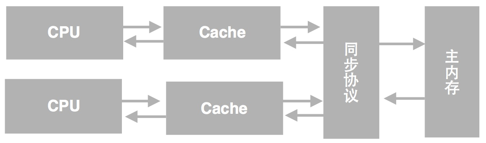
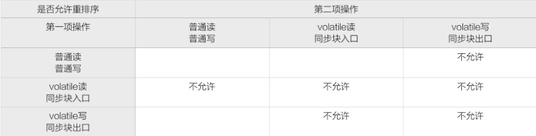
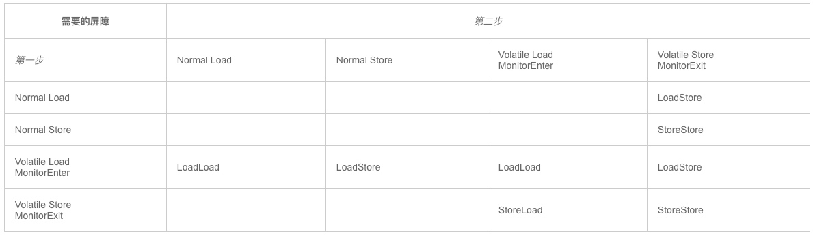

[toc]

# JVM内存模型

## 复现代码

``` java
 1 public class PossibleReordering {
 2 static int x = 0, y = 0;
 3 static int a = 0, b = 0;
 4 
 5 public static void main(String[] args) throws InterruptedException {
 6     Thread one = new Thread(new Runnable() {
 7         public void run() {
 8             a = 1;
 9             x = b;
10         }
11     });
12 
13     Thread other = new Thread(new Runnable() {
14         public void run() {
15             b = 1;
16             y = a;
17         }
18     });
19     one.start();other.start();
20     one.join();other.join();
21     System.out.println(“(” + x + “,” + y + “)”);
22 }

// 执行结果也可能是(0,0)
```

## 基本概念

### 内存可见性



* 缓存中的数据与主内存的数据并不是实时同步的
* 各CPU（或CPU核心）间缓存的数据也不是实时同步的

### Java内存模型

Happens-before的前后两个操作不会被重排序且后者对前者的内存可见。

* 程序次序法则
	* 线程中的每个动作A都happens-before于该线程中的每一个动作B，其中，在程序中，所有的动作B都能出现在A之后。
* 监视器锁法则
	* 对一个监视器锁的解锁 happens-before于每一个后续对同一监视器锁的加锁。
* volatile变量法则
	* 	对volatile域的写入操作happens-before于每一个后续对同一个域的读写操作。
* 线程启动法则
	* 	在一个线程里，对Thread.start的调用会happens-before于每个启动线程的动作。
* 线程终结法则
	* 	线程中的任何动作都happens-before于其他线程检测到这个线程已经终结、或者从Thread.join调用中成功返回，或Thread.isAlive返回false。
* 中断法则
	* 	一个线程调用另一个线程的interrupt happens-before于被中断的线程发现中断。
* 终结法则
	* 一个对象的构造函数的结束happens-before于这个对象finalizer的开始。
* 传递性
	* 	如果A happens-before于B，且B happens-before于C，则A happens-before于C

> Happens-before关系只是对Java内存模型的一种近似性的描述，关于更严谨的Java内存模型的定义和描述，请阅读JSR-133原文或Java语言规范章节17.4。

此外，Java内存模型对volatile和final的语义做了扩展。

* 对volatile语义的扩展保证了volatile变量在一些情况下不会重排序，volatile的64位变量double和long的读取和赋值操作都是原子的

	

* 对final语义的扩展保证一个对象的构建方法结束前，所有final成员变量都必须完成初始化（的前提是没有this引用溢出）

	* 构建方法内部的final成员变量的存储不能重排序
	* 假如final成员变量本身是一个引用的话，这个final成员变量可以引用到的一切存储操作，都不能与构建方法外的将当期构建对象赋值于多线程共享变量的存储操作重排序
	* 初始读取共享对象与初始读取该共享对象的final成员变量之间不能重排序

## 内存屏障

### 解决的问题

编译器和处理器必须同时遵守重排规则，在多核处理器上通常需要使用内存屏障指令来确保与顺序执行相同的一致性。

内存屏障仅仅与内存模型中“获取”、“释放”这些高层次概念有间接的关系。
内存屏障并不是“同步屏障”，内存屏障也与在一些垃圾回收机制中“写屏障（write barriers）”的概念无关。
内存屏障指令仅仅直接控制CPU与其缓存之间，CPU与其准备将数据写入主存或者写入等待读取、预测指令执行的缓冲中的写缓冲之间的相互操作。这些操作可能导致缓冲、主内存和其他处理器做进一步的交互。

### 定义

内存屏障(Memory Barrier)，又称内存栅栏，可以禁止特定类型处理器的重排序，从而让程序按我们预想的流程去执行。

内存屏障是一个CPU指令，基本上它是一条这样的指令：

* 不管什么指令都不能和这条Memory Barrier指令重排序，能保证特定操作的执行顺序
* 强制刷出各种CPU cache，会影响某些数据（或则是某条指令的执行结果）的内存可见性

### 种类

* LoadLoad

	> Load1,Loadload,Load2
	
	通常能执行预加载指令或/和支持乱序处理的处理器中需要显式声明Loadload屏障，因为在这些处理器中正在等待的加载指令能够绕过正在等待存储的指令。
	而对于总是能保证处理顺序的处理器上，设置该屏障相当于无操作。

* StoreStore

	> Store1，StoreStore，Store2
	
	通常情况下，如果处理器不能保证从写缓冲或/和缓存向其它处理器和主存中按顺序刷新数据，那么它需要使用StoreStore屏障。

* LoadStore

	> Load1; LoadStore; Store2
	
	
* StoreLoad

	> Store1; StoreLoad; Load2
	
	StoreLoad屏障可以防止一个后续的load指令 不正确的使用了Store1的数据，而不是另一个处理器在相同内存位置写入一个新数据。
	Storeload屏障在几乎所有的现代多处理器中都需要使用，但通常它的开销也是最昂贵的。部分原因是它们必须关闭通常的略过缓存直接从写缓冲区读取数据的机制。这可能通过让一个缓冲区进行充分刷新（flush）,以及其他延迟的方式来实现。

### Java volatile

JSR-133排序规则



Java内存模型中的volatile是基于Memory Barrier实现的：

* JMM会在写入这个字段之后插进一个Write-Barrier指令
* 并在读这个字段之前插入一个Read-Barrier指令

保证了

* 一个线程写入变量a后，任何线程访问该变量都会拿到最新值
* 在写入变量a之前的写入操作，其更新的数据对于其他线程也是可见的。因为Memory Barrier会刷出cache中的所有先前的写入


### 放置屏障的例子 // 困= =清醒了再看

1. volatile

	``` java
	class X {
	    int a, b;
	    volatile int v, u;
	
	    void f() {
	        int i, j;
	        i = a;// load a
	        j = b;// load b
	        i = v;// load v
	        // LoadLoad
	        j = u;// load u
	        // LoadStore
	        a = i;// store a
	        b = j;// store b
	        // StoreStore
	        v = i;// store v
	        // StoreStore
	        u = j;// store u
	        // StoreLoad
	        i = u;// load u
	        // LoadLoad
	        // LoadStore
	        j = b;// load b
	        a = i;// store a
	    }
	}
	```

2. 特殊的final字段规则在下列代码中需要一个StoreStore屏障

	```
	x.finalField = v; StoreStore; sharedRef = x;
	```


