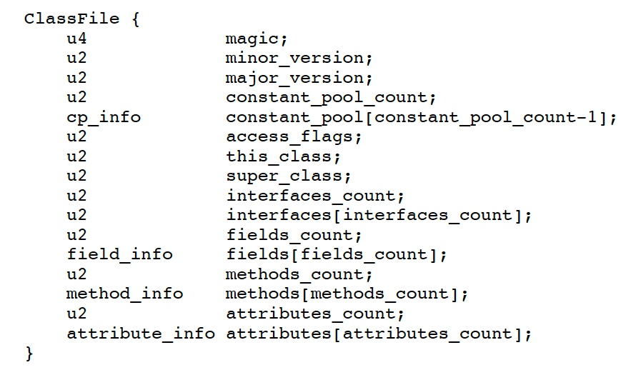
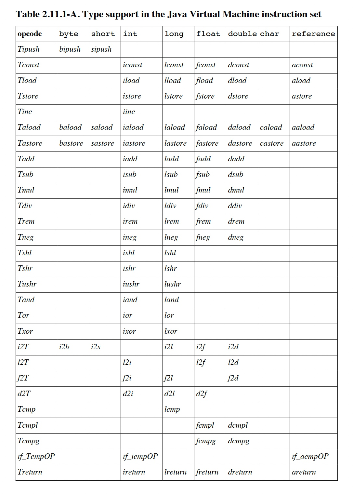
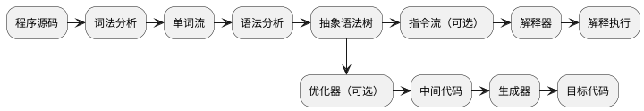
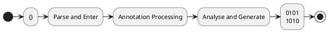
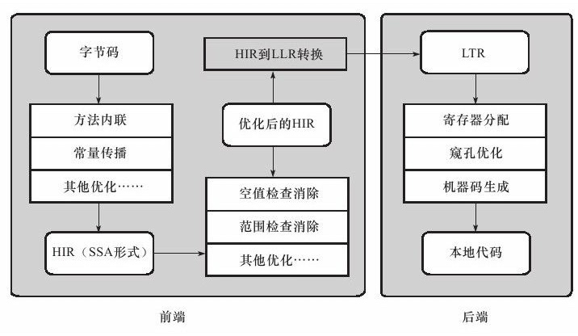
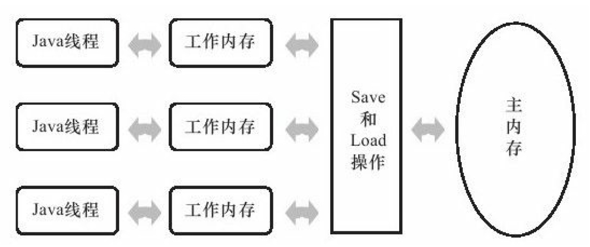

[toc]

# 虚拟机结构

1. Class File Format
2. Data Types
	* Primitive Data Types
		* numeric, boolean, returnAddress
	* Reference Types
		* class, array, interface
3. Runtime Data Areas(per jvm, per thread)
	* pc register
	* stacks
	* heap
	* method area
	* runtime constant pool
	* native method stacks
4. Frames
	* local variables
	* operand stacks
	* dynamic linking
	* normal method invocation completion
	* abrupt method invocation completion
5. Representation of Objects
6. Floating-Point Arithmetic
7. Special Methods
	* Instance Initialization Methods
	* Class Initialization Methods
	* Signature Polymorphic Methods
8. Exceptions
9. Instruction Set
	* load and store(aload, astore)
	* arithmetic(iadd, isub, imul, idiv, irem, ineg, ishl, ishr, ior, iand, ixor, iinc, dcmpg, ...)
	* type conversion(i2b, ...)
	* object creation and manipulation(new, newarray, getstatic, getfield, iaload, aaload, iastore, aastore, arraylength, instanceof, checkcase, ...)
	* operand stack management(pop, dup, swap, ...)
	* control transfer(ifeq, ifne, iflt, ifle, ifgt, ifge, ifnull, ifnonnull, if_icmpeq, if_icmpne, if_icmplt, if_icmpge, tableswitch, lookupswitch, goto, jsr_w, ret...)
	* method invocation and return(invokevirtual, invokeinterface, invokespecial, invokestatic, invokedynamic)
	* throw exception(athrow)
	* synchronization(monitorenter, monitorexit)
10. Class Libraries
	* reflection(java.lang.reflect, Class)
	* loading and creation of a class or interface(ClassLoader)
	* linking and initialization of a class or interface(同上)
	* security(java.security, SecurityManager)
	* multithreading(Thread)
	* weak references(java.lang.ref)
11. Public Design, Private Implementation

# Class 文件结构



工具：javap -v xxx.class, JBE, JClassLib

# 虚拟机执行子系统
## 字节码指令



### 加载和存储指令

将数据在栈帧中的局部变量表和操作数栈间传输

* 加载局部变量到操作栈
	* iload, iload_\<n\>, etc

* 从操作数栈保存数值到局部变量表
	* istore, istore_\<n\>, etc

* 加载常量到操作数栈
	* iconst_m1, iconst_\<i\>, etc

* 扩充局部变量表的访问索引的指令
	* wide

### 运算指令

对两个操作数栈上的值进行运算，并将结果重新存入操作栈顶。
分为整型数据（byte、short、char、boolean）、浮点型数据两类。
	
* 加法
	* iadd, ladd, fadd, dadd

* 减法
	* isub, lsub, fsub, dsub

* 乘法
	* imul, lmul, fmul, dmul
	
* 除法
	* idiv, ldiv, fdiv, ddiv
	
* 求余
	* irem, lrem, frem, drem

* 取反
	* ineg, lneg, fneg, dneg
	
* 位移
	* ishl, ishr, iushl, lshl, lshr, lushr

* 按位或
	* ior, lor

* 按位与
	* iand, land

* 按位异或
	* ixor, lxor
	
* 局部变量自增
	* iinc
	
* 比较
	* dcmpg, dcmpl, fcmpg, fcmpl, lcmp

### 类型转换指令
	
JVM直接支持如下数值的宽化类型转换(widening numeric conversions)

* int -> long, float, double
* long -> float, double
* float -> double
	
窄化类型需要显式指令（可能导致不同正负号等 <- 高位丢弃）

* i2b, i2c, i2s, l2i, f2i, f2l, d2i, d2l, d2f

浮点窄化为整数将遵循
	
* float = NaN -> int/long = 0
* 如果float并不是无穷大，浮点值使用IEEE 754的`向零取整`获得整数值v，若v在目标类型表示范围内，则结果为v，否则根据v的符号转换为能表示的最大/最小正数

### 对象创建与访问指令 

JVM的实例和数组的创建与操作使用了不同的字节码指令。

* 创建类实例
	* new
	
* 创建数组
	* newarray, anewarray, multianewarray
	
* 访问类字段（static）和实例字段（非static）
	* getfield, putfield, getstatic, putstatic

* 加载数组元素到操作数栈
	* baload, caload, saload, iaload, laload, faload, daload, aaload

* 存储操作数栈的值到数组元素中
	* bastore, castore, sastore, iastore, fastore, dastore, aastore
	
* 取数组长度
	* arraylength
	
* 检查类实例类型
	* instanceof, checkcast

### 操作数栈管理指令
	
* 将操作数栈顶的1~2个元素出栈
	* pop, pop2

* 复制栈顶数值并将值重新压入栈顶
	* dup, dup2, dup_x1, dup2_x1, dup_x2, dup2_x2

* 将栈顶数值互换
	* swap

### 控制转移指令
	
有/无条件从指定位置指令而不是控制转移指令的吓一跳指令继续执行程序（修改PC寄存器值）
	
* 条件分支
	* ifeg, iflt, ifle, ifne, ifgt, ifge, ifnull, ifnonnull, if_icmpeg, if_icmpne, if_icmplt, if_icmpgt, if_icmple, if_icmpge, if_acmpge, if_acmpeg, if_acmpne

* 复合条件分支
	* tableswitch, lookupswitch
	
* 无条件分支
	* goto, goto_w, jsr, jsr_w, ret

### 方法调用和返回指令

* 调用对象的实例方法
	* invokevirtual
	
* 调用接口方法（运行时搜索实现了接口方法的对象，找出合适的方法去调用）
	* invokeinterface

* 调用需要特殊处理的方法（如实例初始化方法、私有方法、父类方法）
	* invokespecial

* 调用类方法
	* invokestatic

* 运行时动态解析调用点限定符所引用的方法，并执行（分派逻辑由用户设定的引导方法决定）
	* invokedynamic
	
* 方法返回指令根据返回值区分
	* ireturen, lreturn, freturn, dreturn, areturn, return(used by void, init, clinit)

### 异常处理指令
	
* 显式抛出异常
	* athrow

### 同步指令
	
JVM支持方法级同步、方法内部一段指令序列同步，都由`管程(Monitor)`支持

* 方法级同步（隐式，即无需通过字节码指令来控制，实现在方法调用和返回中）
	
* 同步一段指令集序列（由`synchronized`语句块表示）
	* monitorenter, monitorexit

# 虚拟机类加载机制

JVM加载Class文件到内存，校验数据、转换解析、初始化，形成JVM直接可用的Java类型。

## 类加载时机

### 类的生命周期


	
1. 固定阶段
	
	
	
2. 解析阶段不固定
	
	* 支持动态绑定，可以`Initialization -> Resolution`
	* 只表示Resolution开始，不保证`进行、完成`

4. 引用分类
	* 主动引用：会触发初始化 *必须立即`Initialization`的情况（有且只有）*
		* `new, getstatic, putstatic, invokestatic`
			* Clazz clz = new Clazz()
			* get/set field(被final修饰、已在编译期放入常量池的静态字段除外)
			* Clazz.method()
		* java.lang.reflect
		* 初始化SubClass时`尚未初始化的SuperClass`
			* 接口在初始化时，不要求父接口全部完成初始化，只有在使用父接口（如引用接口中定义的常量）才会初始化
		* 启动VM时的`MainClass`
		* 使用JDK1.7的动态语言支持时，java.lang.invoke.MethodHandle实例最后的解析结果`REF_getStatic, REF_putStatic, REF_invokeStatic的方法句柄对应的尚未初始化的类`
	* 被动引用：不会触发初始化
		* 子类引用父类static字段，父类主动引用，子类被动引用，不触发子类初始化
		* 通过数组定义引用类，不会触发类初始化，但会由newarray指令触发VM直接生成的、直接继承于java.lang.Object的子类
		* 直接引用到定义常量的类，由于常量在编译阶段会存入常量池中，本质上没有直接引用到定义常量的类

## 类加载过程
### 加载

1. 职责
	* 通过`全限定名`获取类定义的二进制字节流
		* 从zip包中读取
			* eg: jar, ear, war, etc
		* 从网络读取
			* eg: Applet
		* 运行时计算生成（动态代理技术）
			* eg: java.lang.reflect.Proxy ProxyGenerator.generateProxyClass为特定接口生成`*$Proxy`的代理类的二进制字节流
		* 由其他文件生成
			* eg: jsp
		* 从DB读取
			* eg: 中间件服务器(SAP Netweaver，支持将程序安装到DB中来完成集群中代码的分发) 
	* 将其代表的`静态存储结构转化为方法区的运行时数据结构`
	* 在内存中生成代表这个类的java.lang.Object对象，作为方法区这个类的数据访问入口
	
2. 数组类的加载过程

	数组类本身由JVM直接创建，但Element Type由类加载器创建。
	
	* 如果数组的Component Type（数组去掉一个维度的类型）是引用类型，则地柜采用定义的加载过程，数组C将在加载该组件类型的类加载器的类名称空间上被标识（类与类加载器共同确定唯一性）
	* 如果Component Type不是引用类型，如int[]，JVM会把数组C标记为与引导类加载器相关联
	* 数组类的可见性与Component Type的可见性一致，如果Component Type不是引用类型，则数组类可见性默认public

### 验证

验证是连接阶段的第一步，目的是确保Class文件的字节流中包含的信息符合当前VM的要求，并不会危害VM自身的安全。

1. 文件格式验证
	
	该阶段基于基于二进制字节流进行，目的是保证输入的字节流能正确解析并存储于方法区内，格式上符合描述一个Java类的要求，验证通过后字节流才会进入内存的方法去中存储。
	
	* 是否以魔数 `0xCAFEBABE` 开通
	* 主、次版本号是否在当前VM处理范围内
	* 常量池中是否有不被支持的类型（tag）
	* 是否有索引值指向不存在或不符合类型的常量
	* CONSTANT_Utf8_info型常量是否符合UTF8编码
	* Class文件中各部分及文件本身是否有被删除或被附加的其他信息
	* ……

2. 元数据验证

	该阶段对字节码描述的信息进行语义分析，目的是保证其描述的信息符合Java语言规范的要求。
	
	* 是否有父类（除了java.lang.Object，都应有父类）
	* 父类是否继承了不允许继承的类（final）
	* 非抽象类是否实现了父类或接口要求实现的所有方法
	* 类中字段、方法是否与父类冲突（覆盖父类final字段、出现不符合规则的overload等）
	* ……

3. 字节码验证

	该阶段分析数据流和控制流，确定程序语义合法、符合逻辑。
	
	* 保证任意时刻操作数栈的数据类型与指令代码序列都能配合工作（如，操作栈放置int类型的数据，也要用int类型来加载入本地变量表）
	* 保证跳转指令不会跳转到方法体意外的字节码指令上
	* 保证方法体中的类型转换是有效的

	JDK1.6后，方法体的Code属性增加了`StackMapTable`属性，描述方法体中所有Basic Block（按照控制流拆分的代码块）开始时本地变量表和操作数栈应有的状态。在字节码验证阶段，就不需要根据程序退到状态的合法性，只需要检查StackMapTable属性中的记录是否合法即可，将字节码验证的类型退到转变为类型检查从而节省时间。

4. 符号引用验证

	发生在VM将符号引用转换为直接引用的时候，转化动作发生在连接的解析阶段，可以看做对类自身以外（常量池中各种符号引用）的信息进行匹配性校验，目的是确保解析动作能正常执行。
	解析失败会抛出`java.lang.IncompatibleClassChangeError`的子类，如`java.lang.IllegalAccessError、java.lang.NoSuchFieldError、java.lang.NoSuchMethodError`等。
	
	* 符号引用中通过字符串描述的全限定名是否能找到对应的类
	* 指定类中是否存在符合方法的字段描述符及简单名称描述的方法、字段
	* 符号引用中的类、字段、方法的访问性是否能被当前类访问
	* ……

	可通过`-Xverify:none`关闭大部分类验证措施，以缩短VM类加载时间。

### 准备

准备阶段是正式为类变量分配内存并设置初始值的阶段，这些变量所使用的内存都将在方法区中分配。

* 仅包含类变量（static），不包含实例变量
* 初始值通常指零值
	* 如`public static int value = 123;` 在准备阶段过后初始值为`0`
	* 将`123`赋值给`value`的`putstatic`指令是程序被编译后存放于类构造器`<cinit>()`方法中，在初始化阶段才会执行
* 如果类字段的字段属性表中存在`ConstantValue`属性，那在准备阶段变量`value`会被初始化为该属性置顶改动值
	* `public static final int value = 123;`编译时javac会为`value`生成`ConstantValue`属性，在准备阶段`value = 123`

### 解析

VM将常量池内的符号引用替换为直接引用的过程。

* 符号引用 Symbolic References
	
	以一组符号来描述引用的目标，符号可以是任何形式的字面量，只要使用时能无歧义地定位到目标即可。
	符号引用与VM实现的内存布局无关，引用的目标不一定已加载到内存中。
	VM实现的内存布局可以不同，但他们能接受的符号引用必须是一致的，因为符号引用的字面量形式明确定义在Java规范的Class文件中。

	* CONSTANT_Class_info, CONSTANT_Fieldref_info, CONSTANT_Methodref_info, etc
	
* 直接引用 Direct References

	可以直接指向目标的指针、相对偏移量或能间接定位到目标的句柄。
	规范只要求在执行用于操作符号引用的字节码指令前，先解析它们使用的符号引用。
	> anewarray, checkcast, getfield, getstatic, instanceof, invokedynamic, invokeinterface, invokespecial, invokestatic, invokevirtual, ldc, ldc_w, multianewarray, new, putfield, putstatic

	除了`invokedynamic`， VM可以缓存第一次解析的结果（在运行时常量池中记录直接引用，并把常量标识为已解析状态）以避免重复解析。
	`invokedynamic`目的是用于动态语言支持，对应的引用为`动态调用点限定符 Dynamic Call Site Specifier`，在实际运行指令时才解析。
	
1. 解析类或接口 CONSTANT_Class_info

	假设当前代码类为D，要把从未解析过的符号引用N解析为类或接口C的直接引用，步骤如下
	1. 如果C不是数组类型，VM会把代表N的全限定名传给D的类加载器去加载C。过程中，由于元数据验证、字节码验证的需要，可能触发其他相关类的加载，如加载父类或实现的接口
	2. 如果C是数组类型，并且Element Type为对象，即N的描述符类似`[Ljava/lang/Integer`，会按照上一点加载Element Type，再由VM生成一个代表此数组维度和元素的数组对象
	3. 如果上述步骤没异常，则C在VM中已经成为有效的类或接口，验证符号引用以确认D具备对C的访问权限，不满足则抛出`java.lang.IllegalAccessError`

2. 解析字段 CONSTANT_Fieldref_info
	
	先解析字段表内的`class_index`中索引的`CONSTANT_Class_info`符号引用，将字段所属的类或接口用C表示，后续步骤如下
	
	1. 如果C包含简单名称和字段描述符都与目标相匹配的字段，则返回该字段的直接引用，查找结束
	2. 否则，如果C中实现了接口，按照继承关系递归搜索各个接口和父接口，如果接口中包含简单名称和字段描述符都与目标相匹配的字段，则返回该字段的直接引用，查找结束
	3. 否则，如果C不是`java.lang.Object`，按照继承关系递归搜索父类，如果父类包含简单名称和字段描述符都与目标相匹配的字段，则返回该字段的直接引用，查找结束
	4. 否则，查找失败，抛出`java.lang.NoSuchFieldError`
	
	查找成功返回了引用，会验证该字段的权限。
	
	实际应用时，VM的编译器会更严格，如果有同名字段，编译器可能拒绝编译并提示`The field Sub.A is ambiguous`

3. 解析类方法 CONSTANT_Methodref_info
	
	先解析方法表内的`class_index`中索引的`CONSTANT_Methodref_info`符号引用，将类或接口用C表示，后续步骤如下
	1. 类方法和接口方法符号引用的常量类型是分开的，如果类方法表中发现`class_info`中索引的C是个接口，直接抛出`java.lang.IncompatibleClassChangeError`
	2. 查找类C，有则返回
	3. 递归查找类C的父类，有则返回
	4. 递归查找类C实现的接口列表及父接口，有则说明类C时抽象类，返回
	5. 查找失败，抛出`java.lang.NoSuchMethodError`

	验证权限。

3. 解析接口方法 CONSTANT_InterfaceMethodref_info
	
	1. 如果在接口方法表中发现`class_index`中索引的C是个类而不是接口，则抛出`java.lang.IncompatibleClassChangeError`
	2. 查找接口C，有则返回
	3. 递归查找接口C的父接口，直到`java.lang.Object`，有则返回
	4. 查找失败，抛出`java.lang.NoSuchMethodError`
	
	验证权限。
	
3. 解析方法类型 CONSTANT_MethodType_info
3. 解析方法句柄 CONSTANT_MethodHandle_info
3. 解析调用点限定符 CONSTANT_InvokeDynamic_info
	
### 初始化

初始化阶段是执行类构造器 `<cinit>()` 的过程。

* `<cinit>()` 由编译器自动收集类中**所有类变量的赋值动作**和静态语句块`static{}`中的语句合并产生，收集顺序由定义顺序决定，静态语句块中只能访问到之前定义的变量，定义在之后的变量可以赋值但不能访问。
* `<cinit>()` 方法与类的构造函数（实例构造器 `<init>` ）不同，不需要显式地调用父类构造器，虚拟机会保证先执行父类的的`<cinit>()`。因此`java.lang.Object`是第一个执行`<cinit>()`方法的类。
* 由于父类的`<cinit>()`先执行，意味着父类的`static{}`也先执行。
* `<cinit>()` 对于类或接口不是必需的，如果没有 `static{}` ，也没有对变量的赋值操作，则Compiler可以不生成类的`<cinit>()`。
* 接口中不能使用 `static{}` ，但仍然有变量初始化的赋值操作，因此接口也会生成 `<cinit>()` 。不同的是，执行接口的 `<cinit>()` 不需要先执行父接口的 `<cinit>()` ，只有当使用父接口中定义的变量时，父接口才会初始化。另外，接口的实现类在初始化时也不会执行接口的 `<cinit>()` 。
* 虚拟机会保证一个类的 `<cinit>()` 放在在多线程环境中被正确地加锁、同步，如果多个线程同时初始化一个类，只会有一个线程执行 `<cinit>()` ，其他线程都要阻塞等待，直到活动线程执行完毕。如果一个类的 `<cinit>()` 有耗时很长的操作，可能造成多个进程阻塞。

> 同一个类加载器下，一个类型只会初始化一次，其他线程唤醒 `<cinit>()` 后，不会再次进入 `<cinit>()` 。

## 类加载器

类加载阶段中 ***通过一个类的全限定名来获取描述此类的二进制字节流*** 放到JVM外部实现，以便让应用自己决定如何获取，实现该行为的代码模块称为 **类加载器**。

### 类与类加载器
Class文件和ClassLoader共同唯一决定一个类。

### 双亲委派模式
1. 启动类加载器 Bootstrap ClassLoader

	将`<JAVA_HOME>\lib`目录中或被-Xbootclasspath指定的路径中，被VM识别的（仅按文件名，如rt.jar）类库加载到VM内存中。

	启动类加载器无法被Java程序直接引用，用户如果要把加载请求委派给引导类加载器，直接用null代替即可。

2. 扩展类加载器 Extension ClassLoader

	由`sun.misc.Launcher$ExtClassLoader`实现，负责加载`<JAVA_HOME>\lib\ext`目录中的，或被`java.ext.dirs`系统变量指定的路径中的所有类库。

	开发者能直接使用。

3. 应用程序类加载器 Application ClassLoader
	
	由`sun.misc.Launcher$AppClassLoader`实现，是`ClassLoader.getSystemClassLoader()`的返回值，负责加载用户类路径上指定的类库。

	开发者能直接使用。
	
	1. Java设计者推荐使用 **双亲委派** 模式，Java类随着它的类加载器一起具备了带有优先级的层次关系。

		> `java.lang.Object`存放在`rt.jar`，无论哪个ClassLoader要加载，最终都委派给模型最顶端的BootstrapClassLoad而，因此Object在各种环境中都是同一个类，保证了Java体系中最基础的行为。
	
	2. **双亲委派** 模式工作过程
	
		```java
		    protected Class<?> loadClass(String name, boolean resolve)
	        throws ClassNotFoundException
	    {
	        synchronized (getClassLoadingLock(name)) {
	            // First, check if the class has already been loaded
	            Class<?> c = findLoadedClass(name);
	            if (c == null) {
	                long t0 = System.nanoTime();
	                try {
	                    if (parent != null) {
	                        c = parent.loadClass(name, false);
	                    } else {
	                        c = findBootstrapClassOrNull(name);
	                    }
	                } catch (ClassNotFoundException e) {
	                    // ClassNotFoundException thrown if class not found
	                    // from the non-null parent class loader
	                }
	
	                if (c == null) {
	                    // If still not found, then invoke findClass in order
	                    // to find the class.
	                    long t1 = System.nanoTime();
	                    c = findClass(name);
	
	                    // this is the defining class loader; record the stats
	                    sun.misc.PerfCounter.getParentDelegationTime().addTime(t1 - t0);
	                    sun.misc.PerfCounter.getFindClassTime().addElapsedTimeFrom(t1);
	                    sun.misc.PerfCounter.getFindClasses().increment();
	                }
	            }
	            if (resolve) {
	                resolveClass(c);
	            }
	            return c;
	        }
	    }
		```

### 破坏双亲委派模式

Bundle OSGi中的每个模块

1. findClass
2. java.lang.Thread contextClassLoader
3. 向程序动态性（HotSwap等）妥协的osgi r4.2模块化标准，osgi搜索类的顺序
	1. `*.java`开头的类委派给父类ClassLoader（符合双亲委派）
	2. 否则，将委派列表内的类委派给父类ClassLoader（符合双亲委派）
	3. 否则，将Import列表中的类委派给Export这个类的Bundle的ClassLoader
	4. 否则，查找当前Bundle的ClassPath，使用自己的ClassLoader
	5. 否则，查找类是否在自己的Fragment Bundle，如果在，则委派给Fragment Bundle的ClassLoader
	6. 否则，查找Dynamic Import列表的Bundle，委派给对应Bundle的ClassLoader
	7. 否则，类查找失败

# 虚拟机字节码执行引擎
## 运行时栈帧结构
### 局部变量表 Local Variable Table
规范没有明确指明一个Slot应占用的内存空间大小，只是导向性地说每个Slot都应该能存放boolean, byte, char, short, int, float, reference或returnAddress类型的数据，这8种类型都可以用32位或更小的物理内存来存放。

> JVM实现要求至少能通过reference实现
> 1. 直接/间接查找到对象在Heap中的数据起始地址索引
> 2. 直接/间接查找到对象在Method Aread中所属数据类型信息

对于64位，JVM会以高位对齐来分配两个连续的Slot，保证外观上与32位VM一致。

Java中明确的64位数据类型只有long, double（reference可能为32或64位），这种把long/double分割存储的做法与**long和double的非原子性协定**中一次把long和double读写分割为两次32位读写的做法类似。
不过，由于局部变量表建立在线程堆栈上，是私有数据，无论读写两个连续的Slot是否为原子操作，都不会引起数据安全问题。

JVM通过**索引定位**的方式使用局部变量表，范围从**0~最大slot数**

* 访问32位，索引n代表使用 **nth slot**
* 访问64位，索引n代表使用 **nth slot, (n+1)th slot**

对于相邻的共同存放一个64位数据的两个slot，不允许以任何方式单独访问其中的某一个，JVM要求如果遇到这种字节码序列，应该在**类加载的校验阶段**抛出异常。

执行实例方法时（非static），**0th slot**默认用于传递对象实例的引用，方法中可以通过**this**访问。
其余参数按参数列表顺序排列，再根据方法体内部定义的变量顺序和作用于分配其余slot。

为了节省Stack Frame空间，Local Variable Table中的slot可以重用。
如果当前字节码PC计数器的值已经超出某个变量的作用域，那这个变量对应的slot可以交给其他变量使用。
复用slot的副作用

* 会直接影响系统gc（slot对前一变量的引用导致gc roots能找到不用的变量）
* 本地变量没有初始化阶段，必须赋初值才能使用


### 操作数栈 Operand Stack

* LIFO
* 元素数据类型必须与字节码指令的序列严格匹配
* 概念模型中两个Stack Frame完全互相独立，但大多数JVM实现里会优化处理，令下面的Stack Frame的**部分操作数栈**与上面的Stack Frame的**部分局部变量表**重叠，在进行方法调用时可以共用一部分数据，无需进行额外的参数复制传递。


### 动态连接

每个Stack Frame都包含一个指向运行时常量池中该Stack Frame所属方法的引用，持有该引用是为了支持方法调用过程中的动态连接（Dynamic Linking）。

字节码中方法调用指令就以Constant Pool中指向方法的符号引用作为参数

* 静态解析：在类加载阶段或第一次使用符号引用的时候就转化为直接引用
* 动态解析：在每次运行期间转化为直接引用

### 方法返回地址

退出方法的两种方式

* 正常完成出口（Normal Method Invocation Completion）
	* 执行引擎遇到任意一个方法返回的字节码指令，返回值和返回值类型将根据方法返回指令来决定
	* **调用者的PC计数器值**可作为返回地址，Stack Frame中很可能会保存该值
* 异常完成出口（Abrupt Method Invocation Completion）
	* 方法体内没处理的异常
	* **通过异常处理表确定**返回地址，Stack Frame一般不保存

无论怎么退出，都需要返回**方法被调用的位置**继续执行，也可能需要**在Stack Frame中保存信息用来帮助恢复上层方法的执行状态**，过程实际等同于**把Current Frame Stack出栈**。

可能执行的操作

* 恢复上传方法的局部变量表和操作数栈
* 返回值压入调用者Stack Frame的操作数栈中
* 调整PC计数器的值以指向方法调用指令后面的一条指令等

### 附加信息

调试信息等，完全取决于具体JVM实现。

## 方法调用

方法调用不等于方法执行，只用于确定被调用方法的版本。
Class文件的**编译过程**不包含传统编译中的连接步骤，一切方法调用在Class文件里面**存储的只是符号引用，而不是方法实际运行时内存布局中的入口地址（相当于直接引用）**。

### 解析 Resolution

所有方法调用的目标方法在Class文件中都是一个常量池中的符号引用，类加载的解析阶段，会将其中一部分符号引用转换为直接饮用，前提是方法**编译期可知，运行期不可变**，即不能通过继承或别的方式重写其他版本。

* 虚方法
	* 静态方法：与类型直接关联 **invokestatic**
	* 私有方法：外部不可访问 **invokespecial**
	* 实例构造器 **invokespecial**
	* 父类方法 **invokespecial**
	* final方法：无法被覆盖，没有其他版本 **invokevirtual**
* 非虚方法
	* 其他 **invokevirtual, invokeinterface, invokedynamic**

	> invokedynamic 先在运行时动态解析出调用点限定符所引用的方法，在执行该方法。**分派逻辑**没固化在JVM内部，而由用户设定的引导方法决定。

### 分派 Dispatch

解析调用一定是静态的过程，在编译期就完全确定，在类装载的解析阶段就会将**符号引用 -> 直接引用**。
分派调用（Dispatch）则可能是静态的或动态的，根据分派依据的宗量数可分为单分派和多分派，组合后共4种分派组合情况。

#### 静态分派
	
1. 定义

	所有依赖静态类型来定位方法执行版本的分派动作。

2. 静态类型和实际类型

	* 静态类型 Static Type
		* 也叫外观类型 Apparent Type
		* 静态类型的变化只在使用时发生，变量本身的静态类型不会变，并且最终的静态类型在编译期是可知的，如`obj.sayHello((Man) man);`
	* 实际类型 Actual Type
		* 实际类型的最终结果再运行期才可知，编译器在编译时并不知道，如`Human man = new Man();`

3. 应用

	典型应用是方法重载。

	JVM的编译器javac根据参数的静态类型（而非实际类型）决定重载版本（静态类型在编译期可知），最终选择了`sayHello(Human)`作为调用目标，并将方法的符号引用写到invokevirtual指令的参数中。
	
	另外，编译器只能确定**一个更加合适的**方法重载版本，而**不是唯一的**方法重载版本。
	原因是字面量不需要定义，所以字面量没有显式的静态类型，只能通过语言上的规则取理解和推断，导致实际重载的版本不确定。
	重载中选择最合适方法的过程，可以参考Java语言规范的Chapter 15.12.2.5 Choosing the Most Specific Method

	参考示例`Overload.class`。


#### 动态分派

invokevirtual指令在运行时的解析过程

1. 找到操作数栈顶的第一个元素指向的实际类型，记作C（Override的本质：运行期确定接受者的实际类型）
2. 如果C中找到与常量中描述符和简单名称都相符的方法，则校验访问权限
	1. 通过则返回这个方法的直接引用，结束查找
	2. 不通过则返回`java.lang.IllegalAccessError`
3. 否则，按照继承关系从下往上依次对C的各个父类进行`步骤2`的搜索、验证过程
4. 始终没找到则返回`java.lang.AbstractMethodError`

#### 单分派与多分派

Java至今是一门**静态多分派，动态单分派**的语言。

1. 宗量
	方法的接收者、方法的参数
2. 单分派与多分派定义
	* 单分派：根据一个宗量选择目标方法
	* 多分派：根据多个宗量选择目标方法

#### 虚拟机动态分派的实现

由于动态分派非常频繁，而选择过程需要运行时在类的方法元数据中搜索合适的目标方法，因此JVM实现出于性能考虑，会在类的Method Area中建立一个虚方法表Virtual Method Table（invokeinterface也会用到接口方法表Interface Method Table），使用虚方法表的索引代替元数据查找以提高性能。

如果某个方法在子类中没有被重写，那子类的虚方法表中的地址入口和父类相同方法的地址入口一致，都指向父类的实现入口。

为了程序实现方便，相同签名的方法在父类、子类的虚方法表中应当具有一样的索引序号。当变换类型时，只需要变更查找的方法表就可以按索引转换出入口地址。

方法表一般在类加载的**连接阶段**进行初始化，准备了类的变量初始值后，VM会初始化方法表。

除了上述**稳定优化**手段，VM在条件允许时，还会使用**内联缓存（Inline Cache）**和基于“类型继承关系分析”（Class Hierarchy Analysis）技术的**守护内联（Guarded Inlining）**两种**非稳定优化**手段来提高性能。


## 动态类型语言支持

JDK 7实现Dynamically Typed Language

### 动态类型语言
1. 特征

	类型检查的主体过程在运行期，而非编译期。
	
	以 `obj.println("hello world")` 为例
	
	* Java在编译期就生成了方法的完整符号引用，作为方法调用指令的参数存储到Class文件。符号引用包含了方法定义在哪个具体类型中、方法的名字、参数顺序、参数类型、方法返回值等，虚拟机可以通过这个符号引用翻译出方法的直接引用。

		```
		invokevirtual #4; // Method java/io/PrintStream.println:(Ljava/lang/String;)V
		```	
	* ECMAScript等动态语言中，变量obj本身没有类型，变量obj的值才有类型，编译时最多只能确定方法名称、参数、返回值等，而不会确定方法所在的具体类型（即方法接收者不固定）。即，**变量无类型而变量值有类型。**

### JDK1.7支持动态类型

JDK1.7之前只有4条方法调用指令

* invokevirtual
* invokespecial
* invokestatic
* invokeinterface

但是第一个参数都是被调用方法的符号引用，如果要在JVM上实现动态类型语言，就需要**编译时留占位符，运行时动态生成字节码实现具体类型到占位符类的适配**，会**增加复杂度、带来额外性能或内存开销**。

JDK1.7（JSR-292）提供新指令**invokedynamic**及`java.lang.invoke`包。

### MethodHandle和Reflection的区别

MethodHandle设计成可服务于所有JVM语言，Reflection设计成服务于Java。

* Reflection模拟java代码层次的方法调用，MethodHandle模拟字节码层次的方法调用
	* MethodHandles.lookup中的 `findStatic(), findVirtual(), findSpecial()` 对应`invokestatic, invokevirtual & invokeinterface, invokespecial` 
* `java.lang.reflect.Method` 比 `java.lang.invoke.MethodHandle` 对象包含更多信息
	* `Method` 重量级，是方法在Java的全面映像，包括方法签名、描述符、方法属性表中个属性的Java端表示方式、执行权限等运行期信息
	* `MethodHandle` 轻量级，仅仅包含与执行方法相关的信息
* `MethodHandle` 模拟字节码的方法指令调用，理论上VM在这方面的优化（如，方法内联）也可以去支持

### invokedynamic

使用INDY等工具生成带有invokedynamic指令的Java代码。

## 基于栈的字节码解释执行引擎

### 解释执行



### 基于栈的指令集与基于寄存器的指令集

1. 基于栈的指令集架构 Instruction Set Architecture

	Javac输出的指令流基本上是**基于栈的指令集架构**，指令大部分是**零地址指令**，依赖操作数栈进行工作。
	
	```
	计算 `1 + 1`
	
	iconst_1 // 压栈
	iconst_1 // 压栈
	iadd // 出栈、相加、结果放回栈顶
	istore_0 // 栈顶值放到局部变量表的slot 0
	```
	
	优点

	* 可移植
		* 可以由VM自行决定把访问频繁的数据（程序计数器、栈顶缓存等）放到寄存器中以获取良好性能，实现简单，用户程序不直接使用寄存器
	* 代码相对紧凑
		* 字节码中每个字节对应一条指令，而多地址指令集中还需要存放参数
	* 编译器实现简单
		* 不需考虑空间分配，都在栈上操作

	缺点
	
	* 执行速度慢
		* 指令数量相对较多
		* 栈实现在内存中，频繁出栈、入栈意味着频繁的内存访问，相对处理器来说，内存是执行速度的瓶颈
	
2. 基于寄存器的指令集架构

	x86是**基于寄存器的指令集架构**，指令大部分是**二地址指令**，依赖寄存器进行工作。

	```
	计算 `1 + 1`
	
	mov eax, 1 // EAX寄存器值设为1
	add eax, 1 // add执行将值加1，结果保存在EAX寄存器中
	```

### 基于栈的解释器执行过程

参考javap产生的字节码指令。


# 类加载及执行子系统的案例

## 案例分析

### Tomcat 正统的类加载器架构

1. Web服务要解决的问题

	* 部署在同一服务器上的两个Web App所使用的Java类库可以相互隔离
	* 部署在同一服务器上的两个Web App所使用的Java类库可以相互共享
		* 共享需要加载到内存的类库，避免VM的方法区过度膨胀
	* 服务器需要尽可能保证自身的安全不受部署的Web App影响
		* 主流Java Web服务器本身也用Java语言是休闲，也有类库依赖问题，应该与Java App类库相互独立
	* 支持JSP应用的Web服务器，大多都需要支持HotSwap功能
		* 主流Web服务器支持JSP生成类的热替换

2. 结论

	* Web服务器需要**多个ClassPath**

3. Tomcat的用户类库结构和类加载器
	
	目录结构
	
	* `/common` 
		* Tomcat和所有App共享
	* `/server`
		* Tomcat独享
	* `/shared`
		* 所有App共享
	* `/WebApp/WEB-INF`
		* 单个App独享

	类加载器（经典的双亲委派模型）

	``` plantuml
	@startuml
	
	partition JVM {
	(*) --> "Bootstrap ClassLoader"
	--> "Extension ClassLoader"
	--> "Application ClassLoader"
	}
	
	partition Tomcat {
	--> "Common ClassLoader"
	note right: /common/*

	"Common ClassLoader" --> "Catalina ClassLoader"
	note right: /server/*

	"Common ClassLoader" --> "Shared ClassLoader"
	note right: /shared/*
	"Shared ClassLoader" --> "WebApp ClassLoader"
	note right: /WebApp/WEB-INF/*
	}
	
	"WebApp ClassLoader" --> "Jasper ClassLoader"
	note right: 一个*.jsp对应一个Jsp类加载器
	
	@enduml
	```
	
	Tomcat 6.x只有指定了 `tomcat/conf/catalina.properties` 的 `server.loader` 和 `share.loader` 才会真正建立 `CatalinaClassLoader` 和 `SharedClassLoader` 实例，否则会用 `CommonClassLoader` 实例代替。
	默认不设置，所以Tomcat 6.x将 `/common, /server, /shared` 合并为 `/lib` ，相当于以前 `/common` 中类库的作用，目的是简化大多数部署场景。

### OSGI 灵活的类加载器架构

OSGI (Open Service Gateway initiative) 基于Java语言的动态模块化规范

1. 特性

	**只有规则，没有固定的委派关系**
	
	* `Bundle（OSGi模块）` 和Java类库一样以 `JAR` 封装，内部存储 `Java Package` 和 `Class`
	* `Bundle` 可以通过 `Import-Package` 声明依赖的 `Java Package` 
	* `Bundle` 可以通过 `Export-Package` 声明允许导出的 `Java Package`
	* `Bundle` 间的依赖是平级模块间的依赖
	* 可以精确控制类库可见性（Bundle里的Package只有Export过才能被外界访问）
	* 基于OSGi的程序**可能**可以实现模块级的热插拔

2. 类加载时可能的查找规则

	**运行时才能确定的网状结构** （麻蛋DAG）

	* 以 `java.*` 开头的类，委派给父类加载器加载
	* 否则，委派列表名单内的类，委派给父类加载器加载
	* 否则，Import列表中的类，委派给Export这个类的Bundle的类加载器加载
	* 否则，查找当前Bundle的Classpath，使用自己的类加载器加载
	* 否则，查找是否在自己的Fragment Bundle中，如果是，委派给Fragment Bundle的类加载器加载
	* 否则，查找Dynamic Import列表的Bundle，委派给对应Bundle的类加载器加载
	* 否则，类查找失败

### 字节码生成技术与动态代理的实现
	
**javac源码 langtools/src/share/classe/com/sun/tools/javac**

### Retrotranslator 跨越JDK版本

1. JDK功能升级

	* 编译器层面
		* 自动装箱拆箱实际是编译器在初中使用包装对象的地方自动插入 `Integer.valueOf()` 等
		* 变长参数在编译后自动转化成数组来完成参数传递
		* 泛型的信息在编译阶段擦除（元数据中仍旧保留）
	* 对Java API的代码增强
		* java.util.Collections, java.util.concurrent
	* 字节码层面
		* 增加invokedynamic支持动态语言
	* VM层面
		* JSR-133等定义的JMM、CMS

2. Retrotranslator模拟范围

	* 编译器层面
	* 对Java API的代码增强

# 早期（编译期）优化

类型

* 前端编译器：javac, ECJ
* JIT编译器：HotSpot VM的C1、C2
* AOT编译器：GNU Compiler for the Java, Excelsior JET

作用

* 前端编译器：优化程序编码
* 运行期编译器：优化程序运行

## Javac编译器

> JDK_SRC_HOME/langtools/src/share/classes/com/sun/tools/javac

编译过程



```
initProcessingAnnotations{processors}; // 准备过程：初始化插入式注解处理器

// These method calls must be chained to avoid memory leaks
delegateCompiler =
	processAnnotations( // 2 执行注解处理
		enterTrees(stopIfError(CompileState.PARSE, // 1.2 输入到符号表
			parseFiles(sourceFileeObjects))), // 1.1 词法分析、语法分析
		classnames);
		
delegateCompiler.compile2(); // 3. 分析及字节码生成

	case BY_TODO:
		while (!todo.isEmpty())
			generate(desugar(flow(attribute(todo.remove())))); // 3.4 生成字节码 3.3 解语法糖 3.2 数据流分析 3.1 标注
		break;
```

### 解析与填充符号表
#### 词法、语法分析

词法分析: 源代码字符 -> 标记集合

> 标记（Token）：编译过程的最小元素，关键字、变量名、字面量、运算符等，Javac中由`com.sun.tools.javac.parser.Scanner`实现

#### 填充符号表


### 插入式注解处理器的注解处理过程


### 分析与字节码生成过程

# 晚期（执行期）优化

## HotSpot的JIT

### 解释器与编译器

1. 分层编译
	* 0th，程序解释执行，解释器不开启性能监控功能（Profiling）
	* 1st，为C1编译，将字节码编译为本地代码，进行简单、可靠的优化，如有必要将加入性能监控的逻辑
	* 2nd，也称为C2编译，也是将字节码编译为本地代码，但是会启用一些编译
耗时较长的优化，甚至会根据性能监控信息进行一些不可靠的激进优化

### 编译对象与触发条件

1. 热点代码

	* 被多次调用的方法
	* 被多次执行的循环体

	以整个方法作为编译对象，发生在方法执行过程中，也称为栈上替换（On Stack Replacement）

2. 热点探测 Hot Spot Detection

	* 基于采样的热点探测 Sample Based Hot Spot Detection
		* 周期性地检查各线程的栈顶，认为经常出现在栈顶的方法是热点
		* 优点：简单、高效、容易获取调用关系（展开调用堆栈）
		* 缺点：难以精确地确认方法热度，容易受到线程阻塞等扰乱
	* 基于计数器的热点探测 Counter Based Hot Spot Detection
		* JVM为每个方法（甚至代码块）建立计数器，统计方法的执行次数
		* 优点：统计结果更加精确、严谨
		* 缺点：复杂，不能直接获取方法的调用关系

3. HotSpot JVM
	
	采用基于计数器的热点探测，为每个方法准备两类计数器
	
#### 方法调用计数器 Invocation Counter

1. 默认阈值
	* Client 1500（默认）
	* Server 10,000（默认）

2. 流程	

	``` plantuml
	start
	:Java方法入口;
	if(exist compiled version) then (是)
		:执行本地代码compiled version;
	else (否)
		:方法调用计数器++;
		if((方法调用计数 + 回边计数) > 阈值) then (是)
			:向编译器提交编译请求;
		endif
		:以解释方式继续执行方法;
	endif
	:Java方法返回;
	end
	```

4. 计数器热度的衰减 Counter Decay
	
	不是统计方法被调用的绝对次数（不然只要运行时间够长，所有方法都会被编译），而是统计相对执行频率，即一段时间内方法被调用的次数。
	当超过一定的时间限度，方法的调用次数仍然不足以让他提交给JIT，则方法的调用计数器就会被减少一半，这个过程称为方法调用计数器热度的衰减，这段时间称为此方法统计的半衰期 Counter Half Life Time。
	
#### 回边计数器 Back Edge Counter

1. 回边 Back Edge
	
	控制流向后跳转的指令

2. 回边计数器阈值计算公式
	
	* Client

		`方法调用计数器阈值 * OSR比率 / 100`
		
		OSR比率默认933，Client回边计数器阈值默认13995

	* Server
		
		`方法调用计数器阈值 * (OSR - 解释器监控比率） / 100`

		OSR默认140，解释器监控比率默认33，Server回边计数器阈值默认10700
		
3. 流程	

	``` plantuml
	start
	:遇到回边指令;
	if(exist compiled version) then (是)
		:执行本地代码compiled version;
	else (否)
		:回边计数器++;
		if((方法调用计数 + 回边计数) > 阈值) then (是)
			:向编译器提交OSR编译请求;
			:调整回边计数器值;
		endif
		:以解释方式继续执行方法;
	endif
	:Java方法返回;
	end
	```
	
4. 其他
	
	没有计数热度衰减，回边计数器统计的就是该方法循环执行的绝对次数，当回边计数器溢出时，会把方法计数器的值也调整到溢出状态，在下次再进入方法时就会执行标准编译过程。
	空循环实际是跳转到自己的过程，不算控制流向后跳转，也就不会被回边计数器统计。
	

### 编译过程

#### Client Compiler



1. 字节码 -> HIR（平台独立的前端）

	HIR, High-Level Intermediate Representation

	* 字节码基础优化
		* 方法内联
		* 常量传播等

	* 字节码 -> HIR 
	
		HIR使用静态单分配(Static Single Assignment, SSA)代表代码值。（？？？）

2. HIR -> LIR（平台相关的后端）

	LIR, Low-Level Intermediate Representation
	
	* HIR基础优化
		* 控制检查消除
		* 范围检查消除等
	* HIR -> LIR

3. LIR -> 机器码（平台相关的后端）

	LSRA, Linear Scan Register Allocation, 线性扫描算法
	
	* 用LSRA在LIR上分配寄存器
	* 在LIR上做窥孔优化（Peephole）
	* 产生机器码

#### Server Compiler

充分优化过的高级编译器，几乎能达到GNU C++编译器使用-O2参数时的优化强度，它会执行所有经典的优化动作，如无用代码消除（Dead Code Elimination）、循环展开（Loop Unrolling）、循环表达式外提（Loop Expression Hoisting）、消除公共子表达式（Common Subexpression Elimination）、常量传播（ConstantPropagation）、基本块重排序（Basic Block Reordering）等，还会实施一些与Java语言特性密切相关的优化技术，如范围检查消除（RangeCheck Elimination）、空值检查消除（Null CheckElimination，不过并非所有的空值检查消除都是依赖编译器优化的，有一些是在代码运行过程中自动优化了）等。另外，还可能根据解释器或Client Compiler提供的性能监控信息，进行一些不稳定的激进优化，如守护内联（Guarded Inlining）、分支频率预测（Branch Frequency Prediction）等。

### 查看及分析即时编译结果

 // TODO

## 编译优化技术

### 公共子表达式消除

如果一个表达式E已经计算过了，并且从先前的计算到现在E中所有变量的值都没有发生变化，那么E的这次出现就成为了公共子表达式。对于这种表达式，没有必要花时间再对它进行计算，只需要直接用前面计算过的表达式结果代替E就可以了。如果这种优化仅限于程序的基本块内，便称为局部公共子表达式消除（Local Common Subexpression Elimination），如果这种优化的范围涵盖了多个基本块，那就称为全局公共子表达式消除（Global Common Subexpression Elimination）

### 数组边界检查消除
### 方法内联

TODO

# Java内存模型与线程

## 硬件效率与一致性

内存I/O、CPU运算的速度相差几个数量级，为了更充分地利用计算机处理器的效能，引入高速缓存Cache将运算需要使用到的数据复制到缓存中，让运算能快速进行，当运算结束后再从缓存同步回内存之中，这样处理器就无须等待缓慢的内存读写了。

基于高速缓存的存储交互很好地解决了处理器与内存的速度矛盾，但引入了一个新的问题：：缓存一致性（Cache Coherence）。

多处理器系统中，每个处理器都有自己的高速缓存，它们又共享同一主内存（Main Memory），当多个处理器的运算任务都涉及同一块主内存区域时，将可能导致各自的缓存数据不一致。

为了解决一致性的问题，各个处理器访问缓存时要根据协议来进行操作：

* MSI
* MESI（Illinois Protocol）
* MOSI
* Synapse
* Firefly
* Dragon Protocol

内存模型，可以理解为在特定的操作协议下，对特定的内存或高速缓存进行读写访问的过程抽象。

除了增加高速缓存之外，，处理器可能会对输入代码进行乱序执行（Out-Of-Order Execution）优化，处理器会在计算之后将乱序执行的结果重组，保证该结果与顺序执行的结果是一致的，但并不保证程序中各个语句计算的先后顺序与输入代码中的顺序一致。

如果存在一个计算任务依赖另外一个计算任务的中间结果，那么其顺序性并不能靠代码的先后顺序来保证。与处理器的乱序执行优化类似，JIT中也有类似的指令重排序（Instruction Reorder）优化。

## Java内存模型

JVM规范试图定义JMM来屏蔽各种硬件和OSdy内存访问差异，以实现让Java程序在各平台下都一致的内存访问效果。

模型必须定义得足够严谨，才能让Java的并发内存访问操作不会产生歧义；但是，也必须定义得足够宽松，使得虚拟机的实现有足够的自由空间去利用硬件的各种特性（寄存器、高速缓存和指令集中某些特有的指令）来获取更好的执行速度。

在此之前，主流语言（如C/C++等）直接用物理硬件和操作系统的内存模型，可能由于不同平台内存模型的差异导致错误的并发访问。

### 主内存与工作内存

1. 主要目标

	定义程序中各个变量的访问规则，即`VM <-> 内存`的细节。

	变量包括实例字段、静态字段、构成数组对象的元素，但不包括局部变量与方法参数等线程私有的非共享元素（不被共享，不存在竞争问题）。为了获得较好的执行效能，Java内存模型并没有限制执行引擎使用处理器的特定寄存器或缓存来和主内存进行交互，也没有限制即时编译器进行调整代码执行顺序这类优化措施。
	
	Java内存模型规定了所有的变量都存储在主内存（Main Memory）中（此处的主内存与介绍物理硬件时的主内存名字一样，两者也可以互相类比，但此处仅是虚拟机内存的一部分）。每条线程还有自己的工作内存（Working Memory，可与前面讲的处理器高速缓存类比），线程的工作内存中保存了被该线程使用到的变量的主内存副本拷贝，线程对变量的所有操作（读取、赋值等）都必须在工作内存中进行，而不能直接读写主内存中的变量。不同的线程之间也无法直接访问对方工作内存中的变量，线程间变量值的传递均需要通过主内存来完成。
	
	

	这里所讲的主内存、工作内存与本书第2章所讲的Java内存区域中的Java堆、栈、方法区等并不是同一个层次的内存划分，这两者基本上是没有关系的，如果两者一定要勉强对应起来，那从变量、主内存、工作内存的定义来看，主内存主要对应于Java堆中的对象实例数据部分，而工作内存则对应于虚拟机栈中的部分区域。从更低层次上说，主内存就直接对应于物理硬件的内存，而为了获取更好的运行速度，虚拟机（甚至是硬件系统本身的优化措施）可能会让工作内存优先存储于寄存器和高速缓存中，因为程序运行时主要访问读写的是工作内存。
	
### 内存间的交互操作

`主内存 <-> 工作内存`的交互协议由8种操作完成，JVM实现必须保证每个操作的原子性（double、long变量的load、store、read、write操作在某些平台上允许例外）。

* lock
	* 作用于主内存的变量，它把一个变量标识为一条线程独占的状态
* unlock
	* 作用于主内存的变量，它把一个处于锁定状态的变量释放出来
* read
	* 作用于主内存的变量，它把一个变量的值从主内存传输到线程的工作内存中，以便随后的load动作使用
* load
	* 作用于工作内存的变量，它把read操作从主内存中得到的变量值放入工作内存的变量副本中
* use
	* 作用于工作内存的变量，它把工作内存中一个变量的值传递给执行引擎，每当虚拟机遇到一个需要使用到变量的值的字节码指令时将会执行这个操作
* assign
	* 作用于工作内存的变量，它把一个从执行引擎接收到的值赋给工作内存的
变量，每当虚拟机遇到一个给变量赋值的字节码指令时执行这个操作
* store
	* 作用于工作内存的变量，它把工作内存中一个变量的值传送到主内存中，以便随后的write操作使用
* write
	* 作用于主内存的变量，它把store操作从工作内存中得到的变量的值放入主内存的变量中

JMM要求read load和store write顺序执行，不要求连续执行。

执行上述8种操作时必须满足一定规则：

* 不允许read和load、store和write操作之一单独出现，即不允许一个变量从主内存读取了但工作内存不接受，或者从工作内存发起回写了但主内存不接受的情况出现
* 不允许一个线程丢弃它的最近的assign操作，即变量在工作内存中改变了之后必须把该变化同步回主内存
* 不允许一个线程无原因地（没有发生过任何assign操作）把数据从线程的工作内存同步回主内存中
* 一个新的变量只能在主内存中“诞生”，不允许在工作内存中直接使用一个未被初始化（load或assign）的变量，换句话说，就是对一个变量实施use、store操作之前，必须先执行过了assign和load操作
* 一个变量在同一个时刻只允许一条线程对其进行lock操作，但lock操作可以被同一条线程重复执行多次，多次执行lock后，只有执行相同次数的unlock操作，变量才会被解锁
* 如果对一个变量执行lock操作，那将会清空工作内存中此变量的值，在执行引擎使用这个变量前，需要重新执行load或assign操作初始化变量的值
* 如果一个变量事先没有被lock操作锁定，那就不允许对它执行unlock操作，也不允许去unlock一个被其他线程锁定住的变量
* 对一个变量执行unlock操作之前，必须先把此变量同步回主内存中（执行store、write操作）

### volatile变量的特殊规则

volatile变量在各个线程的工作内存中不存在一致性问题（在各个线程的工作内存中，volatile变量也可以存在不一致的情况，但由于每次使用之前都要先刷新，执行引擎看不到不一致的情况，因此可以认为不存在一致性问题），但是Java里面的运算并非原子操作，导致volatile变量的运算在并发下不安全。

``` java
public class VolatileTest {

    private static volatile int race = 0;
    private static final int THREAD_COUNT = 20;

    public static void increase() {
        race++;
    }

    public static void main(String[] args) {
        Thread[] threads = new Thread[THREAD_COUNT];
        for (int i = 0; i < THREAD_COUNT; i++) {
            threads[i] = new Thread(() -> {
                for (int j = 0; j < 10000; j++) {
                    increase();
                }
            });
            threads[i].start();
        }

        while (Thread.activeCount() > 1) {
            Thread.yield();
            System.out.println(race);
        }
    }

}
```

``` bytecode
  public static void increase();
    Code:
       0: getstatic     #2                  // Field race:I
       3: iconst_1
       4: iadd
       5: putstatic     #2                  // Field race:I
       8: return
```

客观地说，即使编译出来只有一条字节码指令，也并不意味执行这条指令就是一个原子操作。一条字节码指令在解释执行时，解释器将要运行许多行代码才能实现它的语义，如果是编译执行，一条字节码指令也可能转化成若干条本地机器码指令，此处使用`-XX: +PrintAssembly`参数输出反汇编来分析会更加严谨一些。

由于volatile变量只能保证可见性，在不符合以下两条规则的运算场景中，我们仍然要通过加锁来保证原子性。

* 运算结果并不依赖变量的当前值，或者能够确保只有单一的线程修改变量的值
* 变量不需要与其他的状态变量共同参与不变约束

关键在于volatile修饰的变量，赋值后多执行了“lock addl ＄0x0，（%esp）”操作，这个操作相当于一个内存屏障（指重排序时不能把后面的指令重排序到内存屏障之前的位置），只有一个CPU访问内存时，并不需要内存屏障；但如果有两个或更多CPU访问同一块内存，且其中有一个在观测另一个，就需要内存屏障来保证一致性了。这句指令中的“addl ＄0x0，（%esp）”（把ESP寄存器的值加0）显然是一个空操作（采用这个空操作而不是空操作指令nop是因为IA32手册规定lock前缀不允许配合nop指令使用），关键在于lock前缀，查询IA32手册，它的作用是使得本CPU的Cache写入了内存，该写入动作也会引起别的CPU或者别的内核无效化（Invalidate）其Cache，这种操作相当于对Cache中的变量做了一次前面介绍Java内存模式中所说的“store和write”操作[2]。所以通过这样一个空操作，可让前面volatile变量的修改对其他CPU立即可见。

某些情况下，volatile的同步机制的性能确实要优于锁，但是由于虚拟机对锁实行的许多消除和优化，使得我们很难量化地认为volatile就会比synchronized快多少。

如果让volatile自己与自己比较，那可以确定一个原则

* volatile变量读操作的性能消耗与普通变量几乎没有什么差别，但是写操作则可能会慢一些，因为它需要在本地代码中插入许多内存屏障指令来保证处理器不发生乱序执行。

即便如此，大多数场景下volatile的总开销仍然要比锁低，我们在volatile与锁之中选择的唯一依据仅仅是volatile的语义能否满足使用场景的需求。

[Doug Lea列出了各种处理器架构下的内存屏障指令](http://g.oswego.edu/dl/jmm/cookbook.html)

### long和double变量的特殊规则

long和double的非原子性协定

* 允许虚拟机将没有被volatile修饰的64位数据的读写操作划分为两次32位的操作来进行，即允许虚拟机实现选择可以不保证64位数据类型的load、store、read和write这4个操作的原子性

实际开发中，目前各种平台下的商用虚拟机几乎都选择把64位数据的读写操作作为原子操作来对待。

### 原子性、可见性与有序性

JMM围绕着在并发过程中如何处理原子性、可见性和有序性这3个特征来建立。

#### 原子性 Atomicity

基本数据类型的访问由原子性变量操作`read, load, assign, use, store, write`保证，例外是long和double的非原子性协定（几乎不会发生）。

更大范围的访问由`lock, unlock`操作满足，虽然JVM没直接开放给用户使用，但提供了高层次的字节码指令`monitorenter, monitorexit`来隐式地使用，反映到Java语言中就是关键字`synchronzed`。

#### 可见性 Visibility

可见性指指当一个线程修改了共享变量的值，其他线程能够立即得知这个修改。

JMM通过修改变量后将NewValue同步回MainMemory，读取变量前从MainMemory刷新变量值这种**以MainMemory为传递媒介**的方式实现可见性。

`volatile`变量与普通变量相比，`volatile`的特殊规则保证了NewValue能立即同步到MainMemory，以及每次使用前立即从MainMemory刷新。因此，可以说`volatile`保证了多线程操作时变量的可见性，而普通变量不能。

除了`volatile`，`synchronized和final`也能实现可见性。同步块的可见性由规则**对一个变量执行unlock操作前，必须先把此变量同步回MainMemory中（执行`store, write`**获得。`final`的可见性是指被修饰的字段在构造器中一旦完成初始化，并且构造器没把`this`引用传递出去（this逃逸很危险，其他线程可能通过这个引用访问到**初始化了一半**的对象），那在其他线程中就能看见final字段的值。

#### 有序性 Ordering

如果在本线程内观察，所有的操作都是有序的；如果在一个线程中观察另一个线程，所有的操作都是无序的。即：

* 线程内表现为串行的语义（Within-Thread As-If-Serial Semantics）
* **指令重排序现象**和**工作内存与主内存同步延迟**

JAVA语言提供`volatile`和`synchronized`关键字来保证线程间操作的有序性。

* `volatile`关键字本身就包含了禁止指令重排序的语义
* `synchronized`关键字是由规则**一个变量在同一个时刻只允许一条线程对其进行lock操作**保证

### 先行发生原则


# TBC 


# References

https://docs.oracle.com/javase/specs/index.html
https://docs.oracle.com/javase/specs/jvms/se17/jvms17.pdf


