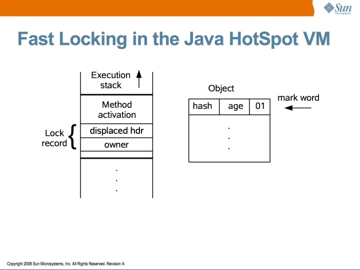
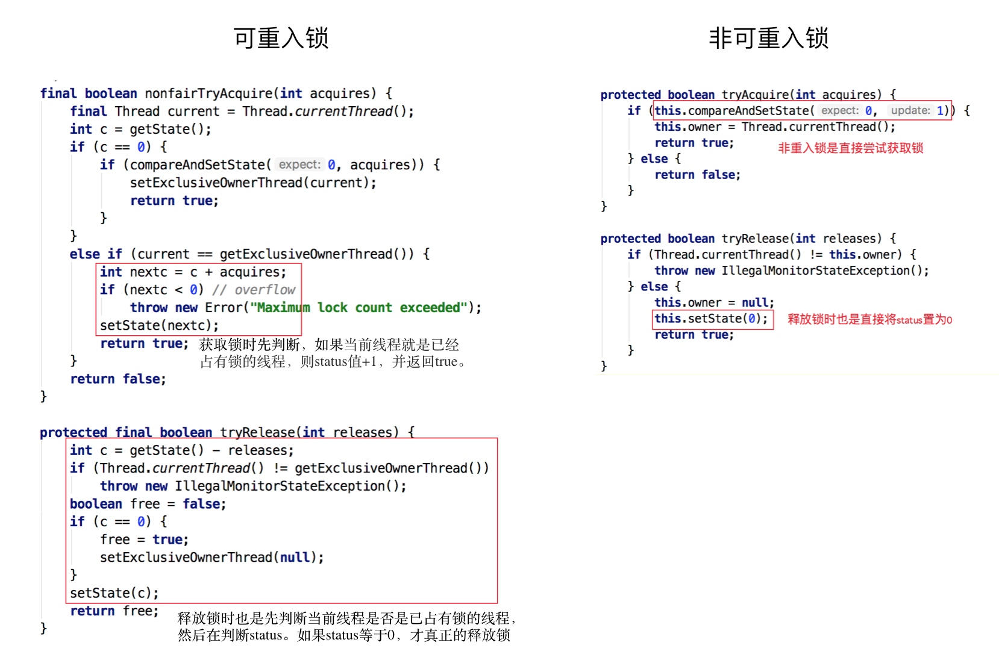
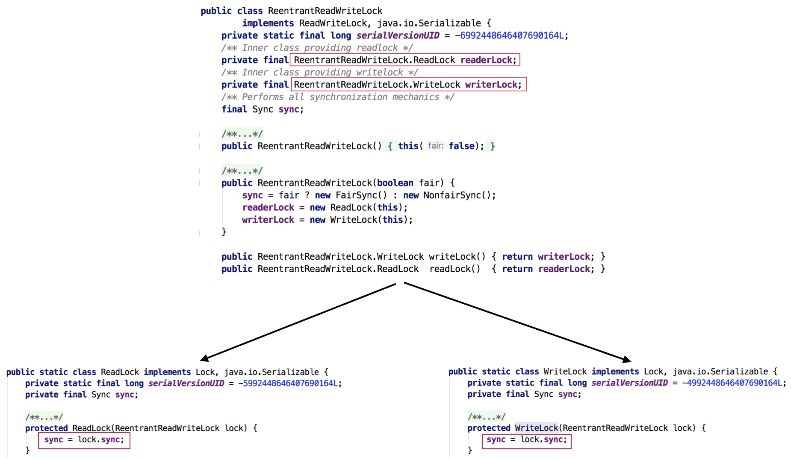
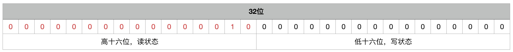

# lock

## 锁的概念

锁是为了保证一致性产生的逻辑概念。当持有锁时，可以进入临界区处理任务，当锁被他人持有时，可以通过自选、进入队列等待 OS 调度来持有锁。从获取锁的难度上分类，前者是轻量级锁，后者是重量级锁。此外，也能按照其它特性分类。


* 悲观锁，认为一定有别的线程来修改数据，因此获取数据前先加锁，确保数据不被别的线程修改，如 *synchronized、Lock*，适合写多场景。
* 乐观锁，认为没有竞争，只在修改数据时判断之前是否有更新，如果没更新则修改数据，如果有更新则报错或重试，常采用 *CAS*，*atomic* 中的递增操作就用了 *CAS*，适合读多场景。
* 自旋锁，减少CPU CS消耗，但仍旧有循环的CPU消耗，可以限定自旋次数（-XX:+UseSpinning，JDK 1.6 默认开启，-XX:PreBlockSpin，默认10）适合锁占用时间短的场景。
* 适应性自旋，自旋次数不固定，由前一次在同一个锁上的自旋时间及锁拥有者的状态决定。
* 无锁、偏向锁、轻量级锁、重量级锁（synchronized） + 对象头
* 公平锁，多个线程按照申请锁的顺序来获取锁，线程直接进入队列中排队FIFO。优点是等待锁的线程不会饿死。缺点是整体吞吐效率相对非公平锁要低，等待队列中除第一个线程以外的所有线程都会阻塞，CPU唤醒阻塞线程的开销比非公平锁大。
* 非公平锁，多个线程加锁时直接尝试获取锁，获取到则线程可以无需阻塞直接获取锁，获取不到才会到队尾等待。优点是可以减少唤起线程的开销，整体的吞吐效率高，因为线程有几率不阻塞直接获得锁，CPU不必唤醒所有线程。缺点是处于等待队列中的线程可能会饿死，或者等很久才会获得锁。
* 可重入锁，指在同一个线程在外层方法获取锁的时候，再进入该线程的内层方法会自动获取锁（前提锁对象得是同一个对象或者class），不会因为之前已经获取过还没释放而阻塞。Java中ReentrantLock和synchronized都是可重入锁，可重入锁的一个优点是可一定程度避免死锁。
* 不可重入锁，更新 AQS 当前 status 值，更新失败后不会判断当前线程是否是获取到这个锁的线程，而是直接锁失败。
* 独享锁，该锁一次只能被一个线程所持有。如果线程T对数据A加上排它锁后，则其他线程不能再对A加任何类型的锁。获得排它锁的线程即能读数据又能修改数据。JDK中的synchronized和JUC中Lock的实现类就是互斥锁。
* 共享锁，该锁可被多个线程所持有。如果线程T对数据A加上共享锁后，则其他线程只能对A再加共享锁，不能加排它锁。获得共享锁的线程只能读数据，不能修改数据。独享锁与共享锁也是通过AQS来实现的，通过实现不同的方法，来实现独享或者共享。


Ref: [不可不说的Java“锁”事](https://tech.meituan.com/2018/11/15/java-lock.html)

## Java 中的锁

### synchronized

JDK 1.0-1.2 间使用重量级锁，即 OS 负责调度锁、处理锁之间的同步、处理线程间同步的状态后再反馈结果给 JVM。JDK 1.6默认开启偏向锁和轻量级锁，可以通过 *-XX:-UseBiasedLocking* 禁用偏向锁。


现在 synchronized 实现比较复杂，存在 *偏向锁-轻量级锁-重量级锁* 间的单向升级过程。

严格来说，偏向锁不是一个真的锁，加锁只需要 *CAS 将线程 ID记到锁的Mark Word里*，减少轻量级锁获取、释放时依赖 *多次 CAS* 的性能损耗，当且仅当只有一个线程执行同步代码块时能提升性能。当多个线程竞争偏向锁时，持有偏向锁的线程才会释放锁，线程不会主动释放偏向锁，偏向锁的撤销，需要等待全局安全点（没有字节码执行），它会先暂停拥有偏向锁的线程，判断锁对象是否处于被锁定的状态。且存在竞争时，通过 *自旋 + CAS* 方式解决，此时为自旋锁，即升级为轻量级锁。
当存在偏向锁时，表明不存在多线程竞争，通过减少传统的重量级锁使用产生的性能消耗，可以确保同步的同时保证性能。*Vector、HashTable、StringBuffer* 都采用 *synchronized* 保证同步。

当自旋次数过多，或竞争线程过多，认为线程竞争过大且自旋的代价高，应该交由 os 调度，对应系统调用 *mutex*，即升级为重量级锁。

升级通过修改锁对象的信息实现。

HotSpot虚拟机中，对象在内存中（16 Bytes）存储的布局可以分为三块区域：对象头（Object Header）、实例数据（Instance Data）和对齐填充（Padding）。 

HotSpot虚拟机的对象头包括两部分信息

1. Mark Word（8 Bytes，非固定的数据结构）

	用于存储对象自身的运行时数据，与定义无关，如对象HashCode、GC分代年龄、锁状态标志、线程持有的锁、偏向线程ID、偏向时间戳等等.

2. Klass Pointer（4 Bytes）

	对象指向它的类的元数据的指针，虚拟机通过这个指针来确定这个对象是哪个类的实例。(数组，对象头中还必须有一块用于记录数组长度的数据，因为虚拟机可以通过普通Java对象的元数据信息确定Java对象的大小，但是从数组的元数据中无法确定数组的大小。) 

32位的HotSpot虚拟机对象头存储结构


为了证实上图的正确性，这里我们看openJDK->hotspot源码markOop.hpp，虚拟机对象头存储结构


> 单词解释
> 
> hash： 保存对象的哈希码
age： 保存对象的分代年龄
biased_lock： 偏向锁标识位
lock： 锁状态标识位
JavaThread*： 保存持有偏向锁的线程ID
epoch： 保存偏向时间戳

上图中有源码中对锁标志位这样枚举

```c++
1 enum {   locked_value             = 0,//00 轻量级锁
2          unlocked_value           = 1,//01 无锁
3          monitor_value            = 2,//10 监视器锁，也叫膨胀锁，也叫重量级锁
4          marked_value             = 3,//11 GC标记
5          biased_lock_pattern      = 5 //101 偏向锁
6   };
```

下面是源码注释


*synchronized* 源码实现就用了Mark Word来标识对象加锁状态，所谓的锁升级就是1bit偏向锁+2bit锁标志位。

上面红框是偏向锁（第一行是指向线程的显示偏向锁，第二行是匿名偏向锁）对应枚举biased_lock_pattern，下面红框是轻量级锁、无锁、监视器锁、GC标记，分别对应上面的前4种枚举。我们甚至能看见锁标志11时，是GC的markSweep(标记清除算法)使用的。

Monitor可以理解为一个同步工具或一种同步机制，通常被描述为一个对象。每一个Java对象就有一把看不见的锁，称为内部锁或者Monitor锁。Monitor是线程私有的数据结构，每一个线程都有一个可用monitor record列表，同时还有一个全局的可用列表。每一个被锁住的对象都会和一个monitor关联，同时monitor中有一个Owner字段存放拥有该锁的线程的唯一标识，表示该锁被这个线程占用。synchronized通过Monitor来实现线程同步，Monitor是依赖于底层的操作系统的Mutex Lock（互斥锁）来实现的线程同步。

当一个线程获取到锁之后，在锁的对象头里面会有一个指向线程栈中锁记录(Lock Record)的指针。当我们判断线程是否拥有锁时只要将线程的锁记录地址和对象头里的指针地址进行比较就行。



### ReentrantLock

```
    abstract static class Sync extends AbstractQueuedSynchronizer

    static final class FairSync extends Sync {
        private static final long serialVersionUID = -3000897897090466540L;

        final void lock() {
            acquire(1);
        }

        /**
         * Fair version of tryAcquire.  Don't grant access unless
         * recursive call or no waiters or is first.
         */
        protected final boolean tryAcquire(int acquires) {
            final Thread current = Thread.currentThread();
            int c = getState();
            if (c == 0) {
                if (!hasQueuedPredecessors() &&
                    compareAndSetState(0, acquires)) {
                    setExclusiveOwnerThread(current);
                    return true;
                }
            }
            else if (current == getExclusiveOwnerThread()) {
                int nextc = c + acquires;
                if (nextc < 0)
                    throw new Error("Maximum lock count exceeded");
                setState(nextc);
                return true;
            }
            return false;
        }
    }
    
    
    static final class NonfairSync extends Sync {
        private static final long serialVersionUID = 7316153563782823691L;

        /**
         * Performs lock.  Try immediate barge, backing up to normal
         * acquire on failure.
         */
        final void lock() {
            if (compareAndSetState(0, 1))
                setExclusiveOwnerThread(Thread.currentThread());
            else
                acquire(1);
        }

        protected final boolean tryAcquire(int acquires) {
            return nonfairTryAcquire(acquires);
        }
    }
    
    // 判断当前线程是否位于同步队列中的第一个
    public final boolean hasQueuedPredecessors() {
        // The correctness of this depends on head being initialized
        // before tail and on head.next being accurate if the current
        // thread is first in queue.
        Node t = tail; // Read fields in reverse initialization order
        Node h = head;
        Node s;
        return h != t &&
            ((s = h.next) == null || s.thread != Thread.currentThread());
    }
```





state字段（int类型，32位），该字段用来描述有多少线程获持有锁。

在独享锁中这个值通常是0或者1（如果是重入锁的话state值就是重入的次数），在共享锁中state就是持有锁的数量。但是在ReentrantReadWriteLock中有读、写两把锁，所以需要在一个整型变量state上分别描述读锁和写锁的数量（或者也可以叫状态）。于是将state变量“按位切割”切分成了两个部分，高16位表示读锁状态（读锁个数），低16位表示写锁状态（写锁个数）。



```
// 写锁
protected final boolean tryAcquire(int acquires) {
	Thread current = Thread.currentThread();
	int c = getState(); // 取到当前锁的个数
	int w = exclusiveCount(c); // 取写锁的个数w
	if (c != 0) { // 如果已经有线程持有了锁(c!=0)
    // (Note: if c != 0 and w == 0 then shared count != 0)
		if (w == 0 || current != getExclusiveOwnerThread()) // 如果写线程数（w）为0（换言之存在读锁） 或者持有锁的线程不是当前线程就返回失败
			return false;
		if (w + exclusiveCount(acquires) > MAX_COUNT)    // 如果写入锁的数量大于最大数（65535，2的16次方-1）就抛出一个Error。
      throw new Error("Maximum lock count exceeded");
		// Reentrant acquire
    setState(c + acquires);
    return true;
  }
  if (writerShouldBlock() || !compareAndSetState(c, c + acquires)) // 如果当且写线程数为0，并且当前线程需要阻塞那么就返回失败；或者如果通过CAS增加写线程数失败也返回失败。
		return false;
	setExclusiveOwnerThread(current); // 如果c=0，w=0或者c>0，w>0（重入），则设置当前线程或锁的拥有者
	return true;
}

// 读锁
protected final int tryAcquireShared(int unused) {
    Thread current = Thread.currentThread();
    int c = getState();
    if (exclusiveCount(c) != 0 &&
        getExclusiveOwnerThread() != current)
        return -1;                                   // 如果其他线程已经获取了写锁，则当前线程获取读锁失败，进入等待状态
    int r = sharedCount(c);
    if (!readerShouldBlock() &&
        r < MAX_COUNT &&
        compareAndSetState(c, c + SHARED_UNIT)) {
        if (r == 0) {
            firstReader = current;
            firstReaderHoldCount = 1;
        } else if (firstReader == current) {
            firstReaderHoldCount++;
        } else {
            HoldCounter rh = cachedHoldCounter;
            if (rh == null || rh.tid != getThreadId(current))
                cachedHoldCounter = rh = readHolds.get();
            else if (rh.count == 0)
                readHolds.set(rh);
            rh.count++;
        }
        return 1;
    }
    return fullTryAcquireShared(current);
}
```

ReentrantLock虽然有公平锁和非公平锁两种，但是它们添加的都是独享锁。当某一个线程调用lock方法获取锁时，如果同步资源没有被其他线程锁住，那么当前线程在使用CAS更新state成功后就会成功抢占该资源。而如果公共资源被占用且不是被当前线程占用，那么就会加锁失败。所以可以确定ReentrantLock无论读操作还是写操作，添加的锁都是都是独享锁。

### Semaphore

```
abstract static class Sync extends AbstractQueuedSynchronizer
```

### AtomicLong

代码调用链

```
unsafe.compareAndSwapInt(this, valueOffset, expect, update);

public final native boolean compareAndSwapLong(Object var1, long var2, long var4, long var6);
    
// LOCK_IF_MP:会根据当前处理器的类型来决定是否为cmpxchg指令添加lock前缀。如果程序是在多处理器上运行，就为cmpxchg指令加上lock前缀（lock cmpxchg）。反之，如果程序是在单处理器上运行，就省略lock前缀（单处理器自身会维护单处理器内的顺序一致性，不需要lock前缀提供的内存屏障效果）。
#define LOCK_IF_MP "cmp $0, " #mp ": je lf: lock: 1: "
    
// 汇编，硬件会在执行 lock 指令后面的指令的时候锁定一个北桥信号，而不采用锁总线的方式
lock cmpxchg 指令
```

比较过程存在 **ABA** 问题，可以通过版本号解决。*cmpxchg* 本身的原子性通过 *lock* 保证，。
**循环时间长开销大**，可以交由 os 统一调度。
**只能保证一个共享变量的原子操作**，JDK 1.5 提供 *AtomicReference* 保证引用对象间的原子性，可以把多个变量放在一个对象内 *CAS*。

### LongAdder


### volatile


### ConcurrentHashMap

*Hash* 表的数据结构是 *数组 + 链表*，插入时先 *hash* 确定链表再查找数组。*HashMap、ConcurrentHashMap* 的数据结构都类似。

但它不是线程安全的，在 *HashMap* 扩容时，需要将旧链表数组的数据迁移至新链表数组，可能造成死循环（JDK 1.7 前的头插法），也可能在多线程插入时造成链表中数据的覆盖导致数据丢失。之后诞生了线程安全的 *HashTable*，但它所有可能竞争的方法都加 *synchronized*，只有一个线程能操作，其它线程都阻塞，效率非常低。*ConcurrentHashMap* 避免对整个 *Map* 加锁，并发效率更高。


JDK 1.7 中，*Segment* 继承自 *ReentrantLock*，用 *volatile* 修饰 *HashEntry* 当前值、next值，*get()* 时不用加锁，并发效率高。
*put()* 时，先尝试 *tryLock()*，失败说明存在竞争，再通过 *scanAndLockForPut()* 自旋，自旋次数达到 *MAX_SCAN_RETRIES* 时执行阻塞锁，直到获取锁。
*size()* 时，先不加锁并多次（最多3次）获取长度并比较结果，如果相同则不存在竞争的写操作，直接返回。如果不同则存在竞争，对每个 *Segment* 加锁后计算 *ConcurrentHashMap* 的值。

> 这和 Java synchronized 升级锁的思路一致，都是通过减少非必要竞争提高并发效率。所有锁优化方式都类似。

```
static class Segment<K,V> extends ReentrantLock implements Serializable
```

JDK 1.8 中，放弃了分段锁，而采用 *CAS + synchronized* 保证并发效率，直接用 *数组 + 链表* 的数据结构，在链表长度大于8时，转为红黑树提升查询效率。另外，*HashEntry* 改为 *Node*，仍旧用 *volatile* 修饰当前值、next值保证 *get()* 的并发效率。
*put()* 时，先 *hash* 并处理初始化，根据 key 定位到 *Node*，如果当前位置为空，则 *CAS* 尝试写入，失败则 *自旋*。同时，根据 *hashcode* 判断是否要扩容，扩容也通过 *CAS* 完成。如果不为空也不用扩容，则通过 *synchronized* 阻塞锁写入数据。如果数据量大于 *TREEIFY_THRESHOLD* 则转换成红黑树。
*size()* 时，如果 *counterCells* 为空则直接返回 *baseCount*，不为空则遍历后累加到 *baseCount* 中。*baseCount* 用 *volatile* 修饰，*put()* 时通过 *CAS* 自增，失败则对 *counterCells* 进行 *CAS*，再失败则进入 *fullAddCount()*，自旋直到成功。*CounterCell* 用 *@sun.misc.Contended* 标记防止伪共享。


