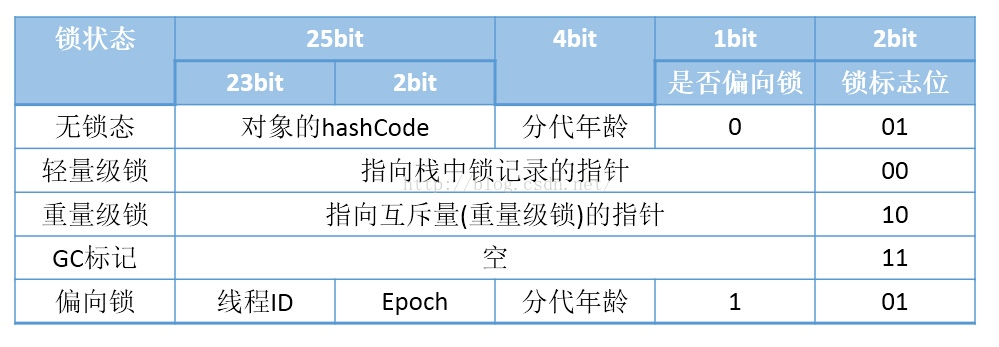

# lock

## 锁的概念

锁是为了保证一致性产生的逻辑概念。当持有锁时，可以进入临界区处理任务，当锁被他人持有时，可以通过自选、进入队列等待 OS 调度来持有锁。从获取锁的难度上分类，前者是轻量级锁，后者是重量级锁。此外，也能按照其它特性分类。


1. 悲观锁认为一定有别的线程来修改数据，因此获取数据前先加锁，确保数据不被别的线程修改，如 *synchronized、Lock*。
2. 乐观锁认为没有竞争，只在修改数据时判断之前是否有更新，如果没更新则修改数据，如果有更新则报错或重试，常采用 *CAS*，*atomic* 中的递增操作就用了 *CAS*。


Ref: [不可不说的Java“锁”事](https://tech.meituan.com/2018/11/15/java-lock.html)

## Java 中的锁

### synchronized

JDK 1.0-1.2 间使用重量级锁，即 OS 负责调度锁、处理锁之间的同步、处理线程间同步的状态后再反馈结果给 JVM。JDK 1.6默认开启偏向锁和轻量级锁，可以通过 *-XX:-UseBiasedLocking* 禁用偏向锁。


现在 synchronized 实现比较复杂，存在 *偏向锁-轻量级锁-重量级锁* 间的单向升级过程。

严格来说，偏向锁不是一个真的锁，只是把线程 ID记到锁上。当多个线程竞争偏向锁时，通过 *自旋 + CAS* 方式解决，此时为自旋锁，即升级为轻量级锁。
当存在偏向锁时，表明不存在多线程竞争，通过减少传统的重量级锁使用产生的性能消耗，可以确保同步的同时保证性能。*Vector、HashTable、StringBuffer* 都采用 *synchronized* 保证同步。

当自旋次数过多，认为线程竞争过大，自旋的代价高，应该交由 os 调度，对应系统调用 *mutex*，即升级为重量级锁。

升级通过修改锁对象的信息实现。

HotSpot虚拟机中，对象在内存中（16 Bytes）存储的布局可以分为三块区域：对象头（Object Header）、实例数据（Instance Data）和对齐填充（Padding）。 

HotSpot虚拟机的对象头包括两部分信息

1. Mark Word（8 Bytes）

	用于存储对象自身的运行时数据， 如对象HashCode、GC分代年龄、锁状态标志、线程持有的锁、偏向线程ID、偏向时间戳等等.

2. Klass Pointer（4 Bytes）

	对象指向它的类的元数据的指针，虚拟机通过这个指针来确定这个对象是哪个类的实例。(数组，对象头中还必须有一块用于记录数组长度的数据，因为虚拟机可以通过普通Java对象的元数据信息确定Java对象的大小，但是从数组的元数据中无法确定数组的大小。 ) 

32位的HotSpot虚拟机对象头存储结构



为了证实上图的正确性，这里我们看openJDK->hotspot源码markOop.hpp，虚拟机对象头存储结构


> 单词解释
> 
> hash： 保存对象的哈希码
age： 保存对象的分代年龄
biased_lock： 偏向锁标识位
lock： 锁状态标识位
JavaThread*： 保存持有偏向锁的线程ID
epoch： 保存偏向时间戳

上图中有源码中对锁标志位这样枚举

```c++
1 enum {   locked_value             = 0,//00 轻量级锁
2          unlocked_value           = 1,//01 无锁
3          monitor_value            = 2,//10 监视器锁，也叫膨胀锁，也叫重量级锁
4          marked_value             = 3,//11 GC标记
5          biased_lock_pattern      = 5 //101 偏向锁
6   };
```

下面是源码注释


*synchronized* 源码实现就用了Mark Word来标识对象加锁状态，所谓的锁升级就是1bit偏向锁+2bit锁标志位。

上面红框是偏向锁（第一行是指向线程的显示偏向锁，第二行是匿名偏向锁）对应枚举biased_lock_pattern，下面红框是轻量级锁、无锁、监视器锁、GC标记，分别对应上面的前4种枚举。我们甚至能看见锁标志11时，是GC的markSweep(标记清除算法)使用的。

### AtomicLong

代码调用链

```
unsafe.compareAndSwapInt(this, valueOffset, expect, update);

public final native boolean compareAndSwapLong(Object var1, long var2, long var4, long var6);
    
// LOCK_IF_MP:会根据当前处理器的类型来决定是否为cmpxchg指令添加lock前缀。如果程序是在多处理器上运行，就为cmpxchg指令加上lock前缀（lock cmpxchg）。反之，如果程序是在单处理器上运行，就省略lock前缀（单处理器自身会维护单处理器内的顺序一致性，不需要lock前缀提供的内存屏障效果）。
#define LOCK_IF_MP "cmp $0, " #mp ": je lf: lock: 1: "
    
// 汇编，硬件会在执行 lock 指令后面的指令的时候锁定一个北桥信号，而不采用锁总线的方式
lock cmpxchg 指令
```

比较过程存在 **ABA** 问题，可以通过版本号解决。*cmpxchg* 本身的原子性通过 *lock* 保证，。

### LongAdder


### volatile


### ConcurrentHashMap

*Hash* 表的数据结构是 *数组 + 链表*，插入时先 *hash* 确定链表再查找数组。*HashMap、ConcurrentHashMap* 的数据结构都类似。

但它不是线程安全的，在 *HashMap* 扩容时，需要将旧链表数组的数据迁移至新链表数组，可能造成死循环（JDK 1.7 前的头插法），也可能在多线程插入时造成链表中数据的覆盖导致数据丢失。之后诞生了线程安全的 *HashTable*，但它所有可能竞争的方法都加 *synchronized*，只有一个线程能操作，其它线程都阻塞，效率非常低。*ConcurrentHashMap* 避免对整个 *Map* 加锁，并发效率更高。


JDK 1.7 中，*Segment* 继承自 *ReentrantLock*，用 *volatile* 修饰 *HashEntry* 当前值、next值，*get()* 时不用加锁，并发效率高。
*put()* 时，先尝试 *tryLock()*，失败说明存在竞争，再通过 *scanAndLockForPut()* 自旋，自旋次数达到 *MAX_SCAN_RETRIES* 时执行阻塞锁，直到获取锁。
*size()* 时，先不加锁并多次（最多3次）获取长度并比较结果，如果相同则不存在竞争的写操作，直接返回。如果不同则存在竞争，对每个 *Segment* 加锁后计算 *ConcurrentHashMap* 的值。

> 这和 Java synchronized 升级锁的思路一致，都是通过减少非必要竞争提高并发效率。所有锁优化方式都类似。

```
static class Segment<K,V> extends ReentrantLock implements Serializable
```

JDK 1.8 中，放弃了分段锁，而采用 *CAS + synchronized* 保证并发效率，直接用 *数组 + 链表* 的数据结构，在链表长度大于8时，转为红黑树提升查询效率。另外，*HashEntry* 改为 *Node*，仍旧用 *volatile* 修饰当前值、next值保证 *get()* 的并发效率。
*put()* 时，先 *hash* 并处理初始化，根据 key 定位到 *Node*，如果当前位置为空，则 *CAS* 尝试写入，失败则 *自旋*。同时，根据 *hashcode* 判断是否要扩容，扩容也通过 *CAS* 完成。如果不为空也不用扩容，则通过 *synchronized* 阻塞锁写入数据。如果数据量大于 *TREEIFY_THRESHOLD* 则转换成红黑树。
*size()* 时，如果 *counterCells* 为空则直接返回 *baseCount*，不为空则遍历后累加到 *baseCount* 中。*baseCount* 用 *volatile* 修饰，*put()* 时通过 *CAS* 自增，失败则对 *counterCells* 进行 *CAS*，再失败则进入 *fullAddCount()*，自旋直到成功。*CounterCell* 用 *@sun.misc.Contended* 标记防止伪共享。


