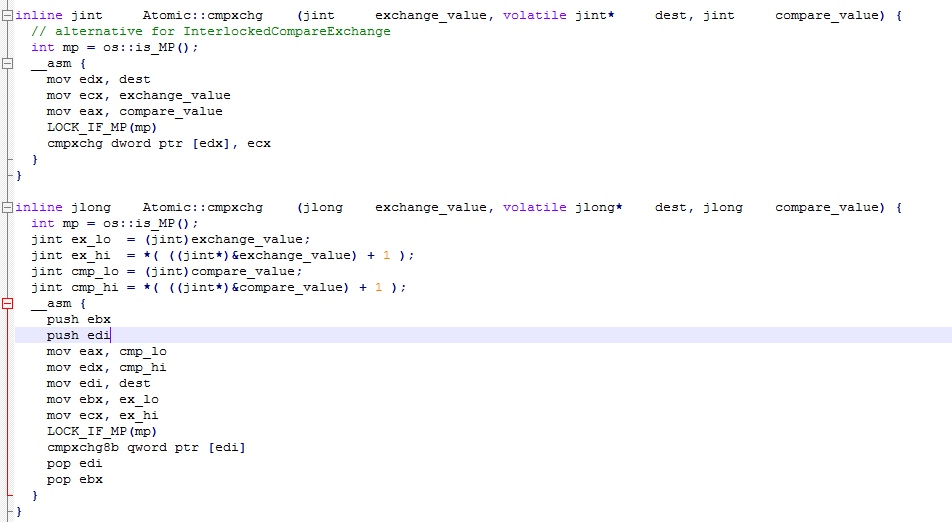
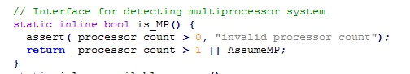
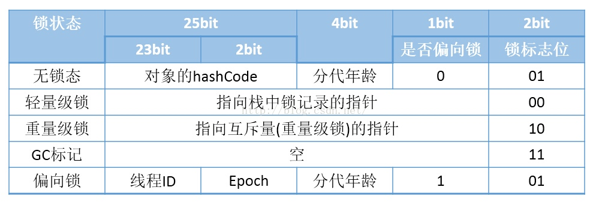
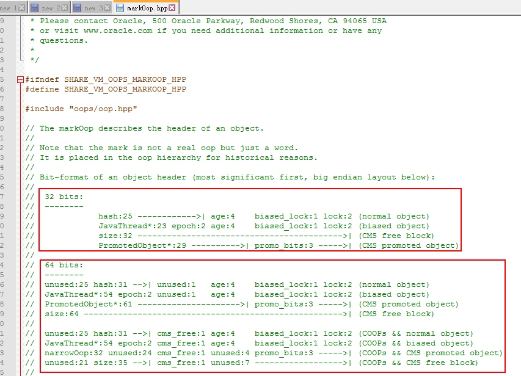
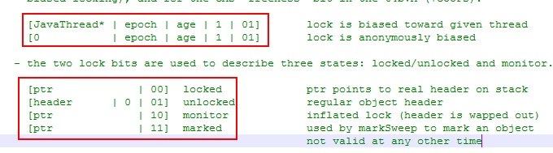
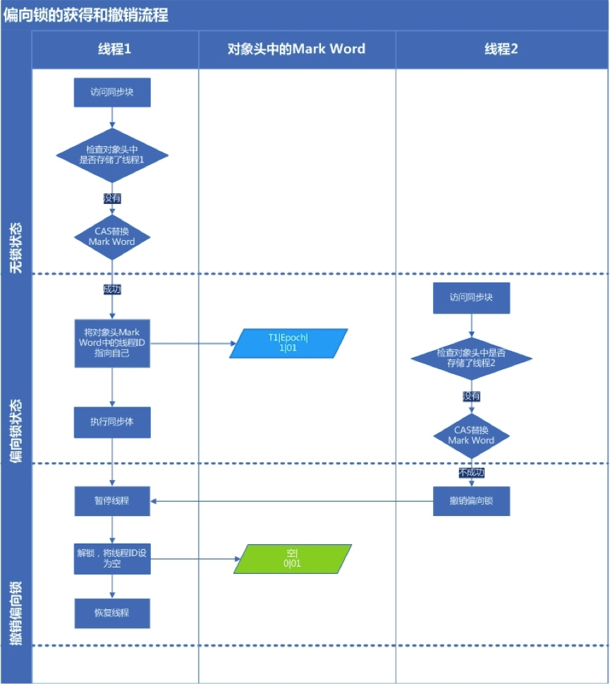
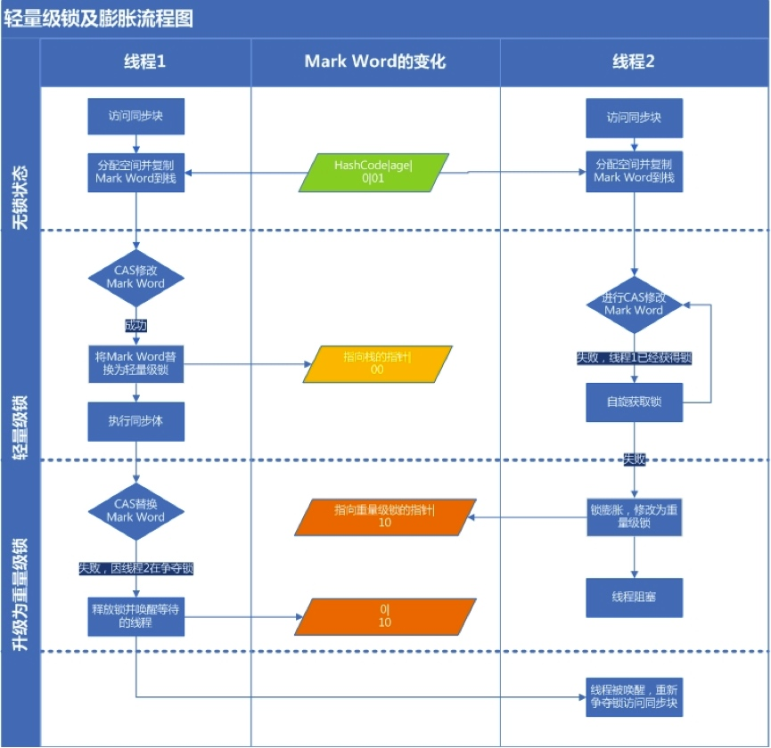

[toc]
# synchronized
## 基础知识
### CAS操作

乐观锁，Compare and Swap。

JNI完成CPU指令的操作：

``` java
unsafe.compareAndSwapInt(this, valueOffset, expect, update);
```

CAS有3个操作数，内存值V，旧的预期值A，要修改的新值B。如果A=V，那么把B赋值给V，返回V；如果A！=V，直接返回V。

源码：openjdk\hotspot\src\oscpu\windowsx86\vm\ atomicwindowsx86.inline.hpp


os::is_MP()  这个是runtime/os.hpp，实际就是返回是否多处理器，源码如下：

如上面源代码所示（看第一个int参数即可），LOCK_IF_MP:会根据当前处理器的类型来决定是否为cmpxchg指令添加lock前缀。如果程序是在多处理器上运行，就为cmpxchg指令加上lock前缀（lock cmpxchg）。反之，如果程序是在单处理器上运行，就省略lock前缀（单处理器自身会维护单处理器内的顺序一致性，不需要lock前缀提供的内存屏障效果）。

### 对象头

HotSpot虚拟机中，对象在内存中存储的布局可以分为三块区域：对象头（Header）、实例数据（Instance Data）和对齐填充（Padding）。 
HotSpot虚拟机的对象头(Object Header)包括两部分信息:

1. Mark Word

	用于存储对象自身的运行时数据， 如哈希码（HashCode）、GC分代年龄、锁状态标志、线程持有的锁、偏向线程ID、偏向时间戳等等.
2. Klass Pointer

	对象指向它的类的元数据的指针，虚拟机通过这个指针来确定这个对象是哪个类的实例。(数组，对象头中还必须有一块用于记录数组长度的数据，因为虚拟机可以通过普通Java对象的元数据信息确定Java对象的大小，但是从数组的元数据中无法确定数组的大小。 ) 

32位的HotSpot虚拟机对象头存储结构



为了证实上图的正确性，这里我们看openJDK--》hotspot源码markOop.hpp，虚拟机对象头存储结构



> 单词解释
> 
> hash： 保存对象的哈希码
age： 保存对象的分代年龄
biased_lock： 偏向锁标识位
lock： 锁状态标识位
JavaThread*： 保存持有偏向锁的线程ID
epoch： 保存偏向时间戳

上图中有源码中对锁标志位这样枚举

```c++
1 enum {   locked_value             = 0,//00 轻量级锁
2          unlocked_value           = 1,//01 无锁
3          monitor_value            = 2,//10 监视器锁，也叫膨胀锁，也叫重量级锁
4          marked_value             = 3,//11 GC标记
5          biased_lock_pattern      = 5 //101 偏向锁
6   };
```

下面是源码注释


不管是32/64位JVM，都是1bit偏向锁+2bit锁标志位。上面红框是偏向锁（第一行是指向线程的显示偏向锁，第二行是匿名偏向锁）对应枚举biased_lock_pattern，下面红框是轻量级锁、无锁、监视器锁、GC标记，分别对应上面的前4种枚举。我们甚至能看见锁标志11时，是GC的markSweep(标记清除算法)使用的。

对象头中的Mark Word，synchronized源码实现就用了Mark Word来标识对象加锁状态。

## JVM中synchronized锁实现原理（优化）

大家都知道java中锁synchronized性能较差，线程会阻塞。本节将以图文形式来描述JVM的synchronized锁优化。

在jdk1.6中对锁的实现引入了大量的优化来减少锁操作的开销

* 锁粗化（Lock Coarsening）
	将多个连续的锁扩展成一个范围更大的锁，用以减少频繁互斥同步导致的性能损耗。

* 锁消除（Lock Elimination）
	JVM及时编译器在运行时，通过逃逸分析，如果判断一段代码中，堆上的所有数据不会逃逸出去从来被其他线程访问到，就可以去除这些锁。

* 轻量级锁（Lightweight Locking）
	JDK1.6引入。在没有多线程竞争的情况下避免重量级互斥锁，只需要依靠一条CAS原子指令就可以完成锁的获取及释放。

* 偏向锁（Biased Locking）
	JDK1.6引入。目的是消除数据再无竞争情况下的同步原语。使用CAS记录获取它的线程。下一次同一个线程进入则偏向该线程，无需任何同步操作。

* 适应性自旋（Adaptive Spinning）
	为了避免线程频繁挂起、恢复的状态切换消耗。产生了忙循环（循环时间固定），即自旋。JDK1.6引入了自适应自旋。自旋时间根据之前锁自旋时间和线程状态，动态变化，用以期望能减少阻塞的时间。

锁升级：偏向锁-->轻量级锁-->重量级锁

### 偏向锁、轻量级锁和重量级锁

按照之前的HotSpot设计，每次加锁/解锁都会涉及到一些CAS操作（比如对等待队列的CAS操作），CAS操作会延迟本地调用，因此偏向锁的想法是一旦线程第一次获得了监视对象，之后让监视对象“偏向”这个线程，之后的多次调用则可以避免CAS操作。

简单的讲，就是在锁对象的对象头中有个ThreaddId字段，这个字段如果是空的，第一次获取锁的时候，就将自身的ThreadId写入到锁的ThreadId字段内，将锁头内的是否偏向锁的状态位置1.这样下次获取锁的时候，直接检查ThreadId是否和自身线程Id一致，如果一致，则认为当前线程已经获取了锁，因此不需再次获取锁，略过了轻量级锁和重量级锁的加锁阶段。提高了效率。

***注意：当锁有竞争关系的时候，需要解除偏向锁，进入轻量级锁。***

每一个线程在准备获取共享资源时

1. 检查MarkWord里面是不是放的自己的ThreadId，如果是，表示当前线程是处于 “偏向锁”.跳过轻量级锁直接执行同步体。
		
	
	
	

2. 如果MarkWord不是自己的ThreadId,锁升级，这时候，用CAS来执行切换，新的线程根据MarkWord里面现有的ThreadId，通知之前线程暂停，之前线程将Markword的内容置为空。
3. 两个线程都把对象的HashCode复制到自己新建的用于存储锁的记录空间，接着开始通过CAS操作，把共享对象的MarKword的内容修改为自己新建的记录空间的地址的方式竞争MarkWord.
4. 第三步中成功执行CAS的获得资源，失败的则进入自旋.
5. 自旋的线程在自旋过程中，成功获得资源(即之前获的资源的线程执行完成并释放了共享资源)，则整个状态依然处于轻量级锁的状态，如果自旋失败 第六步，进入重量级锁的状态，这个时候，自旋的线程进行阻塞，等待之前线程执行完成并唤醒自己.

***注意点：JVM加锁流程***
***偏向锁-->轻量级锁-->重量级锁***
从左往右可以升级，从右往左不能降级

## 从C++源码看synchronized

### 同步和互斥

同步
> 多个线程并发访问共享资源时，保证同一时刻只有一个（信号量可以多个）线程使用。

实现同步的方法

1. 临界区（CriticalSection，又叫关键段）
	
	通过对多线程的串行化来访问公共资源或一段代码，速度快，适合控制数据访问。进程内可用。

2. 互斥量

	互斥量用于线程的互斥。只能为0/1。一个互斥量只能用于一个资源的互斥访问，可跨进程使用。

3. 信号量
	
	信号线用于线程的同步。可以为非负整数，可实现多个同类资源的多线程互斥和同步。当信号量为单值信号量是，也可以完成一个资源的互斥访问。可跨进程使用。

4. 事件

	用来通知线程有一些事件已发生，从而启动后继任务的开始,可跨进程使用。

synchronized的底层实现就用到了临界区和互斥锁（重量级锁的情况下）这两个概念。

### synchronized C++源码

#### C++中的监视器锁数据结构

oopDesc--继承-->markOopDesc--方法monitor()-->ObjectMonitor-->enter、exit 获取、释放锁

1. oopDesc类

	openjdk\hotspot\src\share\vm\oops\oop.hpp下oopDesc类是JVM对象的顶级基类,故每个object都包含markOop。
	
	```c++
	 1 class oopDesc {
	 2   friend class VMStructs;
	 3  private:
	 4   volatile markOop  _mark;//markOop:Mark Word标记字段
	 5   union _metadata {
	 6     Klass*      _klass;//对象类型元数据的指针
	 7     narrowKlass _compressed_klass;
	 8   } _metadata;
	 9 
	10   // Fast access to barrier set.  Must be initialized.
	11   static BarrierSet* _bs;
	12 
	13  public:
	14   markOop  mark() const         { return _mark; }
	15   markOop* mark_addr() const    { return (markOop*) &_mark; }
	16 
	17   void set_mark(volatile markOop m)      { _mark = m;   }
	18 
	19   void    release_set_mark(markOop m);
	20   markOop cas_set_mark(markOop new_mark, markOop old_mark);
	21 
	22   // Used only to re-initialize the mark word (e.g., of promoted
	23   // objects during a GC) -- requires a valid klass pointer
	24   void init_mark();
	25 
	26   Klass* klass() const;
	27   Klass* klass_or_null() const volatile;
	28   Klass** klass_addr();
	29   narrowKlass* compressed_klass_addr();
	....省略...
	}
	```

2. markOopDesc类	
	
	openjdk\hotspot\src\share\vm\oops\markOop.hpp下markOopDesc继承自oopDesc，并拓展了自己的方法monitor()
	
	```c++
	1 ObjectMonitor* monitor() const {
	2     assert(has_monitor(), "check");
	3     // Use xor instead of &~ to provide one extra tag-bit check.
	4     return (ObjectMonitor*) (value() ^ monitor_value);
	5   }
	```
	该方法返回一个ObjectMonitor*对象指针。
	其中value()这样定义：

	```c++
	 1 uintptr_t value() const { return (uintptr_t) this; }
	```

3. 
	
	
	
	
	
	
	
	
## 总结

https://www.cnblogs.com/dennyzhangdd/p/6734638.html


