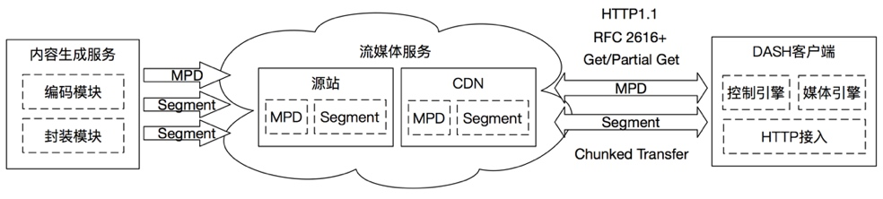

[toc]

# DASH调研

# 问题

我们先到微博看看视频

再来油管看看视频

没有对比就没有伤害，感觉到微博视频有什么不爽吗？

1. 起播慢
2. 后续播放卡顿
3. 视频模糊

用户需要时不时调整播放的清晰度来看更清楚、更流畅的视频，这件事情能用技术解决吗？答案当然是可以，不然为啥写ppt。。。

# 自适应串流

自适应串流技术，Adaptive Bitrate Streaming(ABS)，是一种在网络上使用的串流技术，实时检测的用户的设备情况，比如CPU使用率、缓存空间和网络情况（比如带宽）来调整视频流的质量，将一个视频源输出为多码率的视频输出后，播放器客户端根据资源情况在不同码率的流之间切换，结果是缓存更少、首开更快、高低端链接都有良好体验。

## 主流方案

自适应串流的主流方案如下

具有三个特点

1. 使用多码率编码源内容

	流媒体客户端首先获取所有码率的切片索引信息。一开始，客户端先请求最低码率的串流。如果客户端判断下载速度比当前码率的切片串流快，它就去请求下一个更高码率的串流。随着播放的进行，如果客户端发现下载速度比当前码率的切片串流慢，转而请求下一个较低码率的串流。

2. 每个单码率的流切分为几秒钟的小片

	切片大小和具体实现密切相关，不过一般都在2～10秒之间。每个切片由一个完整的GOP序列组成。
	GOP序列是指一组图，一个GOP序列里面有1个或者多个I帧，GOP序列的第一个帧必须是I帧，并且每个切片都能单独的解码播放显示，是编码器解码的最小单位。

3. 使用HTTP传送视频流

	过去的流媒体技术大多使用基于UDP的协议例如RTP/RTSP或RTMP，但现在的技术则大多基于 HTTP，是为更高效在大型分布式HTTP网络（例如互联网）分发而设计。
	比如不需要防火墙开普通web浏览器所需端口以外的任何端口；网络基础设施的支持较好，允许视频切片在浏览器、网关和CDN的缓存，从而显著降低源站的负载，需要额外增加模块；HTTP服务端和各设备上的客户端服务基本都支持HTTP，但却需要额外的开发、运维成本来支持其他协议。

# DASH方案

DASH是一种自适应串流技术标准，标准意味着没有具体实现，就像jvm规范和jvm实现是两码事。

图里展示了一个简单的按需动态自适应流媒体示例

在这个图中，多媒体内容由视频和音频组件组成。视频源以三种不同的替代比特率进行编码：5M，2M和500K比特/秒。另外，在该trick mode里提供具有低帧率的仅I帧的比特流用于流式传输模式播放。随附的音频内容有两种语言可供选择：备选音频1是英文版本的配音音轨，编码环绕声，AAC 128K和AAC 48K比特/秒，而备选音频2是原始音频法语版本，仅以AAC 128K和AAC 48K bits / sec编码。

> ①通过请求最高可用视频比特流（5M）和128K AAC的英语音频的片段开始流式传输内容。（假设设备该设备不支持环绕音频）在流式传输视频和音频的第一部分之后，监控设备的有效网络带宽，意识到实际可用带宽低于5M比特/秒。所以，在下一个可用的交换点，它通过在继续播放中等质量曲目中的下一个片段时将视频切换为2M比特/秒流式传输128K AAC英文音频。②该设备继续监视实际的网络带宽和意识到网络带宽进一步降低到低于2M比特/秒的值。所以，为了保持连续播放，设备进一步将流切换为500K比特/秒视频和48K比特/秒音频③。它继续以这些速率播放内容，直到网络带宽增加，然后切换视频最高可达2M④。过了一段时间，用户决定暂停和倒带。此时，设备开始流式传输来自特技模式轨道的视频以相反顺序播放视频，而音频被静音⑤。在需要的地方，用户点击以播放原始法语音频的内容。此时，设备将恢复流式传输视频
从最高质量（5M）和来自128K法语音频⑥的音频。

上面的例子可能是多媒体内容动态流式传输最简单的例子之一。更多高级用例可能包括多角度视频，3D多媒体内容流，视频之间切换带有字幕和字幕的流媒体，动态广告插播，低延迟实时流媒体，混合流媒体播放和预先存储的内容等。

## 媒体信息描述 MPD

DASH规定了传输媒体内容的媒体流模型，其中控制权主要在客户端。客户可以使用HTTP协议从没有DASH特定功能的标准Web服务器请求数据。因此，本标准不关注客户端或服务器程序，而是关注用于提供DASH媒体演示的数据格式。
媒体内容的编码和可供播放的媒体的集合以及对这些内容的适当描述形成媒体演示。媒体内容由单个或多个连续的媒体内容时段组成。不同媒体内容时段的内容可能完全独立，或媒体演示文稿的某些时段可能属于同一资产，例如媒体演示文稿是由多个时段组成的主节目集合，每个时段分配给相同的资产，并与插入的广告时段。每个媒体内容时段由一个或多个媒体内容组件组成，例如各种语言的音频组件，提供相同节目的不同视图的不同视频组件，不同语言的字幕等。每个媒体内容组件具有分配的媒体内容组件类型，例如音频或视频。
每个媒体内容组件可以具有几个编码版本，称为媒体流。每个媒体流都会继承媒体内容的属性，媒体内容时段，媒体内容组件以及编码过程中的媒体内容组件，此外还会分配编码过程的属性，如子采样，编解码器参数，编码比特率等。这种描述元数据与媒体内容组件和媒体流的静态和动态选择有关。
DASH基于与图中的演示对齐的分层数据模型.DASH媒体演示由媒体演示描述文档描述。这描述了构成媒体演示文稿的时间段顺序（见5.3.2）。周期典型地表示媒体内容周期，在该周期期间，媒体内容的一致编码版本可用，即可用比特率，语言，字幕，字幕等的集合在周期期间不改变。
在一段时间内，材料被安排到适应套件中（见5.3.3）。适配集表示一组或多个媒体内容组件的可互换编码版本（见5.3.4）。例如，主视频组件可能有一个适配器组，主音频组件可能有一个单独的适配器组。如果有其他可用的资料，例如字幕或音频描述，那么这些可能每个都有一个单独的适应组。材料还可以以多路复用的形式提供，在这种情况下，多路复用的可互换版本可以被描述为单个自适应集合，例如包含一段时间的主音频和主视频的自适应集合。每个复用组件可以通过媒体内容组件描述单独描述。
适应集包含一组表示形式（见5.3.5）。表示描述了一个或多个媒体内容组件的可交付编码版本。表示包括一个或多个媒体流（多路复用中的每个媒体内容组件一个）。适配集内的任何单个表示足以呈现所包含的媒体内容组件。通过在一个适应集中收集不同的表示形式，媒体表示作者表示表示形式表示感知上等同的内容。通常这意味着，客户端可以在适应集内从表示到表示动态切换，以适应网络条件或其他因素。切换是指直到某个时间t的解码数据的呈现，以及从时间t开始呈现另一个表示的解码数据。如果表示被包含在一个适配集中，并且客户端正确切换，则媒体演示预计将在整个交换机中被无缝感知。客户可能会忽略依赖于编解码器或其他不适用的渲染技术的表示。
在表示形式中，内容可以按时间划分为分段（见5.3.9和6），以便正确访问和交付。为了访问某个细分受众群，系统会为每个细分受众群提供一个网址。因此，分段是可以通过单个HTTP请求检索的最大数据单位。
注意这不是严格正确的，因为MPD也可能包含URL的字节范围，这意味着该段包含在某些较大资源的提供的字节范围内。原则上，一个智能客户可以为多个分段构建一个请求，但这不是典型的情况。

DASH定义了不同的时间表。 DASH的一个关键特性是不同媒体内容组件的编码版本共享一个共同的时间表。媒体内容内的每个访问单元的呈现时间被映射到全局公共呈现时间线以用于不同媒体组件的同步并且能够实现相同媒体组件的不同编码版本的无缝切换。这个时间表被称为媒体演示时间表。媒体分段本身包含精确的媒体演示时序信息，可实现组件同步和无缝切换。
第二个时间线用于向客户端发信号通知指定HTTP-URL的Segments的可用时间。这些时间被称为分段可用时间，并以挂钟时间提供。在访问指定HTTP-URL处的段之前，客户端通常会将挂钟时间与段可用时间进行比较，以避免错误的HTTP请求响应。对于静态媒体演示，所有分段的可用时间是相同的。对于动态媒体演示，分段的可用时间取决于媒体演示时间线中分段的位置，即分段随时间变得可用。鉴于静态媒体演示适合提供点播内容，动态媒体演示大多适合提供实时服务。
分段被分配一个持续时间，当以正常速度呈现时，该分段包​​含在该分段中的媒体的持续时间。通常，表示中的所有分段具有相同或大致相似的持续时间。不过，分段时间可能会有所不同从表示到表示。 DASH演示文稿可以用相对较短的片段（例如几秒）构建，也可以用包含整个表示的单个片段的较长片段构建。
在实况内容中通常需要短段，其中对端到端延迟有限制。段的持续时间通常是端到端延迟的下限。 DASH不支持分段随时间推移的可能性：分段被视为一个完整的离散单元，必须整体提供。但是，这并不妨碍应用高级HTTP传输模式（例如分块传输）来优化部署并减少端到端延迟。
分段可以进一步细分为子段，每个子段包含完整数量的完整访问单元。在子段边界上还可能存在媒体格式特定的限制，例如在ISO基媒体文件格式中，子段必须包含完整数量的完整电影片段。如果段被分成子段，则它们由紧凑段索引来描述，该段索引在每个子段占据的段中提供表示中的呈现时间范围和相应的字节范围。客户可以提前下载此索引，然后发出个别子部分的请求。

客户可以在媒体中的任何时间在适应集内将表示切换为表示。然而，由于表示和其他因素中的编码依赖性，可能需要在DASH客户端中进行并行下载和解码，因此在任意位置切换可能很复杂。还希望避免从多个表示中下载相同时间段的'重叠'数据，即媒体。通常，在新流中的流接入点（SAP）处切换是最简单的。为了形式化与切换相关的要求，DASH定义了流接入点的独立于编解码器的概念，并识别各种类型的流接入点。
分段和分段可以以使切换更简单的方式执行。例如，在最简单的情况下，每个细分受众群或细分受众群以一个SAP开头，细分受众群或细分受众群的边界在一个适应集的各个表征之间对齐。在这种情况下，切换表示包括播放到一个表示的（Sub）段的末尾，然后从新表示的下一个（子）段开始播放。媒体演示描述和段索引提供各种指示，其描述可能使交换更简单的表示的属性。然后，该规范的配置文件可能需要以某些方式设置这些指示符，从而使这些配置文件的客户端的实现变得更简单，代价是媒体数据要遵守指示的限制。
对于按需服务，媒体演示描述通常是描述媒体演示各个方面的静态文档。媒体演示的所有片段在任何片段可用时都可在服务器上使用。但是，对于实时服务，随着内容的制作，细分市场随时可用，因此动态媒体演示也是适合的。媒体演示描述可能会定期更新以反映演示文稿随时间的变化，例如，新细分受众群的细分受众群网址可能会添加到MPD中，而那些旧的，不再可用的细分受众群可能会被移除。但是，如果使用模板描述分段URL，则除了某些冗余/故障转移情况外，此更新可能不是必需的。
事件可以在MPD中提供，也可以在Representation中提供，以便向DASH客户端或应用程序发送非周期性信息。事件是定时的，即每个事件开始于特定的媒体呈现时间并且通常具有持续时间。事件包括DASH特定信号或应用程序特定事件。事件的例子是服务器上MPD更新的指示，可能提供详细的更新作为消息的一部分。事件机制也可以用于传递媒体时间相关的应用事件，例如关于广告插入机会的信息等。

## 分片信息 Segment

Segment的描述展示流所需要的元数据，MP4格式的流、TS格式的流、AAC格式的流的元数据不同，那Segment的具体属性也不同。

DASH规定了这些格式下Segment共有的信息，也为ISOBMFF、MEPG-2 TS等提供了更多细节上的标准。

总体来说，有4种不同的Segment，分别是

1. InitializationSegment包含用于访问Representation的初始化信息，不包含媒体数据本身。这种Segment和媒体格式强关联，细节可以参考相应的媒体格式的标准。
2. MediaSegment包含能独立呈现的流媒体信息，与MediaSegment和/或Initialization Segment的描述对应。独立呈现要求有一个或多个独立的访问单元，至少一个流访问点，需要提供如何通过这个Segment访问整个Media Presentation所需的时间和索引信息等。（Representation中第一个Media Segment的SAP=1、2）
支持将Segment切分为多个Subsegment；
每个Subsegment由Segment Index描述，Segment Index可以保存在Media Segment里，通常放在文件最前面，也可以独立保存；
SubSegment可以进一步切分为更细的SubSegment，Segment Index可以包含它的信息。
以ISOBMFF下的FMP4为例，SegmentIndex对应sidx box，Sub-SegmentIndex对应ssix box。
3. IndexSegment包含与媒体分段相关的信息，主要是分段的索引信息，索引段可以是特定的媒体格式，并且应该为允许索引段的每种媒体格式定义更多细节。
4. Bitstream Switching Segment包含切换到指定Representation所必需的数据，比特流交换段是媒体格式特定的。

## 一个例子

## 更多MPD参考

* MPD描述的媒体展示信息包含一个或多个Period（周期，参考5.3.2）
* 每个Period包括一个或多个AdaptionSet（自适应集，参考5.3.3）
	* 如果AdaptionSet包含多个媒体内容组件，则每个媒体内容组件单独表示（参考5.3.4）
* 每个AdaptionSet包含一个或多个Representation（表示集，参考5.3.5）
* 每个Representation包含一个或多个Segment（分段，参考6, 5.3.9）
	* Segment包括用于获取、解码、展示媒体内容的媒体数据和元数据
	* Representation可能包含Sub-Representation（子表示集，参考5.3.6），用于描述、提取Representation中的一部分数据
* 每个Segment包含一个或多个SubSegment（子分段，参考6.2.3.2）
* AdaptionSets, Representations和Sub-Representations的属性和元素是一样的（参考5.3.7）
* ISOBMFF，参考6.3以及ISO/IEC 14496-12
* MPEG-2 TS，参考6.4以及ISO/IEC 13818-1

# 基于DASH实现系统

## 架构

抽象后如图

Dash技术架构分为三部分

1. 内容生成服务负责制作媒体内容并将制作好的内容分发至流媒体服务器
2. 流媒体服务管理DASH媒体内容并响应客户端的HTTP媒体服务请求
3. DASH客户端负责以标准HTTP与服务器交互，获取并解析MPD文件，构建并管理媒体文件下载请求，解码并输出媒体内容，同时也负责响应时间，实现与流媒体服务相关的应用

服务端和客户端间的DASH传输流程如图。首先媒体内容部署在流媒体服务器上，按内容的存储方式分为MPD和媒体文件两部分。当用户发起内容播放请求时，客户端首先向服务器请求，下载并解析MPD文件，获取节目码率等信息，然后根据网络、设备情况向服务器请求某种码率的媒体分片文件。在视频的播放过程中，客户端会根据带宽选择不同码率的媒体分片以实现自适应切换。

MPD作为索引文件，用于描述客户端向服务端获取媒体分片进行解复用、解码、流媒体服务所需的详细信息，MPD采用XML的格式组织数据；媒体分片文件则为与媒体格式相对应的有效编码内容及元数据，由客户端通过HTTP Get方法获取。DASH传输数据模型采用多元素层次化的架构，支持音频、视频等内容的灵活封装。MPD分层数据模型如图所示。

## 内容生成服务

### 要求和建议

1. 编码

	H.264, H.265, AAC

2. 容器

	ISOBMFF、MPEG-2 TS、VP9

3. 属性
	* 视频：分辨率、画质
	* 音频：采样频率、采样位数、帧率、通道数、比特率等
	* 时序化文本：语言

4. 比特率平滑过渡

	为了保证切换时的流畅体验，我们不能只提供1M和16M的视频，而是渐进地提供1M、2M、8M、16M

5. 分片

	减少下载延迟、解码延迟

6. 音视轨分离

	提高转码灵活性，减少需要切换的内容

7. 点播或直播

	点播时流是增量更新，MPD也需要同步
	
### 参考

1. Segment
	视频 参考13818-2 H.264, 14496-10 H.265, 23008-2
2. 音频 参考13818-3, 14496-3, 23003-1, 23003-3
3. MPD 参考23009-1 DASH

## 流媒体服务

## 内容播放

先在播放或更早的时候获取MPD，然后客户端分析MPD选择Period、AdaptionSet、Representation、Segment，根据描述信息中的URL获取Segment。

播放时会根据用户喜好、网络状况、设备能力进行切换，分为主动切换、自适应切换两种。

### 自适应切换

那我们怎么做自适应切换呢？

1.  根据时间找Segment

	* 播放时间模型

		

	* 资源可用时间模型（直播场景）

		获取MPD中的相对时间信息，并且与时间服务器同步时钟信息，算出Segment的播放时间和资源可用的时间。

2. 根据Segment定位流
	
	* index range
	* media range
	
# DASH vs. HLS

现在自适应串流的玩家有Adobe 、Apple和微软。Move Networks 在2010年9月获得了自适应串流的专利。

Apple HTTP Live Streaming (HLS)，在 iPhone 3.0 及更新版中成为标准功能。
> 2010年10月，所有自适应串流方案都作为产权提供时，Apple 将HLS提交到 IETF，成为正式的 RFC。

HLS 串流使用扩展名为 .m3u8 的文件作为索引，文件切片格式为TS，支持直播和时移。支持的客户端包括 iPad, iPhone, STB，VLC和其他支持的设备。

# 业内情况

## 国内

> 2018年初的调查，和现状可能有出入

## Youtube

### 整体方案

媒体数据分为如下几部分

调查时油管正在灰度两套方案（可能更多）

1. 方案一 索引存MPD

	

	

2. 方案二 索引存Segment

	

	

3. 方案对比

	

### 播放页

### Bitrate参考
1. 视频
	

2. 音频
	

