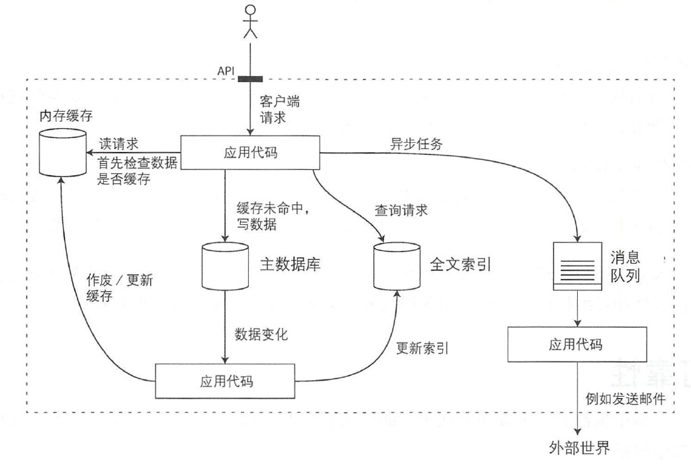

# ddia

## 数据系统基础

### 可靠、可扩展、可维护的应用系统

* 数据库 用以存储数据，之后应用可以再次访问
* 高速缓存 缓存那些复杂或操作代价昂贵的结果，以加快下一次访问
* 索引 用户可以按关键字搜索数据井支持各种过滤
* 流式处理 持续发送消息至另一个进程，处理采用异步方式
* 批处理 定期处理打量的累积数据

### 数据模型与查询语言

### 存储引擎

### 编码格式和序列化技术

