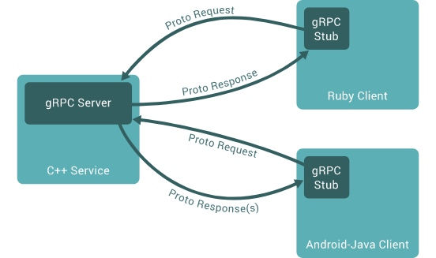
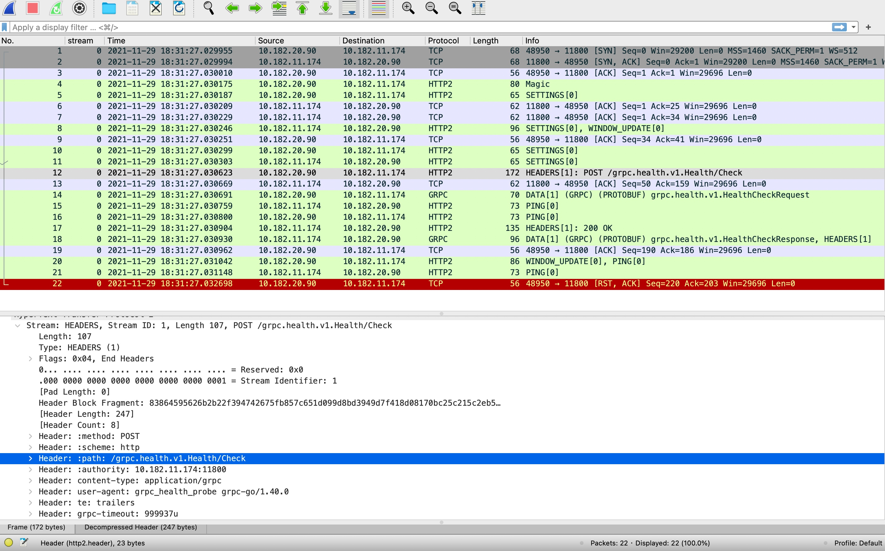
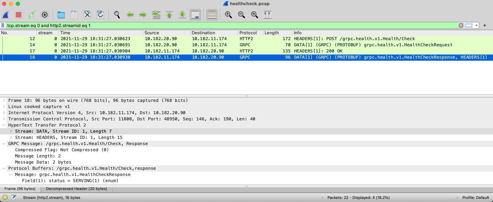

[toc]

# GRPC

## Tools

1. 抓包

	环境：Wireshark 3.6+
	设置：Preferences -> Protocols -> ProtoBuf -> Edit(*.proto path)
	使用：Stream -> Decoded As(右键) -> HTTP2
	
	
	
	
	
2. 发健康检测请求

	grpc_health_probe
	https://github.com/grpc-ecosystem/grpc-health-probe
	
	> 需要区分 CPU 型号

## Reference

### Grpc

https://grpc.io/

https://github.com/grpc/grpc

https://github.com/grpc/grpc/blob/master/doc/health-checking.md

https://github.com/grpc-ecosystem/grpc-health-probe

https://github.com/grpc/grpc/blob/master/doc/PROTOCOL-HTTP2.md

### HTTP/2

https://http2.github.io/

https://datatracker.ietf.org/doc/html/rfc7540

https://datatracker.ietf.org/doc/html/rfc5234

### SkyWaling's Grpc

https://github.com/apache/skywalking/blob/master/docs/en/setup/backend/backend-health-check.md

