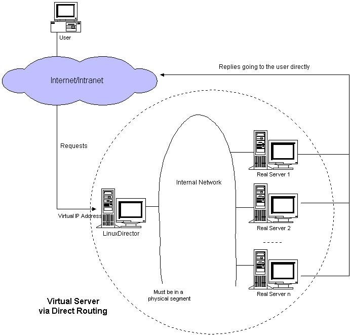

[toc]
# LVS原理及部署
## LVS介绍
### IPVS

在调度器的实现技术中，IP负载均衡技术是效率最高的。在已有的IP负载均衡技术中有通过网络地址转换（Network Address Translation）将一组服务器构成一个高性能的、高可用的虚拟服务器，我们称之为VS/NAT技术（Virtual Server via Network Address Translation），大多数商品化的IP负载均衡调度器产品都是使用此方法，如Cisco的LocalDirector、F5的Big/IP和 Alteon的ACEDirector。在分析VS/NAT的缺点和网络服务的非对称性的基础上，我们提出通过IP隧道实现虚拟服务器的方法VS/TUN （Virtual Server via IP Tunneling），和通过直接路由实现虚拟服务器的方法VS/DR（Virtual Server via Direct Routing），它们可以极大地提高系统的伸缩性。所以，IPVS软件实现了这三种IP负载均衡技术，它们的大致原理如下:

1. Virtual Server via Network Address Translation（VS/NAT）
通过网络地址转换，调度器重写请求报文的目标地址，根据预设的调度算法，将请求分派给后端的真实服务器；真实服务器的响应报文通过调度器时，报文的源地址被重写，再返回给客户，完成整个负载调度过程。

2. Virtual Server via IP Tunneling（VS/TUN）
采用NAT技术时，由于请求和响应报文都必须经过调度器地址重写，当客户请求越来越多时，调度器的处理能力将成为瓶颈。为了解决这个问题，调度器把请求报 文通过IP隧道转发至真实服务器，而真实服务器将响应直接返回给客户，所以调度器只处理请求报文。由于一般网络服务应答比请求报文大许多，采用 VS/TUN技术后，集群系统的最大吞吐量可以提高10倍。

3. Virtual Server via Direct Routing（VS/DR）
VS/DR通过改写请求报文的MAC地址，将请求发送到真实服务器，而真实服务器将响应直接返回给客户。同VS/TUN技术一样，VS/DR技术可极大地 提高集群系统的伸缩性。这种方法没有IP隧道的开销，对集群中的真实服务器也没有必须支持IP隧道协议的要求，但是要求调度器与真实服务器都有一块网卡连 在同一物理网段上。

针对不同的网络服务需求和服务器配置，IPVS调度器实现了如下八种负载调度算法：

1. 轮叫（Round Robin）
调度器通过"轮叫"调度算法将外部请求按顺序轮流分配到集群中的真实服务器上，它均等地对待每一台服务器，而不管服务器上实际的连接数和系统负载。

2. 加权轮叫（Weighted Round Robin）
调度器通过"加权轮叫"调度算法根据真实服务器的不同处理能力来调度访问请求。这样可以保证处理能力强的服务器处理更多的访问流量。调度器可以自动问询真实服务器的负载情况，并动态地调整其权值。

3. 最少链接（Least Connections）
调度器通过"最少连接"调度算法动态地将网络请求调度到已建立的链接数最少的服务器上。如果集群系统的真实服务器具有相近的系统性能，采用"最小连接"调度算法可以较好地均衡负载。

4. 加权最少链接（Weighted Least Connections）
在集群系统中的服务器性能差异较大的情况下，调度器采用"加权最少链接"调度算法优化负载均衡性能，具有较高权值的服务器将承受较大比例的活动连接负载。调度器可以自动问询真实服务器的负载情况，并动态地调整其权值。

5. 基于局部性的最少链接（Locality-Based Least Connections）
"基于局部性的最少链接" 调度算法是针对目标IP地址的负载均衡，目前主要用于Cache集群系统。该算法根据请求的目标IP地址找出该目标IP地址最近使用的服务器，若该服务器 是可用的且没有超载，将请求发送到该服务器；若服务器不存在，或者该服务器超载且有服务器处于一半的工作负载，则用"最少链接"的原则选出一个可用的服务 器，将请求发送到该服务器。

6. 带复制的基于局部性最少链接（Locality-Based Least Connections with Replication）
"带复制的基于局部性最少链接"调度算法也是针对目标IP地址的负载均衡，目前主要用于Cache集群系统。它与LBLC算法的不同之处是它要维护从一个 目标IP地址到一组服务器的映射，而LBLC算法维护从一个目标IP地址到一台服务器的映射。该算法根据请求的目标IP地址找出该目标IP地址对应的服务 器组，按"最小连接"原则从服务器组中选出一台服务器，若服务器没有超载，将请求发送到该服务器，若服务器超载；则按"最小连接"原则从这个集群中选出一 台服务器，将该服务器加入到服务器组中，将请求发送到该服务器。同时，当该服务器组有一段时间没有被修改，将最忙的服务器从服务器组中删除，以降低复制的 程度。

7. 目标地址散列（Destination Hashing）
"目标地址散列"调度算法根据请求的目标IP地址，作为散列键（Hash Key）从静态分配的散列表找出对应的服务器，若该服务器是可用的且未超载，将请求发送到该服务器，否则返回空。

8. 源地址散列（Source Hashing）
"源地址散列"调度算法根据请求的源IP地址，作为散列键（Hash Key）从静态分配的散列表找出对应的服务器，若该服务器是可用的且未超载，将请求发送到该服务器，否则返回空。

### KTCPVS

在基于IP负载调度技术中，当一个TCP连接的初始SYN报文到达时，调度器就选择一台服务器，将报文转发给它。此后通过查发报文的IP和TCP报文头地 址，保证此连接的后继报文被转发到该服务器。这样，IPVS无法检查到请求的内容再选择服务器，这就要求后端服务器组提供相同的服务，不管请求被发送到哪 一台服务器，返回结果都是一样的。但是，在有些应用中后端服务器功能不一，有的提供HTML文档，有的提供图片，有的提供CGI，这就需要基于内容的调度 (Content-Based Scheduling)。

由于用户空间TCP Gateway的开销太大，我们提出在操作系统的内核中实现Layer-7交换方法，来避免用户空间与核心空间的切换和内存复制的开销。在Linux操作系统的内核中，我们实现了Layer-7交换，称之为KTCPVS（Kernel TCP Virtual Server）。目前，KTCPVS已经能对HTTP请求进行基于内容的调度，但它还不很成熟，在其调度算法和各种协议的功能支持等方面，有大量的工作需要做。

## 体系结构

一般来说，LVS集群采用三层结构，其体系结构如图1所示，三层主要组成部分为：
负载调度器（load balancer），它是整个集群对外面的前端机，负责将客户的请求发送到一组服务器上执行，而客户认为服务是来自一个IP地址（我们可称之为虚拟IP地址）上的。
服务器池（server pool），是一组真正执行客户请求的服务器，执行的服务有WEB、MAIL、FTP和DNS等。
共享存储（shared storage），它为服务器池提供一个共享的存储区，这样很容易使得服务器池拥有相同的内容，提供相同的服务。

调度器是服务器集群系统的唯一入口点（Single Entry Point），它可以采用IP负载均衡技术、基于内容请求分发技术或者两者相结合。在IP负载均衡技术中，需要服务器池拥有相同的内容提供相同的服务。当 客户请求到达时，调度器只根据服务器负载情况和设定的调度算法从服务器池中选出一个服务器，将该请求转发到选出的服务器，并记录这个调度；当这个请求的其 他报文到达，也会被转发到前面选出的服务器。在基于内容请求分发技术中，服务器可以提供不同的服务，当客户请求到达时，调度器可根据请求的内容选择服务器 执行请求。因为所有的操作都是在Linux操作系统核心空间中将完成的，它的调度开销很小，所以它具有很高的吞吐率。

服务器池的结点数目是可变的。当整个系统收到的负载超过目前所有结点的处理能力时，可以在服务器池中增加服务器来满足不断增长的请求负载。对大多数 网络服务来说，请求间不存在很强的相关性，请求可以在不同的结点上并行执行，所以整个系统的性能基本上可以随着服务器池的结点数目增加而线性增长。

负载调度器、服务器池和共享存储系统通过高速网络相连接，如100Mbps交换网络、Myrinet和Gigabit网络等，避免当系统规模扩大时互联网络成为整个系统的瓶颈。

通常，我们在调度器上有资源监测进程来时刻监视各个服务器结点的健康状况。当服务器对ICMP ping不可达时或者探测她的网络服务在指定的时间没有响应时，资源监测进程通知操作系统内核将该服务器从调度列表中删除或者失效。这样，新的服务请求就 不会被调度到坏的结点。资源监测进程能通过电子邮件或传呼机向管理员报告故障。一旦监测进程到服务器恢复工作，通知调度器将其加入调度列表进行调度。另 外，通过系统提供的管理程序，管理员可发命令随时可以将新机器加入服务来提高系统的处理性能，也可以将已有的服务器切出服务，以便对服务器进行系统维护。

现在前端的调度器有可能成为系统的单一失效点（Single Point of Failure）。为了避免调度器失效而导致整个系统不能工作，我们需要设立一个从调度器作为主调度器的备份。两个心跳（Heartbeat）进程[6]分 别在主、从调度器上运行，它们通过串口线和UDP等心跳线来相互定时地汇报各自的健康状况。当从调度器不能听得主调度器的心跳时，从调度器通过ARP欺骗 （Gratuitous ARP）来接管集群对外的Virtual IP Address，同时接管主调度器的工作来提供负载调度服务。当主调度器恢复时，这里有两种方法，一是主调度器自动变成从调度器，二是从调度器释放 Virtual IP Address，主调度器收回Virtual IP Address并提供负载调度服务。这里，多条心跳线可以使得因心跳线故障导致误判（即从调度器认为主调度器已经失效，其实主调度器还在正常工作）的概论 降到最低。

通常，当主调度器失效时，主调度器上所有已建立连接的状态信息将丢失，已有的连接会中断。客户需要向重新连接，从调度器才会将新连接调 度到各个服务器上，这对客户会造成一定的不便。为此，IPVS调度器在Linux 内核中实现一种高效状态同步机制，将主调度器的状态信息及时地同步到从调度器。当从调度器接管时，绝大部分已建立的连接会持续下去。

## IP负载均衡

在已有的IP负载均衡技术中，主要有通过网络地址转换（Network Address Translation）将一组服务器构成一个高性能的、高可用的虚拟服务器，我们称之为VS/NAT技术（Virtual Server via Network Address Translation）。在分析VS/NAT的缺点和网络服务的非对称性的基础上，我们提出了通过IP隧道实现虚拟服务器的方法VS/TUN （Virtual Server via IP Tunneling），和通过直接路由实现虚拟服务器的方法VS/DR（Virtual Server via Direct Routing），它们可以极大地提高系统的伸缩性。

### VS解决方法

在网络服务中，一端是客户程序，另一端是服务程序，在中间可能有代理程序。由此看来，可以在不同的层次上实现多台服务器的负载均衡。用集群解决网络服务性能问题的现有方法主要分为以下四类。

1. 基于RR-DNS

    NCSA的可伸缩的WEB服务器系统就是最早基于RR-DNS（Round-Robin Domain Name System）的原型系统，结构和工作流程如下图所示：
    
    
    有一组WEB服务器，他们通过分布式文件系统AFS(Andrew File System)来共享所有的HTML文档。这组服务器拥有相同的域名（如www.ncsa.uiuc.edu），当用户按照这个域名访问时, RR-DNS服务器会把域名轮流解析到这组服务器的不同IP地址，从而将访问负载分到各台服务器上。这种方法带来几个问题：
    
    1. 域名服务器是一个分布式系统，是按照一定的层次结构组织的。当用户就域名解析请求提交给本地的域名服务器，它会因不能直接解析而依次向上一级域名服务器提交，直到RR-DNS域名服器把这个域名解析到其中一台服务器的IP地址。可见，从用户到RR-DNS间存在多台域名服器，而它们都会缓冲已解析的名字到IP地址的映射,这会导致该域名服器组下所有用户都会访问同一WEB服务器，出现不同WEB服务器间严重的负载不平衡。为了保证在域名服务器中域名到IP地址的映射不被长久缓冲，RR-DNS在域名到IP地址的映射上设置一个TTL(Time To Live)值，过了这一段时间，域名服务器将这个映射从缓冲中淘汰。这就涉及到如何设置这个TTL值，若这个值太大，在这个TTL期间，很多请求会被映射到同一台WEB服务器上，同样会导致严重的负载不平衡。若这个值太小，例如是０，会导致本地域名服务器频繁地向RR-DNS提交请求，增加了域名解析的网络流量，同样会使RR-DNS服务器成为系统中一个新的瓶颈。

    2. 用户机器会缓冲从名字到IP地址的映射，而不受TTL值的影响，用户的访问请求会被送到同一台WEB服务器上。由于用户访问请求的突发性和访问方式不同，例如有的人访问一下就离开了，而有的人访问可长达几个小时，所以各台服务器间的负载仍存在倾斜（Skew）而不能控制。当TTL值为0时，因为用户访问的突发性也会存在着较严重的负载不平衡。

    3. 系统的可靠性和可维护性差。若一台服务器失效，会导致将域名解析到该服务器的用户看到服务中断，需要修改RR-DNS服 务器中的IP地址列表，把该服务器的IP地址从中划掉，然后等上几天或者更长的时间，等所有域名服器将该域名到这台服务器的映射淘汰，和所有映射到这台服务器的客户机不再使用该站点为止。

2. 基于客户端
    
    需要每个客户程序都有一定的服务器集群的知识，进而把以负载均衡的方式将请求发到不同的服务器。例如，Netscape Navigator浏览器访问Netscape的主页时，它会随机地从一百多台服务器中挑选第N台，最后将请求送往wwwN.netscape.com。然而，这不是很好的解决方法，Netscape只是利用它的Navigator避免了RR-DNS解析的麻烦，当使用IE等其他浏览器不可避免的要进行 RR-DNS解析。
    
    Smart Client是Berkeley做的另一种基于客户端的解决方法。服务提供一个Java Applet在客户方浏览器中运行，Applet向各个服务器发请求来收集服务器的负载等信息，再根据这些信息将客户的请求发到相应的服务器。高可用性也在Applet中实现，当服务器没有响应时，Applet向另一个服务器转发请求。这种方法的透明性不好，Applet向各服务器查询来收集信息会增加额外的网络流量，不具有普遍的适用性。

3. 基于应用层负载均衡调度

    多台服务器通过高速的互联网络连接成一个集群系统，在前端有一个基于应用层的负载调度器。当用户访问请求到达调度器时，请求会提交给作负载均衡调度的应用程 序，分析请求，根据各个服务器的负载情况，选出一台服务器，重写请求并向选出的服务器访问，取得结果后，再返回给用户。

    应用层负载均衡调度的典型代表有Zeus负载调度器、pWeb、Reverse-Proxy和SWEB等。Zeus负载调度器是Zeus公司的商业 产品，它是在Zeus Web服务器程序改写而成的，采用单进程事件驱动的服务器结构。pWeb就是一个基于Apache 1.1服务器程序改写而成的并行WEB调度程序，当一个HTTP请求到达时，pWeb会选出一个服务器，重写请求并向这个服务器发出改写后的请求，等结果返回后，再将结果转发给客户。Reverse-Proxy利用Apache 1.3.1中的Proxy模块和Rewrite模块实现一个可伸缩WEB服务器，它与pWeb的不同之处在于它要先从Proxy的cache中查找后，若没有这个副本，再选一台服务器，向服务器发送请求，再将服务器返回的结果转发给客户。SWEB是利用HTTP中的redirect错误代码，将客户请求到 达一台WEB服务器后，这个WEB服务器根据自己的负载情况，自己处理请求，或者通过redirect错误代码将客户引到另一台WEB服务器，以实现一个 可伸缩的WEB服务器。

    基于应用层负载均衡调度的多服务器解决方法也存在一些问题：

    1. 系统处理开销特别大，致使系统的伸缩性有限。当请求到达负载均衡调度器至处理结束时，调度器需要进行四次从核心到用户空间或从用户空间到核心空间的上下文切换和内存复制；需要进行二次TCP连接，一次是从用户到调度器，另一次是从调度器到真实服务器；需要对请求进行分析和重写。这些处理都需要不小的CPU、内存和网络等资源开销，且处理时间长。所构成系统的性能不能接近线性增加的，一般服务器组增至3或4台时，调度器本身可能会成为新的瓶颈。所以，这种基于应用层负载均衡调度的方法的伸缩性极其有限。

    2. 基于应用层的负载均衡调度器对于不同的应用，需要写不同的调度器。以上几个系统都是基于HTTP协议，若对于FTP、Mail、POP3等应用，都需要重写调度器。

4. 基于IP层负责均衡调度

    用户通过虚拟IP地址（Virtual IP Address）访问服务时，访问请求的报文会到达负载调度器，由它进行负载均衡调度，从一组真实服务器选出一个，将报文的目标地址Virtual IP Address改写成选定服务器的地址，报文的目标端口改写成选定服务器的相应端口，最后将报文发送给选定的服务器。真实服务器的回应报文经过负载调度器时，将报文的源地址和源端口改为Virtual IP Address和相应的端口，再把报文发给用户。Berkeley的MagicRouter、Cisco的LocalDirector、Alteon的ACEDirector和F5的Big/IP等都是使用网络地址转换方法。MagicRouter是在Linux 1.3版本上应用快速报文插入技术，使得进行负载均衡调度的用户进程访问网络设备接近核心空间的速度，降低了上下文切换的处理开销，但并不彻底，它只是研究的原型系统，没有成为有用的系统存活下来。Cisco的LocalDirector、Alteon的ACEDirector和F5的Big/IP是非常昂贵的商品化系统，它们支持部分TCP/UDP协议，有些在ICMP处理上存在问题。

    IBM的TCP Router使用修改过的网络地址转换方法在SP/2系统实现可伸缩的WEB服务器。TCP Router修改请求报文的目标地址并把它转发给选出的服务器，服务器能把响应报文的源地址置为TCP Router地址而非自己的地址。这种方法的好处是响应报文可以直接返回给客户，坏处是每台服务器的操作系统内核都需要修改。IBM的 NetDispatcher是TCP Router的后继者，它将报文转发给服务器，而服务器在non-ARP的设备配置路由器的地址。这种方法与LVS集群中的VS/DR类似，它具有很高的可伸缩性，但一套在IBM SP/2和NetDispatcher需要上百万美金。总的来说，IBM的技术还挺不错的。

    在贝尔实验室的ONE-IP中，每台服务器都独立的IP地址，但都用IP Alias配置上同一VIP地址，采用路由和广播两种方法分发请求，服务器收到请求后按VIP地址处理请求，并以VIP为源地址返回结果。这种方法也是为了避免回应报文的重写，但是每台服务器用IP Alias配置上同一VIP地址，会导致地址冲突，有些操作系统会出现网络失效。通过广播分发请求，同样需要修改服务器操作系统的源码来过滤报文，使得只有一台服务器处理广播来的请求。

    微软的Windows NT负载均衡服务（Windows NT Load Balancing Service，WLBS）是1998年底收购Valence Research公司获得的，它与ONE-IP中的基于本地过滤方法一样。WLBS作为过滤器运行在网卡驱动程序和TCP/IP协议栈之间，获得目标地址为VIP的报文，它的过滤算法检查报文的源IP地址和端口号，保证只有一台服务器将报文交给上一层处理。但是，当有新结点加入和有结点失效时，所有服务器 需要协商一个新的过滤算法，这会导致所有有Session的连接中断。同时，WLBS需要所有的服务器有相同的配置，如网卡速度和处理能力。

### VS/NAT

VS/NAT的体系结构如图所示。在一组服务器前有一个调度器，它们是通过Switch/HUB相连接的。这些服务器提供相同的网络服务、相同的内容。

NAT的工作原理是报文头（目标地址、源地址和端口等）被正确改写后，客户相信它们连接一个IP地址，而不同IP地址的服务器组也认为它们是与客户直接相连的。由此，可以用NAT方法将不同IP地址的并行网络服务变成在一个IP地址上的一个虚拟服务。

客户通过Virtual IP Address（虚拟服务的IP地址）访问网络服务时，请求报文到达调度器，调度器根据连接调度算法从一组真实服务器中选出一台服务器，将报文的目标地址Virtual IP Address改写成选定服务器的地址，报文的目标端口改写成选定服务器的相应端口，最后将修改后的报文发送给选出的服务器。同时，调度器在连接Hash 表中记录这个连接，当这个连接的下一个报文到达时，从连接Hash表中可以得到原选定服务器的地址和端口，进行同样的改写操作，并将报文传给原选定的服务 器。当来自真实服务器的响应报文经过调度器时，调度器将报文的源地址和源端口改为Virtual IP Address和相应的端口，再把报文发给用户。我们在连接上引入一个状态机，不同的报文会使得连接处于不同的状态，不同的状态有不同的超时值。在TCP 连接中，根据标准的TCP有限状态机进行状态迁移；在UDP中，我们只设置一个UDP状态。不同状态的超时值是可以设置的，在缺省情况下，SYN状态的超时为1分钟，ESTABLISHED状态的超时为15分钟，FIN状态的超时为1分钟；UDP状态的超时为5分钟。当连接终止或超时，调度器将这个连接从连接Hash表中删除。

### VS/TUN

在VS/NAT 的集群系统中，请求和响应的数据报文都需要通过负载调度器，当真实服务器的数目在10台和20台之间时，负载调度器将成为整个集群系统的新瓶颈。大多数Internet服务都有这样的特点：请求报文较短而响应报文往往包含大量的数据。如果能将请求和响应分开处理，即在负载调度器中只负责调度请求而响应直 接返回给客户，将极大地提高整个集群系统的吞吐量。

IP隧道（IP tunneling）是将一个IP报文封装在另一个IP报文的技术，这可以使得目标为一个IP地址的数据报文能被封装和转发到另一个IP地址。IP隧道技 术亦称为IP封装技术（IP encapsulation）。IP隧道主要用于移动主机和虚拟私有网络（Virtual Private Network），在其中隧道都是静态建立的，隧道一端有一个IP地址，另一端也有唯一的IP地址。

我们利用IP隧道技术将请求报文封装转 发给后端服务器，响应报文能从后端服务器直接返回给客户。但在这里，后端服务器有一组而非一个，所以我们不可能静态地建立一一对应的隧道，而是动态地选择一台服务器，将请求报文封装和转发给选出的服务器。这样，我们可以利用IP隧道的原理将一组服务器上的网络服务组成在一个IP地址上的虚拟网络服务。VS/TUN的体系结构如图4所示，各个服务器将VIP地址配置在自己的IP隧道设备上。

它的连接调度和管理与VS/NAT中的一样，只是它的报文转发方法不同。调度器根据各个服务器的负载情况，动态地选择一台服务器， 将请求报文封装在另一个IP报文中，再将封装后的IP报文转发给选出的服务器；服务器收到报文后，先将报文解封获得原来目标地址为VIP的报文，服务器发 现VIP地址被配置在本地的IP隧道设备上，所以就处理这个请求，然后根据路由表将响应报文直接返回给客户。

根据缺省的TCP/IP协议栈处理，请求报文的目标地址为VIP，响应报文的源地址肯定也为VIP，所以响应报文不需要作任何修改，可以直接返回给客户，客户认为得到正常的服务，而不会知道究竟是哪一台服务器处理的。

### VS/DR

跟VS/TUN 方法相同，VS/DR利用大多数Internet服务的非对称特点，负载调度器中只负责调度请求，而服务器直接将响应返回给客户，可以极大地提高整个集群 系统的吞吐量。

VS/DR的体系结构如图所示：调度器和服务器组都必须在物理上有一个网卡通过不分断的局域网相连，如通过高速的交换机或者HUB相连。VIP地址为调度器和服务器组共享，调度 器配置的VIP地址是对外可见的，用于接收虚拟服务的请求报文；所有的服务器把VIP地址配置在各自的Non-ARP网络设备上，它对外面是不可见的，只 是用于处理目标地址为VIP的网络请求。

VS/DR 的工作流程如图8所示：它的连接调度和管理与VS/NAT和VS/TUN中的一样，它的报文转发方法又有不同，将报文直接路由给目标服务器。在VS/DR 中，调度器根据各个服务器的负载情况，动态地选择一台服务器，不修改也不封装IP报文，而是将数据帧的MAC地址改为选出服务器的MAC地址，再将修改后 的数据帧在与服务器组的局域网上发送。因为数据帧的MAC地址是选出的服务器，所以服务器肯定可以收到这个数据帧，从中可以获得该IP报文。当服务器发现 报文的目标地址VIP是在本地的网络设备上，服务器处理这个报文，然后根据路由表将响应报文直接返回给客户。

在VS/DR中，根据缺省的TCP/IP协议栈处理，请求报文的目标地址为VIP，响应报文的源地址肯定也为VIP，所以响应报文不需要作任何修改，可以直接返回给客户，客户认为得到正常的服务，而不会知道是哪一台服务器处理的。

VS/DR负载调度器跟VS/TUN一样只处于从客户到服务器的半连接中，按照半连接的TCP有限状态机进行状态迁移。

### 优缺点分析

三种IP负载均衡技术的优缺点归纳在下表中：

_	VS/NAT	VS/TUN	VS/DR
Server	any	Tunneling	Non-arp device
server network	private	LAN/WAN	LAN
server number	low (10~20)	High (100)	High (100)
server gateway	load balancer	own router	Own router

注： 以上三种方法所能支持最大服务器数目的估计是假设调度器使用100M网卡，调度器的硬件配置与后端服务器的硬件配置相同，而且是对一般Web服务。使用更 高的硬件配置（如千兆网卡和更快的处理器）作为调度器，调度器所能调度的服务器数量会相应增加。当应用不同时，服务器的数目也会相应地改变。所以，以上数 据估计主要是为三种方法的伸缩性进行量化比较。

1. Virtual Server via NAT

    VS/NAT 的优点是服务器可以运行任何支持TCP/IP的操作系统，它只需要一个IP地址配置在调度器上，服务器组可以用私有的IP地址。缺点是它的伸缩能力有限， 当服务器结点数目升到20时，调度器本身有可能成为系统的新瓶颈，因为在VS/NAT中请求和响应报文都需要通过负载调度器。 我们在Pentium 166 处理器的主机上测得重写报文的平均延时为60us，性能更高的处理器上延时会短一些。假设TCP报文的平均长度为536 Bytes，则调度器的最大吞吐量为8.93 MBytes/s. 我们再假设每台服务器的吞吐量为800KBytes/s，这样一个调度器可以带动10台服务器。（注：这是很早以前测得的数据）

    基于 VS/NAT的的集群系统可以适合许多服务器的性能要求。如果负载调度器成为系统新的瓶颈，可以有三种方法解决这个问题：混合方法、VS/TUN和 VS/DR。在DNS混合集群系统中，有若干个VS/NAT负载调度器，每个负载调度器带自己的服务器集群，同时这些负载调度器又通过RR-DNS组成简 单的域名。但VS/TUN和VS/DR是提高系统吞吐量的更好方法。

    对于那些将IP地址或者端口号在报文数据中传送的网络服务，需要编写相应的应用模块来转换报文数据中的IP地址或者端口号。这会带来实现的工作量，同时应用模块检查报文的开销会降低系统的吞吐率。

2. Virtual Server via IP Tunneling

    在VS/TUN 的集群系统中，负载调度器只将请求调度到不同的后端服务器，后端服务器将应答的数据直接返回给用户。这样，负载调度器就可以处理大量的请求，它甚至可以调 度百台以上的服务器（同等规模的服务器），而它不会成为系统的瓶颈。即使负载调度器只有100Mbps的全双工网卡，整个系统的最大吞吐量可超过 1Gbps。所以，VS/TUN可以极大地增加负载调度器调度的服务器数量。VS/TUN调度器可以调度上百台服务器，而它本身不会成为系统的瓶颈，可以 用来构建高性能的超级服务器。

    VS/TUN技术对服务器有要求，即所有的服务器必须支持“IP Tunneling”或者“IP Encapsulation”协议。目前，VS/TUN的后端服务器主要运行Linux操作系统，我们没对其他操作系统进行测试。因为“IP Tunneling”正成为各个操作系统的标准协议，所以VS/TUN应该会适用运行其他操作系统的后端服务器。

3. Virtual Server via Direct Routing

    跟VS/TUN方法一样，VS/DR调度器只处理客户到服务器端的连接，响应数据可以直接从独立的网络路由返回给客户。这可以极大地提高LVS集群系统的伸缩性。

    跟VS/TUN相比，这种方法没有IP隧道的开销，但是要求负载调度器与实际服务器都有一块网卡连在同一物理网段上，服务器网络设备（或者设备别名）不作ARP响应，或者能将报文重定向（Redirect）到本地的Socket端口上。

## 负载调度算法

[TBC](http://www.linuxvirtualserver.org/zh/lvs4.html)

### 内核中的副总调度算法

### 动态反馈负载均衡算法

