# Mock Server

# Mock Server

## 功能

接收请求，做出预配置的处理。

1. 返回预期Response

	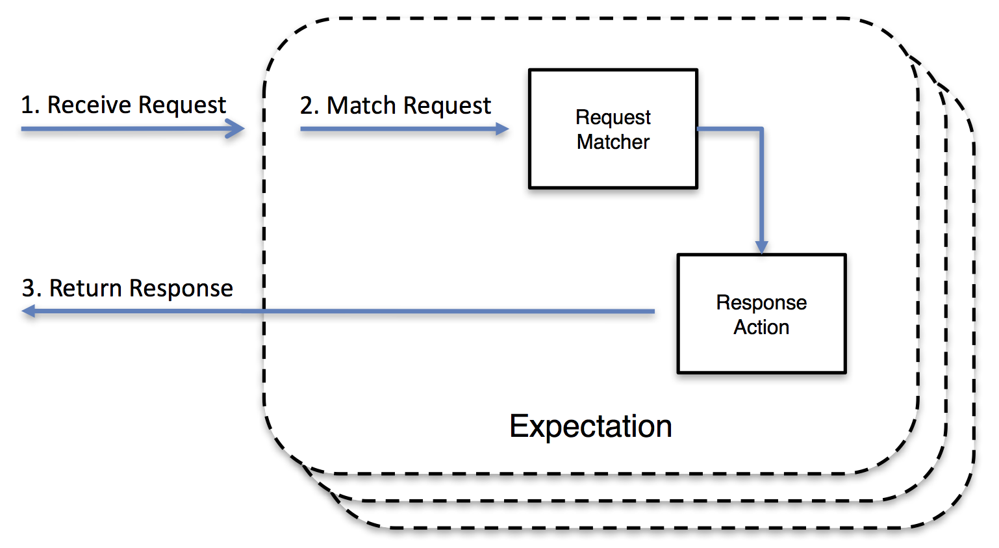

2. Request符合预期时，继续传递

	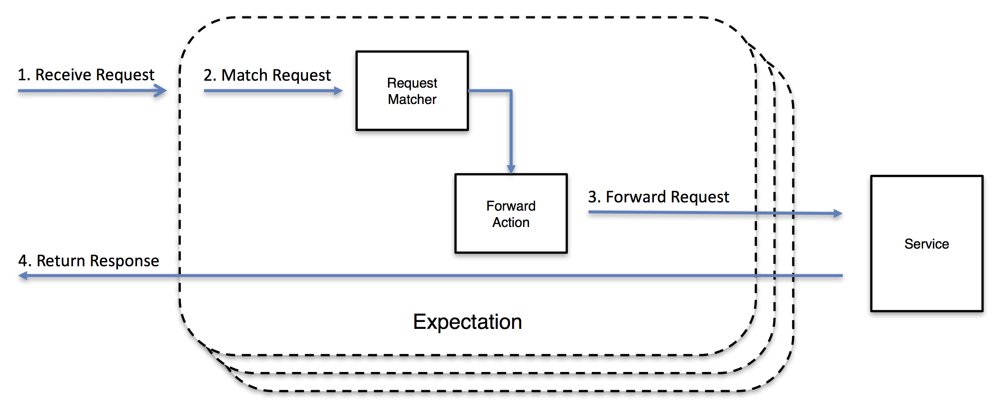

3. Request符合预期时，回调

	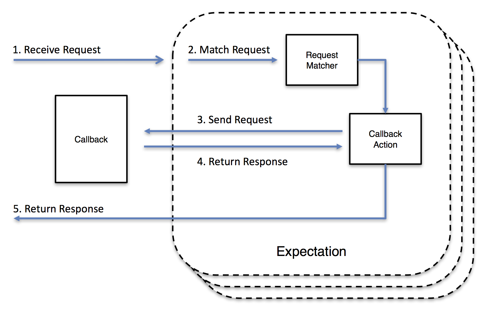

4. Request符合预期时，返回不合法值或断连

	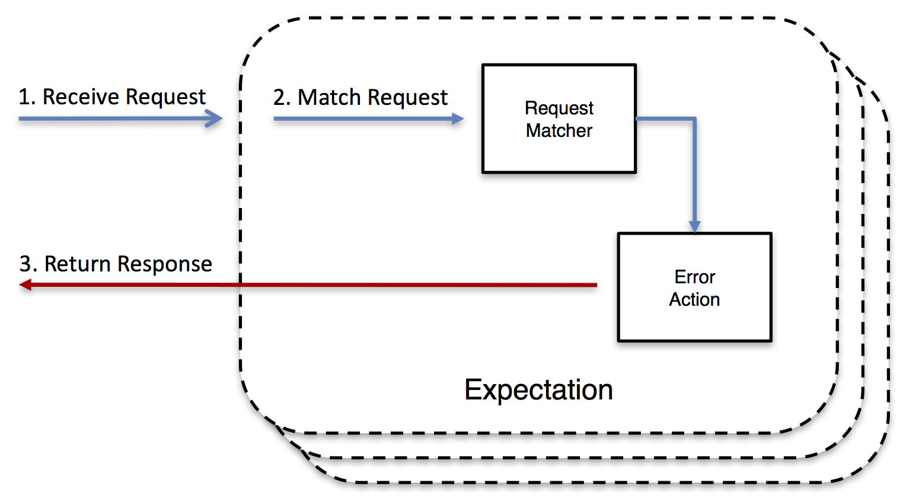

5. 验证Request是否发送成功
	
	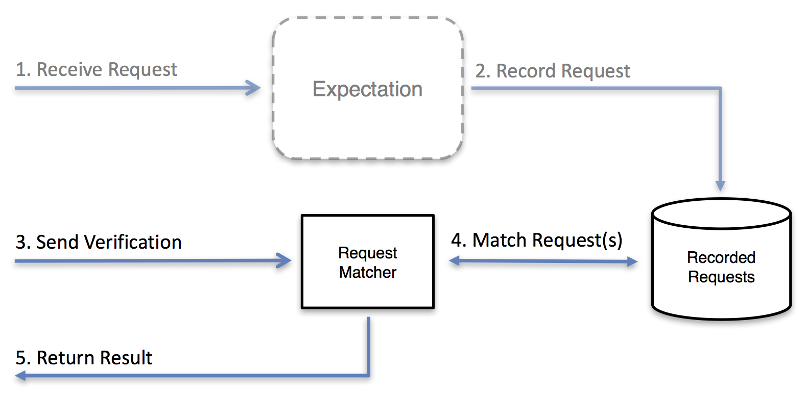

6. 检索日志、请求、预期值

	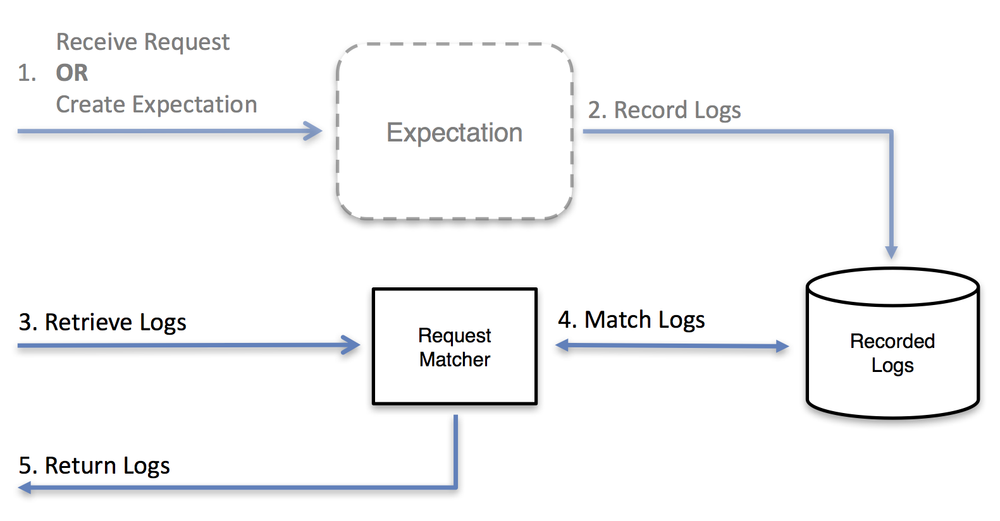

## 使用场景

1. 测试

	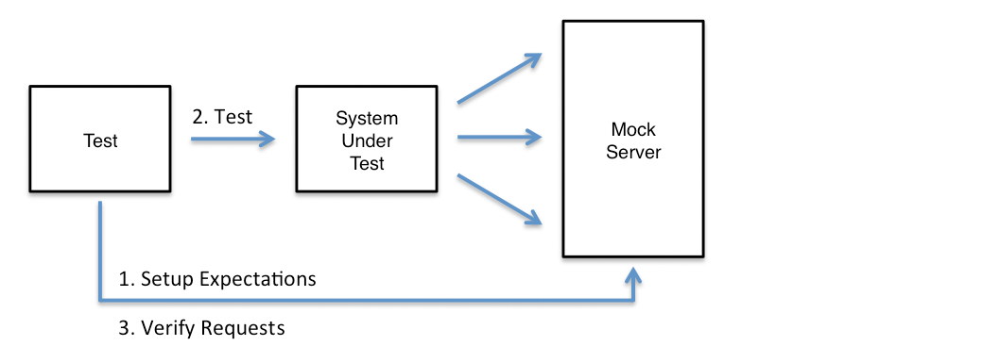

2. 解耦开发
	
	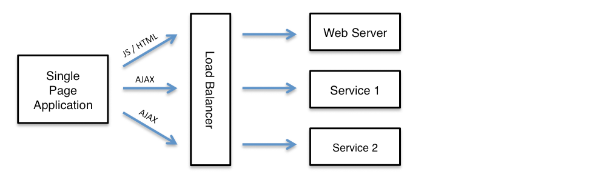

3. 隔离单个服务

	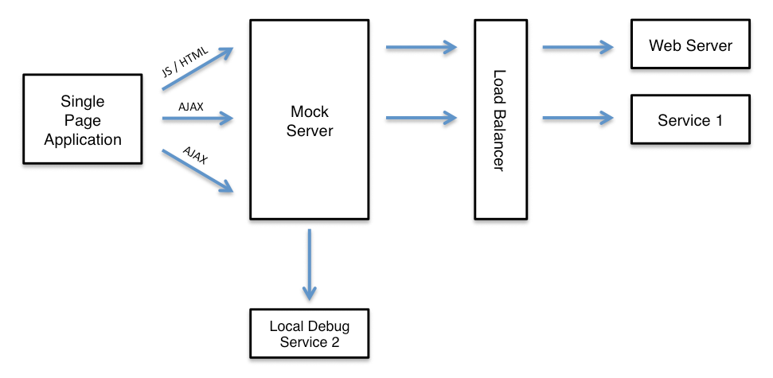

## Mock Server Proxy

### 功能

透传、验证、记录所有请求。

### 使用场景

1. 测试

2. 分析现有系统
	
	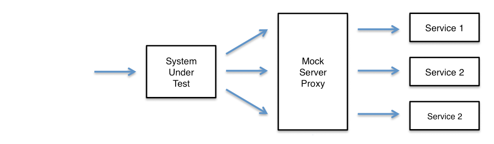

3. 调试HTTP交互
4. 记录&重放

	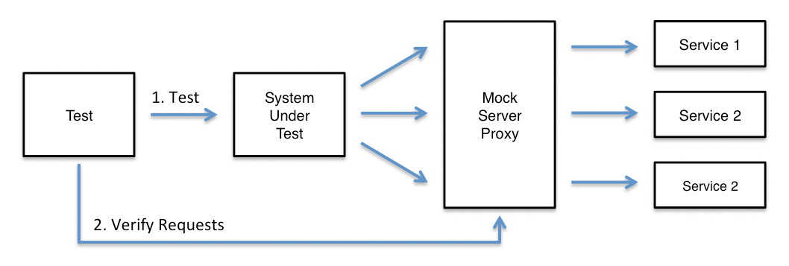

## Reference

http://www.mock-server.com/

