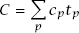
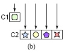
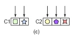
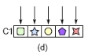

# 软件设计的哲学

---

## 1. 软件设计问题

> **小节概要：** 软件设计的核心在于分解复杂问题、降低复杂性，并借助高层级哲学概念来引导设计决策。

### 1.1 问题分解

- 将一个复杂问题分解为可以独立解决的部分。

### 1.2 解决复杂性

- **使代码更简单和更易理解**
  - 例如：消除特殊情况或以一致的方式使用标识符来降低复杂性。
- **模块化设计**
  - 例如：通过封装，避免程序员立即暴露在所有复杂性面前。

### 1.3 设计哲学的作用

- 用哲学相关的高层级概念来比较方案、引导探索设计空间。

---

## 2. 复杂性

### 2.1 复杂性的本质

> **小节概要：** 复杂性是使软件系统难以理解和修改的一切事物，其产生于依赖性和模糊性，并以增量方式不断累积。

#### 2.1.1 定义

- **实用角度**：复杂性指那些与软件系统相关的，而且让系统难以理解和修改的任何事物。
- **成本收益角度**：复杂系统中，实施很小改进需要大量工作；简单系统中，可以用更少精力实施更大改进。
- **复杂性取决于最常见的活动**：
  - 系统总体复杂性 C = Σ (子系统复杂性 cp × 研发耗时加权 tp)
      - 
  - **思考**：
    - 效率亦然，效率取决于最常见的活动。
    - 性能优化亦然，效果取决于与目标关联最强部分的优化。

#### 2.1.2 症状

- **变更放大**：简单变更需要在许多不同地方修改代码。
- **认知负荷**：研发需要多少知识才能完成一项任务。
- **未知的未知**：最危险的复杂性形式——你甚至不知道需要了解什么。

#### 2.1.3 原因

- **依赖性**：模块之间的相互关联。
- **模糊性**：重要信息不明显。

#### 2.1.4 复杂性是增量产生的

- 复杂性不是某一次巨大失误造成的，而是无数小决策逐步累积的结果。

---

### 2.2 降低复杂性的重要性

> **小节概要：** 仅仅让代码"能跑"是不够的，好的设计需要通过深模块、信息隐藏、通用接口和分层抽象等手段系统性地降低复杂性。

#### 2.2.1 工作代码是不够的

- 代码正确运行只是最低要求，良好的设计同样重要。

#### 2.2.2 深模块

- 好的模块应该是"深的"——提供强大功能的同时，对外暴露简单的接口。

#### 2.2.3 信息隐藏和泄露

**信息隐藏**

- **最佳形式**：将信息完全隐藏在模块中，从而使该信息对模块用户无关且不可见。
- **部分隐藏也有价值**：
  - 常用特性要精简，避免在常用特性的 API 中迫使用户了解少用特性的知识。
  - 例如，如果某特性或信息只被少数类使用，且只通过单独方法访问，在最常见场景中信息不可见，所以它们在大部分情况下也是隐藏的。

**信息泄露**

- **核心**：多个地方使用相同知识。
  - 一个设计决策反映在多个模块中时，在模块间创建了依赖关系，对该设计决策的任何更改都将要求对所有涉及的模块进行更改，会发生信息泄露。
- **表现形式**：
  - 接口泄露。
  - 两个类具有特定的知识（例如，一个类按某格式读，另一个类按某格式写）。

**时间顺序分解**

- 按操作的时间顺序拆分模块是一种常见的设计陷阱，容易导致信息泄露。

**类内部的信息隐藏**

- 使用 `private` 方法。
- 减少每个实例变量的使用位置数量，消除类内依赖关系并降低复杂性。

**做过头**

- **重点**：识别模块外部需要哪些信息，并确保公开。
- 信息隐藏只有在被隐藏的信息在模块外部不需要时才有意义。
  - 例如，反例是假设配置参数影响模块性能，且不同参数会设置不同模块用途，应该将参数暴露在模块接口中，以便调整。

**信息隐藏和深模块密切相关**

- 如果模块隐藏了很多信息，则往往会增加模块提供的功能，同时还会减少其对外接口数量，这使得模块更深。相反，如果一个模块没有隐藏太多信息，则它要么功能不多，要么接口复杂，无论哪种方式，模块都是浅的。
- 将系统分解为模块时，尽量不要受运行时操作顺序的影响，否则你将沿着时间顺序分解的错误道路前进，这将导致信息泄露和浅模块。相反，请考虑执行应用程序任务所需的不同知识，并在设计每个模块时封装这些知识中的一个或几个。这样将产生一个整洁和简单的深模块设计。

#### 2.2.4 通用模块更深入

**类设计决策**

- **使类的接口足够通用**：
  - 以"有点"通用的方式实现新模块，模块功能反映当前需求，接口则足够通用以支持多种用途。
  - 通用接口比专用接口更深、更简单、代码量更少。
  - 即使以专用方式使用类，以通用方式构建类也更容易。
- **通用性通过更清晰的分隔从而更好地隐藏信息**。
- **通过问题识别整洁的通用类**：
  - 满足当前所有需求的最简单接口是什么？
    - 减少 API 中方法数量而不降低整体功能，可能正在创建更通用的方法。
  - 这个方法会在多少种情况下被使用？
  - 这个 API 对于当前需求来说是否易于使用？
    - 避免过于通用以至于难以满足当前功能需求。
- **将专用代码上移/下移**：
  - 下移：依赖反转？
- **消除代码里的特殊情况**：
  - 以一种无需任何额外代码就能自动处理边界情况的方式来设计正常情况。

**类设计目标**

- 允许每个类独立开发。
- 确定谁需要知道什么、何时需要知道（边界）。
  - 当细节很重要时，最好使它们明确且尽可能明显，此时隐藏信息只会产生模糊性。

#### 2.2.5 不同层级，不同抽象

> **小节概要：** 软件系统的每一层级都应提供不同的抽象，相邻层级出现相似抽象（如透传方法）是设计不良的危险信号。

**透传方法：相邻层级具有相似抽象（危险信号）**

- **问题**：
  - 责任划分混淆（功能、抽象）——相关类职责划分不明确，让类变浅（增加类接口复杂性、系统复杂性），但没有增加系统整体功能。
  - 会在类间创建依赖关系。
- **解决**：重构，使每个类有各自不同且连贯的职责。
- **方法**：
  - 将较低层级的类直接暴露给较高层级的调用者，而从较高层级的类中移除对该功能的所有责任。
      - 
  - 在类间重新分配功能。
      - 
  - 将某个功能的接口聚合在一个类中。
      - 

**可以有重复接口的情况**

- **重点**：每种新方法都应贡献有用且独特的功能，纯透传不提供新功能。
- 分发器 Dispatcher；同一接口不同实现（同层，不互调）。

**装饰器**

- **动机**：将类的专用扩展与通用核心功能分开。
- **问题**：
  - 装饰器类往往很浅——引入大量样板以实现少量新功能。
    - 例如：Java I/O 中的 `BufferedInputStream` 与 `InputStream`。
  - 包含大量透传方法。
- **替代方法**：
  - **将方法添加至基础类**——适用于新功能相对通用、逻辑上与基础类相关、使用基础类的大多数时候也使用新功能的情况。
    - 例如：几乎每个用 `InputStream` 的人都会创建 `BufferedInputStream`，并且缓冲是 I/O 的自然组成部分，应该合并。
  - 如果新功能专用于特定用例，将其与用例合并。
  - 将新功能与现有装饰器合并，产生一个更深的装饰器类。
  - 新功能是否真的需要包装现有功能，能否实现为独立于基础类的独立类？
    - 例如：滚动条、主窗口可以分开实现，而无需包装所有现有功能。
- **适合场景**：系统使用的外部类接口不能被修改，但该外部类必须适配应用的接口，此时适合使用包装器类翻译接口。

**接口与实现**

- 类的接口与实现通常应该不同。
  - 例如：文本类对外提供字符接口，对内按行实现；GS 对外提供 SubTable 接口，对内按 Page 实现。

**透传变量**

- **Context + 不可变变量**：
  - **Pros**：统一系统全局信息处理，不需要透传变量，便于测试。
  - **Cons**：存在全局变量的大多数缺点。比如，特定变量何处、何时使用不明显，容易在系统中创建不明显的依赖关系；线程安全问题。
- **Bad Case**：
  - 全局变量：同进程内只有一份，容易访问冲突且不便测试。
  - 透传变量：路径上所有方法都感知，修改不便。

**结论**

- 添加到系统中的每个设计元素（接口、参数、函数、类、定义）都会增加复杂性，因为开发人员必须了解该元素。为了使一个设计元素在对抗复杂性时产生净收益，它必须消除没有该设计元素时出现的复杂性，否则，最好在没有该特定元素的情况下实现系统。
  - 例如：类通过封装功能降低复杂性，这样类的用户不必知道具体功能实现。

#### 2.2.6 下沉复杂性

> **小节概要：** 当模块存在不可避免的复杂性时，应优先在模块内部处理，为使用者提供简单的接口。

- 新模块存在不可避免的复杂性时：
  1. 让模块使用者处理复杂性，即接口复杂、实现简单。
  2. **（优选）** 复杂性与模块功能有关，则在模块内部处理复杂性，即接口简单、实现复杂。

#### 2.2.7 在一起更好还是分开更好

- 这是一个需要根据具体场景权衡的设计问题。

---

### 2.3 如何识别不必要的复杂性

> **小节概要：** 识别系统中不必要的复杂性，是持续改进设计质量的关键能力。

---

## 3. 降低复杂性的技术

> **小节概要：** 通过定义不存在的错误、多次设计迭代、良好的注释习惯、一致性和代码可读性等具体技术手段来降低系统复杂性。

### 3.1 定义不存在的错误

- 通过重新定义操作语义，使原本需要处理的错误情况不复存在，从而简化错误处理逻辑。

### 3.2 设计它两次

- 对于重要的设计决策，至少考虑两种不同方案进行对比，然后选择更优的设计。

### 3.3 注释

- **写注释的理由**：注释是降低认知负荷和消除未知的重要工具。
- **注释应该描述代码中不明显的内容**：不要重复代码本身已经表达的信息。
- **选择好的名字**：好的命名可以减少注释的需要，但不能完全替代注释。
- **先写注释**：在编写代码之前先写注释，有助于理清设计思路。

### 3.4 修改现有代码

- 在修改现有代码时，应同时改善代码结构，避免让复杂性持续增长。

### 3.5 一致性

- 在整个系统中保持一致的编码风格和设计模式，降低认知负荷。

### 3.6 代码应该显而易见

- 代码的行为和意图应该从代码本身就能看出来，减少读者的猜测成本。

---

## 4. 软件发展趋势

> **小节概要：** 审视当前软件工程中的主流趋势，并从设计哲学的角度评估其对系统复杂性的影响。

---

## 5. 设计性能

> **小节概要：** 性能优化同样需要以设计思维来指导，避免因性能优化而破坏系统的简洁性和可维护性。

---

## 6. 结论

> **小节概要：** 软件设计的终极目标是管理复杂性——通过深模块、信息隐藏、通用接口和清晰的抽象层级，持续构建易于理解和演进的系统。
