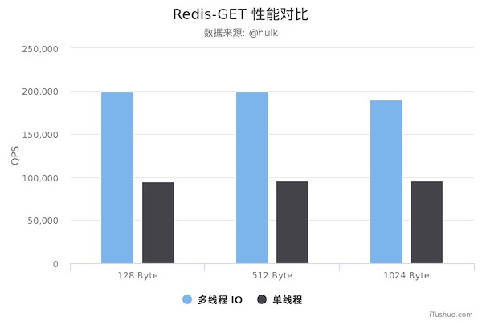
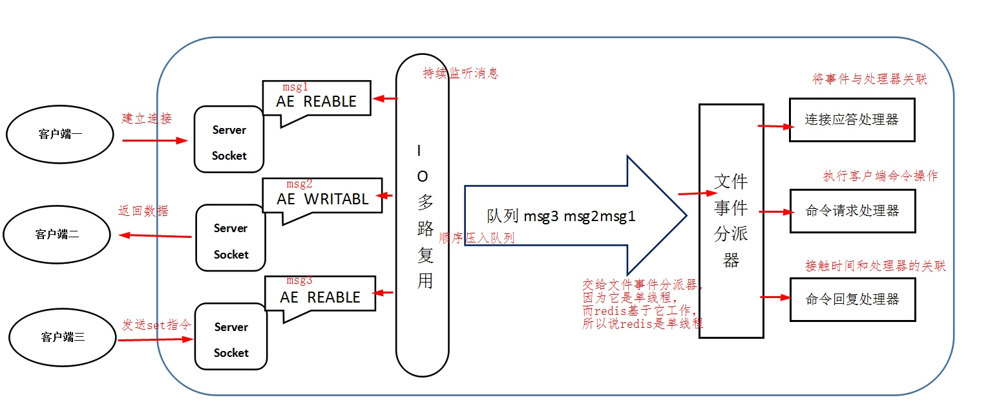

# Redis

[toc]

## 一些传闻

1. Redis 单线程
	
	避免了不必要的上下文切换和竞争条件，也不存在多进程或者多线程导致的切换而消耗 CPU，不用去考虑各种锁的问题，不存在加锁释放锁操作。
	
	使用多路I/O复用模型，非阻塞IO。
	
	``` bash
	[root@10-77-121-227 redis-4.0.8]# ps -p 161771 -T
   PID   SPID TTY          TIME CMD
161771 161771 ?        00:00:00 redis-server
161771 161772 ?        00:00:00 redis-server
161771 161773 ?        00:00:00 redis-server
161771 161774 ?        00:00:00 redis-server
	```
	
	Redis 4.0 引入多线程处理后台操作，如删除对象等。
	Redis 6.0 引入多线程处理 IO，默认单线程。
	
	[一个据说并不严谨的测试](https://blog.csdn.net/weixin_45583158/article/details/100143587)
	
	


2. Redis 完全基于内存
	
	瓶颈更多存在于内存、网络，而不是 CPU。

3. 数据结构简单，对数据操作也简单
	
	Redis中的数据结构是专门进行设计的

## Redis 是什么，解决什么问题


## 工作模型

Redis基于Reactor模式开发了网络事件处理器，这个处理器被称为文件事件处理器。它的组成结构为4部分：多个套接字、IO多路复用程序、文件事件分派器、事件处理器。
因为文件事件分派器队列的消费是单线程的，所以Redis才叫单线程模型。



### I/O 模型


### 处理模型


### 数据结构


## 源码分析


## 发展时间线


## 未来发展


