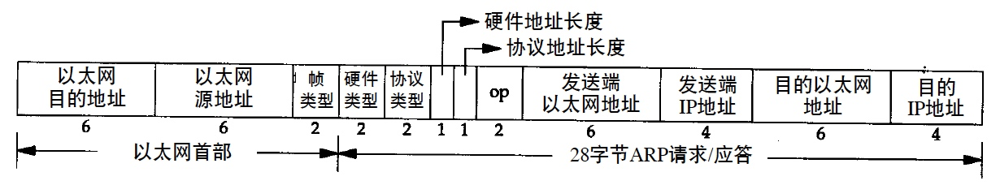

[toc]

# ARP & RARP


# ARP

## 一个例子

```
ftp bsdi
```

1. DNS
	
	ftp client调用gethostbyname(host -> ip)

2. TCP
	
	使用ip建连，首先发送一份IP数据报（SYN）
	
3. IP

	* 目的主机在本地网络（以太网、令牌环网或点对点链接的另一端），IP数据报可以直接发送到目的主机上（点对点不使用ARP，设置链路时就必须告知内核链路每一端的IP地址）
	* 目的主机在远程网络上，通过IP选路函数确定下一跳路由器地址，并让它转发IP数据报

4. ARP

	假定本地网络是一个以太网，需要将32位IP -> 48位以太网地址。
	
	* ARP将称作ARP请求的以太网数据帧广播给以太网上每个主机，请求中包含目的主机IP地址
	* 目的主机的ARP层收到广播报文后，识别并且发送ARP应答，返回IP地址及对应的硬件地址

5. TCP
	
	发送IP数据报

## 高速缓存

```
➜  media git:(master) ✗ arp -a
? (192.168.43.1) at 96:87:e0:a7:b8:79 on en0 ifscope [ethernet]
? (224.0.0.251) at 1:0:5e:0:0:fb on en0 ifscope permanent [ethernet]
? (239.255.255.250) at 1:0:5e:7f:ff:fa on en0 ifscope permanent [ethernet]
```

每台机器有一个ARP高速缓存，存放最近 `Internet地址 -> 硬件地址` 的映射记录，从创建开始计算生存时间一般 `20min`。

## 分组格式



> 可以解析IP地址以外的地址

ARP请求和回答的数据帧长 `42字节（28字节的ARP数据，14字节的以太网帧头）` 因此每一帧都必须加入填充字符以达到以太网的最小长度要求 `60字节`。它不包含4字节的一淘网帧尾。

# RARP

## 分组格式

* RARP和ARP的主要差别是是RARP请求或应答的帧类型代码为0x8035，而且RARP请求的操作代码为3，应答操作代码为4
* RARP请求是广播，而RARP应答一般是单播

