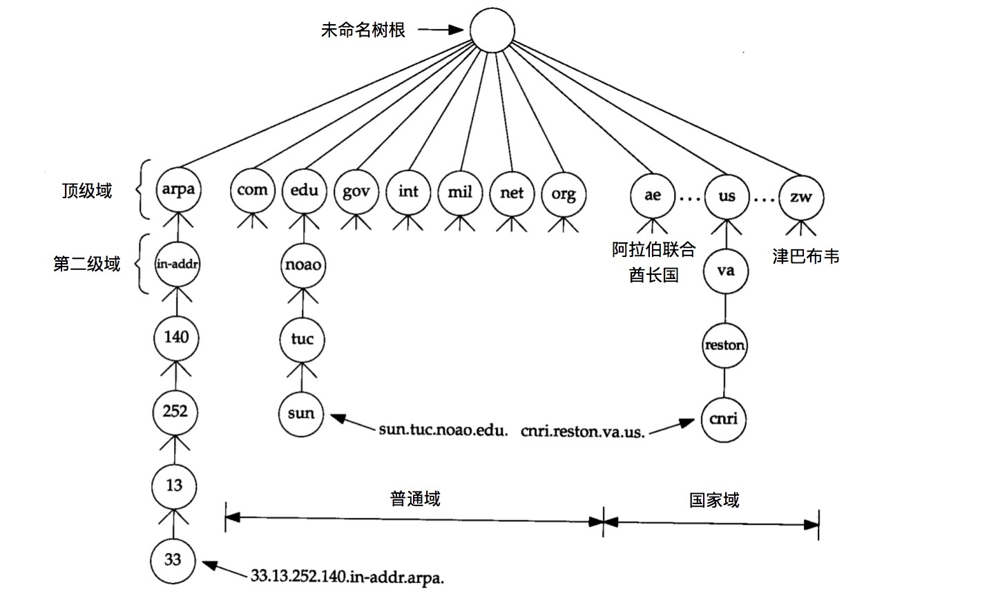
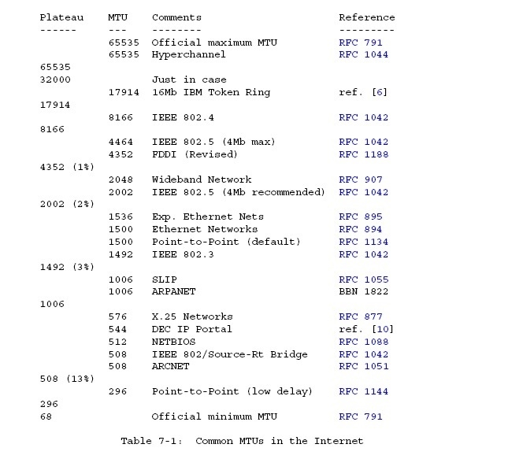

[toc]

# DNS

## DNS基础

DNS是提供主机名字和IP地址转换功能的分布式数据库，具有层次结构，每个结点由[1,63]个字符标识。



顶级域名分为三部分

* arpa 地址到名字转换的特殊域
* 7个3字符长的普通域
	* com, edu, gov, ...
* 2字符长的国家域或地理域

网络信息中心NIC负责分配顶级域和和委派其他指定区域的授权机构，一个独立管理的DNS子树称为一个区域**zone**。一个名字服务器负责一个或多个zone，提供至少一个互相独立且冗余的主、辅名字服务器，主服务器从磁盘文件中调入该区域所有信息，辅名字服务器从主服务器同步，也称作区域同步。

当有新主机加入一个区域时，区域管理者将信息（至少name和ip）加入到主名字服务器的一个磁盘文件中，然后通知主名字服务器重新调入配置文件，辅名字服务器定时（通常3h）向主名字服务器查询是否有新数据并区域同步。


域名服务器按层次分为

* 根域名服务器 13个不同IP地址的根域名服务器，名称[a-m]，每个根域名服务器与它的镜像域名服务器共享一个IP，请求路由到最近的镜像域名服务器
* 顶级域名服务器 管理二级域名
* 权限域名服务器 管理区域的域名解析
* 本地域名服务器 主机首先请求的域名服务器

所有主名字服务器都必须知道根服务器的IP（不是域名），根服务器知道所有二级域中每个授权名字服务器的名字和IP。

当一个名字服务器没有被请求的信息时，它需要知道其他名字服务器的IP，处理流程如下


使用高速缓存。

## DNS协议报文


## IPv4 vs. IPv6

## Dig分析解析结果

## Wireshark分析DNS协议

## 一些有趣的问题


### What's IP packet size

RFC 791: maximum packet 576 octets.
RFC 1123: Limited by UDP, DNS record type size < 512 bytes, so resolvers and name servers should implement TCP services as a backup.

IPv4 UDP packet

* 20 bytes IP header
* <= 40 bytes IP options
* 8 bytes UDP header
* payload

IP header ∈ [28, 68] bytes while all hosts accept a 576 byte IP packet, so maximum UDP payload is 512 bytes. `??? 不是512-68=508吗`

If the reply is 

* <= 512 bytes, send a response over UDP
* > 512 bytes, send a response over UDP with TRUNCATED bit in DNS payload
	* trigger the client to re-query using TCP
		

RFC 2671: sender's UDP payload size is the number of octets that cal be reassembled and delivered in the sender's network stack. Note that path MTU, with or without fragment, may be smaller than this.

```
Datagram = Data block + Datagram header = 512 + 64 = 576 octets
Datagram header = typical internet header + margins for higher level protocols = 20 + 44 = 64
```

### Why UDP 512 bytes



Internet大多数网络接口`MTU < 512`，若`size > MTU`可能导致IP分片。由于只有1片带端口号信息，其他分片可能被防火墙拒绝导致通信障碍，为了保证信息通畅无阻需要

```
DNS报文 + UDP + IP < MTU
```

即

```
DNS报文 < MTU - UDP - IP = 512 - 8 - 20 = 484
```

取整

```
DNS报文 < 512
```

### Why 13 dns root domains

Nameserver starts up getting a list of root nameserver IP addresses to validate or update the built-in list.

DNS packet

* Header 12 bytes
* Question Section 5 bytes
	* root-label 1 byte
	* class 2 bytes
	* qtype 2 bytes
* Resource Record 31 bytes
	* root-label 1 byte
	* ttl 4 bytes
	* class 2 bytes
	* type 2 bytes
	* rdlength 2 bytes
	* nameserver name 20 bytes `<1>a<12>root-servers<3>net<0>`
* Other Record 15 bytes
	* root-label
	* ttl
	* class
	* type
	* rdlength
	* compression 4 bytes `<1><letter><compression pointer>`
* A Record 20 bytes ( with compression 16 bytes)
	* nameserver name 20 bytes
	* ttl 4 bytes
	* class 2 bytes
	* types 2 bytes
	* rdlength 2 bytes
	* address 4 bytes

DNS packet size

```
12       ;; ->>HEADER<<-
 5       ;; QUESTION SECTION:
31 + 15n ;; ANSWER SECTION:
     16m ;; ADDITIONAL SECTION:
```

Usually m = n, so the equation becomes

```
48 + 31n = 512
       n = 464 / 31 = 14.96
```


## Reference

https://ripe67.ripe.net/presentations/112-2013-10-16-dns-protocol.pdf
https://www.ietf.org/rfc/rfc1034.txt DNS概念和功能
https://www.ietf.org/rfc/rfc1035.txt DNS规范和实现


