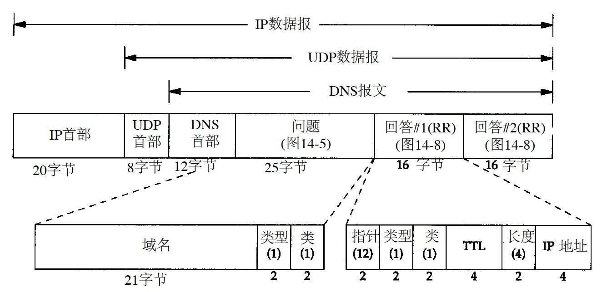

[toc]

# DNS 域名系统

# DNS基础

DNS是提供主机名字和IP地址转换功能的分布式数据库，具有层次结构，每个结点由[1,63]个字符标识。


顶级域名分为三部分

* arpa 地址到名字转换的特殊域
* 7个3字符长的普通域
	* com, edu, gov, ...
* 2字符长的国家域或地理域

网络信息中心NIC负责分配顶级域和和委派其他指定区域的授权机构，一个独立管理的DNS子树称为一个区域**zone**。一个名字服务器负责一个或多个zone，提供至少一个互相独立且冗余的主、辅名字服务器，主服务器从磁盘文件中调入该区域所有信息，辅名字服务器从主服务器同步，也称作区域同步。

当有新主机加入一个区域时，区域管理者将信息（至少name和ip）加入到主名字服务器的一个磁盘文件中，然后通知主名字服务器重新调入配置文件，辅名字服务器定时（通常3h）向主名字服务器查询是否有新数据并区域同步。


域名服务器按层次分为

* 根域名服务器 13个不同IP地址的根域名服务器，名称[a-m]，每个根域名服务器与它的镜像域名服务器共享一个IP，请求路由到最近的镜像域名服务器
* 顶级域名服务器 管理二级域名
* 权限域名服务器 管理区域的域名解析
* 本地域名服务器 主机首先请求的域名服务器

所有主名字服务器都必须知道根服务器的IP（不是域名），根服务器知道所有二级域中每个授权名字服务器的名字和IP。

当一个名字服务器没有被请求的信息时，它需要知道其他名字服务器的IP，处理流程如下


在标准的Unix实现中，高速缓存是由域名服务器而不是由域名解析器维护，任何一个使用名字服务器的应用均可获得高速缓存，在该站点使用这个名字服务器的任何其他主机也能共享服务器的高速缓存。

# DNS协议报文

## 报文格式

1. 报文的总体格式

	

	* opcode 通常值为0（标准查询），其他值为1（反向查询）和2（服务器状态请求
	* TC是1 bit字段，表示“可截断的(truncated)”。使用UDP时，表示当应答的总长度超过512字节时，只返回前512个字节，剩余部分放到下一片
	* RD是1 bit字段表示“期望递归（recursion desired）”。该比特能在一个查询中设置，并在响应中返回。
		* 为1，名字服务器必须处理这个查询，也称为一个递归查询
		* 为0，且被请求的名字服务器没有一个授权回答，它就返回一个能解答该查询的其他名字服务器列表，这称为迭代查询
	

2. 查询问题的格式
	
	

	* 查询名

		

	* DNS问题和响应的类型值和查询类型值
		
		
	
		```
		➜  ~ host -t a weibo.com
		weibo.com has address 123.125.104.26
		weibo.com has address 123.125.104.197
		➜  ~ host -t cname weibo.com
		weibo.com has no CNAME record
		➜  ~ host -t ptr weibo.com
		weibo.com has no PTR record		```

3. 资源记录的格式

	

	DNS报文中最后的三个字段，回答字段、授权字段和附加信息字段，均采用一种称为资源记录RR（Resource Record）的相同格式。
	* 资源记录通常的生存时间值为2天

4. 实际传输的报文

	

## 指针查询

给定一个IP地址，返回与该地址对应的域名。

以 `edu.noao.tuc.sun` 为例，当它加入Internet并获得DNS域名空间的授权，则它们也获得了对应IP地址的in-addr.arpa域名空间的授权，但是DNS名字是由树的底部逐步向上书写的。这意味着对于IP地址为 `140.252.13.33` 的sun主机，它的DNS名字为 `33.13.252.140.in-addr.arpa` 。
从应用的角度上看，正常的名字解析器函数 `gethostbyaddr` 将接收一个IP地址并返回对应主机的有关信息。反转这些字节和添加in-addr.arpa域均由该函数自动完成。

抓包看看实际情况

```
➜  ~ host 140.252.13.34
34.13.252.140.in-addr.arpa domain name pointer pipen14.tuc.noao.edu.
```


IP `140.252.13.34` 已经由客户端转换为 `34.13.252.140.in-addr.arpa` 后再发起请求。

# Wireshark分析DNS协议

1. 抓包

	tcpdump指定端口53过滤出dns相关包，dig先后用udp（默认）、tcp分别发起dns请求，命令及返回如下

	```shell
	➜  ~ tcpdump -i any port 53 -w dns.cap	
	➜  ~ dig weibo.com	
	; <<>> DiG 9.10.6 <<>> weibo.com
	;; global options: +cmd
	;; Got answer:
	;; ->>HEADER<<- opcode: QUERY, status: NOERROR, id: 65469
	;; flags: qr rd ra ad; QUERY: 1, ANSWER: 2, AUTHORITY: 0, ADDITIONAL: 0
	
	;; QUESTION SECTION:
	;weibo.com.			IN	A
	
	;; ANSWER SECTION:
	weibo.com.		60	IN	A	123.125.104.26
	weibo.com.		60	IN	A	123.125.104.197
	
	;; Query time: 3 msec
	;; SERVER: 172.16.0.1#53(172.16.0.1)
	;; WHEN: Sat Jan 19 15:08:28 CST 2019
	;; MSG SIZE  rcvd: 59
	
	➜  ~ dig weibo.com +tcp	
	; <<>> DiG 9.10.6 <<>> weibo.com +tcp
	;; global options: +cmd
	;; Got answer:
	;; ->>HEADER<<- opcode: QUERY, status: NOERROR, id: 55956
	;; flags: qr rd ra; QUERY: 1, ANSWER: 2, AUTHORITY: 0, ADDITIONAL: 0
	
	;; QUESTION SECTION:
	;weibo.com.			IN	A
	
	;; ANSWER SECTION:
	weibo.com.		60	IN	A	123.125.104.26
	weibo.com.		60	IN	A	123.125.104.197
	
	;; Query time: 11 msec
	;; SERVER: 172.16.0.1#53(172.16.0.1)
	;; WHEN: Sat Jan 19 15:08:53 CST 2019
	;; MSG SIZE  rcvd: 59

	```

2. 分析

	wireshark打开`.cap`文件，先用`udp stream eq 0`看基于udp的dns包
	
	* No.1 DNS query based on udp

		
		
		* `Opcode : 0`标准查询
		* `Truncated: Message is not truncated` client端不支持分片，请server端返回完整数据
		* `Recursion desired: Do query recursively` 如果域名解析服务器没有IP地址，递归查询后把结果告诉Client
		* `Non-authenticated data: Unacceptable` 只接受授权服务器的回复
		* `Questions: 1` 问题部分只有1个
		* `weibo.com: type A, class IN` 希望获得IP地址
		* `UDP payload size: 4096` 神秘信息，TBC
		* `EDNS0 version: 0` 神秘信息，TBC

	* No.1 DNS response based on udp
	
		

		* `Answer RRs: 2` 有两个答案部分
		* `Time to live: 60` 有效期60（??? 单位s TBC）
	
	再用`tcp stream eq 0`看基于tcp的dns包

	* No.2 DNS query based on tcp

		

	* No.2 DNS response based on tcp

		

* 调用链


# 用UDP还是TCP

等等，除了多了握手挥手过程，DNS的请求和返回没什么区别，为什么要同时支持udp和tcp呢？

此外，我们知道IP包大小受限于MTU，UDP包小于512 bytes（原因见后文），当返回响应中的TC（删减标志）比特被设置为1时，意味着响应的长度超过了512 bytes，且仅返回前512 bytes。在遇到这种情况时，域名解析器通常使用TCP重发原来的查询请求，它将允许返回的响应超过512 bytes。
此外，区域传送将使用TCP，因为这里传送的数据远比一个查询或响应多得多。

# IPv4 vs. IPv6
	
# 一些有趣的问题

## What's IP packet size

RFC 791: maximum packet 576 octets.
RFC 1123: Limited by UDP, DNS record type size < 512 bytes, so resolvers and name servers should implement TCP services as a backup.

IPv4 UDP packet

* 20 bytes IP header
* <= 40 bytes IP options
* 8 bytes UDP header
* payload

IP header ∈ [28, 68] bytes while all hosts accept a 576 byte IP packet, so maximum UDP payload is 512 bytes. `??? 不是512-68=508吗`

If the reply is 

* <= 512 bytes, send a response over UDP
* > 512 bytes, send a response over UDP with TRUNCATED bit in DNS payload
	* trigger the client to re-query using TCP
		

RFC 2671: sender's UDP payload size is the number of octets that cal be reassembled and delivered in the sender's network stack. Note that path MTU, with or without fragment, may be smaller than this.

```
Datagram = Data block + Datagram header = 512 + 64 = 576 octets
Datagram header = typical internet header + margins for higher level protocols = 20 + 44 = 64
```

## Why UDP 512 bytes


Internet大多数网络接口`MTU < 512`，若`size > MTU`可能导致IP分片。由于只有1片带端口号信息，其他分片可能被防火墙拒绝导致通信障碍，为了保证信息通畅无阻需要

```
DNS报文 + UDP + IP < MTU
```

即

```
DNS报文 < MTU - UDP - IP = 512 - 8 - 20 = 484
```

取整

```
DNS报文 < 512
```

## Why 13 dns root domains

Nameserver starts up getting a list of root nameserver IP addresses to validate or update the built-in list.

DNS packet

* Header 12 bytes
* Question Section 5 bytes
	* root-label 1 byte
	* class 2 bytes
	* qtype 2 bytes
* Resource Record 31 bytes
	* root-label 1 byte
	* ttl 4 bytes
	* class 2 bytes
	* type 2 bytes
	* rdlength 2 bytes
	* nameserver name 20 bytes `<1>a<12>root-servers<3>net<0>`
* Other Record 15 bytes
	* root-label
	* ttl
	* class
	* type
	* rdlength
	* compression 4 bytes `<1><letter><compression pointer>`
* A Record 20 bytes ( with compression 16 bytes)
	* nameserver name 20 bytes
	* ttl 4 bytes
	* class 2 bytes
	* types 2 bytes
	* rdlength 2 bytes
	* address 4 bytes

DNS packet size

```
12       ;; ->>HEADER<<-
 5       ;; QUESTION SECTION:
31 + 15n ;; ANSWER SECTION:
     16m ;; ADDITIONAL SECTION:
```

Usually m = n, so the equation becomes

```
48 + 31n = 512
       n = 464 / 31 = 14.96
```


# Reference

* https://ripe67.ripe.net/presentations/112-2013-10-16-dns-protocol.pdf
* https://www.ietf.org/rfc/rfc1034.txt DNS概念和功能
* https://www.ietf.org/rfc/rfc1035.txt DNS规范和实现


