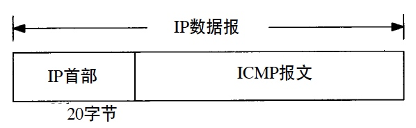
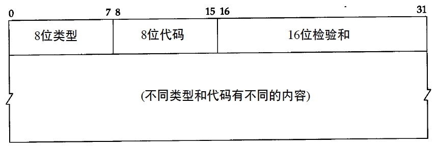
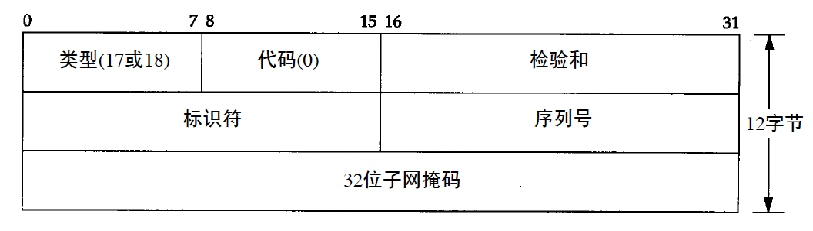
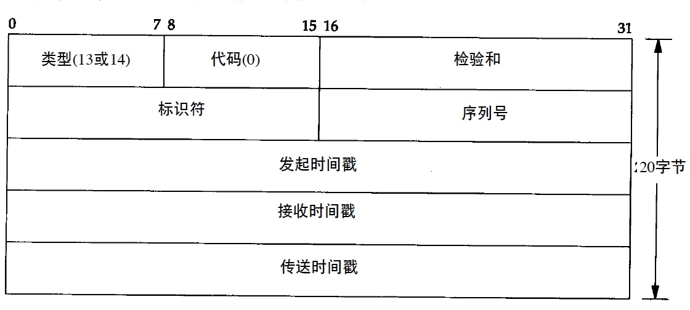
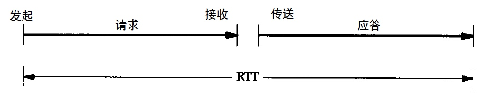
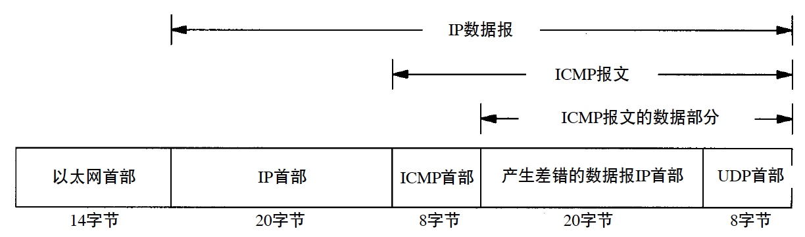
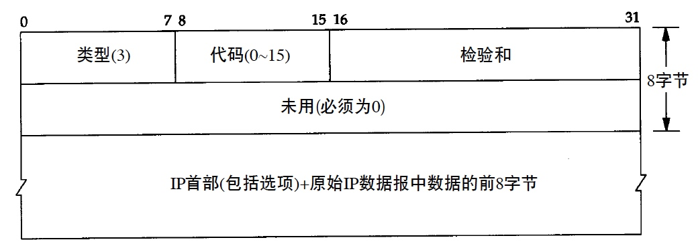
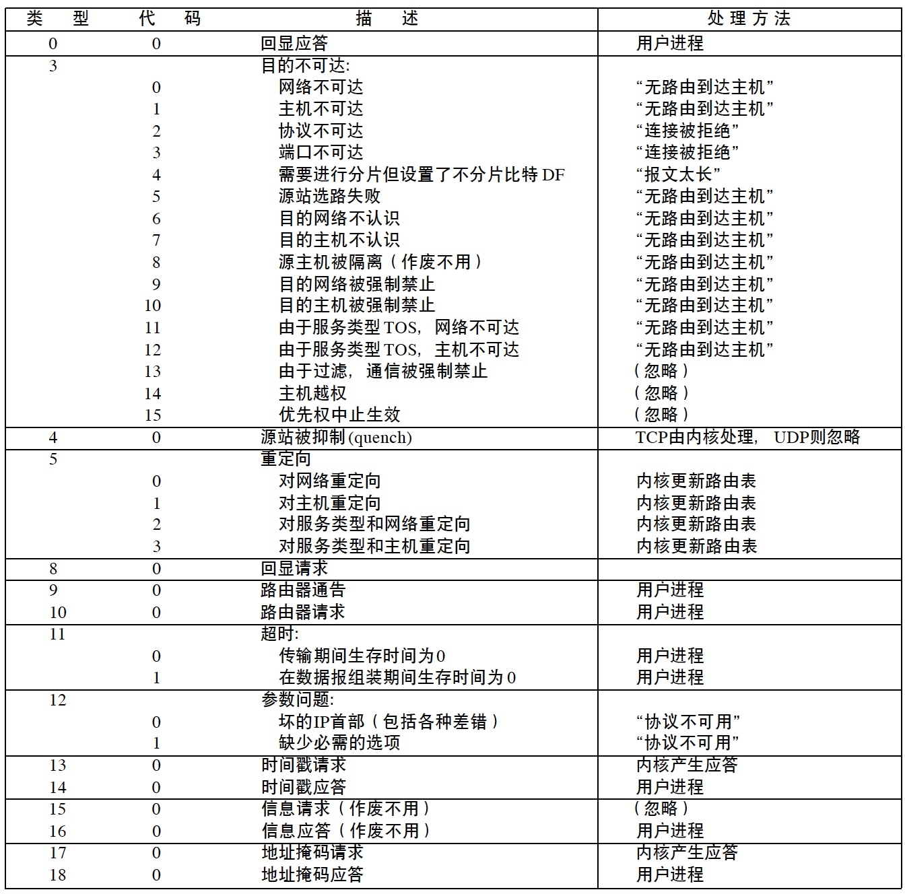

[toc]

# ICMP 

# 介绍

ICMP（Internet控制报文协议），传递差错报文以及其他需要注意的信息。

* ICMP经常被认为是IP层的一个组成部分
* ICMP报文通常被IP层或更高层协议（TCP或UDP）使用
* 一些ICMP报文把差错报文返回给用户进程
* ICMP的正式规范参见RFC 792 [Posterl1981b]

ICMP报文是在IP数据报内部被传输的，报文格式如图

# 报文类型

1. 类型

	| 类型 | 代码 | 描述 | 查询 | 差错 |
	| --- | --- | --- | --- | --- |
	| 0 | 0 | Ping应答 | √ |  |
	| 3 |   | 目的不可达 |  | √ |
	| 3 | 0 | 网络不可达 |  | √ |
	| 3 | 1 | 主机不可达 |  | √ |
	| 3 | 2 | 协议不可达 |  | √ |
	| 3 | 3 | 端口不可达 |  | √ |
	| 3 | 4 | 需要分片但不支持 |  | √ |
	| 3 | 5 | 源站选路失败 |  | √ |
	| 3 | 6 | 目的网络不认识 |  | √ |
	| 3 | 7 | 目的主机不认识 |  | √ |
	| 3 | 8 | 源主机被隔离 |  | √ |
	| 3 | 9 | 目的网络被强制禁止 |  | √ |
	| 3 | 10 | 目的主机被强制禁止 |  | √ |
	| 3 | 11 | 由于服务类型TOS，网络不可达 |  | √ |
	| 3 | 12 | 由于服务类型TOD，主机不可达 |  | √ |
	| 3 | 13 | 由于过滤，通信被强制禁止 |  | √ |
	| 3 | 14 | 主机越权 |  | √ |
	| 3 | 15 | 优先权中止生效 |  | √ |
	| 4 | 0 | 源端被关闭 |  | √ |
	| 5 |  | 重定向 |  | √ |
	| 5 | 0 | 对网络重定向 |  | √ |
	| 5 | 1 | 对主机重定向 |  | √ |
	| 5 | 2 | 对服务类型和网络重定向 |  | √ |
	| 5 | 3 | 对服务类型和主机重定向 |  | √ |
	| 8 | 0 | 请求回显（Ping） | √ |   |
	| 9 | 0 | 路由器通告 | √ |  |
	| 10 | 0 | 路由器请求 | √ |   |
	| 11 |  | 超时 |  | √ |
	| 11 | 0 | 传输期间生存时间为0 |  | √ |
	| 11 | 1 | 数据报组装期间生存时间为0 |  | √ |
	| 12 |  | 参数问题 |  |   |
	| 12 | 0 | 坏的IP首部 |  | √ |
	| 12 | 1 | 缺少必需的选项 |  | √ |
	| 13 | 0 | 时间戳请求 | √ |  |
	| 14 | 0 | 时间戳应答 | √ |  |
	| 15 | 0 | 信息请求 | √ |  |
	| 16 | 0 | 信息应答 | √ |  |
	| 17 | 0 | 地址掩码请求 | √ |  |
	| 18 | 0 | 地址掩码应答 | √ |  |

	当发送一份ICMP差错报文时，报文始终包含IP的首部和产生ICMP差错报文的IP数据报的前8个字节。

	> 这样，接收ICMP差错报文的模块就会把它与某个特定的协议（根据IP数据报首部中的协议字段来判断）和用户进程（根据包含在IP数据报前8个字节中的TCP或UDP报文首部中的TCP或UDP端口号来判断）联系起来

2. 不产生差错报文的情况

	为了防止过去允许ICMP差错报文对广播分组响应所带来的广播风暴，规定了一些不产生ICMP差错报文的情况

	* ICMP差错报文
		* 避免循环产生ICMP差错报文
		* 但ICMP查询报文可能会产生ICMP差错报文
	* 目的地址是广播地址或多播地址的IP数据报
	* 作为链路层广播的数据报
	* 不是IP分片的第一片
	* 源地址不是单个主机的数据报
		* 即，源地址不能为零地址、环回地址、广播地址或多播地址
	
# 地址掩码请求与应答

1. 功能

	ICMP地址掩码请求用于无盘系统在引导过程中获取自己的子网掩码。

	> 无盘系统获取子网掩码的另一个方法是BOOTP协议

2. 报文格式

	

	RFC规定，除非系统是地址掩码的授权代理，否则它不能发送地址掩码应答。

# 时间戳请求与应答

1. 功能

	允许系统向另一个系统查询当前的时间。

	> 返回的建议值是自午夜开始计算的毫秒数，协调的统一时间，提供毫秒级的分辨率

2. 报文格式

	

3. 调整时间戳

	

	如果我们相信RTT的值，并且相信RTT的一半用于请求报文的传输，另一半用于应答报文的传输，那么为了使本机时钟与查询主机的时钟一致，本机时钟需要进行调整，调整值是 `differenct - RTT / 2`

# ICMP端口不可达差错

1. UDP端口不可达的ICMP差错报文示例

	

	* ICMP报文是在主机之间交换的，而不用目的端口号
	* UDP数据报则是在端口间交换
	* ICMP差错报文必须包括生成该差错报文的数据报IP首部（包含任何选项），还必须至少包括跟在该IP首部后面的前8个字节

2. ICMP不可达报文的一般格式

	

3. BSD系统对ICMP报文的处理

	

	* 内核
		* ICMP就由内核来处理
	* 用户进程
		* 报文被传送到所有在内核中登记的用户进程，以读取收到的ICMP报文
		* 如果不存在任何这样的用户进程，那么报文就悄悄地被丢弃
	* 如果最后一列标明的是引号内的一串字符，那么它就是对应的Unix差错，处理细节暂不表

# ICMP如何设置IP的服务类型

TBC

RFC 1349 [Almquist 1992]，图3-2

# netstat实现

TBC

