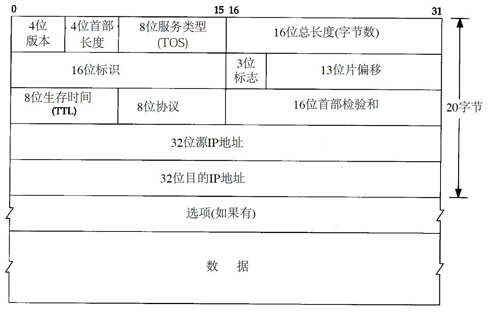
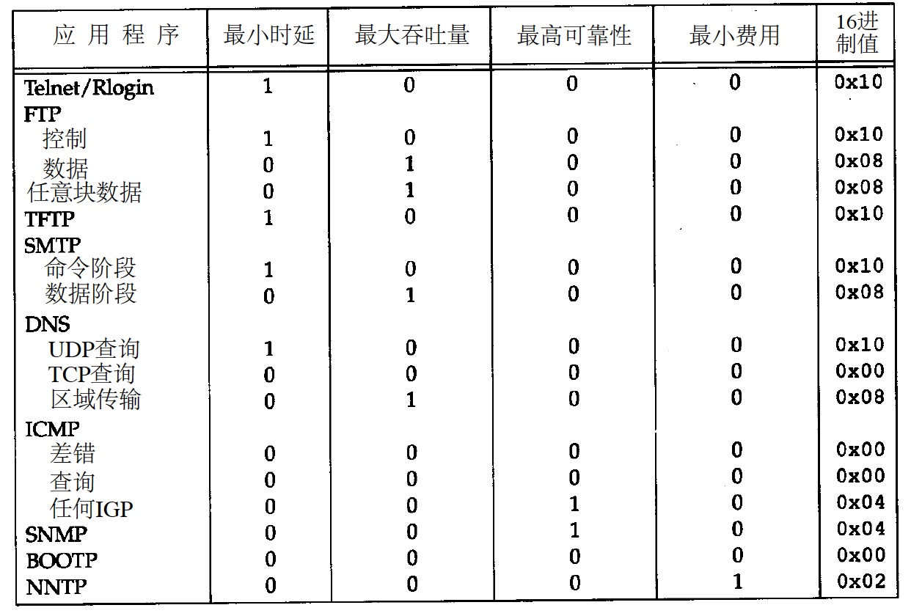
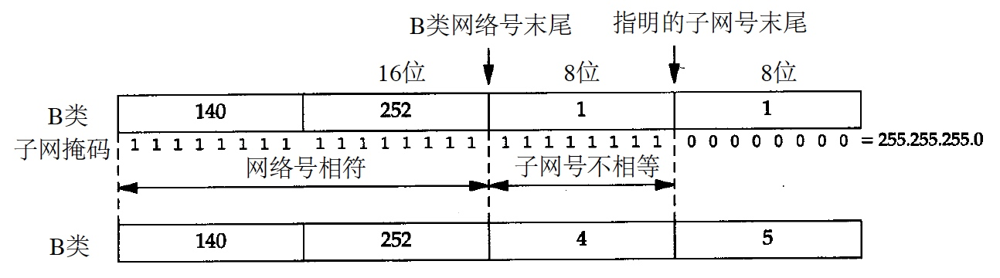
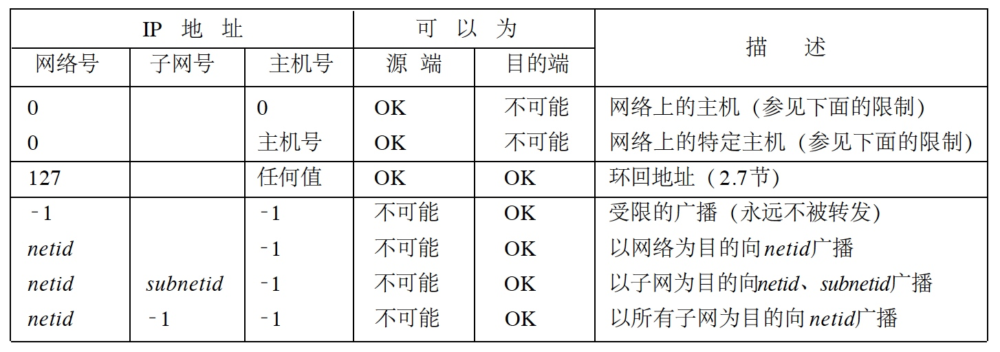

[toc]

# IP 网际协议

# 核心概念

* 不可靠
	* 不能保证IP数据报能成功地到达目的地
	* IP仅提供最好的传输服务
	* 发生某种错误时，丢弃该数据报，然后发送ICMP消息报给信源端
* 无连接
	* IP并不维护任何关于后续数据报的状态信息，每个数据报的处理是相互独立的

# IP数据报

* 普通的IP首部长为20个字节，除非含有选项字段
* TCP/IP首部中所有的二进制整数在网络中都以 `big endian` 传输，也称作网络字节序
	* 其他形式存储二进制整数的机器，必须在传输数据之前把首部转换成网络字节序
* 目前的协议版本号是4，也称作IPv4
* 首部长度指的是首部占32 bit字的数目，包括任何选项，由于它是一个4比特字段，因此首部最长为60个字节 WHAT？？？
* TOS 服务类型字段
	* 3 bit 优先权 已忽略
	* 4 bit TOS
		* 最小时延、最大吞吐量、最高可靠性和最
小费用 单选
	* 1 bit 未用位 置0
	* 服务类型及推荐值
		
* 总长度字段
	* 整个IP数据报的长度，单位字节
	* 字段长16bit，所以IP数据报最长可达65535字节
		* 过长的数据报会被大多数的链路层分片
		* 主机也要求不能接收超过576 bytes的数据报
		* 大量基于UDP的应用（RIP，TFTP，BOOTP，DNS，SNMP）都限制用户数据报长度为512字节，但大多数的实现（特别是那些支持网络文件系统NFS的实现）允许超过8192字节
I P数据报。
	* 由于TCP把用户数据分成若干片，因此一般来说这个限制不会影响TCP
	* 总长度字段是必要的内容，因为一些数据链路需要填充一些数据，解析时也能定位数据报内容的位置
* 标识字段
	* 唯一地标识主机发送的每一份数据报
	* 通常每发送一份报文它的值就会加1
* TTL生存时间字段
	* 数据报可以经过的最多路由器数
	* TTL的初始值由源主机设置（通常为32或64），一旦经过一个处理它的路由器，它的值就减去1，值为0时丢弃数据报，并发送ICMP报文通知源主机
* 首部检验和字段
	* 首先把检验和字段置为0，然后对首部中每个16 bit进行二进制反码求和
	* 检验和错误时，IP就丢弃收到的数据报，但不生成差错报文，由上层去发现丢失的数据报并进行重传
* 源IP地址和目的IP地址
	* 各32 bit
* 是任选项字段
	* 变长

# 路由选择

1.  概念

	* 如果目的主机与源主机直接相连（如点对点链路）或都在一个共享网络上（以太网或令牌环网），那么IP数据报就直接送到目的主机上
	* 否则，主机把数据报发往一默认的路由器上，由路由器来转发该数据报
	* I P层在
内存中有一个路由表。当收到一份数据报并进行发送时，它都要对该表搜索一次。当数据报
来自某个网络接口时， I P首先检查目的I P地址是否为本机的I P地址之一或者I P广播地址。如果
确实是这样，数据报就被送到由I P首部协议字段所指定的协议模块进行处理。如果数据报的（也就是说，像下面对待发出的数据报一样处理）；否则（ 2）数据报被丢弃

2. 路由表信息

	* 目的IP地址
		* 网络地址中的主机号为0，以指定网络中的所有主机（如以太网，令牌环网）
	* 下一站/下一跳路由器IP，或者有直接连接的网络IP
	* 标志
		* 指明目的IP是网络地址还是主机地址
		* 指明下一站路由器是否为真正的下一站路由器，还是一个直接相连的接口
	* 为数据报的传输指定一个网络接口

3. 逐跳路由
	
	假定下一站路由器比发送数据报的主机更接近目的，所有的IP路由选择只为数据报传输提供下一站路由器的IP地址。
	
	* 步骤
	
		* 搜索路由表，寻找能与目的IP地址完全匹配的表目
		* 搜索路由表，寻找能与目的网络号相匹配的表目
			* 必须考虑可能的子网掩码
		* 搜索路由表，寻找标为**默认（default）**的表目
		* 都失败，则该数据报就不能被传送，一般会向生成数据报的应用程序返回一个**主机不可达**或**网络不可达**的错误
	
	* 特性
		
		* 默认路由，以及下一站路由器发送的ICMP间接报文是IP路由选择机制中功能强大的特性 ???
		* 为一个网络指定一个路由器，而不必为每个主机指定一个路由器，可以极大地缩小路由表的规模
			* Internet上的路由器有只有几千个表目，而不会是超过100万个表目

# 子网

## 子网寻址

* 子网号长度由网络管理员指定
* 子网对于子网内部的路由器是不透明的
* 子网划分缩减了路由表的规模

## 子网掩码

子网掩码是网络号、主机号的位数的表示码，1表示网络号+子网号，0表示主机号。

给定IP地址和子网掩码以后，主机就可以确定IP数据报的目的是

* 本子网上的主机
	* 网络号、子网号相等
* 本网络中其他子网上的主机
	* 网络号相等，子网号不等
* 其他网络上的主机
	* 网络号不等

## 特殊IP

# 路由表配置

TBC

# IP的未来

由于Internet快速增长带来的三个问题

* 超过半数的B类地址已被分配
* 32 bit的IP地址从长期的Internet增长角度来看，一般是不够用的
* 当前的路由结构没有层次结构，属于平面型结构，每个网络都需要一个路由表目。随着网络数目的增长，一个具有多个网络的网站就必须分配多个C类地址，而不是一个B类地址，因此路由表的规模会不断增长

