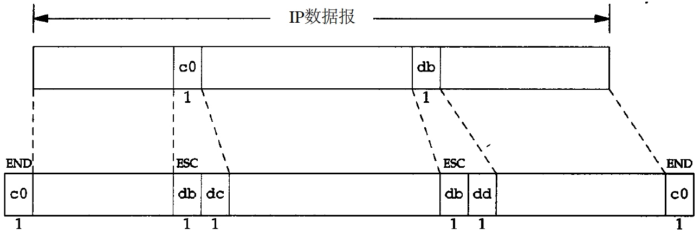

# 网络基础

## 分层

* 应用 应用信息 -> 数据 HTTP/TLS/DNS
* 传输 端 -> 端 TCP/UDP TCP segment
* 网络 点 -> 点 IP/ICMP IP datagram Router
* 链路 比特流 数字信号 -> 光电信号 ARP/RARP？ Frame Bridge

## 网络地址

## 封装

用户数据进入协议栈，每层增加首部、尾部信息后作为比特流送入网络。

* 以太网数据帧的物理特性是其长度必须在 `46~1500` 字节之间
* 用 `octet` 表示字节，兼容非8bit的字节，如DEC系统
* UDP数据与TCP数据基本一致。唯一的不同是UDP传给IP的信息单元称作UDP数据报
（UDP datagram），而且UDP的首部长为8字节
* IP在首部中存入一个长度为8 bit的数值表明数据属于哪种协议，称作协议域
	* 1表示为ICMP
	* 2表示为IGMP
	* 6表示为TCP
	* 7表示为UDP

## 分用 Demultiplexing

分用指主机收到信息后数据在协议栈中自底向上逐层处理的过程。

* 虽然ICMP/IGMP和IP同属网络层协议，但他们的报文都被封装在IP数据报中，所以分用时把他们放到IP上层
* 虽然ARP/RARP属于链路层协议，在IP之上但他们和IP一样都有各自的以太网数据帧类型，所以把他们放到以太网之上，和IP同层

## 端口号

Unix保留端口号在 `1~1023` 之间。

## 实现

不同BSD版本及其特性

# 链路层

## 协议介绍

1. IEEE 802.2/802.3（RFC 1042）和以太网的封装格式（RFC 894）
	
	

2. SLIP报文的封装

	
	
	* 每一端必须知道对方的I P地址。没有办法把本端的I P地址通知给另一端
	* 数据帧中没有类型字段，如果一条串行线路用于SLIP，那么它不能同时使用其他协议
	* SLIP没有在数据帧中加上检验和
	* 串行线路的速率通常较低（19200 b/s或更低），而且通信经常是交互式的，因此在SLIP线路上有许多小的TCP分组进行交换。为了传送1个字节的数据需要20个字节的IP首部和20个字节的TCP首部，总数超过40个字节，人们提出一个被称作CSLIP（即压缩SLIP）的新协议，它在RFC 1144中被详细描述。CSLIP一般能把上面的40个字节压缩到3或5个字节

3. PPP协议

	

	* 每一帧都以标志字符0x7e开始和结束。紧接着是一个地址字节，值始终是0xff，然后是一个值为0x03的控制字节
	* 在串行链路上封装IP数据报的方法，支持校验，也支持同步链接
	* 支持建立、测试、配置链路层协议
	* 针对不同网络层协议的网络控制协议

## 环回接口

1. 127.0.0.1 localhost

2. 环回接口处理数据报的过程

	

	* 传给环回地址的任何数据均作为IP输入
	* 传给广播地址或多播地址的数据报复制一份传给环回接口
	* 任何传给该主机IP地址的数据均送到环回接口
	* 送给主机本身IP地址的IP数据报一般不出现在相应的网络上

## MTU

最大传输单元

	
* 如果IP层有一个数据报要传，而且数据的长度比链路层的MTU还大，那么IP层就需要进行分片（fragmentation）
* 点到点的链路层（如SLIP/PPP）的MTU并非指的
是网络媒体的物理特性，它是一个逻辑限制，目的是为交互使用提供足够快的响应时间
* 路径上最小的MTU才是实际的MTU，它不一定是常数，也不一定对称，这和来回的路由结果有关

