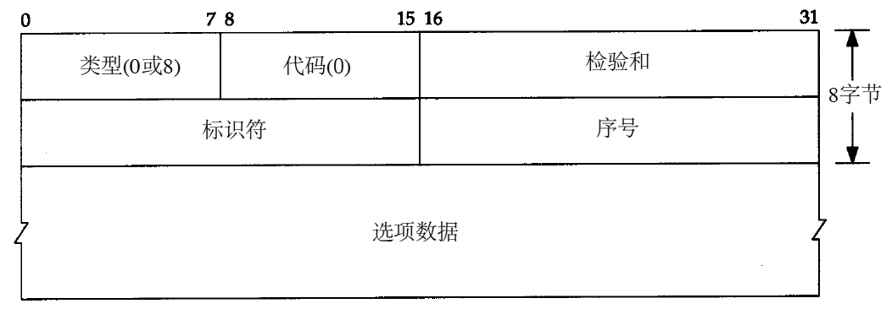
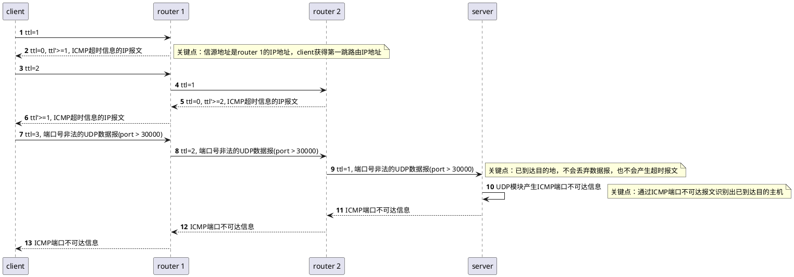
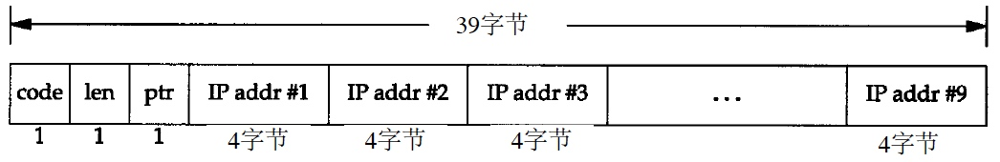
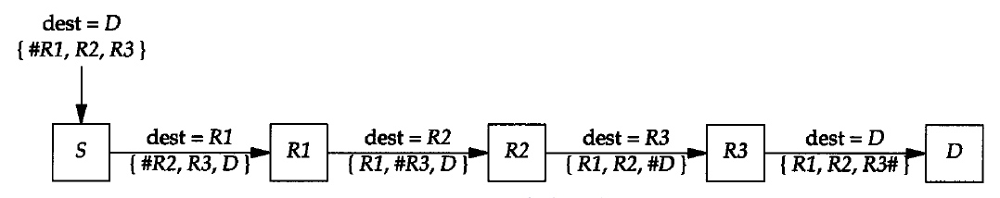

[toc]
# Ping & Traceroute

# Ping
## 程序实现

1. 介绍
	
	* ping程序是对两个TCP/IP系统连通性进行测试的基本工具。它只利用ICMP回显请求和回显应答报文，而不用经过传输层（TCP/UDP）
		* 一般如果不能ping到某台主机，那么就不能telnet或者ftp到那台主机ping程序还能测出到这台主机的往返时间
		* 由于出现了提供访问控制清单的路由器和防火墙，一台主机的可达性可能不只取决于IP层是否可达，还取决于使用何种协议以及端口号
	* ping服务器一般在内核中实现ICMP的功能
		* Unix系统在实现ping程序时是把ICMP报文中的标识符字段置成发送进程的ID号。即使在同一台主机上同时运行了多个ping程序实例，ping程序也可以识别出返回的信息
		* 序列号从0开始，每发送一次新的回显请求就加1
		* ping程序打印出返回的每个分组的序列号，允许我们查看是否有分组丢失、失序或重复

2. ICMP回显请求和回显应答报文格式
	
	

## IP记录路由选项

```
ping -R baidu.com
```

用它记录路由存在一些问题

1. 并不是所有的路由器都支持记录路由选项，因此该选项在某些路径上不能使用
2. 记录路由一般是单向的选项， 但是这样使得记录下来的IP地址翻了一番（一来一回）
3. IP首部中留给选项的空间有限，不能存放当前大多数的路径
	* 在IP首部选项字段中最多只能存放9个I P地址

# Traceroute

## 程序实现

使用ICMP报文和IP首部中的TTL字段

* TTL字段是由发送端初始设置一个8 bit字段。推荐的初始值由分配数字RFC指定，当前值为64
* 每个处理数据报的路由器都需要把TTL的值减1或减去数据报在路由器中停留的秒数
	* 由于大多数的路由器转发数据报的时延都小于1秒钟，因此TTL最终成为一个跳站的计数器，所经过的每个路由器都将其值减1
	* 路由器收到 `ttl=0/1` 的数据报时，不再转发它以终止循环回路



开始时发送一个TTL字段为1的UDP数据报，然后将TTL字段每次加1，以确定路径中的每个路由器。
每个路由器在丢弃UDP数据报时都返回一个ICMP超时报文2，而最终目的主机则产生一个ICMP端口不可达的报文。

## 计算RTT

TBC

## 抓包验证

```
➜  ~ traceroute localhost
traceroute to localhost (127.0.0.1), 64 hops max, 52 byte packets
 1  localhost (127.0.0.1)  0.328 ms  0.056 ms  0.062 ms
```

* 目的地址 `localhost (127.0.0.1)`
* max ttl = 64
* 52 byte的数据报
	* 20 byte的IP首部
	* 8 byte的UDP首部
	* 24 byte的用户数据 ***TBC***
		* 每发一个数据报就加1的序列号
		* 送出ttl的副本
		* 发送数据报的时间
* 第一跳的主机或路由器名字和地址 `1  localhost (127.0.0.1)`
* 对每个ttl值发送三份数据报 `0.328 ms  0.056 ms  0.062 ms`
	* 每接收一份ICMP超时返回就计算rtt并打印出来 
	* 如果在5秒种内仍未收到3份数据报的任意一份的响应，则打印一个星号，并发送下一份数据报

由于路由动态变化，存在如下问题

1. 不能保证现在的路由也是将来所要采用的路由，甚至两份连续的IP数据报都可能采用不同的路由
2. 不能保证ICMP报文的路由与traceroute程序发送的UDP数据报采用同一路由
	* 计算出的rtt不能真实体现实际rtt
3. 返回的ICMP报文中的信源IP地址是UDP数据报到达的路由器接口的IP地址
	* 与IP记录路由选项不同，记录的IP地址指的是发送接口地址

## IP源站选路选项

### 介绍

源站选路（source routing）指由发送者指定路由。

IP首部源站路由选项的通用格式



### 类型

1. 严格的源路由选路 LSRR
	* 发送端指明IP数据报所必须采用的确切路由
	* 如果一个路由器发现源路由所指定的下一个路由器不在其直接连接的网络上，那么它就返回一个**源站路由失败**的ICMP差错报文
2. 宽松的源路由选路 SSRR
	* 发送端指明了一个数据报经过的IP地址清单，但是数据报在清单上指
明的任意两个地址之间可以通过其他路由器

### 运行过程



* 发送主机从应用程序接收源站路由清单，将第1个表项去掉（它是数据报的最终目的地址），将剩余的项移到1个项中，并将原来的目的地址作为清单的最后一项。指针仍然指向清单的第1项（即，指针的值为4）
* 每个处理数据报的路由器检查其是否为数据报的最终地址。如果不是，则正常转发数据报（在这种情况下，必须指明宽松源站选路，否则就不能接收到该数据报）
* 如果该路由器是最终目的，且指针不大于路径的长度，那么
	* 由ptr所指定的清单中的下一个地址就是数据报的最终目的地址
	* 由外出接口(outgoing interface)相对应的IP地址取代刚才使用的源地址
	* 指针加4

> Host Requirements RFC指明，TCP客户必须能指明源站选路，同时，TCP服务器必须能够接收源站选路，并且对于该TCP连接的所有报文段都能采用反向路由。如果TCP服务器下面接收到一个不同的源站选路，那么新的源站路由将取代旧的源站路由。

### 问题

1. 往返路由不一定对称

