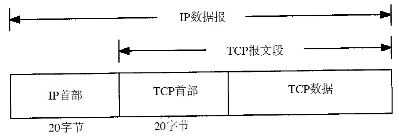

[toc]

# TCP

# 协议

## 特性

TCP提供面向连接的、可靠的字节流服务。

* 连接
	* 两端
* 可靠
	* ack和超时重传保证数据到达
	* 校验和保证数据内容一致
	* 滑动窗口控制流量
* 字节流
	* 不更改字节流
	* 不解释字节流

## 首部




```
   0                            15                              31
  -----------------------------------------------------------------
  |          source port          |       destination port        |
  -----------------------------------------------------------------
  |                        sequence number                        |
  -----------------------------------------------------------------
  |                     acknowledgment number                     |
  -----------------------------------------------------------------
  |  HL   | rsvd  |C|E|U|A|P|R|S|F|        window size            |
  -----------------------------------------------------------------
  |         TCP checksum          |       urgent pointer          |
  -----------------------------------------------------------------
```
```
   0             7|             15|             23|             31
  ----------------|---------------|---------------|----------------
  |  HL   | rsvd  |C|E|U|A|P|R|S|F|        window size            |
  ----------------|---------------|---------------|----------------
  |               |  13th octet   |               |               |
```

```
IP数据报 = IP首部（20字节） + TCP报文段
TCP报文段 = TCP首部（20字节） + TCP数据
TCP首部 = 源端port（16位） + 目的端port（16位）
	+ seq（32位）
	+ ack（32位）
	+ 首部长度（4位） + 保留（6位） + 标志位（6位 URG/ACK/PSH/RST/SYN/FIN） + 窗口大小（16位）
	+ 校验和（16位） + 紧急指针（16位）
	+ 选项
	+ 数据
```

* seq 报文段中第一个数据字节
* ack 报文段中最后一个数据字节 + 1（没错，ack表示下次要收的第一个数据字节，而不是已经收到的数据字节）
* SYN/FIN 占1字节
* 全双工，两端各自维护序号
* 无法确认/否认选定部分的滑动窗口协议
* 常见可选字段
	* MSS 通常在建连SYN报文段中指明接收的最大长度的报文段

# 连接

## 从包角度看建连断连

了解 [三次握手](https://www.geeksforgeeks.org/tcp-connection-establishment/)、[四次挥手](https://www.geeksforgeeks.org/tcp-connection-termination/) 后，以访问微博主页为例，看对成功建连、传输数据、断连的理解是否一致。

``` bash
tcpdump -i any -v 'host weibo.com'

curl weibo.com
```

```
➜  ~ curl weibo.com
<!DOCTYPE HTML PUBLIC "-//IETF//DTD HTML 2.0//EN">
<html>
<head><title>301 Moved Permanently</title></head>
<body bgcolor="white">
<h1>301 Moved Permanently</h1>
<p>The requested resource has been assigned a new permanent URI.</p>
<hr/>Powered by WeiBo</body>
</html>
```

```
Chamber:~ root# tcpdump -i any -v 'host weibo.com'
// 抓包信息
tcpdump: data link type PKTAP
tcpdump: listening on any, link-type PKTAP (Apple DLT_PKTAP), capture size 262144 bytes

// tos 0x0: 服务类型（4位），分别为最小时延、最大吞吐、最高可靠、最小费用。0x0表示一般服务。
// ttl 64: 数据报的max路由跳数（不是时间）。经过64个路由后，第65个路由丢弃报文并发回ICMP通知src。
// id 0: IP报文头的Identification，用于IP分片重组。0表示没分片。
// offset 0: 相对原始没分片的IP报文的偏移，用于IP分片重组。0表示第一片。
// flags [DF]: 分片情况，DF不分片，MF分片。DF时忽略id、offset。
// proto TCP: 协议。
// length 64: IP数据报总长度，不含首部长度。
17:51:39.084820 IP (tos 0x0, ttl 64, id 0, offset 0, flags [DF], proto TCP (6), length 64)

// 10.235.64.68.51862 > 123.125.104.26.http:
// Flags [S]: TCP标记，S SYN，P PSH尽快给应用层，U URG尽快传输，其他man tcpdump
// cksum 0x41a0 (correct): TCP首部和数据的校验和为0x41a0，校验正确。如果由CPU分包，应该correct；如果由网卡分包，可能incorrect，但不影响传输。
// seq 4055662156: tcpdump时SYN包默认显示原始序号，其他包显示相对序号，可用选项-S要求都显示原始序号。
// win 65535: 10.235.64.68最多还能接收65535 bytes数据。通过滑动窗口控制拥塞。10.235.64.68读取n bytes数据后，还能接收(65535 + n) bytes数据；10.235.64.68接收m bytes数据后，还能接收(65535 - m) bytes数据。当win 0时，Wireshark显示【TCP ZeroWindow】。
// options: 可选项。通常第一个包沟通mss。
// mss 1460: 最小分段大小1460 bytes。通常 mss = MTU(1500) - IP首部(20) - TCP首部(20) = 1460。走lo时mss会很大。
// wscale 6: win的扩大因子，表示扩大时左移6位，只在SYN报文中有意义。
// TS val 735862729: TCP时间戳，在重传等seq相同场景下，用于区分数据报顺序。取值通常与系统时间戳无关。
// length 0: TCP数据长度0。通常SYN、FIN不占用数据长度，只传首部就行。
    10.235.64.68.51862 > 123.125.104.26.http: Flags [S], cksum 0x41a0 (correct), seq 4055662156, win 65535, options [mss 1460,nop,wscale 6,nop,nop,TS val 735862729 ecr 0,sackOK,eol], length 0

17:51:39.087129 IP (tos 0x0, ttl 56, id 12393, offset 0, flags [none], proto TCP (6), length 52)
    123.125.104.26.http > 10.235.64.68.51862: Flags [S.], cksum 0xb8de (correct), seq 3778949680, ack 4055662157, win 14600, options [mss 1448,nop,nop,sackOK,nop,wscale 7], length 0
17:51:39.087184 IP (tos 0x0, ttl 64, id 0, offset 0, flags [DF], proto TCP (6), length 40)
    10.235.64.68.51862 > 123.125.104.26.http: Flags [.], cksum 0x22ad (correct), ack 1, win 4096, length 0
17:51:39.087296 IP (tos 0x0, ttl 64, id 0, offset 0, flags [DF], proto TCP (6), length 113)
    10.235.64.68.51862 > 123.125.104.26.http: Flags [P.], cksum 0xce0d (correct), seq 1:74, ack 1, win 4096, length 73: HTTP, length: 73
	GET / HTTP/1.1
	Host: weibo.com
	User-Agent: curl/7.54.0
	Accept: */*

17:51:39.089674 IP (tos 0x0, ttl 56, id 12394, offset 0, flags [none], proto TCP (6), length 40)
    123.125.104.26.http > 10.235.64.68.51862: Flags [.], cksum 0x31f1 (correct), ack 74, win 115, length 0

// 微博->我: 数据
17:51:39.089738 IP (tos 0x0, ttl 56, id 12395, offset 0, flags [none], proto TCP (6), length 522)
    123.125.104.26.http > 10.235.64.68.51862: Flags [P.], cksum 0x98d7 (correct), seq 1:483, ack 74, win 115, length 482: HTTP, length: 482
	HTTP/1.1 301 Moved Permanently
	Server: WeiBo
	Date: Wed, 21 Aug 2019 09:51:39 GMT
	Content-Type: text/html
	Content-Length: 276
	Connection: keep-alive
	Location: https://weibo.com/
	LB_HEADER: alice30

	<!DOCTYPE HTML PUBLIC "-//IETF//DTD HTML 2.0//EN">
	<html>
	<head><title>301 Moved Permanently</title></head>
	<body bgcolor="white">
	<h1>301 Moved Permanently</h1>
	<p>The requested resource has been assigned a new permanent URI.</p>
	<hr/>Powered by WeiBo</body>
	</html>

// 微博->我: bye（微博不再发数据，但能收，也叫半关闭。应用可以通过shutdown而非close触发半关闭）
17:51:39.089739 IP (tos 0x0, ttl 56, id 12396, offset 0, flags [none], proto TCP (6), length 40)
    123.125.104.26.http > 10.235.64.68.51862: Flags [F.], cksum 0x300e (correct), seq 483, ack 74, win 115, length 0

// 我->微博: 收完数据
17:51:39.089769 IP (tos 0x0, ttl 64, id 0, offset 0, flags [DF], proto TCP (6), length 40)
    10.235.64.68.51862 > 123.125.104.26.http: Flags [.], cksum 0x208a (correct), ack 483, win 4088, length 0

// 我->微博: 听说你要bye？
17:51:39.089783 IP (tos 0x0, ttl 64, id 0, offset 0, flags [DF], proto TCP (6), length 40)
    10.235.64.68.51862 > 123.125.104.26.http: Flags [.], cksum 0x2089 (correct), ack 484, win 4088, length 0

// 我->微博: bye（我不再发数据，但能收）
17:51:39.089901 IP (tos 0x0, ttl 64, id 0, offset 0, flags [DF], proto TCP (6), length 40)
    10.235.64.68.51862 > 123.125.104.26.http: Flags [F.], cksum 0x2080 (correct), seq 74, ack 484, win 4096, length 0

// 微博->我: 听说你也要bye，那我们bye bye成了
17:51:39.092646 IP (tos 0x0, ttl 56, id 0, offset 0, flags [none], proto TCP (6), length 40)
    123.125.104.26.http > 10.235.64.68.51862: Flags [.], cksum 0x300d (correct), ack 75, win 115, length 0
```

有成功就有失败，以访问google为例，看理解是否一致。

```
tcpdump -i any -v 'host google.com'

time curl google.com
```

```
➜  ~ time curl google.com
curl: (7) Failed to connect to google.com port 80: Operation timed out
// 1分15秒70毫秒后超时
curl google.com  0.01s user 0.01s system 0% cpu 1:15.70 total
```

```
Chamber:~ root# tcpdump -i any -v 'host google.com'
tcpdump: data link type PKTAP
tcpdump: listening on any, link-type PKTAP (Apple DLT_PKTAP), capture size 262144 bytes

// 我->google: 不停发SYN，从未得到相应。注意发SYN时间间隔，从7th包开始，间隔时间指数增长。
20:07:27.840699 IP (tos 0x0, ttl 64, id 0, offset 0, flags [DF], proto TCP (6), length 64)
// Flags [SEW]: SYN，ECE，CWR。ECE表示三次握手期间启用ECN。通常，TCP通过丢包表示网络拥塞，ECN则是一个标记，即使不丢包也能表示网络拥塞。CWR（Congestion Window Reduced）表示收到带ECN标记的TCP报文段，表明网络拥塞。
    10.235.64.68.55135 > tsa03s01-in-f14.1e100.net.http: Flags [SEW], cksum 0x0519 (correct), seq 4201852395, win 65535, options [mss 1460,nop,wscale 6,nop,nop,TS val 743970916 ecr 0,sackOK,eol], length 0
20:07:28.843395 IP (tos 0x0, ttl 64, id 0, offset 0, flags [DF], proto TCP (6), length 64)
    10.235.64.68.55135 > tsa03s01-in-f14.1e100.net.http: Flags [S], cksum 0x01f1 (correct), seq 4201852395, win 65535, options [mss 1460,nop,wscale 6,nop,nop,TS val 743971916 ecr 0,sackOK,eol], length 0
20:07:29.847881 IP (tos 0x0, ttl 64, id 0, offset 0, flags [DF], proto TCP (6), length 64)
    10.235.64.68.55135 > tsa03s01-in-f14.1e100.net.http: Flags [S], cksum 0xfe08 (correct), seq 4201852395, win 65535, options [mss 1460,nop,wscale 6,nop,nop,TS val 743972916 ecr 0,sackOK,eol], length 0
20:07:30.849981 IP (tos 0x0, ttl 64, id 0, offset 0, flags [DF], proto TCP (6), length 64)
    10.235.64.68.55135 > tsa03s01-in-f14.1e100.net.http: Flags [S], cksum 0xfa20 (correct), seq 4201852395, win 65535, options [mss 1460,nop,wscale 6,nop,nop,TS val 743973916 ecr 0,sackOK,eol], length 0
20:07:31.852178 IP (tos 0x0, ttl 64, id 0, offset 0, flags [DF], proto TCP (6), length 64)
    10.235.64.68.55135 > tsa03s01-in-f14.1e100.net.http: Flags [S], cksum 0xf638 (correct), seq 4201852395, win 65535, options [mss 1460,nop,wscale 6,nop,nop,TS val 743974916 ecr 0,sackOK,eol], length 0
20:07:32.854760 IP (tos 0x0, ttl 64, id 0, offset 0, flags [DF], proto TCP (6), length 64)
    10.235.64.68.55135 > tsa03s01-in-f14.1e100.net.http: Flags [S], cksum 0xf250 (correct), seq 4201852395, win 65535, options [mss 1460,nop,wscale 6,nop,nop,TS val 743975916 ecr 0,sackOK,eol], length 0
20:07:34.861564 IP (tos 0x0, ttl 64, id 0, offset 0, flags [DF], proto TCP (6), length 64)
    10.235.64.68.55135 > tsa03s01-in-f14.1e100.net.http: Flags [S], cksum 0xea80 (correct), seq 4201852395, win 65535, options [mss 1460,nop,wscale 6,nop,nop,TS val 743977916 ecr 0,sackOK,eol], length 0
20:07:38.873868 IP (tos 0x0, ttl 64, id 0, offset 0, flags [DF], proto TCP (6), length 64)
    10.235.64.68.55135 > tsa03s01-in-f14.1e100.net.http: Flags [S], cksum 0xdae0 (correct), seq 4201852395, win 65535, options [mss 1460,nop,wscale 6,nop,nop,TS val 743981916 ecr 0,sackOK,eol], length 0
20:07:46.967498 IP (tos 0x0, ttl 64, id 0, offset 0, flags [DF], proto TCP (6), length 64)
    10.235.64.68.55135 > tsa03s01-in-f14.1e100.net.http: Flags [S], cksum 0xbb9f (correct), seq 4201852395, win 65535, options [mss 1460,nop,wscale 6,nop,nop,TS val 743989917 ecr 0,sackOK,eol], length 0
20:08:03.003644 IP (tos 0x0, ttl 64, id 0, offset 0, flags [DF], proto TCP (6), length 64)
    10.235.64.68.55135 > tsa03s01-in-f14.1e100.net.http: Flags [S], cksum 0x7d1f (correct), seq 4201852395, win 65535, options [mss 1460,nop,wscale 6,nop,nop,TS val 744005917 ecr 0,sackOK,eol], length 0
20:08:35.394063 IP (tos 0x0, ttl 64, id 0, offset 0, flags [DF], proto TCP (6), length 48)
    10.235.64.68.55135 > tsa03s01-in-f14.1e100.net.http: Flags [S], cksum 0x97b9 (correct), seq 4201852395, win 65535, options [mss 1460,sackOK,eol], length 0
```

有一些注意事项

1. 主动关闭的端在收到对端的FIN后，进入TIME_WAIT状态，此时不再收发数据。但是，由于四元组组成的网络链路中可能有遗留的报文段还没送达，为了保证未来的新连接不受影响，TIME_WAIT状态要保持2MSL（2倍的Max Segment Lifetime）。RFC 793指出2MSL应该为2min，但通常为30s/60s/120s。
	* TIME_WAIT期间，四元组不可用。事实上，大多数TCP实现更严格，连源端口都不可用。可以通过`SO_REUSEADDR`等系统参数重新用源端口生成新的四元组，当然，老的四元组仍旧不可用
	* TIME_WAIT期间，迟到的报文段会被丢弃
	* TIME_WAIT期间，如果主机重启，可能会重用老的四元组，RFC 793规定重启后MSL内不能建立任何连接，也成为`quiet time`。考虑到主机重启时间通常大于2MSL，一般没问题，所以TCP实现不遵守该原则
2. 理论上半关闭状态可能永远保持，为了避免无限等待，会设置定时器，当连接空闲10分75秒，TCP会从`FIN_WAIT_2 -> CLOSED`。不符合规范，但有用。
3. 对端的端口没使用时，会返回RST；异常终止时，会返回RST而不是FIN，此时会丢弃所有待发送数据。
	* Socket API通过`SO_LINGER`提供异常关闭能力
4. 两端同时打开时，握手可能要4个报文段。

## 从socket角度看建连断连

服务端监听端口4444，客户端建连。操作过程中通过`ss`、`netstat`观察socket。

1. 服务端开始监听后，没有新连接

	```
	// 服务端保持监听端口4444，走ipv4
	nc -4lk 4444
	
	// 服务端监控4444端口tcp/udp变化，以点分十进制展示ip
	watch -n 1 'ss -anut | grep 4444'
	```

	```
	// *:4444 : 传入的SYN将被任何一个本地IP接收
	// *:* : LISTEN状态表示在等待请求到达，此时不知道对端的IP、端口
	Netid State      Recv-Q Send-Q                                                                 Local Address:Port                                                                   Peer Address:Port
	tcp   LISTEN     0      10                                                                                 *:4444                                                                              *:*
	```

2. 客户端建连

	```
	// 建立2次，注意每个连接都是四元组
	nc 10.77.122.225 4444 &
	nc 10.77.122.225 4444 &
	```
	
	```
	// LISTEN状态的进程：用于接收其他连接的请求，当有新连接请求到达并接受时，操作系统内核的TCP模块会新建一个ESTABLISHED状态的进程，该进程的端口号与LISTEN状态的端口号相同
	// ESTAB状态的进程：用于接收数据报文，不能接收SYN报文段
	Netid State      Recv-Q Send-Q                                                                 Local Address:Port                                                                   Peer Address:Port
	tcp   LISTEN     0      10                                                                                 *:4444                                                                              *:*
	tcp   ESTAB      0      0                                                                      10.77.122.225:4444                                                                   10.235.64.68:55709
	tcp   ESTAB      0      0                                                                      10.77.122.225:4444                                                                   10.235.64.68:55844
	```

3. 客户端主动断连，客户端进入TIME_WAIT；服务端主动断连，服务端进入TIME_WAIT


TBC
    


