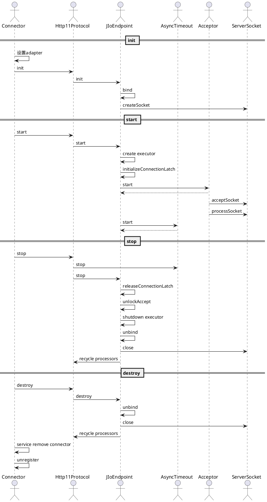
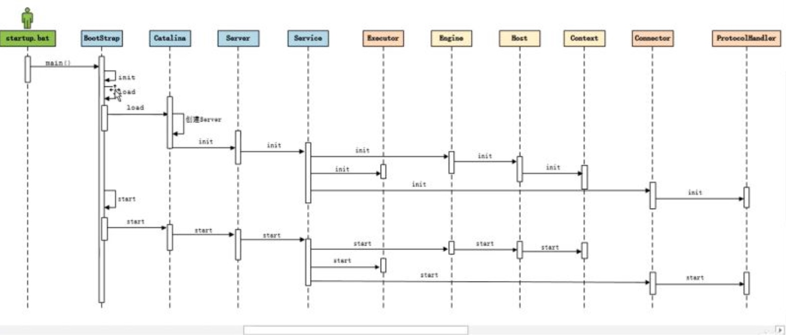

[toc]

# 基本概念
1. 启动
	
	
	
1. Connector

	Connector是本地 *监听* 端口的抽象。
	
	* ProtocolHandler
		* Endpoint
			* Acceptor
			* Handler
			* SocketProcessor
			
			* AsyncTimeout
			* LimitLatch
			* unlockAccept WHY?
		* ConnectionHandler
			* Processor
				* Set up IO
				* Read and parse request headers
				* Call adapter.service()
					* create servlet request & response
		* setSoLinger, setSoTimeout, setTcpNoDelay
	* Adapter 请求处理器的代理
	* Request/Response

	支持IO	

	* BIO
	* NIO
	* NIO2
	* APR
	
	支持协议
	
	* HTTP
	* AJP
		* 高效/高性能（传输二进制，简单连接池？）
		* 与常用反向代理模块mod_jk, mod_proxy集成
		* Tomcat提供丰富的协议转换API，对HTTP姿势友好

2. Container
	
	Container是请求处理器的抽象，负责执行请求并返回响应。
	
	* Engine
	* Host
	* Context
	* Wrapper

	关联组件
	
	* Loader
	* Logger
	* Manager
	* Realm
	* Resources

4. Lifecycle

	```
	The valid state transitions for components that support Lifecycle are:
	              start()
	    -----------------------------
	    |                           |
	    | init()                    |
	   NEW -»-- INITIALIZING        |
	   | |           |              |     ------------------«-----------------------
	   | |           |auto          |     |                                        |
	   | |          \|/    start() \|/   \|/     auto          auto         stop() |
	   | |      INITIALIZED --»-- STARTING_PREP --»- STARTING --»- STARTED --»---  |
	   | |         |                                                            |  |
	   | |destroy()|                                                            |  |
	   | --»-----«--    ------------------------«--------------------------------  ^
	   |     |          |                                                          |
	   |     |         \|/          auto                 auto              start() |
	   |     |     STOPPING_PREP ----»---- STOPPING ------»----- STOPPED -----»-----
	   |    \|/                               ^                     |  ^
	   |     |               stop()           |                     |  |
	   |     |       --------------------------                     |  |
	   |     |       |                                              |  |
	   |     |       |    destroy()                       destroy() |  |
	   |     |    FAILED ----»------ DESTROYING ---«-----------------  |
	   |     |                        ^     |                          |
	   |     |     destroy()          |     |auto                      |
	   |     --------»-----------------    \|/                         |
	   |                                 DESTROYED                     |
	   |                                                               |
	   |                            stop()                             |
	   ----»-----------------------------»------------------------------
	```

# BIO



1. init阶段

	Server绑定本地端口，设置max_connections和backlog。
	
	``` java
	    @Override
	    public void bind() throws Exception {
	
	        // Initialize thread count defaults for acceptor
	        if (acceptorThreadCount == 0) {
	            acceptorThreadCount = 1;
	        }
	        // Initialize maxConnections
	        if (getMaxConnections() == 0) {
	            // User hasn't set a value - use the default
	            setMaxConnections(getMaxThreadsWithExecutor());
	        }
	
	        if (serverSocketFactory == null) {
	            if (isSSLEnabled()) {
	                serverSocketFactory =
	                    handler.getSslImplementation().getServerSocketFactory(this);
	            } else {
	                serverSocketFactory = new DefaultServerSocketFactory(this);
	            }
	        }
	
	        if (serverSocket == null) {
	            try {
	                // 监听请求，不指定地址监听所有client，指定地址监听特定address的client
	                if (getAddress() == null) {
	                    serverSocket = serverSocketFactory.createSocket(getPort(),
	                            getBacklog());
	                } else {
	                    serverSocket = serverSocketFactory.createSocket(getPort(),
	                            getBacklog(), getAddress());
	                }
	            } catch (BindException orig) {
	                String msg;
	                if (getAddress() == null)
	                    msg = orig.getMessage() + " <null>:" + getPort();
	                else
	                    msg = orig.getMessage() + " " +
	                            getAddress().toString() + ":" + getPort();
	                BindException be = new BindException(msg);
	                be.initCause(orig);
	                throw be;
	            }
	        }
	
	    }
	```

	backlog vs. max_connections

2. start阶段

	Server启动Acceptor，Acceptor根据Connector、Endpoint状态来管理连接并将socket移交给SocketProcessor进一步处理。

	``` java
	    protected class Acceptor extends AbstractEndpoint.Acceptor {

        @Override
        public void run() {

            int errorDelay = 0;

            // Loop until we receive a shutdown command
            // 只有调stopInternal() 会令 running = false
            while (running) {

                // Loop if endpoint is paused
                // 只有调stopInternal()、protocol.pause()、connector.pause() 会令 pause = true
                while (paused && running) {
                    state = AcceptorState.PAUSED;
                    try {
                        Thread.sleep(50);
                    } catch (InterruptedException e) {
                        // Ignore
                    }
                }

                if (!running) {
                    break;
                }
                state = AcceptorState.RUNNING;

                try {
                    //if we have reached max connections, wait
                    countUpOrAwaitConnection();

                    Socket socket = null;
                    try {
                        // Accept the next incoming connection from the server
                        // socket
                        socket = serverSocketFactory.acceptSocket(serverSocket);
                    } catch (IOException ioe) {
                        countDownConnection();
                        // Introduce delay if necessary
                        // 类似tcp慢启动，避免accept失败时耗费cpu和io，eg：ulimit达到上限。n为第几次，sleep max(1600, 50*(n-1))ms
                        errorDelay = handleExceptionWithDelay(errorDelay);
                        // re-throw
                        throw ioe;
                    }
                    // Successful accept, reset the error delay
                    errorDelay = 0;

                    // Configure the socket
                    // eg：client RST会导致设置socket失败
                    if (running && !paused && setSocketOptions(socket)) {
                        // Hand this socket off to an appropriate processor
                        if (!processSocket(socket)) {
                            countDownConnection();
                            // Close socket right away
                            closeSocket(socket);
                        }
                    } else {
                        countDownConnection();
                        // Close socket right away
                        closeSocket(socket);
                    }
                } catch (IOException x) {
                    if (running) {
                        log.error(sm.getString("endpoint.accept.fail"), x);
                    }
                } catch (NullPointerException npe) {
                    if (running) {
                        log.error(sm.getString("endpoint.accept.fail"), npe);
                    }
                } catch (Throwable t) {
                    ExceptionUtils.handleThrowable(t);
                    log.error(sm.getString("endpoint.accept.fail"), t);
                }
            }
            state = AcceptorState.ENDED;
        }
    }

	```
	
	SocketProcessor负责ssl握手和按SocketStatus处理socket，将正常链接转交给ConnectionHandler进一步处理
	
	* OPEN/UPGRADE，设置keepalived、access时间
	* LONG，设置access时间、把socket加入waitingRequests继续等待请求，并交给新的SocketProcessor再次处理
	* CLOSE或异常，关闭socket
	
	``` java
	    protected class SocketProcessor implements Runnable {

        protected SocketWrapper<Socket> socket = null;
        protected SocketStatus status = null;

        public SocketProcessor(SocketWrapper<Socket> socket) {
            if (socket==null) throw new NullPointerException();
            this.socket = socket;
        }

        public SocketProcessor(SocketWrapper<Socket> socket, SocketStatus status) {
            this(socket);
            this.status = status;
        }

        @Override
        public void run() {
            boolean launch = false;
            synchronized (socket) {
                try {
                    SocketState state = SocketState.OPEN;
                    handler.beforeHandshake(socket);
                    try {
                        // SSL handshake
                        serverSocketFactory.handshake(socket.getSocket());
                    } catch (Throwable t) {
                        ExceptionUtils.handleThrowable(t);
                        if (log.isDebugEnabled()) {
                            log.debug(sm.getString("endpoint.err.handshake"), t);
                        }
                        // Tell to close the socket
                        state = SocketState.CLOSED;
                    }

                    if ((state != SocketState.CLOSED)) {
                        if (status == null) {
                            state = handler.process(socket, SocketStatus.OPEN_READ);
                        } else {
                            state = handler.process(socket,status);
                        }
                    }
                    if (state == SocketState.CLOSED) {
                        // Close socket
                        if (log.isTraceEnabled()) {
                            log.trace("Closing socket:"+socket);
                        }
                        countDownConnection();
                        try {
                            socket.getSocket().close();
                        } catch (IOException e) {
                            // Ignore
                        }
                    } else if (state == SocketState.OPEN ||
                            state == SocketState.UPGRADING  ||
                            state == SocketState.UPGRADED){
                        socket.setKeptAlive(true);
                        socket.access();
                        launch = true;
                    } else if (state == SocketState.LONG) {
                        socket.access();
                        waitingRequests.add(socket);
                    }
                } finally {
                    if (launch) {
                        try {
                            getExecutor().execute(new SocketProcessor(socket, SocketStatus.OPEN_READ));
                        } catch (RejectedExecutionException x) {
                            log.warn("Socket reprocessing request was rejected for:"+socket,x);
                            try {
                                //unable to handle connection at this time
                                handler.process(socket, SocketStatus.DISCONNECT);
                            } finally {
                                countDownConnection();
                            }


                        } catch (NullPointerException npe) {
                            if (running) {
                                log.error(sm.getString("endpoint.launch.fail"),
                                        npe);
                            }
                        }
                    }
                }
            }
            socket = null;
            // Finish up this request
        }

    }
	```
	
	Http11ConnectionHandler
	
	
	``` java
	        public SocketState process(SocketWrapper<S> wrapper,
                SocketStatus status) {
            if (wrapper == null) {
                // Nothing to do. Socket has been closed.
                return SocketState.CLOSED;
            }

            S socket = wrapper.getSocket();
            if (socket == null) {
                // Nothing to do. Socket has been closed.
                return SocketState.CLOSED;
            }

            Processor<S> processor = connections.get(socket);
            if (status == SocketStatus.DISCONNECT && processor == null) {
                // Nothing to do. Endpoint requested a close and there is no
                // longer a processor associated with this socket.
                return SocketState.CLOSED;
            }

            wrapper.setAsync(false);
            ContainerThreadMarker.set();

            try {
                if (processor == null) {
                    processor = recycledProcessors.pop();
                }
                if (processor == null) {
                    processor = createProcessor();
                }

                initSsl(wrapper, processor);

                SocketState state = SocketState.CLOSED;
                Iterator<DispatchType> dispatches = null;
                do {
                    if (dispatches != null) {
                        // Associate the processor with the connection as
                        // these calls may result in a nested call to process()
                        connections.put(socket, processor);
                        DispatchType nextDispatch = dispatches.next();
                        if (processor.isUpgrade()) {
                            state = processor.upgradeDispatch(
                                    nextDispatch.getSocketStatus());
                        } else {
                            state = processor.asyncDispatch(
                                    nextDispatch.getSocketStatus());
                        }
                    } else if (processor.isComet()) {
                        state = processor.event(status);
                    } else if (processor.isUpgrade()) {
                        state = processor.upgradeDispatch(status);
                    } else if (status == SocketStatus.DISCONNECT) {
                        // Comet and upgrade need to see DISCONNECT but the
                        // others don't. NO-OP and let socket close.
                    } else if (processor.isAsync() || state == SocketState.ASYNC_END) {
                        state = processor.asyncDispatch(status);
                        if (state == SocketState.OPEN) {
                            // release() won't get called so in case this request
                            // takes a long time to process, remove the socket from
                            // the waiting requests now else the async timeout will
                            // fire
                            getProtocol().endpoint.removeWaitingRequest(wrapper);
                            // There may be pipe-lined data to read. If the data
                            // isn't processed now, execution will exit this
                            // loop and call release() which will recycle the
                            // processor (and input buffer) deleting any
                            // pipe-lined data. To avoid this, process it now.
                            state = processor.process(wrapper);
                        }
                    } else if (status == SocketStatus.OPEN_WRITE) {
                        // Extra write event likely after async, ignore
                        state = SocketState.LONG;
                    } else {
                        state = processor.process(wrapper);
                    }

                    if (state != SocketState.CLOSED && processor.isAsync()) {
                        state = processor.asyncPostProcess();
                    }

                    if (state == SocketState.UPGRADING) {
                        // Get the HTTP upgrade handler
                        UpgradeToken upgradeToken = processor.getUpgradeToken();
                        HttpUpgradeHandler httpUpgradeHandler = upgradeToken.getHttpUpgradeHandler();
                        // Retrieve leftover input
                        ByteBuffer leftoverInput = processor.getLeftoverInput();
                        // Release the Http11 processor to be re-used
                        release(wrapper, processor, false, false);
                        // Create the upgrade processor
                        processor = createUpgradeProcessor(
                                wrapper, leftoverInput, upgradeToken);
                        // Mark the connection as upgraded
                        wrapper.setUpgraded(true);
                        // Associate with the processor with the connection
                        connections.put(socket, processor);
                        // Initialise the upgrade handler (which may trigger
                        // some IO using the new protocol which is why the lines
                        // above are necessary)
                        // This cast should be safe. If it fails the error
                        // handling for the surrounding try/catch will deal with
                        // it.
                        if (upgradeToken.getInstanceManager() == null) {
                            httpUpgradeHandler.init((WebConnection) processor);
                        } else {
                            ClassLoader oldCL = upgradeToken.getContextBind().bind(false, null);
                            try {
                                httpUpgradeHandler.init((WebConnection) processor);
                            } finally {
                                upgradeToken.getContextBind().unbind(false, oldCL);
                            }
                        }
                    }
                    if (getLog().isDebugEnabled()) {
                        getLog().debug("Socket: [" + wrapper +
                                "], Status in: [" + status +
                                "], State out: [" + state + "]");
                    }
                    if (dispatches == null || !dispatches.hasNext()) {
                        // Only returns non-null iterator if there are
                        // dispatches to process.
                        dispatches = wrapper.getIteratorAndClearDispatches();
                    }
                } while (state == SocketState.ASYNC_END ||
                        state == SocketState.UPGRADING ||
                        dispatches != null && state != SocketState.CLOSED);

                if (state == SocketState.LONG) {
                    // In the middle of processing a request/response. Keep the
                    // socket associated with the processor. Exact requirements
                    // depend on type of long poll
                    connections.put(socket, processor);
                    longPoll(wrapper, processor);
                } else if (state == SocketState.OPEN) {
                    // In keep-alive but between requests. OK to recycle
                    // processor. Continue to poll for the next request.
                    connections.remove(socket);
                    release(wrapper, processor, false, true);
                } else if (state == SocketState.SENDFILE) {
                    // Sendfile in progress. If it fails, the socket will be
                    // closed. If it works, the socket either be added to the
                    // poller (or equivalent) to await more data or processed
                    // if there are any pipe-lined requests remaining.
                    connections.put(socket, processor);
                } else if (state == SocketState.UPGRADED) {
                    // Don't add sockets back to the poller if this was a
                    // non-blocking write otherwise the poller may trigger
                    // multiple read events which may lead to thread starvation
                    // in the connector. The write() method will add this socket
                    // to the poller if necessary.
                    if (status != SocketStatus.OPEN_WRITE) {
                        longPoll(wrapper, processor);
                    }
                } else {
                    // Connection closed. OK to recycle the processor. Upgrade
                    // processors are not recycled.
                    connections.remove(socket);
                    if (processor.isUpgrade()) {
                        UpgradeToken upgradeToken = processor.getUpgradeToken();
                        HttpUpgradeHandler httpUpgradeHandler = upgradeToken.getHttpUpgradeHandler();
                        InstanceManager instanceManager = upgradeToken.getInstanceManager();
                        if (instanceManager == null) {
                            httpUpgradeHandler.destroy();
                        } else {
                            ClassLoader oldCL = upgradeToken.getContextBind().bind(false, null);
                            try {
                                httpUpgradeHandler.destroy();
                            } finally {
                                try {
                                    instanceManager.destroyInstance(httpUpgradeHandler);
                                } catch (Throwable e) {
                                    ExceptionUtils.handleThrowable(e);
                                    getLog().error(sm.getString("abstractConnectionHandler.error"), e);
                                }
                                upgradeToken.getContextBind().unbind(false, oldCL);
                            }
                        }
                    } else {
                        release(wrapper, processor, true, false);
                    }
                }
                return state;
            } catch(java.net.SocketException e) {
                // SocketExceptions are normal
                getLog().debug(sm.getString(
                        "abstractConnectionHandler.socketexception.debug"), e);
            } catch (java.io.IOException e) {
                // IOExceptions are normal
                getLog().debug(sm.getString(
                        "abstractConnectionHandler.ioexception.debug"), e);
            }
            // Future developers: if you discover any other
            // rare-but-nonfatal exceptions, catch them here, and log as
            // above.
            catch (Throwable e) {
                ExceptionUtils.handleThrowable(e);
                // any other exception or error is odd. Here we log it
                // with "ERROR" level, so it will show up even on
                // less-than-verbose logs.
                getLog().error(
                        sm.getString("abstractConnectionHandler.error"), e);
            } finally {
                ContainerThreadMarker.clear();
            }

            // Make sure socket/processor is removed from the list of current
            // connections
            connections.remove(socket);
            // Don't try to add upgrade processors back into the pool
            if (processor !=null && !processor.isUpgrade()) {
                release(wrapper, processor, true, false);
            }
            return SocketState.CLOSED;
        }
	```
	
	

3. stop阶段
4. destroy阶段


# NIO

# NIO2

# APR





