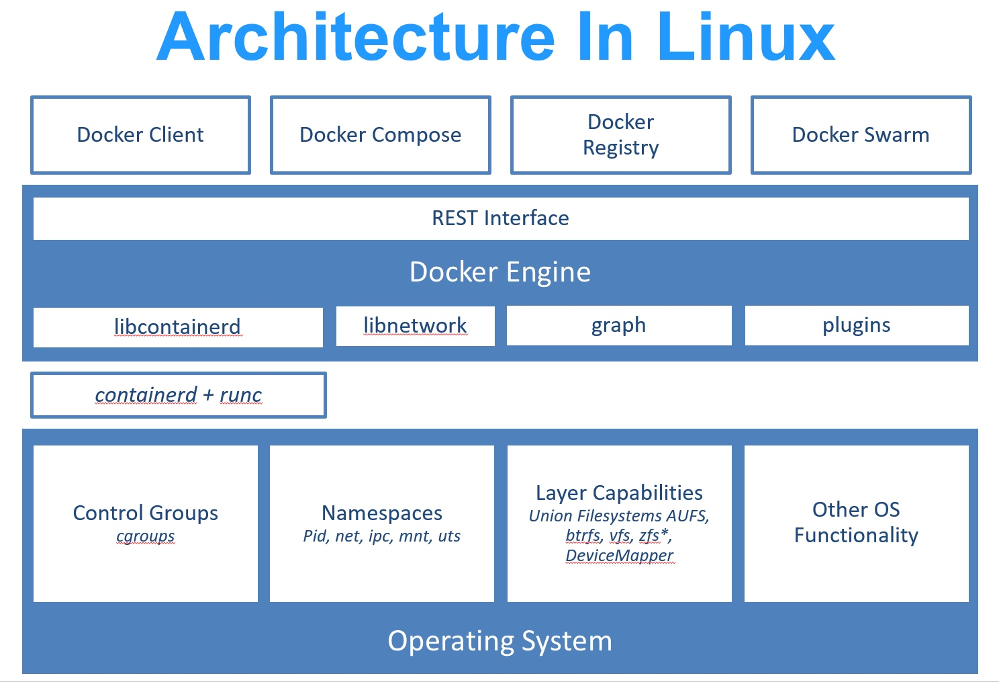

[toc]

# Docker




传统虚拟机技术是虚拟出一套硬件后，在其上运行一个完整操作系统，在该系统上再运行所需应用进程；而容器内的应用进程直接运行于宿主的内核，容器内没有自己的内核，而且也没有进行硬件虚拟。因此容器要比传统虚拟机更为轻便。

## 基本概念

### 镜像

操作系统分为 内核 和 用户空间。对于 Linux 而言，内核启动后，会挂载 root 文件系统为其提供用户空间支持。

Docker 镜像 是一个特殊的文件系统，除了提供容器运行时所需的程序、库、资源、配置等文件外，还包含了一些为运行时准备的一些配置参数（如匿名卷、环境变量、用户等）。镜像 不包含 任何动态数据，其内容在构建之后也不会被改变。

因为镜像包含操作系统完整的 root 文件系统，其体积往往是庞大的，因此在 Docker 设计时，就充分利用 Union FS 的技术，将其设计为分层存储的架构。所以严格来说，镜像并非是像一个 ISO 那样的打包文件，镜像只是一个虚拟的概念，其实际体现并非由一个文件组成，而是由多层文件系统联合组成。

镜像构建时，会一层层构建，前一层是后一层的基础。每一层构建完就不会再发生改变，后一层上的任何改变只发生在自己这一层。比如，删除前一层文件的操作，实际不是真的删除前一层的文件，而是仅在当前层标记为该文件已删除。在最终容器运行的时候，虽然不会看到这个文件，但是实际上该文件会一直跟随镜像。因此，在构建镜像的时候，需要额外小心，每一层尽量只包含该层需要添加的东西，任何额外的东西应该在该层构建结束前清理掉。

分层存储的特征还使得镜像的复用、定制变的更为容易。甚至可以用之前构建好的镜像作为基础层，然后进一步添加新的层，以定制自己所需的内容，构建新的镜像。

```
# Docker Hub 中显示的体积是压缩后的体积，镜像下载到本地后，显示展开后的各层所占空间的总和，但并非是所有镜像实际硬盘消耗
docker image ls

# 由于 Docker 镜像是多层存储结构，并且可以继承、复用，因此不同镜像可能会因为使用相同的基础镜像，从而拥有共同的层。由于 Docker 使用 Union FS，相同的层只需要保存一份即可，因此实际镜像硬盘占用空间很可能要比这个列表镜像大小的总和要小的多
docker system df

# 虚悬镜像
docker image ls -f dangling=true
docker image prune

# 中间镜像
# 为了加速镜像构建、重复利用资源，Docker 会利用 中间层镜像。所以在使用一段时间后，可能会看到一些依赖的中间层镜像。默认的 docker image ls 列表中只会显示顶层镜像
docker image ls -a

# 列出镜像
docker image ls -f since=mongo:3.2
docker image ls -f label=com.example.version=0.1
docker image ls -q
docker image ls --format "table {{.ID}}\t{{.Repository}}\t{{.Tag}}"

# 镜像删除
# 可以用镜像名来删除镜像，更精确的是使用镜像摘要
# 删除行为分为两类，一类是 Untagged，另一类是 Deleted。镜像的唯一标识是其 ID 和摘要，而一个镜像可以有多个标签。先删标签，无其它镜像或容器引用后才删镜像。
docker image ls --digests
docker image rm $(docker image ls -q redis)

# 运行一个容器的时候（如果不使用卷的话），我们做的任何文件修改都会被记录于容器存储层里。而 Docker 提供了一个 docker commit 命令，在原有镜像的基础上，再叠加上容器的存储层，构成新的镜像。
docker diff CONTAINER
docker commit \
    --author "Tao Wang <twang2218@gmail.com>" \
    --message "修改了默认网页" \
    webserver \
    nginx:v2
docker history CONTAINER

# 虚拟的基础镜像
# Dockerfile 中 FROM 是必备的指令，并且必须是第一条指令
# 对于 Linux 下静态编译的程序来说，并不需要有操作系统提供运行时支持，所需的一切库都已经在可执行文件里了，因此直接 FROM scratch 会让镜像体积更加小巧。使用 Go 语言 开发的应用很多会使用这种方式来制作镜像，这也是为什么有人认为 Go 是特别适合容器微服务架构的语言的原因之一。
FROM scratch

# RUN 新建立一层，在其上执行这些命令，执行结束后，commit 这一层的修改，构成新的镜像。多个 RUN 创建多层镜像没有意义，而且很多运行时不需要的东西，都被装进了镜像里，比如编译环境、更新的软件包等等。结果就是产生非常臃肿、非常多层的镜像，不仅仅增加了构建部署的时间，也很容易出错。没必要建立很多层，使用一个 RUN 指令，并使用 && 将各个所需命令串联起来即可。此外，还可以看到这一组命令的最后添加了清理工作的命令，删除了为了编译构建所需要的软件，清理了所有下载、展开的文件，并且还清理了 apt 缓存文件。这是很重要的一步，我们之前说过，镜像是多层存储，每一层的东西并不会在下一层被删除，会一直跟随着镜像。因此镜像构建时，一定要确保每一层只添加真正需要添加的东西，任何无关的东西都应该清理掉。
# Union FS 是有最大层数限制的，比如 AUFS，曾经是最大不得超过 42 层，现在是不得超过 127 层。
RUN set -x; buildDeps='gcc libc6-dev make wget' \
    && apt-get update \
    && apt-get install -y $buildDeps \
    && wget -O redis.tar.gz "http://download.redis.io/releases/redis-5.0.3.tar.gz" \
    && mkdir -p /usr/src/redis \
    && tar -xzf redis.tar.gz -C /usr/src/redis --strip-components=1 \
    && make -C /usr/src/redis \
    && make -C /usr/src/redis install \
    && rm -rf /var/lib/apt/lists/* \
    && rm redis.tar.gz \
    && rm -r /usr/src/redis \
    && apt-get purge -y --auto-remove $buildDeps

# 构建上下文 Context
# Docker 在运行时分为 Docker 引擎（也就是服务端守护进程）和客户端工具。Docker 的引擎提供了一组 REST API，被称为 Docker Remote API，而如 docker 命令这样的客户端工具，则是通过这组 API 与 Docker 引擎交互，从而完成各种功能。因此，虽然表面上我们好像是在本机执行各种 docker 功能，但实际上，一切都是使用的远程调用形式在服务端（Docker 引擎）完成。也因为这种 C/S 设计，让我们操作远程服务器的 Docker 引擎变得轻而易举。
# 当构建的时候，用户会指定构建镜像上下文的路径，docker build 命令得知这个路径后，会将路径下的所有内容打包，然后上传给 Docker 引擎。这样 Docker 引擎收到这个上下文包后，展开就会获得构建镜像所需的一切文件。
# .dockerignore 用于剔除不需要作为上下文传递给 Docker 引擎的文件
docker build -t nginx:v3 .
Sending build context to Docker daemon 2.048 kB

# 支持基于多个源构建镜像
docker build -t hello-world https://github.com/docker-library/hello-world.git#master:amd64/hello-world
docker build http://server/context.tar.gz
docker build - < Dockerfile

# COPY 复制文件
# 指令将从构建上下文目录中 <源路径> 的文件/目录复制到新的一层的镜像内的 <目标路径> 位置。<源路径> 可以是多个，甚至可以是通配符，其通配符规则要满足 Go 的 filepath.Match 规则。
# 如果源路径为文件夹，复制的时候不是直接复制该文件夹，而是将文件夹中的内容复制到目标路径。
COPY [--chown=<user>:<group>] <源路径>... <目标路径>
COPY [--chown=<user>:<group>] ["<源路径1>",... "<目标路径>"]
COPY hom* /mydir/
COPY hom?.txt /mydir/

# ADD 高级的赋值文件
# 在 COPY 基础上增加了一些功能，比如 <源路径> 可以是一个 URL，权限自动设置为 600。所以不如直接使用 RUN 指令，然后使用 wget 或者 curl 工具下载，处理权限、解压缩、然后清理无用文件更合理。因此，这个功能其实并不实用，而且不推荐使用。
# 如果 <源路径> 为一个 tar 压缩文件的话，压缩格式为 gzip, bzip2 以及 xz 的情况下，ADD 指令将会自动解压缩这个压缩文件到 <目标路径> 去。
ADD ubuntu-xenial-core-cloudimg-amd64-root.tar.gz /

# CMD 容器启动命令，即指定默认的容器主进程的启动命令
# Docker 不是虚拟机，容器就是进程，那么在启动时需要指定所运行的程序及参数。在指令格式上，一般推荐使用 exec 格式，这类格式在解析时会被解析为 JSON 数组，因此一定要使用双引号 "，而不要使用单引号。如果使用 shell 格式的话，实际的命令会被包装为 sh -c 的参数的形式进行执行。
shell 格式：CMD <命令>
exec 格式：CMD ["可执行文件", "参数1", "参数2"...]
参数列表格式：CMD ["参数1", "参数2"...]。在指定了 ENTRYPOINT 指令后，用 CMD 指定具体的参数。
CMD [ "sh", "-c", "service nginx start"]
CMD ["nginx", "-g", "daemon off;"]

# ENTRYPOINT 入口点
# ENTRYPOINT 和 RUN 格式一样，分为 exec 格式和 shell 格式。ENTRYPOINT 在运行时也可以替代，不过需要通过 docker run 的参数 --entrypoint 指定。当指定了 ENTRYPOINT 后，CMD 的含义就发生了改变，不再是直接的运行其命令，而是将 CMD 的内容作为参数传给 ENTRYPOINT 指令，换句话说实际执行时，将变为：<ENTRYPOINT> "<CMD>"。
# 适用于 1. 让镜像变成像命令一样使用；2. 应用运行前的准备工作
FROM ubuntu:18.04
RUN apt-get update \
    && apt-get install -y curl \
    && rm -rf /var/lib/apt/lists/*
ENTRYPOINT [ "curl", "-s", "http://myip.ipip.net" ]
--
docker run myip -i

# ENV 设置环境变量
# 下列指令可以支持环境变量展开： ADD、COPY、ENV、EXPOSE、FROM、LABEL、USER、WORKDIR、VOLUME、STOPSIGNAL、ONBUILD、RUN。
ENV <key> <value>
ENV <key1>=<value1> <key2>=<value2>...

# ARG 构建参数
# 设置的构建环境的环境变量，在将来容器运行时是不会存在这些环境变量的，但 docker history 还是可以看到。
# ARG 指令有生效范围，如果在 FROM 指令之前指定，那么只能用于 FROM 指令中。
ARG <参数名>[=<默认值>]

# VOLUME 定义匿名卷
VOLUME ["<路径1>", "<路径2>"...]
VOLUME <路径>

# EXPOSE 暴露端口
# 声明容器运行时提供服务的端口，但在容器运行时并不会因为这个声明应用就会开启这个端口的服务。能帮助镜像使用者理解这个镜像服务的守护端口，以方便配置映射；还能在运行时使用随机端口映射时，也就是 docker run -P 时，自动随机映射 EXPOSE 的端口。
EXPOSE <端口1> [<端口2>...]。

# WORKDIR 指定工作目录
# 如果使用的相对路径，那么所切换的路径与之前的 WORKDIR 有关。
WORKDIR <工作目录路径>

# USER 指定当前用户
# 只是切换到指定用户而已，用户必须是事先建立好，否则无法切换。
USER <用户名>[:<用户组>]
# 如果以 root 执行的脚本，在执行期间希望改变身份，比如希望以某个已经建立好的用户来运行某个服务进程，不要使用 su 或者 sudo，这些都需要比较麻烦的配置，而且在 TTY 缺失的环境下经常出错。建议使用 gosu。
## 建立 redis 用户，并使用 gosu 换另一个用户执行命令
RUN groupadd -r redis && useradd -r -g redis redis
## 下载 gosu
RUN wget -O /usr/local/bin/gosu "https://github.com/tianon/gosu/releases/download/1.12/gosu-amd64" \
    && chmod +x /usr/local/bin/gosu \
    && gosu nobody true
## 设置 CMD，并以另外的用户执行
CMD [ "exec", "gosu", "redis", "redis-server" ]

# HEALTHCHECK 健康检查
# Docker 1.12 引入。没有 HEALTHCHECK 指令前，Docker 引擎只可以通过容器内主进程是否退出来判断容器是否状态异常。但是如果程序进入死锁状态，或者死循环状态，应用进程并不退出，但是该容器已经无法提供服务了，导致可能会有部分容器已经无法提供服务了却还在接受用户请求。
# 和 CMD, ENTRYPOINT 一样，HEALTHCHECK 只可以出现一次，如果写了多个，只有最后一个生效。
# 命令格式和 ENTRYPOINT 一样，分为 shell 格式，和 exec 格式。命令的返回值决定了该次健康检查的成功与否：0：成功；1：失败；2：保留，不要使用这个值。
HEALTHCHECK [选项] CMD <命令>：设置检查容器健康状况的命令
HEALTHCHECK NONE：如果基础镜像有健康检查指令，使用这行可以屏蔽掉其健康检查指令
FROM nginx
RUN apt-get update && apt-get install -y curl && rm -rf /var/lib/apt/lists/*
HEALTHCHECK --interval=5s --timeout=3s \
  CMD curl -fs http://localhost/ || exit 1

# ONBUILD 为他人作嫁衣裳
# ONBUILD 是一个特殊的指令，它后面跟的是其它指令，比如 RUN, COPY 等，而这些指令，在当前镜像构建时并不会被执行。只有当以当前镜像为基础镜像，去构建下一级镜像的时候才会被执行。

# LABEL 为镜像添加元数据
# https://github.com/opencontainers/image-spec/blob/main/annotations.md
LABEL <key>=<value> <key>=<value> <key>=<value> ...

# SHELL 指令
# SHELL 指令可以指定 RUN ENTRYPOINT CMD 指令的 shell，Linux 中默认为 ["/bin/sh", "-c"]
```

使用镜像创建一个容器，该镜像必须与 Docker 宿主机系统架构一致，例如 Linux x86_64 架构的系统中只能使用 Linux x86_64 的镜像创建容器。
官方镜像有一个 manifest 列表 (manifest list)。当用户获取一个镜像时，Docker 引擎会首先查找该镜像是否有 manifest 列表，如果有的话 Docker 引擎会按照 Docker 运行环境（系统及架构）查找出对应镜像（例如 golang:alpine）。如果没有的话会直接获取镜像（例如上例中我们构建的 username/test）。

> Windows、macOS 除外，其使用了 binfmt_misc 提供了多种架构支持，在 Windows、macOS 系统上 (x86_64) 可以运行 arm 等其他架构的镜像。

每个镜像都由很多层次构成，Docker 使用 Union FS 将这些不同的层结合到一个镜像中去。
通常 Union FS 有两个用途, 一方面可以实现不借助 LVM、RAID 将多个 disk 挂到同一个目录下,另一个更常用的就是将一个只读的分支和一个可写的分支联合在一起，Live CD 正是基于此方法可以允许在镜像不变的基础上允许用户在其上进行一些写操作。

Docker 在 OverlayFS 上构建的容器也是利用了类似的原理。


### 容器

容器的实质是进程，但与直接在宿主执行的进程不同，容器进程运行于属于自己的独立的 命名空间。因此容器可以拥有自己的 root 文件系统、自己的网络配置、自己的进程空间，甚至自己的用户 ID 空间。

前面讲过镜像使用的是分层存储，容器也是如此。每一个容器运行时，是以镜像为基础层，在其上创建一个当前容器的存储层，我们可以称这个为容器运行时读写而准备的存储层为 容器存储层。

容器存储层的生存周期和容器一样，容器消亡时，容器存储层也随之消亡。因此，任何保存于容器存储层的信息都会随容器删除而丢失。

按照 Docker 最佳实践的要求，容器不应该向其存储层内写入任何数据，容器存储层要保持无状态化。所有的文件写入操作，都应该使用 数据卷（Volume）、或者 绑定宿主目录，在这些位置的读写会跳过容器存储层，直接对宿主（或网络存储）发生读写，其性能和稳定性更高。

数据卷的生存周期独立于容器，容器消亡，数据卷不会消亡。因此，使用数据卷后，容器删除或者重新运行之后，数据却不会丢失。

当利用 docker run 来创建容器时，Docker 在后台运行的标准操作包括
	
* 检查本地是否存在指定的镜像，不存在就从 registry 下载
* 利用镜像创建并启动一个容器
* 分配一个文件系统，并在只读的镜像层外面挂载一层可读写层
* 从宿主主机配置的网桥接口中桥接一个虚拟接口到容器中去
* 从地址池配置一个 ip 地址给容器
* 执行用户指定的应用程序
* 执行完毕后容器被终止

可以利用 docker container start 命令，直接将一个已经终止（exited）的容器启动运行。
	
容器的核心为所执行的应用程序，所需要的资源都是应用程序运行所必需的。除此之外，并没有其它的资源。可以在伪终端中利用 ps 或 top 来查看进程信息。

从 docker attach 的 stdin 中 exit 会导致容器停止，但 docker exec 不会，所以推荐用 docker exec。	

```
# 用户既可以使用 docker load 来导入镜像存储文件到本地镜像库，也可以使用 docker import 来导入一个容器快照到本地镜像库。这两者的区别在于容器快照文件将丢弃所有的历史记录和元数据信息（即仅保存容器当时的快照状态），而镜像存储文件将保存完整记录，体积也要大。此外，从容器快照文件导入时可以重新指定标签等元数据信息。
cat ubuntu.tar | docker import - test/ubuntu:v1.0
docker import http://example.com/exampleimage.tgz example/imagerepo

docker export 7691a814370e > ubuntu.tar

# 如果要删除一个运行中的容器，可以添加 -f 参数。Docker 会发送 SIGKILL 信号给容器。
```

### 仓库

Docker Registry 公开服务是开放给用户使用、允许用户管理镜像的 Registry 服务。一般这类公开服务允许用户免费上传、下载公开的镜像，并可能提供收费服务供用户管理私有镜像。

由于某些原因，在国内访问这些服务可能会比较慢。国内的一些云服务商提供了针对 Docker Hub 的镜像服务（Registry Mirror），这些镜像服务被称为 加速器。常见的有 阿里云加速器、DaoCloud 加速器 等。

```
# 查看是否在 docker.service 文件中配置过镜像地址
systemctl cat docker | grep '\-\-registry\-mirror'

# 如果该命令有输出，那么执行 $ systemctl cat docker 查看 ExecStart= 出现的位置，修改对应的文件内容去掉 --registry-mirror 参数及其值，并按接下来的步骤进行配置

# 配置daemon，在 /etc/docker/daemon.json 中写入如下内容
{
  "registry-mirrors": [
    "https://hub-mirror.c.163.com",
    "https://mirror.baidubce.com"
  ]
}

# 重新启动服务
sudo systemctl daemon-reload
sudo systemctl restart docker

# 检查 Registry 加速器是否生效
docker info
```

除了使用公开服务外，用户还可以在本地搭建私有 Docker Registry。Docker 官方提供了 Docker Registry 镜像，可以直接使用做为私有 Registry 服务。

```
# 启动仓库
docker run -d \
    -p 5000:5000 \
    -v /opt/data/registry:/var/lib/registry \
    registry

# 查看仓库中的镜像
curl registry.api.weibo.com/v2/_catalog
```

使用 Docker 官方的 Registry 创建的仓库面临一些维护问题。比如某些镜像删除以后空间默认是不会回收的，需要一些命令去回收空间然后重启 Registry。在企业中把内部的一些工具包放入 Nexus 中是比较常见的做法，最新版本 Nexus3.x 全面支持 Docker 的私有镜像。所以使用 Nexus3.x 一个软件来管理 Docker , Maven , Yum , PyPI 等是一个明智的选择。

仓库（Repository）是集中存放镜像的地方。一个容易混淆的概念是注册服务器（Registry）。实际上注册服务器是管理仓库的具体服务器，每个服务器上可以有多个仓库，而每个仓库下面有多个镜像。从这方面来说，仓库可以被认为是一个具体的项目或目录。例如对于仓库地址 docker.io/ubuntu 来说，docker.io 是注册服务器地址，ubuntu 是仓库名。

```
docker search centos --filter=stars=100

# 自动构建允许用户通过 Docker Hub 指定跟踪一个目标网站（支持 GitHub 或 BitBucket）上的项目，一旦项目发生新的提交 （commit）或者创建了新的标签（tag），Docker Hub 会自动构建镜像并推送到 Docker Hub 中。
```

## 高级概念
### 数据管理


容器中管理数据主要有两种方式：

* 数据卷（Volumes）
* 挂载主机目录 (Bind mounts)

#### 数据卷

数据卷 是一个可供一个或多个容器使用的特殊目录，它绕过 UFS，可以提供很多有用的特性

* 数据卷 可以在容器之间共享和重用
* 对 数据卷 的修改会立马生效
* 对 数据卷 的更新，不会影响镜像
* 数据卷 默认会一直存在，即使容器被删除

> 数据卷 的使用，类似于 Linux 下对目录或文件进行 mount，镜像中的被指定为挂载点的目录中的文件会复制到数据卷中（仅数据卷为空时会复制）。

```
docker volume create my-vol
docker volume ls
docker volume inspect my-vol
docker volume rm my-vol

# 启动一个挂载数据卷的容器
docker run -d -P \
    --name web \
    # -v my-vol:/usr/share/nginx/html \
    --mount source=my-vol,target=/usr/share/nginx/html \
    nginx:alpine

# 数据卷 是被设计用来持久化数据的，它的生命周期独立于容器，Docker 不会在容器被删除后自动删除 数据卷，并且也不存在垃圾回收这样的机制来处理没有任何容器引用的 数据卷。如果需要在删除容器的同时移除数据卷。可以在删除容器的时候使用 docker rm -v 这个命令。
docker volume prune
```

#### 挂载主机目录

``` bash
# 使用 --mount 标记可以指定挂载一个本地主机的目录到容器中去。本地目录的路径必须是绝对路径，以前使用 -v 参数时如果本地目录不存在 Docker 会自动为你创建一个文件夹，现在使用 --mount 参数时如果本地目录不存在，Docker 会报错。默认权限是 读写，用户也可以通过增加 readonly 指定为 只读。
docker run -d -P \
    --name web \
    # -v /src/webapp:/usr/share/nginx/html \
    --mount type=bind,source=/src/webapp,target=/usr/share/nginx/html,readonly \
    nginx:alpine
```

### 网络

Docker 允许通过外部访问容器或容器互联的方式来提供网络服务。

```
# 使用 -P 标记时，Docker 会随机映射一个端口到内部容器开放的网络端口。
docker run -d -P nginx:alpine
# 映射到指定地址的指定端口
docker run -d -p 127.0.0.1:80:80 nginx:alpine
# 使用 udp 标记来指定 udp 端口
docker run -d -p 127.0.0.1:80:80/udp nginx:alpine
```

随着 Docker 网络的完善，强烈建议大家将容器加入自定义的 Docker 网络来连接多个容器，而不是使用 --link 参数。

```
docker network create -d bridge my-net
docker run -it --rm --name busybox1 --network my-net busybox sh
docker run -it --rm --name busybox2 --network my-net busybox sh
```

Docker 利用虚拟文件来挂载容器的 3 个相关配置文件。

```
$ mount
/dev/disk/by-uuid/1fec...ebdf on /etc/hostname type ext4 ...
/dev/disk/by-uuid/1fec...ebdf on /etc/hosts type ext4 ...
tmpfs on /etc/resolv.conf type tmpfs ...
```

这种机制可以让宿主主机 DNS 信息发生更新后，所有 Docker 容器的 DNS 配置通过 /etc/resolv.conf 文件立刻得到更新。
配置全部容器的 DNS ，也可以在 /etc/docker/daemon.json 文件中增加以下内容来设置。

```
{
  "dns" : [
    "114.114.114.114",
    "8.8.8.8"
  ]
}
```

手动指定容器的配置，可以在使用 docker run 命令启动容器时加入如下参数
	
* -h HOSTNAME 或者 --hostname=HOSTNAME 设定容器的主机名，它会被写到容器内的 /etc/hostname 和 /etc/hosts。但它在容器外部看不到，既不会在 docker container ls 中显示，也不会在其他的容器的 /etc/hosts 看到。
* --dns=IP_ADDRESS 添加 DNS 服务器到容器的 /etc/resolv.conf 中，让容器用这个服务器来解析所有不在 /etc/hosts 中的主机名。
* --dns-search=DOMAIN 设定容器的搜索域，当设定搜索域为 .example.com 时，在搜索一个名为 host 的主机时，DNS 不仅搜索 host，还会搜索 host.example.com。
* 如果在容器启动时没有指定最后两个参数，Docker 会默认用主机上的 /etc/resolv.conf 来配置容器。


当 Docker 启动时，会自动在主机上创建一个 docker0 虚拟网桥，实际上是 Linux 的一个 bridge，可以理解为一个软件交换机。它会在挂载到它的网口之间进行转发。
同时，Docker 随机分配一个本地未占用的私有网段（在 RFC1918 中定义）中的一个地址给 docker0 接口。比如典型的 172.17.42.1，掩码为 255.255.0.0。此后启动的容器内的网口也会自动分配一个同一网段（172.17.0.0/16）的地址。
当创建一个 Docker 容器的时候，同时会创建了一对 veth pair 接口（当数据包发送到一个接口时，另外一个接口也可以收到相同的数据包）。这对接口一端在容器内，即 eth0；另一端在本地并被挂载到 docker0 网桥，名称以 veth 开头（例如 vethAQI2QT）。通过这种方式，主机可以跟容器通信，容器之间也可以相互通信。Docker 就创建了在主机和所有容器之间一个虚拟共享网络。

下面是一个跟 Docker 网络相关的命令列表。
其中有些命令选项只有在 Docker 服务启动的时候才能配置，而且不能马上生效。

* -b BRIDGE 或 --bridge=BRIDGE 指定容器挂载的网桥
* --bip=CIDR 定制 docker0 的掩码
* -H SOCKET... 或 --host=SOCKET... Docker 服务端接收命令的通道
* --icc=true|false 是否支持容器之间进行通信
* --ip-forward=true|false 请看下文容器之间的通信
* --iptables=true|false 是否允许 Docker 添加 iptables 规则
* --mtu=BYTES 容器网络中的 MTU

下面2个命令选项既可以在启动服务时指定，也可以在启动容器时指定。在 Docker 服务启动的时候指定则会成为默认值，后面执行 docker run 时可以覆盖设置的默认值。

* --dns=IP_ADDRESS... 使用指定的DNS服务器
* --dns-search=DOMAIN... 指定DNS搜索域

最后这些选项只有在 docker run 执行时使用，因为它是针对容器的特性内容。

* -h HOSTNAME 或 --hostname=HOSTNAME 配置容器主机名
* --link=CONTAINER_NAME:ALIAS 添加到另一个容器的连接
* --net=bridge|none|container:NAME_or_ID|host 配置容器的桥接模式
* -p SPEC 或 --publish=SPEC 映射容器端口到宿主主机
* -P or --publish-all=true|false 映射容器所有端口到宿主主机

#### 访问控制

容器的访问控制，主要通过 Linux 上的 iptables 防火墙来进行管理和实现。iptables 是 Linux 上默认的防火墙软件，在大部分发行版中都自带。

1. 容器访问外部网络

	容器要想访问外部网络，需要本地系统的转发支持。在Linux 系统中，检查转发是否打开。
	
	```
	# 如果在启动 Docker 服务的时候设定 --ip-forward=true, Docker 就会自动设定系统的 ip_forward 参数为 1。
	$sysctl net.ipv4.ip_forward
	net.ipv4.ip_forward = 1
	
	# 如果为 0，说明没有开启转发，则需要手动打开。
	$sysctl -w net.ipv4.ip_forward=1
	```

2. 容器之间访问

	容器之间相互访问，需要两方面的支持。
	
	* 容器的网络拓扑是否已经互联。默认情况下，所有容器都会被连接到 docker0 网桥上。
	* 本地系统的防火墙软件 -- iptables 是否允许通过。
	
	当启动 Docker 服务（即 dockerd）的时候，默认会添加一条转发策略到本地主机 iptables 的 FORWARD 链上。策略为通过（ACCEPT）还是禁止（DROP）取决于配置--icc=true（缺省值）还是 --icc=false。当然，如果手动指定 --iptables=false 则不会添加 iptables 规则。

	可见，默认情况下，不同容器之间是允许网络互通的。如果为了安全考虑，可以在 /etc/docker/daemon.json 文件中配置 {"icc": false} 来禁止它。
	
	在通过 -icc=false 关闭网络访问后，还可以通过 --link=CONTAINER_NAME:ALIAS 选项来访问容器的开放端口。例如，在启动 Docker 服务时，可以同时使用 icc=false --iptables=true 参数来关闭允许相互的网络访问，并让 Docker 可以修改系统中的 iptables 规则。
	
	此时，系统中的 iptables 规则可能是类似

	```
	$ sudo iptables -nL
	...
	Chain FORWARD (policy ACCEPT)
	target     prot opt source               destination
	DROP       all  --  0.0.0.0/0            0.0.0.0/0
	...
	```
	
	之后，启动容器（docker run）时使用 --link=CONTAINER_NAME:ALIAS 选项。Docker 会在 iptable 中为 两个容器分别添加一条 ACCEPT 规则，允许相互访问开放的端口（取决于 Dockerfile 中的 EXPOSE 指令）。
	
	当添加了 --link=CONTAINER_NAME:ALIAS 选项后，添加了 iptables 规则。
	
	```
	 sudo iptables -nL
	...
	Chain FORWARD (policy ACCEPT)
	target     prot opt source               destination
	ACCEPT     tcp  --  172.17.0.2           172.17.0.3           tcp spt:80
	ACCEPT     tcp  --  172.17.0.3           172.17.0.2           tcp dpt:80
	DROP       all  --  0.0.0.0/0            0.0.0.0/0
	```
	
	> --link=CONTAINER_NAME:ALIAS 中的 CONTAINER_NAME 目前必须是 Docker 分配的名字，或使用 --name 参数指定的名字。主机名则不会被识别。
	
#### 端口映射

默认情况下，容器可以主动访问到外部网络的连接，但是外部网络无法访问到容器。

1. 容器访问外部
	
	容器所有到外部网络的连接，源地址都会被 NAT 成本地系统的 IP 地址。这是使用 iptables 的源地址伪装操作实现的。
	
	```
	# 将所有源地址在 172.17.0.0/16 网段，目标地址为其他网段（外部网络）的流量动态伪装为从系统网卡发出。MASQUERADE 跟传统 SNAT 的好处是它能动态从网卡获取地址。
	$ sudo iptables -t nat -nL
	...
	Chain POSTROUTING (policy ACCEPT)
	target     prot opt source               destination
	MASQUERADE  all  --  172.17.0.0/16       !172.17.0.0/16
	...
	```
	
2. 外部访问容器
	
	容器允许外部访问，其实也是在本地的 iptable 的 nat 表中添加相应的规则。
	
	```
	# 使用 -P
	# 这里的规则映射了 0.0.0.0，意味着将接受主机来自所有接口的流量。用户可以通过 -p IP:host_port:container_port 或 -p IP::port 来指定允许访问容器的主机上的 IP、接口等，以制定更严格的规则。
	# 如果希望永久绑定到某个固定的 IP 地址，可以在 Docker 配置文件 /etc/docker/daemon.json 中添加如下内容 {"ip": "0.0.0.0"}
	$ iptables -t nat -nL
	...
	Chain DOCKER (2 references)
	target     prot opt source               destination
	DNAT       tcp  --  0.0.0.0/0            0.0.0.0/0            tcp dpt:49153 to:172.17.0.2:80
	
	# 使用 -p 80:80
	$ iptables -t nat -nL
	Chain DOCKER (2 references)
	target     prot opt source               destination
	DNAT       tcp  --  0.0.0.0/0            0.0.0.0/0            tcp dpt:80 to:172.17.0.2:80
	```
#### 端口映射

Docker 服务默认会创建一个 docker0 网桥（其上有一个 docker0 内部接口），它在内核层连通了其他的物理或虚拟网卡，这就将所有容器和本地主机都放到同一个物理网络。

Docker 默认指定了 docker0 接口 的 IP 地址和子网掩码，让主机和容器之间可以通过网桥相互通信，它还给出了 MTU（接口允许接收的最大传输单元），通常是 1500 Bytes，或宿主主机网络路由上支持的默认值。这些值都可以在服务启动的时候进行配置。

由于目前 Docker 网桥是 Linux 网桥，用户可以使用 brctl show 来查看网桥和端口连接信息。

```
$ sudo brctl show
bridge name     bridge id               STP enabled     interfaces
docker0         8000.3a1d7362b4ee       no              veth65f9
                                             vethdda6
```

#### 网桥

每次创建一个新容器的时候，Docker 从可用的地址段中选择一个空闲的 IP 地址分配给容器的 eth0 端口。使用本地主机上 docker0 接口的 IP 作为所有容器的默认网关。

```
$ ip addr show eth0
24: eth0: <BROADCAST,UP,LOWER_UP> mtu 1500 qdisc pfifo_fast state UP group default qlen 1000
    link/ether 32:6f:e0:35:57:91 brd ff:ff:ff:ff:ff:ff
    inet 172.17.0.3/16 scope global eth0
       valid_lft forever preferred_lft forever
    inet6 fe80::306f:e0ff:fe35:5791/64 scope link
       valid_lft forever preferred_lft forever
$ ip route
default via 172.17.42.1 dev eth0
172.17.0.0/16 dev eth0  proto kernel  scope link  src 172.17.0.3
```

除了默认的 docker0 网桥，用户也可以在启动 Docker 服务的时候，使用 -b BRIDGE或--bridge=BRIDGE 指定使用的网桥来连接各个容器。

```
# 如果服务已经运行，那需要先停止服务，并删除旧的网桥
$ sudo systemctl stop docker
$ sudo ip link set dev docker0 down
$ sudo brctl delbr docker0

# 然后创建一个网桥 bridge0
$ sudo brctl addbr bridge0
$ sudo ip addr add 192.168.5.1/24 dev bridge0
$ sudo ip link set dev bridge0 up

# 查看确认网桥创建并启动
$ ip addr show bridge0
4: bridge0: <BROADCAST,MULTICAST> mtu 1500 qdisc noop state UP group default
    link/ether 66:38:d0:0d:76:18 brd ff:ff:ff:ff:ff:ff
    inet 192.168.5.1/24 scope global bridge0
       valid_lft forever preferred_lft forever

# 在 Docker 配置文件 /etc/docker/daemon.json 中添加如下内容，即可将 Docker 默认桥接到创建的网桥上。
{
  "bridge": "bridge0",
}
```

默认情况下，Docker 会将所有容器连接到由 docker0 提供的虚拟子网中。用户有时候需要两个容器之间可以直连通信，而不用通过主机网桥进行桥接。解决办法很简单：创建一对 peer 接口，分别放到两个容器中，配置成点到点链路类型即可。

```
# 启动 2 个容器后找到进程号，然后创建网络命名空间的跟踪文件。
$ docker inspect -f '{{.State.Pid}}' 1f1f4c1f931a
2989
$ docker inspect -f '{{.State.Pid}}' 12e343489d2f
3004
$ sudo mkdir -p /var/run/netns
$ sudo ln -s /proc/2989/ns/net /var/run/netns/2989
$ sudo ln -s /proc/3004/ns/net /var/run/netns/3004

# 创建一对 peer 接口，然后配置路由
$ sudo ip link add A type veth peer name B
$ 
$ sudo ip link set A netns 2989
$ sudo ip netns exec 2989 ip addr add 10.1.1.1/32 dev A
$ sudo ip netns exec 2989 ip link set A up
$ sudo ip netns exec 2989 ip route add 10.1.1.2/32 dev A
$ 
$ sudo ip link set B netns 3004
$ sudo ip netns exec 3004 ip addr add 10.1.1.2/32 dev B
$ sudo ip netns exec 3004 ip link set B up
$ sudo ip netns exec 3004 ip route add 10.1.1.1/32 dev B
```

现在这 2 个容器就可以相互 ping 通，并成功建立连接。点到点链路不需要子网和子网掩码。此外，也可以不指定 --net=none 来创建点到点链路。这样容器还可以通过原先的网络来通信。利用类似的办法，可以创建一个只跟主机通信的容器。但是一般情况下，更推荐使用 --icc=false 来关闭容器之间的通信。

### Compose

ompose 项目是 Docker 官方的开源项目，负责实现对 Docker 容器集群的快速编排，定位是 「定义和运行多个 Docker 容器的应用（Defining and running multi-container Docker applications）」，它允许用户通过一个单独的 docker-compose.yml 模板文件（YAML 格式）来定义一组相关联的应用容器为一个项目（project）。Compose 的默认管理对象是项目，通过子命令对项目中的一组容器进行便捷地生命周期管理。

Compose 项目由 Python 编写，实现上调用了 Docker 服务提供的 API 来对容器进行管理。因此，只要所操作的平台支持 Docker API，就可以在其上利用 Compose 来进行编排管理。Docker 官方用 GO 语言 重写 了 Docker Compose，并将其作为了 docker cli 的子命令，称为 Compose V2。你可以参照官方文档安装，然后将熟悉的 docker-compose 命令替换为 docker compose，即可使用 Docker Compose。

docker-compose 命令的基本的使用格式是

> docker-compose [-f=<arg>...] [options] [COMMAND] [ARGS...]

```
# 安装与卸载
sudo curl -L https://github.com/docker/compose/releases/download/1.27.4/docker-compose-`uname -s`-`uname -m` > /usr/local/bin/docker-compose
# 国内用户可以使用以下方式加快下载
sudo curl -L https://download.fastgit.org/docker/compose/releases/download/1.27.4/docker-compose-`uname -s`-`uname -m` > /usr/local/bin/docker-compose
sudo chmod +x /usr/local/bin/docker-compose

# bash 补全命令
curl -L https://raw.githubusercontent.com/docker/compose/1.27.4/contrib/completion/bash/docker-compose > /etc/bash_completion.d/docker-compose

# build 构建
## --force-rm 删除构建过程中的临时容器
## --no-cache 构建镜像过程中不使用 cache（这将加长构建过程）
## --pull 始终尝试通过 pull 来获取更新版本的镜像
docker-compose build [options] [SERVICE...]

# config 验证 Compose 文件格式是否正确，若正确则显示配置，若格式错误显示错误原因。

# down 此命令将会停止 up 命令所启动的容器，并移除网络

# exec 进入指定的容器

# images 列出 Compose 文件中包含的镜像

# kill 通过发送 SIGKILL 信号来强制停止服务容器，支持通过 -s 参数来指定发送的信号
docker-compose kill -s SIGINT

# logs 默认情况下，docker-compose 将对不同的服务输出使用不同的颜色来区分
## --no-color 关闭颜色
docker-compose logs [options] [SERVICE...]

# pause
docker-compose pause [SERVICE...]

# unpause 恢复处于暂停状态中的服务

# port 打印某个容器端口所映射的公共端口
## --protocol=proto 指定端口协议，tcp（默认值）或者 udp
## --index=index 如果同一服务存在多个容器，指定命令对象容器的序号（默认为 1）
docker-compose port [options] SERVICE PRIVATE_PORT

## -q 只打印容器的 ID 信息
docker-compose ps [options] [SERVICE...]

# pull
## --ignore-pull-failures 忽略拉取镜像过程中的错误
docker-compose pull [options] [SERVICE...]

# push

# restart 重启项目中的服务
## -t, --timeout TIMEOUT 指定重启前停止容器的超时（默认为 10 秒）
docker-compose restart [options] [SERVICE...]

# rm 删除所有（停止状态的）服务容器。推荐先执行 docker-compose stop 命令来停止容器
## -f, --force 强制直接删除，包括非停止状态的容器。一般尽量不要使用该选项。
## -v 删除容器所挂载的数据卷。

# run
## -d 后台运行容器。
## --name NAME 为容器指定一个名字。
## --entrypoint CMD 覆盖默认的容器启动指令。
## -e KEY=VAL 设置环境变量值，可多次使用选项来设置多个环境变量。
## -u, --user="" 指定运行容器的用户名或者 uid。
## --no-deps 不自动启动关联的服务容器。
## --rm 运行命令后自动删除容器，d 模式下将忽略。
## -p, --publish=[] 映射容器端口到本地主机。
## --service-ports 配置服务端口并映射到本地主机。
## -T 不分配伪 tty，意味着依赖 tty 的指令将无法运行。
docker-compose run [options] [-p PORT...] [-e KEY=VAL...] SERVICE [COMMAND] [ARGS...]

# scale 设置指定服务运行的容器个数，一般当指定数目多于该服务当前实际运行容器，将新创建并启动容器；反之，将停止容器。
## -t, --timeout TIMEOUT 停止容器时候的超时（默认为 10 秒）
docker-compose scale [options] [SERVICE=NUM...]

# start 启动已经存在的服务容器
docker-compose start [SERVICE...]

# stop 停止已经处于运行状态的容器，但不删除它
## -t, --timeout TIMEOUT 停止容器时候的超时（默认为 10 秒）
docker-compose stop [options] [SERVICE...]

# top 查看各个服务容器内运行的进程

# up 将尝试自动完成包括构建镜像，（重新）创建服务，启动服务，并关联服务相关容器的一系列操作。链接的服务都将会被自动启动，除非已经处于运行状态。
# 默认情况，如果服务容器已经存在，docker-compose up 将会尝试停止容器，然后重新创建（保持使用 volumes-from 挂载的卷），以保证新启动的服务匹配 docker-compose.yml 文件的最新内容。
## -d 在后台运行服务容器。
## --no-color 不使用颜色来区分不同的服务的控制台输出。
## --no-deps 不启动服务所链接的容器。
## --force-recreate 强制重新创建容器，不能与 --no-recreate 同时使用
## --no-recreate 如果容器已经存在了，则不重新创建，不能与 --force-recreate 同时使用
## --no-build 不自动构建缺失的服务镜像。
## -t, --timeout TIMEOUT 停止容器时候的超时（默认为 10 秒）
docker-compose up [options] [SERVICE...]
```

docker-compose.yml

```
version: "3"
services:
  webapp:
# 每个服务都必须通过 image 指令指定镜像或 build 指令（需要 Dockerfile）等来自动构建生成镜像。
如果使用 build 指令，在 Dockerfile 中设置的选项(例如：CMD, EXPOSE, VOLUME, ENV 等) 将会自动被获取，无需在 docker-compose.yml 中重复设置
    image: examples/web
    build:
      context: ./dir
      dockerfile: Dockerfile-alternate
# 指令指定构建镜像时的变量
      args:
        buildno: 1
# 指定构建镜像的缓存
      cache_from:
        - alpine:latest
        - corp/web_app:3.14
# 当使用 HOST:CONTAINER 格式来映射端口时，如果你使用的容器端口小于 60 并且没放到引号里，可能会得到错误结果，因为 YAML 会自动解析 xx:yy 这种数字格式为 60 进制。为避免出现这种问题，建议数字串都采用引号包括起来的字符串格式。
    ports:
      - "80:80"
    volumes:
      - "/data"
    cap_add:
      - ALL
    cap_drop:
      - NET_ADMIN
    command: echo "hello world"
# 仅用于 Swarm mode
    configs
    deploy
# 指定父 cgroup 组，意味着将继承该组的资源限制
    cgroup_parent: cgroups_1
# 指定容器名称后，该服务将无法进行扩展（scale），因为 Docker 不允许多个容器具有相同的名称
    container_name: docker-web-container
# 解决容器的依赖、启动先后的问题，但不会等待被依赖服务「完全启动」之后才启动
    depends_on:
      - db
      - redis

# 自定义 DNS 服务器。可以是一个值，也可以是一个列表。
dns: 8.8.8.8
dns:
  - 8.8.8.8
  - 114.114.114.114

# 配置 DNS 搜索域。可以是一个值，也可以是一个列表。
dns_search: example.com
dns_search:
  - domain1.example.com
  - domain2.example.com

# 挂载一个 tmpfs 文件系统到容器。
tmpfs: /run
tmpfs:
  - /run
  - /tmp

# 从文件中获取环境变量，可以为单独的文件路径或列表。如果通过 docker-compose -f FILE 方式来指定 Compose 模板文件，则 env_file 中变量的路径会基于模板文件路径。如果有变量名称与 environment 指令冲突，则按照惯例，以后者为准。环境变量文件中每一行必须符合格式，支持 # 开头的注释行。
env_file: .env
env_file:
  - ./common.env
  - ./apps/web.env
  - /opt/secrets.env

# 设置环境变量。你可以使用数组或字典两种格式。如果变量名称或者值中用到表达 布尔 含义的词汇，最好放到引号里，避免 YAML 自动解析某些内容为对应的布尔语义，包括 y|Y|yes|Yes|YES|n|N|no|No|NO|true|True|TRUE|false|False|FALSE|on|On|ON|off|Off|OFF
environment:
  RACK_ENV: development
  SESSION_SECRET:
environment:
  - RACK_ENV=development
  - SESSION_SECRET

# 暴露端口，但不映射到宿主机，只被连接的服务访问。仅可以指定内部端口为参数。
expose:
 - "3000"
 - "8000"

# 链接到 docker-compose.yml 外部的容器，甚至并非 Compose 管理的外部容器。不建议使用。
external_links:
 - redis_1
 - project_db_1:mysql
 - project_db_1:postgresql

# 类似 Docker 中的 --add-host 参数，指定额外的 host 名称映射信息。会在启动后的服务容器中 /etc/hosts 文件中添加如下相应条目。
extra_hosts:
 - "googledns:8.8.8.8"
 - "dockerhub:52.1.157.61"

# 通过命令检查容器是否健康运行。
healthcheck:
  test: ["CMD", "curl", "-f", "http://localhost"]
  interval: 1m30s
  timeout: 10s
  retries: 3

# 为容器添加 Docker 元数据（metadata）信息。例如可以为容器添加辅助说明信息。
labels:
  com.startupteam.description: "webapp for a startup team"
  com.startupteam.department: "devops department"
  com.startupteam.release: "rc3 for v1.0"

# links 不推荐使用

# 配置日志选项。
logging:
# 目前支持三种日志驱动类型 json-file, syslog, none
  driver: syslog
# 配置日志驱动的相关参数
  options:
    syslog-address: "tcp://192.168.0.42:123"
    max-size: "200k"
    max-file: "10"

# 设置网络模式。使用和 docker run 的 --network 参数一样的值。
network_mode: "bridge"
network_mode: "host"
network_mode: "none"
network_mode: "service:[service name]"
network_mode: "container:[container name/id]"

# 配置容器连接的网络。
version: "3"
services:
  some-service:
    networks:
     - some-network
     - other-network
networks:
  some-network:
  other-network:

# 跟主机系统共享进程命名空间。打开该选项的容器之间，以及容器和宿主机系统之间可以通过进程 ID 来相互访问和操作。
pid: "host"

# 存储敏感数据，例如 mysql 服务密码。
mysql:
  image: mysql
  environment:
    MYSQL_ROOT_PASSWORD_FILE: /run/secrets/db_root_password
  secrets:
    - db_root_password
    - my_other_secret
secrets:
  my_secret:
    file: ./my_secret.txt
  my_other_secret:
    external: true

# 指定容器模板标签（label）机制的默认属性（用户、角色、类型、级别等）。例如配置标签的用户名和角色名。
security_opt:
    - label:user:USER
    - label:role:ROLE

# 设置另一个信号来停止容器。在默认情况下使用的是 SIGTERM 停止容器。
stop_signal: SIGUSR1

# 配置容器内核参数。
sysctls:
  net.core.somaxconn: 1024
  net.ipv4.tcp_syncookies: 0
sysctls:
  - net.core.somaxconn=1024
  - net.ipv4.tcp_syncookies=0

# 指定容器的 ulimits 限制值。
  ulimits:
    nproc: 65535
    nofile:
      soft: 20000
      hard: 40000

# 此外，还有包括 domainname, entrypoint, hostname, ipc, mac_address, privileged, read_only, shm_size, restart, stdin_open, tty, user, working_dir 等指令，基本跟 docker run 中对应参数的功能一致。
```

### Swarm mode


## Reference

https://github.com/docker-library/docs

https://www.docker.com/blog/

https://docs.docker.com/develop/develop-images/dockerfile_best-practices/

[Go File Path](https://pkg.go.dev/path/filepath#Match)

https://github.com/containerd/containerd

https://docs.docker.com/compose/reference/

https://github.com/docker/awesome-compose

https://github.com/docker/swarmkit/


