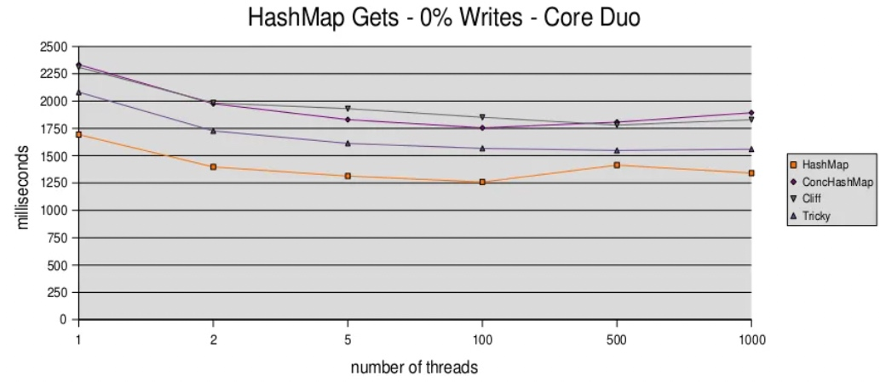

# I/O in Java

## IO vs. NIO

1. N连接N线程
	* 同步
	* 高并发
	* 多线程（1k+）
	* 同步问题快速出现？？？
	* 同步很难
		* 大家都搞错了？？？
		* 导致良好的、间歇性的、不可追踪的、不可重现的、偶尔的服务器崩溃
		* scaling was limited
	* 1k+线程时，服务器容易出问题
	* java.nio
	* 异步I/O
		* 事件驱动
		* 有状态
	* 理论上支持1线程负责整个server
		* no given task can monopolize anything
	* 实际上
		* 少量线程处理多个阶段
		* 多个线程处理后端通信
		* 一些工作线程
		* 一些DB线程
	* SEDA(Staged Event-Driven Architecture)
		* https://en.wikipedia.org/wiki/Staged_event-driven_architecture
		* 服务端设计标准
			* 多层的动态可调整的池子大小
			* 某种进化算法 - 尝试另一个线程？？？
			* 基于java.nio
2. N连接1线程
	* 异步
	* 可以1线程，但通常有多个
	* clients间多cs
	* 受限于CPU，带宽，fds
	* 别弄混 scalable vs. fast

3. NIO vs. IO 
	1. 选哪种实现Server，Why？
		* NIO
			* Asynchronous IO 快（错的）
			* cs慢（错的）
			* 多线程耗内存
			* 线程间同步很要命（错的）
			* N连接N线程无法扩展（错的）
		* IO
			* Synchronous IO 快
			* 编程简单
			* 更好地利用多核

	2. 关于速度

		假设 1个Client 1个Server，对大量数据做基准测试，速度上NIO只有IO的75%。
		阻塞模型 比 NIO selectors 快25-35%，阻塞模型引入了多种技术
		
		* 使用多个selectors
		* 如果第一个 **read** 返回 *EAGAIN*，则多 **read** 几次
		
		> Yet we couldn't beat the plain thread per connection model with linux NPTL.
		
		epoll比poll的性能、可扩展性更好。
		基于epoll的Server的可扩展性比“N连接N线程”更好，但性能差25%。使用epoll可以通过更少的线程达到和NIO一样的性能。
		
	3. 伪代码
		
		Asynchronous
		
		```
		1. make syscall to selector
		2. if nothing to do, goto 1
		3. loop through tasks
			a. if OP_ACCEPT, syscall to accept the connection, save the key
			b. if OP_READ, find the key, syscall to read data
			c. if more tasks goto 3
		4. goto 1
		```
		
		Synchronous
		
		```
		1. make syscall to accept connection(thread blocks)
		2. make syscall to read data(thread blocks)
		3. goto 2
		```
		
		

4. 多线程
	
	* 很难写？？？
	* 收益显著，利用多核
	* Linux 2.4之前最多支持百来个线程，Windows能支持1.6k（jvm限制？？？）
	* Linux 2.6+ 默认NPTL
		* threading lib 标准化了
		* 空闲线程的消耗接近0
		* cs更快（1 vs. 2, 1 vs. 1000）
			
		* 支持更多线程
			同步消耗大，但单线程同步消耗低
			
			4核（同步放大了方法调用的负担；越多核，约快；非阻塞表现更好）
			
			更多核
			
			
	总而言之
	
	* uncontended sync is cheap？？？
	* contended sync gets more expensive？？？
	* nonblocking datastructure scale well？？？
	* multithreaded programming style is quite viable even on single core
	
	

5. Server实战
	
	1. 1 thread per connection
		* 类似写单线程代码
		* 所有数据结构要支持多线程访问
		* sync can be tricky？？？
	2. read 阻塞
		* read阻塞时，thread空闲
		* write阻塞时，thread空闲，但通常不显著？？？
	3. 扩展
		
		
		1. 一台机器can跑多少线程？
			* 受限于栈大小(-Xss)
		2. 一台机器should跑多少线程？
			* 刚好用完CPU/内存/网络等资源
			* 选择合适的保和度（过满则溢）
			* 背压

6. Design Decisions
	
	* ThreadPools
		* 别用 *Executors.newCachedThreadPool*
		* SynchronousQueue
		* 清理无用thread（默认：60s）
		* 已有threads忙碌时可以创建新threads（有上、下限）
	* Blocking Data Structures
		* BlockingQueue
			* 内置于 *Executors**
			* 通常用 *ArrayBlockingQueue*，很少用 *LinkedBlockingQUeue*
			* **remove** 会阻塞
			* **insert** 会唤醒线程
			* 在I/O里可以直接把 Socket 给 worker threads
	* NonBlocking Data Structures
		* ConcurrentLinkedQueue
			* 基于 CAS
			* elegance is downright fun？？？
			* **add/delete/iterate** 不导致数据损坏或阻塞
			* **iterate** fuzzy？？？
		* ConcurrentHashMap
			* 不是真并发
			* **read** 不阻塞
			* **write** 部分有锁
			* 构造函数中可以调整并发数
		* Cliff Click's NonBlockingHashMap & NonBlockingLongHashMap
			* 完全不阻塞
			* **write** 的表现很好？？？
	* BufferedStreams
		* BufferedOutputStream
			* 默认8k byte[]
			* 需要 **flush**
			* 能极大优化频繁写小数据场景下的性能
			* 相当于加了一层内存缓存
			* 适用于发送出现问题，不适用于已经把消息转为 *byte[]*
	* Bytes
		* 分配对象的消耗小，but a few million objects are probably measurable？？？
		* *String* 操作内部繁琐
		* 当心自动包装

7. Designing Servers
	1. static server
		
		
		
		
		
		
	2. smtp server
		
9. References

	* [NPTL Native POSIX Thread Library](https://en.wikipedia.org/wiki/Native_POSIX_Thread_Library)
	* [SEDA Staged Event-Driven Architecture](https://en.wikipedia.org/wiki/Staged_event-driven_architecture)
	* Why Events are a bad idea(for high-concurrency servers), Rob von Behren
	* C10K Problem, Dan Kegel

