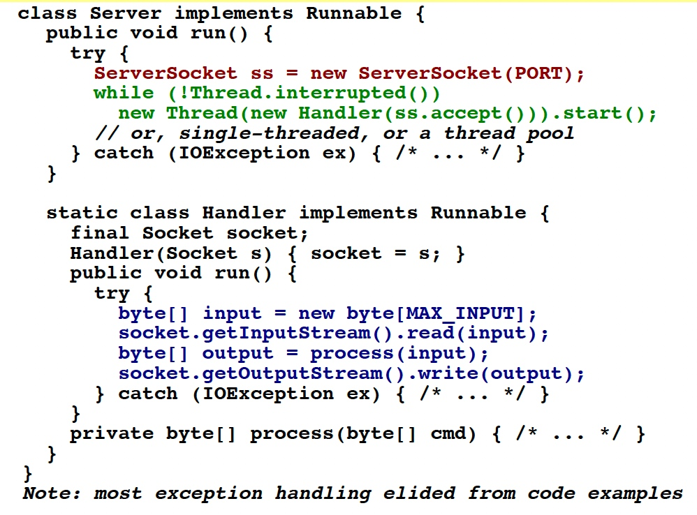
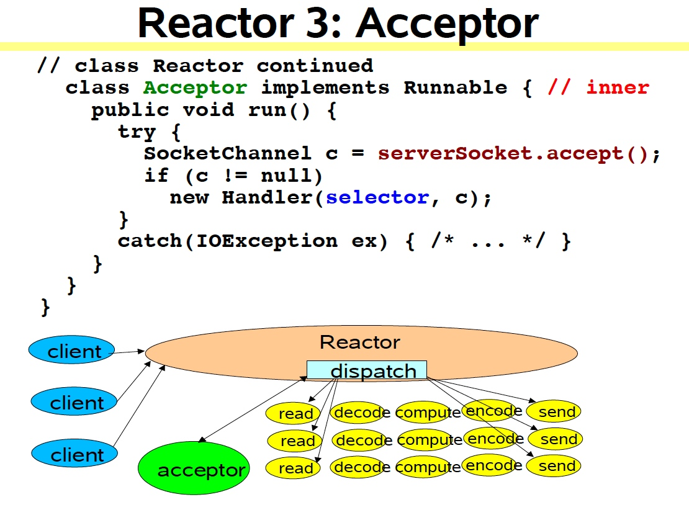
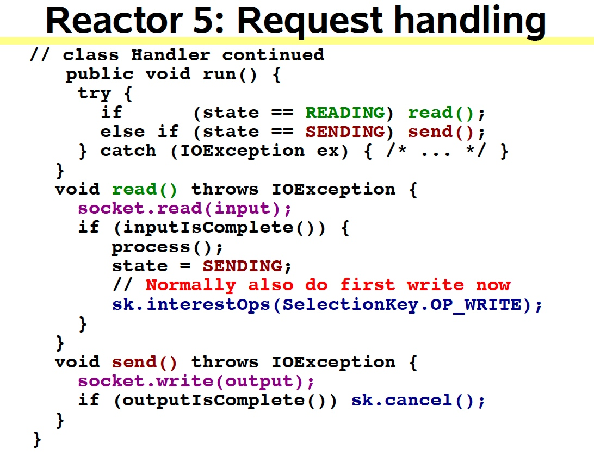

# Scalable I/O

1. Basics
	
	Web services, Distributed Objects, etc.
	
	Most have same basic structure, but differ in nature and cost of each step(XML parsing, File transfer, Web page generation, computational services, ...)
		
	* 	Read request
	* 	Decode request
	* 	Process service
	* 	Encode reply
	* 	Send reply
	
	Classic serivce design
	
	
	
	Classic ServerSocket Loop
	
	

2. Scalability Goals
	* Graceful degradation under increasing load (more clients)
	* Continuous improvement with increasing resources (CPU, memory, disk, bandwidth)
	* Also meet availability and performance goals
		* Short latencies
		* Meeting peak demand
		* Tunable quality of service
	* Divide-and-conquer is usually the best approach for achieving any scalability goal

3. Divide and Conquer
	
	* Divide processing into small tasks
		* Each task performs an action without blocking
	* Execute each task when it is enabled
		* Here, an IO event usually serves as trigger
			
		* Basic mechanisms supported in java.nio
			* *Non-blocking* reads and writes
			* *Dispatch* tasks associated with sensed IO events
		* Endless variation possible
			* A family of event-driven designs
		
4. Event-Driven Designs
	
	优缺点
	
	* Usually more efficient than alternatives
		* Fewer resources
			* Don't usually need a thread per client
		* Less overhead
			* Less context switching, often less locking？？？
		* But dispatching can be slower
			* Must manually bind actions to events
	* Usually harder to program
		* Must break up into simple non-blocking actions
			* Similar to GUI event-driven actions
			* Cannot eliminate all blocking: GC, page faults, etc
		* Must keep track of logical state of service
	
5. Reactor Pattern
	
	Events in AWT
	
	

	Basic reactor design with single thread
	
	
	
	* *Reactor* responds to IO events by dispatching the appropriate handler
		* Similar to AWT thread
	* *Handlers* perform non-blocking actions
		* Similar to AWT ActionListeners
	* Manage by binding handlers to events
		* Similar to AWT addActionListener

	API in java.nio

	* Channels
		* Connections to files, sockets etc that support non-blocking reads
	* Buffers
		* Array-like objects that can be directly read or written by Channels
	* Selectors
		* Tell which of a set of Channels have IO events
	* SelectionKeys
		* Maintain IO event status and bindings
	
	
	
	
	
	
	
	
	
	
	
	
	
	Multithreaded Designs
	
	* Strategically add threads for scalability
		* Mainly applicable to multiprocessors
	* Worker Threads
		* Reactors should quickly trigger handlers
			* Handler processing slows down Reactor
		* Offload non-IO processing to other threads
	* Multiple Reactor Threads
		* Reactor threads can saturate doing IO
		* Distribute load to other reactors
			* Load-balance to match CPU and IO rates
	
	Worker Threads
	
	* Offload non-IO processing to speed up Reactor thread
		* Similar to POSA2 Proactor designs
	* Simpler than reworking compute-bound processing into event-driven form
		* Should still be pure nonblocking computation
			* Enough processing to outweigh overhead
	* But harder to overlap processing with IO
		* Best when can first read all input into a buffer
	* Use thread pool so can tune and control
		* Normally need many fewer threads than clients
	
	Worker Thread Pools
	
	
	
	
	
	Coordinating Tasks
	
	* Handoffs
		* Each task enables, triggers, or calls next one
		* Usually fastest but can be brittle
	* Callbacks to per-handler dispatcher
		* Sets state, attachment, etc
		* A variant of GoF Mediator pattern
	* Queues
		* For example, passing buffers across stages
	* Futures
		* When each task produces a result
		* Coordination layered on top of join or wait/notify
	
	Using Multiple Reactors
	
	
	
	TBC

