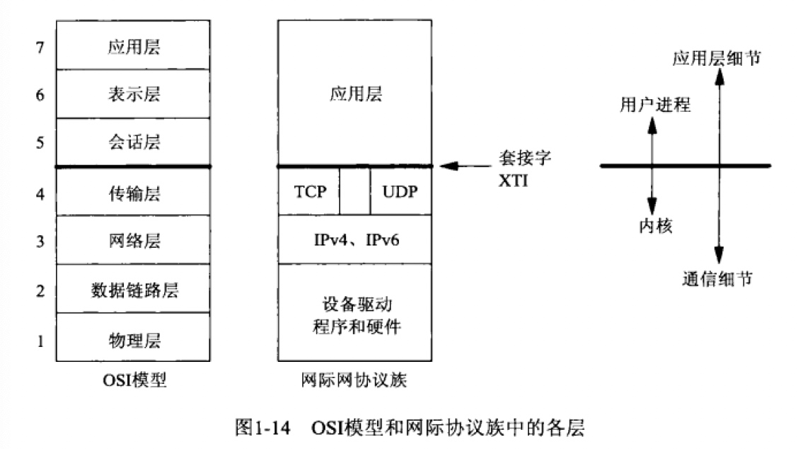
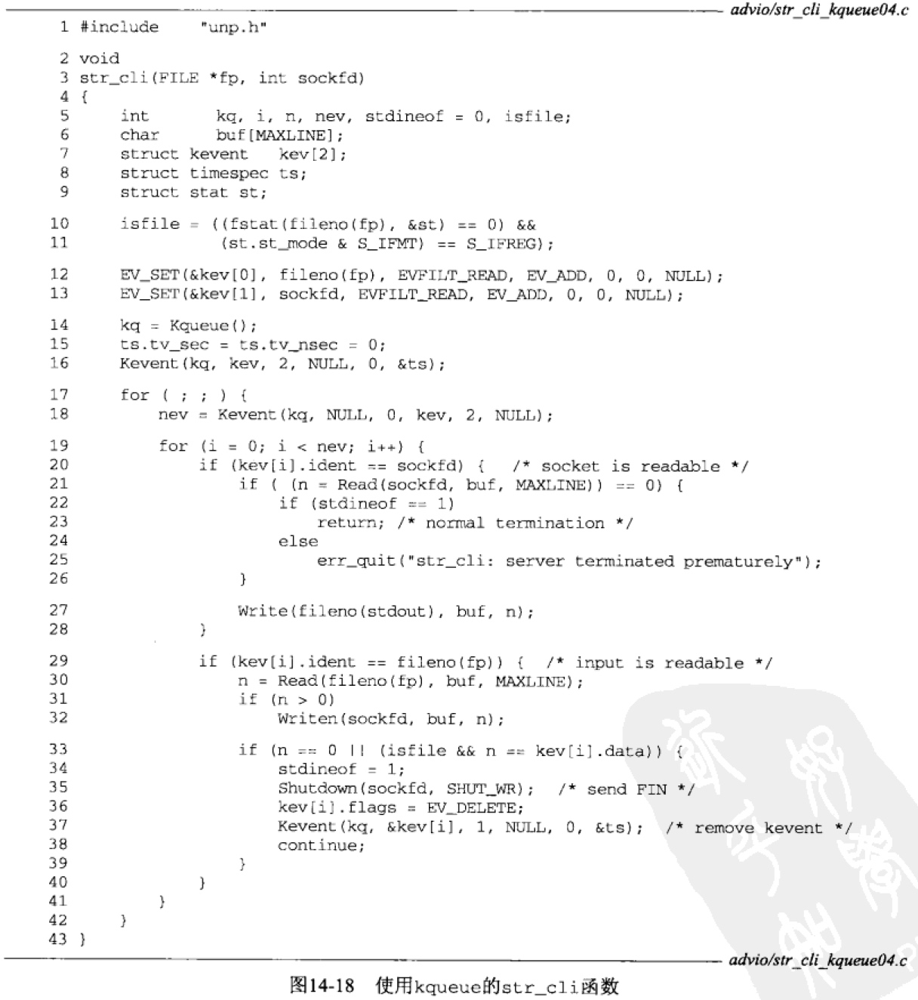
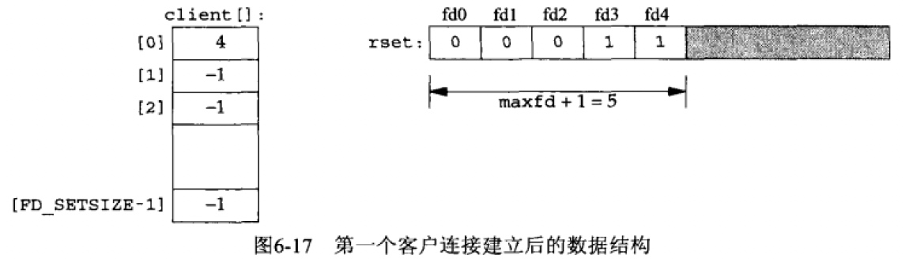
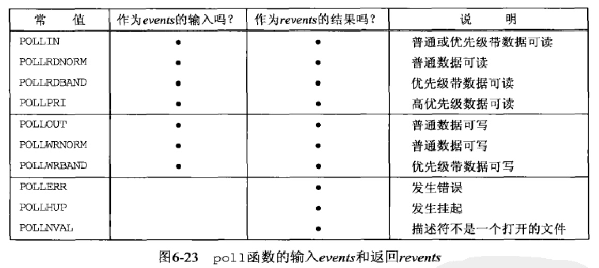
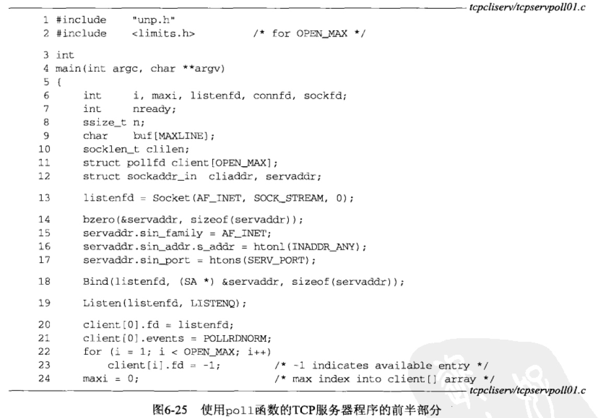

# UNP

[toc]

## TCP/IP 基本概念

1. OSI
	
	

2. netstat
	
	``` bash
	[root@16-36-106-yf-core simulation_31]# netstat -ni
Kernel Interface table
Iface      MTU    RX-OK RX-ERR RX-DRP RX-OVR    TX-OK TX-ERR TX-DRP TX-OVR Flg
docker0   1500 870904890      0      0 0      622155419      0      0      0 BMRU
eth1      1500 6093538256      0   1318 0      5943664247      0      0      0 BMRU
lo       65536 26114335      0      0 0      26114335      0      0      0 LRU
veth1795  1500    31670      0      0 0         79904      0      0      0 BMRU
veth11b9  1500    80621      0      0 0        217078      0      0      0 BMRU
veth143e  1500 11875038      0      0 0       8292256      0      0      0 BMRU
veth3fc8  1500 25678016      0      0 0      19287518      0      0      0 BMRU
veth692f  1500  1407520      0      0 0        995911      0      0      0 BMRU
veth8452  1500       19      0      0 0           111      0      0      0 BMRU
veth98b1  1500    30984      0      0 0        120175      0      0      0 BMRU
vethb59b  1500     5219      0      0 0          3685      0      0      0 BMRU

	[root@16-36-106-yf-core simulation_31]# netstat -rn
Kernel IP routing table
Destination     Gateway         Genmask         Flags   MSS Window  irtt Iface
0.0.0.0         172.16.36.1     0.0.0.0         UG        0 0          0 eth1
10.0.0.0        172.16.36.1     255.0.0.0       UG        0 0          0 eth1
169.254.0.0     0.0.0.0         255.255.0.0     U         0 0          0 eth1
172.16.0.0      172.16.36.1     255.255.0.0     UG        0 0          0 eth1
172.16.36.0     0.0.0.0         255.255.255.0   U         0 0          0 eth1
172.17.0.0      0.0.0.0         255.255.0.0     U         0 0          0 docker0
192.168.0.0     172.16.36.1     255.255.0.0     UG        0 0          0 eth1
	```
	
3. POXIS

	https://unix.org/version3/

4. TCP/IP

	

	tcpdump

	* socket(PF_PACKET, SOCK_RAW, 768)        = 3
	* socket(PF_INET, SOCK_DGRAM, IPPROTO_IP) = 4

	

	

	tcp

	* RFC 793, 2581, 2988, 3390
	* mss: cat /proc/sys/net/ipv4/tcp_base_mss
	* window size: sysctl -a | egrep "rmem|wmem|adv_win|moderate"
	* timestamp: net.ipv4.tcp_timestamps
	
5. sctp
	
	

	
	
	

	
6. port与进程
	
	
	
	

7. 缓冲区大小及限制
	
	* IPv4数据报最大65535字节（含首部，总长度字段16bit）
	* IPv6数据报最大65575字节（不含首部20字节，净荷长度16bit），支持jumbo payload选项（MTU超过65535限制时刻开启，如主机内部连接）
	* MTU通常由硬件规定，以太网1500字节，PPP可人为配置，IPv4最小68字节（20首部+40选项+8最小片段），IPv6最小1280字节（运行在MTU小于min值时需要链路分片、重组，RFC 2460）
	* IP数据报小于链路MTU时会被分片（fragmentation），IPv4主机对产生的数据报分片，IPv4路由器对转发的数据报分片，IPv6只有主机对产生的数据报分片，IPv6主机不对转发的数据分片
	* IPv4首部 **DF位** （不分片位）设置后，路由遇到超出MTU大小的数据报返回ICMPv4消息 *destination unreachable, fragmentation needed but DF bit set*
	* 最小重组缓冲区大小，IPv4 576字节，IPv6 1500字节。如，许多基于IPv4的UDP应用（DNS、RIP、SNMP等）避免产生577+（含）以上大小的包
	* MSS，告知对端自身重组缓冲区的大小实际值，进而避免分片。通常设置为MTU间IP首部、TCP首部，如以太网IPv4 MSS 1460，IPv6 1440（IPv6首部40字节）
	* TCP输出
		* 发送缓冲区 **SO_SNDBUF**，内核从应用进程的缓冲区复制数据到套接字的发送缓冲区，空间不够时 **sleep 应用进程**（阻塞），内核直到完成复制才从 **write** 返回，即 **write** 成功不表示对端收到数据（参考 **SO_LINGER**）
			
		* TCP必须为已发送的数据保留副本，直到收到对端 *ack* 后本端TCP才从套接字发送缓冲区丢弃已确认的数据
	* UDP输出
		* UDP实际上不存在真正的发送缓冲区，因为UDP不可靠，不必保存应用数据的副本
		* UDP有大小限制 **SO_SNDBUF**，当应用进程实际写的数据报超出限制时，内核向进程返回 *EMSGSIZE*。
		  
		* UDP套接字 **write** 成功表示数据报或所有片段已被加入数据链路层的输出队列，若队列空间不足，内核通常返回 *ENOBUFS* （有些实现不返回）
	* SCTP输出
		* 类TCP输出
			

8. 常见应用的协议使用情况
	
	
## Socket编程

### 数据结构

1. socket地址结构
	
	
	传递socket地址结构时

	* 进程 -> 内核: bind, connect, sendto, 会传 **结构的指针、结构的整数大小**
		

	* 内核 -> 进程: accept, recvfrom, getsockname, getpeername, 会传 **结构的指针、结构的整数大小的指针**，因为函数返回时结构大小是另一个结果，告知进程内核在结构中实际存储的信息量，称为 **值-结果(value-result)**参数
		
	
	* 其他: recvmsg, sendmsg的结构长度通过结构字段传递，而不通过函数参数
2. 字节操纵函数
	* b_*: 起源于4.2BSD，bzero, bcopy, bcmp
	* mem_*: 起源于ANSI C，memset, memcopy, memcpy(当src和dst重叠时，memcopy结果不可知，要改用memmove), memmove
3. 地址转换函数

	

	* inet_aton, inet_addr, inet_ntoa 适用IPv4
		* inet_aton的 **addrptr** 指针为空时，会做有效性检查但不存储结果
	* inet_pton, inet_ntop 同时适用IPv4、IPv6

4. 字节流Socket
	* read, write受限于Socket缓冲区，输入或输出的字节数可能比请求数量少

### TCP函数


* connect
	* 需要时内核会确定IP、选择临时Port，不用提前调**bind**
	* TCP会触发三次握手，连接失败可能返回
		* *ETIMEOUT* 未收到SYN响应，通常6s、24s后重试，75s后超时
		* *ECONNREFUSED* SYN响应为RST，hard error，通常对端端口未监听
		* *EHOSTUNREACH、ENETUNREACH* 路由失败时（路由器转发失败、本地路由转发表没有可达路径、connect调用不等待就返回）主机保存ICMP错误，直到重试失败时告知进程，soft error
		* 成功则**SYN_SENT**后**ESTABLISHED**，失败则**CLOSED**且必须调close当前socket
* bind
	
	* int bind(int sockfd, const struct sockaddr *myaddr, socklen_t addrlen);
	* 服务器通常在启动时绑定端口，如果未bind，则调**connect、listen**时由内核分配临时端口
	* 进程能将特定IP（属于主机网络接口）绑定到socket上，对于TCP相当于为IP数据报指定了源IP地址，限定了socket能接收的客户连接，所以通常TCP不将IP绑定到socket，而是在连接socket时交由内核根据出口网络接口来选择源IP，出口网络接口取决于到达服务器所需的路径，把用户发送的SYN的目的IP作为服务器的源IP
	* 如果指定Port为0，内核在**bind**时选择临时端口；如果指定IP为通配，内核将等到*TCP socket建连*或*UDP socket发数据*时才选择本地IP 
* listen
	* int listen(int sockfd, int backlog);
	* Only in TCP
	* **socket**默认创建主动socket，等待调**connect**发起连接，**listen**将其转换为被动socket，让内核接受指向该socket的连接请求，*CLOSED -> LISTEN*
	* backlog 内核应该为socket排队的最大连接个数
		
		
		* 未完成连接队列（incomplete connection queue） *SYN_RCVD*
		* 已完成连接队列（completed connection queue） *ESTABLISHED*
		* 从队列中移除
			* 75s超时则从incomplete中移除
			* 进程调用accept时将completed的head返给进程，如果completed为空则进程sleep直到completed有新数据
		* listen的backlog没有过正式定义，曾被规定为 *max(incomplete + completed)*
		* Berkeley的实现增加了模糊因子 *fudge factor*，**未处理队列实际长度 = 模糊因子 * backlog**，
		* backlog不要设置为0，不同实现对此有不同解释
		* 正常握手时（没重传），incomplete中任一项的留存时间为1个RTT，RTT取决于客户端和服务器，中值187ms
		* 指定较大backlog的理由：对于繁忙的服务器，随着*SYN*到达，incomplete可能增长，若队列满了，TCP会忽略该分节（不发RST），认为繁忙是暂时性的，期望客户端交由协议栈 **重发SYN** 而非 **处理RST**，也避免客户端无法区分*端口无监听服务和队列满*
		* 握手完成后、**accept**前的数据应交由服务器TCP排队，最大数据量为已连接socket的接收缓冲区大小
* accept
	* int accept(int sockfd, struct sockaddr *cliaddr, socklen_t *addrlen);
* fork, exec
	* fork 调用一次、返回两次
	* fork 典型用法
		* 1个进程创建1个自身的副本，eg：网络服务器
		* 1个进程执行另1个程序，创建自身副本后exec替换成其他程序，eg：shell
* 并发服务器
	* 对TCP Socket调用 **close** 会发送 *FIN*，但父进程对fd调用 **close** 并没有终止连接。
		* 这是因为每个文件/Socket都有一个引用计数，由文件表项维护，表示当前打开着的引用fd的个数。**socket** 返回后关联fd的引用计数为1，**accept** 返回后关联fd的引用计数也为1，但 **fork** 返回后fd在父子进程间共享，关联fd的引用计数为2。当父进程关闭fd时，fd只减1，即子进程处理与客户端的连接，父进程在 *LISTEN Socket* 上再次调用 **accept** 处理下一个连接。该Socket真正的清理和资源释放要等到引用计数为0时，也就是子进程也关闭fd时。
			
			
	
* close
	* int close(int sockfd);
	* 不再 **read/write** 新数据，但TCP将继续发送已排队等待发送的数据，之后是正常的TCP连接终止序列
	* TCP选项 *SO_LINGER* 可以改变上述默认行为
* shutdown
	* 立即关闭Socket，即发送FIN
* getsockname, getpeername
	* int getsockname(int sockfd, struct sockaddr *localaddr, socklen_t *addrlen);
		* 对于没调用 **bind** 的TCP，**connect** 成功返回后，**getsockname** 用于返回由内核赋予该连接的*本地IP和本地Port*
		* 对于*0端口*的 **bind**（由内核选择本地端口），**getsockname** 用于返回由内核赋予的*本地Port*
		* 获取某个Socket的地址族
	* int getpeername(int sockfd, struct sockaddr *peeraddr, socklen_t *addrlen);
		
### TCP程序示例


Server端


> P5-2 19~24 子进程关闭监听套接字，子进程从套接字读数据并写回给客户端，父进程关闭已连接套接字
> P5-3 8~9 收到FIN后 **read** 返回0，从而终止子进程

Client端


1. 正常启动
	* Server端
		* listen *LISTEN* 通配IP *:9877
		* socket, conenct 触发握手 *ESTABLISHED*
		* accept, fork, 父进程继续accept下一个, 子进程read
	* Client端
		* connect 触发握手 *ESTABLISHED*
		* fgets 阻塞等待用户输入
		* write, read阻塞等待Socket, fputs
2. 正常终止
	* Client端
		* fgets(EOF), exit 内核关闭Socket(TCP发送FIN) *FIN_WAIT_2*
	* Server端
		* TCP回应FIN的ACK *CLOSE_WAIT*
		* read(收到FIN，返回0), 子进程exit, 子进程所有fd关闭(TCP发送FIN，收到Client的ACK，结束挥手) *TIME_WAIT*
		* 进程终止时，给父进程发送*SIGCHLD* ，若父进程没处理，则子进程僵死
			* *SIGCHOLD* 内核在任一进程终止时发给父进程的信号
			* 设置 *Zombie* 状态是为了维护子进程信息，以便父进程在未来获取，包括子进程ID、终止状态、资源利用信息
			* 当进程终止，且其子进程为 *Zombie*，则重置子进程的父进程ID为`1`，交由`init`进程清理
3. POSIX信号处理
	1. 软中断 告知某个process发生了某event 通常异步
		* 进程A发给进程B/进程A
		* 内核发给进程
 	2. 关联的处置/行为（disposition/action），通过调用 **sigaction** 设置一个信号的处置
 		* signal handler（捕获信号 catching）
 			* 只要有特定信号就调用，但 *SIGKILL、SIGSTOP* 无法捕获，*SIGIO、SIGPOLL、SIGURG* 等个别信号还要做些额外工作
 			* void handler(int signo);
 		* 设置为 *SIG_IGN* 来忽略某个信号
 			* 但 *SIGKILL、SIGSTOP* 无法忽略
 		* 设置为 *SIG_DFL* 来启用默认处置
 			* 通常为终止进程，部分会产生core image，个别会忽略
4. wait, waitipd

	返回已终止子进程的ID、子进程终止状态

	1. wait
		* pid_t wait(int *statloc);
	2. waitpid
		* pid_t waitpid(pid_t pid, int *statloc, int options);
		* *WNOHANG* options 告知内核在没有已终止子进程时不要阻塞
	
	

	5个 *SIGCHLD* 都在信号处理函数执行前产生，而它只执行1次，因为Unix信号一般不排队。而且依赖于FIN到达的时间，该问题的结果是不确定的。
	应该调 **waitpid** 而非 **wait**。

	

	Server进程正确处理 **accept** 返回的 *EINTR*，并建立一个给所有已终止子进程调用 **waitpid** 的信号处理函数，以处理可能遇到的三种情况
	
	* **fork**子进程时，必须捕获 *SIGCHLD*
	* 捕获信号时，必须处理被中断的syscall
	* *SIGCHLD* 的信号处理函数必须正确编写，应使用waitpid避免留下 *Zombie* 进程

	
	
5. accept返回前连接中止
	
	

	不同OS有不同处理
	
	* Berkeley 在内核中处理中止的连接，Server进程继续accept下一个
	* SVR4 返回错误给Server进程，错误取决于具体实现，可能为 *EPROTO* 或 *ECONNABORT*，POSIX要求返回后者，避免Server进程分不清 streams system 产生的致命的协议相关事件（不能继续accept）和已建立连接的非致命中止事件（能继续accept）

6. Server进程终止

	``` plantuml
	@startuml
	Alice -> Server: kill 子进程
	Server -> Server: 内核关闭所有打开着的子进程fd
	Server -> ClientTCP: FIN
	ClientTCP -> Server: ACK(FIN)
	Client -> Client: fgets
	Client -> ClientTCP: write
	ClientTCP -> Server: push data
	Client -> Client: read(因为收到过FIN所以返回0), "server terminated permaturely"
	Client -> Client: 关闭所有打开着的fd
	Server -> ClientTCP: RST
	@enduml
	```
	
	*FIN* 时，Client阻塞在 **fgets** 上，Client实际在应对2个fd —— Socket和stdin，它不能只阻塞在一个fd上。需要在 **kill** Server进程后，让Client进程感知到 *FIN*
	
7. SIGPIPE
	
	Client进程可能在 **read** 前执行2次 **write**，第1次 **write** 会产生 *RST*，第2次 **write** 来不及感知 *RST*，需要避免Client进程写入更多数据。
	当进程向某个已知收到 *RST* 的Socket，内核向进程发送 *SIGPIPE*，该信号默认行为是终止进程。无论怎么处理信号，**write** 都会返回 *EPIPE* 错误。
	
	

8. Server宕机
	
	Client TCP协议栈会重传，Berkley重传约12次，共约9分钟才放弃。可能收到 *ETIMEOUT、EHOSTUNREACH、ENETUNREACH*。
	Client可以设置超时以尽快检测崩溃。

9. Server宕机后重启

	Server TCP丢失连接信息，会以 *RST* 响应Client。而Client正阻塞在 **read**，会返回 *ECONNRESET*。

10. Server关机
	
	init进程向所有进程发送 *SIGTERM*（可捕获），等待一段固定时间（5~20s），再向所有进程发送 *SIGKILL*（不能捕获）。
	当Server子进程终止时，它所有打开着的fd都被关闭。此时，Client仍旧阻塞在 **fgets**，无法立即感知到Socket的 *FIN*。
	
### UDP函数
### UDP程序示例
### 套接字选项


对 **shutdown** 的2种可能调用和对 **close** 的3种可能调用，及其对TCP Socket的影响。


// TODO

### SCTP函数
### SCTP程序示例
## 名字与地址转换
## IPv4和IPv6的互操作性
## 守护进程和inetd
## 高级I/O函数

1. Socket超时
	1. 调用 **alarm**，超时时产生 *SIGALRM* 信号。缺点是信号处理的实现不同，而且可能干扰进程中现有的 **alarm** 调用。
	2. 通过 **select** 阻塞等待I/O，替代直接阻塞在 **read、wirte** 上。
	3. 使用Socket选项 *SO_RCVTIMEO*、*SO_SNDTIMEO*。缺点是部分实现不支持。

	上述3种方式适用于输入/输出操作（如 **read、wite** 及 **recvfrom、sendto** 等变体）。但因为TCP内置的 **connect** 超时非常长（75s），**select** 用在 **connect** 上设置超时的先决条件是Socket是非阻塞模式，两个Socket选项也不适用，所以 **connect** 上的超时处理问题还有待解决。
	
2. recv & send

	``` c
	ssize_t recv(int sockfd, void *buff, size_t nbytes, int flags);
	ssize_t send(int sockfd, const void *buff, size_t nbytes, int flags);
	```
	
	
	
	*flags* 是值传递，即只能用户进程单向传递给内核，不能回传。4.3BSD修改 **recvmsg、sendmsg** 用的 *msghdr* 结构，新增整数 *msg_flags* 成员，该结构是引用传递，所以内核能回传给用户进程。

3. readv & sendv
	
	类似 **read、write**，但允许单个syscall读入到或写出自一个或多个缓冲区，称为分散读（scatter read）或集中写（gather write），因为来自读操作的输入数据被分散到多个应用缓冲区，而来自多个应用缓冲区的数据被集中提供给单个写操作。
	
	``` c
	# @return 读入或写出的字节数，出错返回-1
	ssize_t readv(int fieldes, const struct iovec *iov, int iovcnt);
	ssize_t writev(int fieldes, const struct iovec *iov, int iovcnt);
	
	struct iovec {
		void *iov_base; /* starting address of buffer */
		size_t iov_len; /* size of buffer */
	}
	```
	
	可用于任何fd，不局限于Socket。此外，**writev** 是原子操作，即对于一个基于记录的协议（如UDP），一次 **writev** 调用只产生单个UDP数据报。
	
	
	？？？
	
4. recvmsg & sendmsg
	
	最通用的I/O函数。实际上所有 **read、readv、recv、recvfrom** 都能替换成 **recvmsg**，类似地输出函数也能替换为 **sendmsg**。
	
	``` c
	# @return 成功返回读入或写出的字节数，出错返回-1
	ssize_t recvmsg(int sockfd, struct msghdr *msg, int flags);
	ssize_t sendmsg(int sockfd, struct msghdr *msg, int flags);
	
	struct msghdr {
		void *msg_name; /* protocol address */
		socklen_t msg_namelen; /* size of protocol address */
		struct iovec *msg_iov; /* scatter/gather array */
		int msg_iovlen; /* elements in msg_iov */
		void *msg_control; /* ancillary data (cmsghdr struct) */
		socklen_t msg_controllen; /* length of ancillary data */
		int msg_flags; /* flags returned by recvmsg() */
	}
	```
	
5. 排队的数据量 确定Socket接收缓冲区的数据量
	
	有时想在不真正读取数据前就知道Socket上已有多少数据排队等待读取，有3种方法
	
	* 如果目的是避免读操作阻塞在内核中，可以使用非阻塞式I/O
	* 如果既想查看数据，又想数据仍然留在接收队列中供本进程其他部分稍后读取，可以用 *MSG_PEEK* 标志。如果不能肯定是否真有数据可读，可以结合非阻塞Socket使用该标志，也可以组合使用 *MSG_DONTWAIT、MSG_PEEK*。注意，由于Socket会持续接收数据、其他进程共享该Socket并从中读取数据，两次相继的 **recv** 间接收队列中的数据量可能变化。
	* 一些实现支持ioctl的 *FIONREAD* 命令。该命令第三个ioctl参数是整数指针，内核通过该指针返回Socket接收队列的当前字节数，是已排队字节的总和。
	
6. Socket和标准I/O
	
	围绕fd工作的函数执行I/O称为Unix内核中的系统调用实现，如 **read, write及其变体**。执行I/O的另一种方法是使用标准I/O函数，处理我们直接使用Unix I/O时必须考虑的一些细节，如自动缓冲输入流和输出流。
	
	标准I/O函数库可用于Socket，但存在如下问题
	
	* 通过调用 **fdopen** 可以从任何fd创建标准I/O流，也能通过调用 **fileno** 获取给定标准I/O流的fd。如果想在标准I/O流上调用 **select**，由于只用于fd，因此必须要获取该标准I/O流的fd。
	* TCP、UDP都是全双工，以 *r+* 类型打开的流也是全双工，但是在调用输出函数后要插入 **fflush、fseek、fsetpos、rewind** 才能接着调输入函数，调用输入函数后要插入 **fseek、fsetpos、rewind** 才能接着调用输出函数，除非输入函数遇到 *EOF*。但 **fseek、fsetpos、rewind** 都调用 **lseek**，而 **lseek** 用在Socket上会失败。
	
	解决上述问题最简单的方法是 为1个给定fd打开2个标准I/O流，分别用于读、写。
	
	
	
	标准I/O库函数执行3类缓冲
	
	1. 完全缓冲（fully buffering）
		* 缓冲区满
		* 进程显式调用 **fflush**
		* 进程调用 **exit** 终止自身
	2. 行缓冲（line buffering）
		* 碰到换行符
		* 进程显式调用 **fflush**
		* 进程调用 **exit** 终止自身
	3. 不缓冲（unbuffering）
		* 每次调用标准I/O输出函数都发生I/O

	标准I/O函数库的大多数Unix实现使用如下规则
	
	* stderr不缓冲
	* stdin、stdout完全缓冲，除非指代终端设备时行缓冲
	* 所有其他I/O流都完全缓冲，除非指代终端设备时行缓冲

	由于Socket不是终端设备，**fput** 完全缓冲，会导致阻塞。有2种解法
	
	* 通过 **setvbuf** 迫使输出流变为行缓冲
	* 每次 **fputs** 后 **fflush** 强制输出
	
	但上述2种方法容易犯错？？？，与Nagle算法的交互也成为题。大多数情况下最好的解决办法是彻底避免在Socket上使用标准I/O函数库。
	此外，标准I/O库的某些实现在fd大于255时存在别的问题，对于需要处理大量fd的网络服务器不友好。（查看<stdio.h>定义的FILE结构存放fd的变量是什么类型）

	7. 高级轮询技术
		
		1. /dev/poll 接口
			**select、poll** 每次调用时都要传递待查询的fds，但 */dev/poll* 能在调用之间维持状态，因此轮询进程可以预先设置好待查询fds，然后进入循环等待事件发生，每次循环回来不必重置该列表。
			
			
			* 向 */dev/poll* 提供fds
			* 等待事件，进程阻塞在 **ioctl**
			* 遍历就绪的fds
			
		2. kqueue 接口
			
			*kqueue* 允许进程向内核注册描述所关注kqueue事件的事件过滤器（event filter）。事件包括 类似 **select** 关注的*文件I/O*和*超时*，*异步I/O*、*文件修改通知（如文件被删除或修改时发出的通知）*、*进程跟踪（如进程调exit、fork时发出的通知）* 和 *信号处理*。
			*kevent* 负责注册关注的事件，也负责确定是否有关注的事件发生。
			*timeout* 的处理类似 **select**，即 *NULL*阻塞进程，*非0值*设置超时，*0值*执行非阻塞事件检查。
			
			``` c
			int kqueue(void);
			int kevent(int kq, const struct kevent *changelist, int nchanges, struct kevent *eventlist, int nevents, const struct timespec *timeout);
			void EV_SET(struct kevent *kev, uintptr_t ident, short filter, u_short flags, u_int fflags, intptr_t data, void *udata);
			
			struct kevent {
				uintptr_t ident; /* identifier (eg, fd) */
				short filter; /* filter type (eg, EVFILT_READ) */
				u_short flags; /* action flags (eg, EV_ADD) */
				u_int fflags; /* filter-specific flags */
				intptr_t data; /* filter-specific data */
				void *udata; /* opaque user data */
			}
			```
			
			其中，*flags* 在调用时指定过滤器更改行为，在返回时额外给出条件
			
			
			
			*filter* 指定过滤器类型
			
			
			
			
			
			* 判定是否文件
				* *kqueue* 处理 *EOF* 的行为取决于fd是文件、管道、终端，因此调用 **fstat** 判定文件指针是否关联一个文件
			* 为 *kqueue* 设置 *kevent*
			* 创建 *kqueue* 并增设过滤器
				* *0值* 非阻塞调用 *kevent*
			* 无限循环，阻塞在 *kevent* 中
				* 调用 *kevent* 指定的过滤器更改列表为 *NULL*，因为只关注已注册过的事件
				* 超时 *NULL*，永远阻塞
			* 遍历返回的事件并分别处理
				* Socket变为可读
				* 输入变为可读
					* 对于管道和终端，*kqueue* 像 **select** 那样返回1个可读指针表示有一个 *EOF* 待处理
					* 对于文件，*kqueue* 只在 *kevent* 的 *data* 成员中返回文件剩余字节数，并假设进程能由此获悉是否到达文件尾
		
	8. T/TCP 事务目的TCP	
		
		用以避免最近通信过的主机间的握手。
		T/TCP能把 *SYN、FIN、数据* 组合到单个分节中（数据大小 < MSS）。
		
		
		
## Unix域
## ioctl
## 路由Socket
## 密钥管理Socket
## 广播
## 多播
## 高级UDP Socket
## 高级SCTP Socket
## 带外数据
## 线程
## IP选项
## 原始Socket
## 数据链路访问
## 流


## I/O模型

I/O需要 **等待数据准备好** 后 **从内核向进程复制数据**。

Unix可用的5种I/O模型如下

1. 阻塞式I/O	
	

2. 非阻塞式I/O
	
	进程设置Socket为 *非阻塞* 指当I/O操作要sleep进程时，不sleep而是返回错误。
	进程对非阻塞fd循环调用 **recvfrom** 称为轮询（polling）。
	进程持续轮询内核会消耗大量CPU时间。
	
	
	
	Socket默认阻塞，即发出不能立即完成的Socket调用时，进程会被投入睡眠，等待相应操作完成。可能阻塞的Socket调用分为4类

	1. 输入
		
		read, readv, recv, recvfrom, recvmsg
		
		* 阻塞式
			* TCP（默认）
				* 接收缓冲区没数据可读，进程被投入睡眠，直到有数据到达
				* 字节流协议，数据可能是单字节或完整的TCP分节中的数据，如果要等待固定数据的数据可读，可以调用 **readn** 或指定 *MSG_WAITALL* 标志
			* UDP
				* 数据报协议，如果接受缓冲区为空，进程被投入睡眠，直到有数据报到达
		* 非阻塞式
			* 输入操作不能被满足时，立即返回 *EWOULDBLOCK* 错误
		
		非阻塞 **str_cli函数** 实现示例
		
		* to 容纳 stdin -> server 的数据

			

		* fr 容纳 server -> stdout 的数据

			

		* **str_cli** 非阻塞式I/O实现

			
			
			* sockfd、STDIN_FILENO、STDOUT_FILENO 描述符都设置为非阻塞 *O_NONBLOCK*
			* 初始化缓冲区指针，且最大描述符加1作为 **select** 的第一个参数
			* 指定关注的fds
				* 2个fd_set *&rset、&wset* 清零再打开最多2位
				* 如果stdin没读到 *EOF*，且 *to缓冲区* 可用，就打开 *&rset* 中对应stdin的位
				* 如果 *fr缓冲区* 可用，就打开 *&wset* 中对应Socket的位
				* 如果 *to缓冲区* 有data要写，就打开 *&wset* 中对应Socket的位
				* 如果 *fr缓冲区* 有data要写，就打开 *&wset* 中对应stdout的位
			* 调用 **select** 等待事件，不设置超时
			
			
			
			
						
			* 从stdin **read**
				* 处理非阻塞错误 *EWOULDBLOCK*
				* 处理 *EOF*
					* 设置stdineof标志
					* 如果 *to缓冲区* 没有data要发送则调 **shutdown** 发送FIN
				* 处理返回的data
					* 增加 *toiptr*
					* 打开 *&wset* 中对应Socket的位，引发调用 **write** Socket
			* 从Socket **read**
			* **write** 到stdout
				* 如果stdout可写，就调用 **write**
				* 遇到非阻塞错误 *EWOULDBLOCK* 啥也不做
				* 如果 **write** 成功，增加 *froptr*，如果 *froptr* 追上 *friptr*，就同时恢复为指向 *fr缓冲区* 开始处
			* **write** 到Socket
				* 类似 **write** 到stdout，唯一差别是当 *tooptr* 追上 *toiptr*，不仅要同时恢复到 *to缓冲区* 开始处，如果已经在stdin遇到 *EOF*，还要发送 *FIN* 到Server
			
			
			
		**str_cli** 的非阻塞式I/O 135行代码，阻塞式I/O 40行代码，停-等20行代码。从停-等改为阻塞式I/O执行速度提升30倍，但阻塞式I/O改为非阻塞式I/O收益不大，更简单的方法通常是把应用程序任务 **划分到多个进程（fork）或线程**。
		
		* **str_cli** 的 **fork** 版实现
			
			
			
			
			
			
			
	2. 输出
	
		write, writev, send, sento, sendmsg
		
		* 阻塞式
			* TCP
				* 内核从应用进程的缓冲区复制数据到Socket的发送缓冲区，如果发送缓冲区没有空间，进程被投入睡眠，直到有空间为止
			* UDP
				* 不存在真正的发送缓冲区，内核只是复制应用进程数据并沿协议栈行下传递，按序带上UDP首部、IP首部，因此不会因为复制数据阻塞，但可能因为其他原因阻塞
		* 非阻塞式
			* TCP
				* Socket发送缓冲区没空间时，立即返回 *EWOULDBLOCK* 错误
				* Socket发送缓冲区有一些空间，返回内核能够复制到该缓冲区的字节数，也称为不足计数（short count）
	
	3. 接受外来连接
		
		accept
		
		* 阻塞式
			* 没新连接到达，调用进程被投入睡眠
		* 非阻塞式
			* 没新连接到达，立即返回 *EWOULDBLOCK* 错误
		
	4. 发起外出连接
		
		connect
		
		用于TCP。虽然UDP也适用connect，但并不真的建立连接，只会在内核保存peer的IP和Port。
		
		* 阻塞式
			* 	TCP建连的握手阶段需要connect等到SYN对应的ACK才返回，即TCP的每个connect总会阻塞调用进程至少1个RTT
		* 非阻塞式
			* 如果连接不能立即建立，那仍旧能建立连接（发送握手SYN），但返回 *EINPROGRESS* 错误
		
		非阻塞式 **connect** 用途
		
		* 握手（1个RTT，且RTT波动大）、其他处理并行
		* 同时建立多个连接
		* **select** 等待连接建立时可以设置超时，从而缩短 **connect** 的超时（75ms）
		
		处理细节
		
		* 如果Client、Server在同一个host，通常连接立刻建立，**connect** 立刻返回
		* Berkeley的实现关于 **select** 和 **非阻塞connect** 有如下规则
			* 建连成功时，fd变为 *可写*
			* 建连错误时，fd变为 *可读可写*
				* 描述符就绪规则：*TCP Socket* 变为 *可写* 条件为 *发送缓冲区有可用空间*（对于建连中的Socket而言，该条件永远 *true*），且该Socket已建立连接（握手完成后）。当 *TCP Socket* 发生错误时，待处理错误总是导致该Socket变为 *可读可写*
		
		非阻塞 **connect* 时间获取Client
			
		
		
		* 设置Socket为非阻塞
		* 并行处理其他事情
		* 检查连接是否立即建立
		* 调用 **select**
		* 处理超时
		* 检查可读或可写条件
		* 关闭非阻塞状态并返回		
		
		Socket的各种实现和非阻塞 **connect** 会带来移植性问题。
		
		* **select** 前可能已经建连并有对端数据到达，此时即使Socket不发生错误，Socket也是 *可读可写*，和建连失败的读写条件一样。可以通过调用 **getsockopt** 并 **检查Socket上是否存在待处理错误** 来解决。
		
			
		
		* 由于不能假设Socket的 *可写（不可读）* 条件是 **select** 返回Socket成功的唯一方法，需要想办法判断怎样算建连成功
			* 调 **getpeername** 代替 **getsockopt**，如果返回 *ENOTCONN*，则建连失败，我们必须接着用 *SO_ERROR* 调用 **getsockopt** 获取Socket上待处理的错误
			* 用 *0* 调 **read**
			* 再调 **connect**，**EINCONN** 表示已建连
		
		但是非阻塞connect不容易移植，较简单的解决方式是为每个连接创建一个处理线程。（？？？）
	
	非阻塞connect示例
	
	
	
	*netfttoread* 待读取文件数，*nlefttoconn* 待连接文件数，*nconn* 打开中的连接数
	
	
	
	
	
	创建非阻塞Socket，发起非阻塞connect，并把相应文件的标识设置为 *F_CONNECTING*，处理建连完成的情况。
	
	
	
	
	
	构造命令并发送，设置标志，可能的话（没达到最大并行连接数且有连接需要建立，则找一个上位处理的文件调用 **start_connect** 发起另一个连接）发起另一个连接，**select** 等待事件（可读可写/可写）发生，（遍历nfiles）处理所有就绪的fds。
	
3. I/O multiplexing (select, poll)

	进程可以调用 **select** 或 **poll**，阻塞在其中之一，而不阻塞在真正的I/O syscall上。
	使用 **select** 或 **poll** 需要2个syscall，比阻塞式I/O更复杂，该模型的优势在于能等待多个fd就绪。

	

	```
	# 允许进程指示内核等待多个events中任何一个发生，且只在发生events或经历一段指定的时间后才唤醒它。
	# 即，用户进程调select告知内核对哪些fds感兴趣以及等待多长时间。支持所有fd。

	int select(int nfds, fd_set *readfds, fd_set *writefds, fd_set *exceptfds, struct timeval *timeout);
	int pselect(int nfds, fd_set *readfds, fd_set *writefds, fd_set *exceptfds, const struct timespec *timeout, const sigset_t *sigmask);
	int poll(struct pollfd *fds, nfds_t nfds, int timeout);
	int ppoll(struct pollfd *fds, nfds_t nfds, const struct timespec *timeout_ts, const sigset_t *sigmask);
	struct pollfd {
		int   fd;         /* file descriptor */
  		short events;     /* requested events */
  		short revents;    /* returned events */
  };
	```
	
	> 需要 **pselect** 的原因是，如果要等待信号或文件描述符准备就绪，则需要进行原子测试以防止竞争条件。（假设信号处理程序设置一个全局标志并返回。然后，如果信号在测试之后但在调用之前到达，则对该全局标志的测试然后调用 select() 可能会无限期挂起。相比之下， pselect()允许一个人首先阻塞信号，处理传入的信号，然后使用所需的 sigmask 调用 pselect()，避免竞争。）
	
	*timeval* 有三种可能
	
	* 永远等待：仅在有一个fd准备好I/O时才返回。置空。
	* 等待固定时间：在有1个fd准备好I/O时返回，但不超时。置正数。
	* 不等待：检查fd后立即返回，也称为轮询（polling）。置0。
	
	前两种通常会被在等待期间捕获的信号中断，并从信号处理函数返回。？？？
	> 设置信号处理函数时指定 *SA_RESTART* 标识，在SRV4下可以自动重启被中断的 **select**，捕获信号时要处理好 *EINTR* 错误。
	
	*exceptfds* 目前支持的异常条件只有2个
	
	* 某个Socket的带外数据到达
	* 某个已置为分组模式的为终端存在可从其主端读取的控制状态信息？？？
	
	使用时，需要注意
	
	* *nfds* 指定待测试的fd个数，值为待测试的最大描述符+1，即测试 {0, 1, 2, ..., nfds - 1}
	* 测试 fd_set 中的fd时，fd_set中的任何与未就绪fd对应的位返回时都清0，为此，每次重新调用 **select** 时都要重新把关心的位置1。
	
	**select** 返回已就绪的fds的总位数，超时返回0，出错返回-1。
	
	

	使用 **select** 改进客户端函数 str_cli
	
	

	但是 **fgets** 收到EOF不一定表示Socket中的数据都发送完毕，不能直接return到main函数，需要只瓣关闭TCP，即向Server发FIN告知已完成了数据发送，但保持Socket的fd打开以便读取。

	shutdown
	
	* int shutdown(int sockfd, int howto);
	* **shutdown** 能立即触发TCP的挥手，不用等fd的引用计数归零
	* **shutdown** *SHUT_RD*后Socket接收的来自对端的数据会被确认然后悄悄丢弃，*SHUT_WR*后挥手且进程不能write该Socket

	使用 **select、shutdown** 改进客户端函数 str_cli
	
	
	
	服务端建连前的状态
	
	

	
	
	* 0、1、2为stdin、stdout、stderr，3为 *LISTEN* Socket
	
	第一个、第二个客户端建连后的服务端状态
	
	

	
	
	

	
	
	第一个客户端终止链接后服务端的状态
	
	
	
	
	
	以 *select的fd是唯一的监听fd* 为前提，阻塞在 **select**，**accept**新连接，检查现有连接。
	
	
	
	当Server在处理多个Client时，绝对不能阻塞于单个Client的调用，要避免服务被挂起或DDoS。常见方法如下

	* 非阻塞式I/O
	* 让单独的控制线程服务Client（如创建子进程/子线程）
	* 对I/O设置超时
	
	**pselect** 支持纳秒级超时、指向信号掩码的指针（允许程序禁止递交某些信号，再测试由这些当前被禁止信号的信号处理函数设置的全局变量，然后调用 **pselect**，告知它重新设置信号掩码）
	
	比如，当信号 *SIGINT* 仅仅设置全局变量 *intr_flag* 并返回，如果进程阻塞于 **select** 调用，那么从信号处理函数的返回将导致 **select** 返回 *EINTR* 错误。
	
	
	
	问题是，如果在测试 *intr_flag* 和调用 **select** 间有信号发生，那么如果 **select** 永远阻塞，该信号将丢失。
	
	
	
	在测试 *intr_flag* 前，先阻塞 *SIGINT*。当 **pselect** 被调用时，先以空集（zeromask）替代进程的信号掩码，再检查fd，并可能进入睡眠。然而当 **pselect** 返回时，进程的信号掩码又被重置为调用 **pselect** 前的值（即 *SIGINT* 被阻塞）。
	
	**poll** 在SVR3上只支持流设备，SVR4取消了限制支持所有fd。功能与 **select** 类似，但在处理流设备时能提供额外信息。？？？
	
	```
	// @return 返回就绪fd数目，超时返回0，出错返回-1
	int poll(struct pollfd *fdarray, unsigned long nfds, int timeout);
	
	struct pollfd {
		int fd; /* descriptor to check */
		short events; /* events of interest on fd */
		short revents; /* events that occurred on fd */
	}
	```
	
	
	
	使用 **select** 时，必须分配一个client数组以及名为rset的描述符集。改用 **poll**，只需要分配一个 *pollfd* 结构的数组来维护客户信息，而不必分配另外一个数组。
	
	
	
	调用poll，检查新连接，再检查某个现有连接上的数据。
	
	
	
	client[0] 用于监听Socket，其余项的的描述符成员置-1；设置 *POLLRDNORM* 事件，当有新链接准备好接受时 **poll** 将通知我们。
	
4. 信号驱动式I/O (SIGIO)

	内核在fd就绪时发送 *SIGIO* 信号通知应用进程。
	该模型的优势在于 *等待数据报到达* 期间进程不被阻塞，只要等待来自信号处理函数的通知。

	
	
	``` bash
	int sigaction(int signum, const struct sigaction *act, struct sigaction *oldact);
	struct sigaction {
		void (*sa_handler)(int);
		void (*sa_sigaction)(int, siginfo_t *, void *);
		sigset_t sa_mask;
		int sa_flags;
		void (*sa_restorer)(void);
	};
	```
	
	历史上曾被称为异步I/O，区别如下
	
	* 异步I/O，通常定义为进程执行I/O系统调用告知内核启动某个I/O操作，内核启动I/O操作后立即返回到进程，进程在I/O操作期间继续执行，当操作完成或遇到错误时，内核以进程在I/O系统调用中指定的某种方式通知进程
	* 非阻塞式I/O，内核一旦启动I/O操作就不像异步I/O那样立即返回进程，而是等到I/O操作完成或遇到错误。内核立即返回的唯一条件是I/O操作的完成不得不把进程投入睡眠，这种情况下内核不启动I/O操作
	
	Socket的信号驱动式I/O要求进程执行如下步骤
	
	1. 建立SIGIO信号的信号处理函数
	2. 设置该Socket的owner，通常使用 **fcntl** 的 *F_SETOWN* 命令
	3. 开启该Socket的SIGIO，通常使用 **fcntl** 的 *F_SETFL* 命令打开 *O_ASYNC* 标志
	
	UDP Socket的SIGIO信号在发生如下事件时产生
	
	* 数据报到达Socket
	* Socket上发生异步错误
	
	TCP Socket的SIGIO信号在发生如下事件时产生
	
	* *LISTEN* Socket上某个连接请求已经完成
	* 某个断连请求已经发起
	* 某个断连请求已经完成
	* 某个连接半关闭
	* 数据到达Socket
	* 数据从Socket发走
	* Socket上发生异步错误
	
	SIGIO让内核在Socket上发生某个事件时使用SIGIO信号通知进程，但是
	
	* 对于已连接的TCP Socket，众多条件会产生通知，且无法区分，反而没什么用
	* 对于监听的TCP Socket，通知发生在有一个新连接准备好接受的时候
	* 对于UDP Socket，通知表示有一个数据报到达或一个异步错误，这两种情况都调用 **recvfrom**
	
5. 异步I/O (POSIX的aoi_系列函数)

	SIGIO是内核通知用户进程 *何时可以启动一个I/O操作*，异步I/O是内核通知用户进程 *何时完成I/O操作*。

	
	
	1. Linux AIO
		
		当前的 Linux POSIX AIO 实现是由 glibc 在用户空间提供的。这有许多限制，最显着的是维护多个线程来执行 I/O 操作成本高昂且扩展性差。内核下基于状态机实现异步 I/O 还没成熟到可以完全重新实现 POSIX AIO 的地步。

		Linux aio syscall 如下（glibc不支持，libaio支持）
		
		```
		int io_submit(aio_context_t ctx_id, long nr, struct iocb **iocbpp);
		int io_setup(unsigned nr_events, aio_context_t *ctx_idp);
		int io_cancel(aio_context_t ctx_id, struct iocb *iocb, struct io_event *result);
		int io_destroy(aio_context_t ctx_id);
		int io_getevents(aio_context_t ctx_id, long min_nr, long nr, struct io_event *events, struct timespec *timeout);
		```
		
		在使用之前将控制块缓冲区清零是一个好主意（请参阅memset (3)）。控制块缓冲区和aio_buf指向的缓冲区 在 I/O 操作正在进行时不得更改。这些缓冲区必须保持有效，直到 I/O 操作完成。

		使用相同aiocb结构的同时异步读取或写入操作会产生未定义的结果。

		glibc aio 函数如下
		
		```
		aio_read(3)     Enqueue a read request.  This is the asynchronous analog of read(2).
		aio_write(3)    Enqueue a write request.  This is the asynchronous analog of write(2).
		aio_fsync(3)    Enqueue a sync request for the I/O operations on a file descriptor.  This is the asynchronous analog of fsync(2) and fdatasync(2).
		aio_error(3)    Obtain the error status of an enqueued I/O request.
		aio_return(3)   Obtain the return status of a completed I/O request.
		aio_suspend(3)  Suspend the caller until one or more of a specified set of I/O requests completes.
		aio_cancel(3)   Attempt to cancel outstanding I/O requests on a specified file descriptor.
		lio_listio(3)   Enqueue multiple I/O requests using a single function call.
		```
		
		```
		struct aiocb {
		
		  int aio_fildes;               // File Descriptor
		  int aio_lio_opcode;           // Valid only for lio_listio (r/w/nop)
		  volatile void ∗aio_buf;       // Data Buffer
		  size_t aio_nbytes;            // Number of Bytes in Data Buffer
		  struct sigevent aio_sigevent; // Notification Structure
		
		  /∗ Internal fields ∗/
		  ...
		
		};
		```
		
		sigevent告诉 AIO 在 I/O 完成时要做什么
		
		```
		union sigval {          /* Data passed with notification */
		 int     sival_int;         /* Integer value */
		 void   *sival_ptr;         /* Pointer value */
		};
		
		struct sigevent {
		 int          sigev_notify; /* Notification method */
		 int          sigev_signo;  /* Notification signal */
		 union sigval sigev_value;  /* Data passed with notification */
		 void       (*sigev_notify_function) (union sigval); /* Function used for thread notification (SIGEV_THREAD) */
		 void        *sigev_notify_attributes; /* Attributes for notification thread (SIGEV_THREAD) */
		 pid_t        sigev_notify_thread_id; /* ID of thread to signal (SIGEV_THREAD_ID) */
		};
		```
		
		1. aio_read
			
			```
			int aio_read(struct aiocb *aiocbp);
			```
			
			```			
			  int fd, ret;
			  struct aiocb my_aiocb;
			
			  fd = open( "file.txt", O_RDONLY );
			  if (fd < 0) perror("open");
			
			  /∗ Zero out the aiocb structure (recommended) ∗/
			  bzero( (char ∗)&my_aiocb, sizeof(struct aiocb) );
			
			  /∗ Allocate a data buffer for the aiocb request ∗/
			  my_aiocb.aio_buf = malloc(BUFSIZE+1);
			  if (!my_aiocb.aio_buf) perror("malloc");
			
			  /∗ Initialize the necessary fields in the aiocb ∗/
			  my_aiocb.aio_fildes = fd;
			  my_aiocb.aio_nbytes = BUFSIZE;
			  my_aiocb.aio_offset = 0;
			
			  ret = aio_read( &my_aiocb );
			  if (ret < 0) perror("aio_read");
			
			  while ( aio_error( &my_aiocb ) == EINPROGRESS ) ;
			
			  if ((ret = aio_return( &my_iocb )) > 0) {
			    /∗ got ret bytes on the read ∗/
			  } else {
			    /∗ read failed, consult errno ∗/
	  }

			```
			
		2. aio_error
			
			```
			int aio_error( struct aiocb ∗aiocbp );
			```
			
		3. aio_return

			仅在aio_error 调用确定您的请求已完成（成功或错误）后才会调用此函数。
			```
			ssize_t aio_return( struct aiocb ∗aiocbp );
			```
	
		4. aio_write

			要使用的偏移量对于read调用很重要。但是，对于 write，偏移量仅在O_APPEND未设置选项的文件上下文中使用时才重要。如果O_APPEND设置，则忽略偏移并将数据附加到文件末尾。否则，该aio_offset字段确定将数据写入文件的偏移量。
			```
			int aio_write( struct aiocb ∗aiocbp );
			```
	
		5. aio_suspend
			
			挂起（或阻止）调用进程，直到异步 I/O 请求完成、发出信号或发生可选超时。调用者提供了一个aiocb引用列表， 至少一个引用的完成将导致aio_suspend返回。
			
			```
			int aio_suspend( const struct aiocb ∗const cblist[], int n, const struct timespec ∗timeout );
			```
			
			```
			struct aioct ∗cblistMAX_LIST
			/∗ Clear the list. ∗/
			bzero( (char ∗)cblist, sizeof(cblist) );
			
			/∗ Load one or more references into the list ∗/
			cblist[0] = &my_aiocb;
			
			ret = aio_read( &my_aiocb );
			
			ret = aio_suspend( cblist, MAX_LIST, NULL );
			```
	
		6. aio_cancel
			
			取消给定文件描述符的一个或所有未完成的 I/O 请求。
			
			```
			int aio_cancel( int fd, struct aiocb ∗aiocbp );
			```
	
		7. lio_listio
			
			同时发起多个传输，可以在单个系统调用的上下文中启动大量 I/O（意味着一个内核上下文切换）。
			请求lio_listio与典型的read或 write请求略有不同，必须指定操作。
			
			```
			int lio_listio( int mode, struct aiocb ∗list[], int nent, struct sigevent ∗sig );
			```
			
			```
			struct aiocb aiocb1, aiocb2;
			struct aiocb ∗list[MAX_LIST];
			
			...
			
			/∗ Prepare the first aiocb ∗/
			aiocb1.aio_fildes = fd;
			aiocb1.aio_buf = malloc( BUFSIZE+1 );
			aiocb1.aio_nbytes = BUFSIZE;
			aiocb1.aio_offset = next_offset;
			aiocb1.aio_lio_opcode = LIO_READ;
			
			...
			
			bzero( (char ∗)list, sizeof(list) );
			list[0] = &aiocb1;
			list[1] = &aiocb2;
			
			ret = lio_listio( LIO_WAIT, list, MAX_LIST, NULL );			```

		8. 通过信号异步通知
			
			使用信号进行进程间通信 (IPC) 是 UNIX 中的传统机制，AIO 也支持。在这个范例中，应用程序定义了一个信号处理程序，当指定的信号发生时调用该处理程序。然后，应用程序指定异步请求将在请求完成时发出信号。作为信号上下文的一部分，aiocb提供特定 请求以跟踪多个可能未完成的请求。
			
			```
			void setup_io( ... )
			{
			  int fd;
			  struct sigaction sig_act;
			  struct aiocb my_aiocb;
			
			  ...
			
			  /∗ Set up the signal handler ∗/
			  sigemptyset(&sig_act.sa_mask);
			  sig_act.sa_flags = SA_SIGINFO;
			  sig_act.sa_sigaction = aio_completion_handler;
			
			
			  /∗ Set up the AIO request ∗/
			  bzero( (char ∗)&my_aiocb, sizeof(struct aiocb) );
			  my_aiocb.aio_fildes = fd;
			  my_aiocb.aio_buf = malloc(BUF_SIZE+1);
			  my_aiocb.aio_nbytes = BUF_SIZE;
			  my_aiocb.aio_offset = next_offset;
			
			  /∗ Link the AIO request with the Signal Handler ∗/
			  my_aiocb.aio_sigevent.sigev_notify = SIGEV_SIGNAL;
			  my_aiocb.aio_sigevent.sigev_signo = SIGIO;
			  my_aiocb.aio_sigevent.sigev_value.sival_ptr = &my_aiocb;
			
			  /∗ Map the Signal to the Signal Handler ∗/
			  ret = sigaction( SIGIO, &sig_act, NULL );
			
			  ...
			
			  ret = aio_read( &my_aiocb );
			
			}
			
			
			void aio_completion_handler( int signo, siginfo_t ∗info, void ∗context )
			{
			  struct aiocb ∗req;
			
			
			  /∗ Ensure it's our signal ∗/
			  if (info‑>si_signo == SIGIO) {
			
			    req = (struct aiocb ∗)info‑>si_value.sival_ptr;
			
			    /∗ Did the request complete? ∗/
			    if (aio_error( req ) == 0) {
			
			      /∗ Request completed successfully, get the return status ∗/
			      ret = aio_return( req );
			
			    }
			
			  }
			
			  return;
			}
			```
						
		10. 通过回调异步通知
			
			```
			void setup_io( ... )
			{
			  int fd;
			  struct aiocb my_aiocb;
			
			  ...
			
			  /∗ Set up the AIO request ∗/
			  bzero( (char ∗)&my_aiocb, sizeof(struct aiocb) );
			  my_aiocb.aio_fildes = fd;
			  my_aiocb.aio_buf = malloc(BUF_SIZE+1);
			  my_aiocb.aio_nbytes = BUF_SIZE;
			  my_aiocb.aio_offset = next_offset;
			
			  /∗ Link the AIO request with a thread callback ∗/
			  my_aiocb.aio_sigevent.sigev_notify = SIGEV_THREAD;
			  my_aiocb.aio_sigevent.notify_function = aio_completion_handler;
			  my_aiocb.aio_sigevent.notify_attributes = NULL;
			  my_aiocb.aio_sigevent.sigev_value.sival_ptr = &my_aiocb;
			
			  ...
			
			  ret = aio_read( &my_aiocb );
			
			}
			
			
			void aio_completion_handler( sigval_t sigval )
			{
			  struct aiocb ∗req;
			
			  req = (struct aiocb ∗)sigval.sival_ptr;
			
			  /∗ Did the request complete? ∗/
			  if (aio_error( req ) == 0) {
			
			    /∗ Request completed successfully, get the return status ∗/
			    ret = aio_return( req );
			
			  }
			
			  return;
			}
			```
			
		11. 系统配置
			* /proc/sys/fs/aio-nr 文件提供当前系统范围异步 I/O 请求的数量
			* /proc/sys/fs/aio-max-nr 文件是允许的最大并发请求数。最大值通常为 64KB，这对于大多数应用程序来说已经足够了
			
	2. Windows AIO
		
		
		
		
		
6. I/O模型对比

	POSIX的术语定义

	* 同步I/O（synchronous I/O）：导致请求进程阻塞，直到I/O完成
	* 异步I/O（asynchronous I/O)：不导致请求进程阻塞

	
	
	根据POSIX定义，阻塞式I/O模型、非阻塞式I/O模型、I/O复用模型、SIGIO模型都是同步I/O模型，因为真正的I/O操作 **recvfrom** 会阻塞进程。
	
	基本 Linux I/O 模型的简化矩阵
	
	
	
	同步阻塞 I/O 模型，从应用程序的角度来看，read呼叫的持续时间很长。但是，实际上，当读取与内核中的其他工作多路复用时，应用程序实际上被阻塞了。
	
	
	
	同步非阻塞 I/O 模型，在许多情况下，应用程序必须忙等待直到数据可用或在内核中执行命令时尝试做其他工作。同样，此方法可能会在 I/O 中引入延迟，因为内核中可用的数据与用户调用read返回数据之间的任何间隙 都会降低整体数据吞吐量。
	
	
	
	异步阻塞 I/O 模型（select），配置了非阻塞 I/O，然后使用阻塞 select系统调用来确定何时有 I/O 描述符的任何活动。使select调用变得 有趣的是，它不仅可以用于为一个描述符提供通知，还可以用于为多个描述符提供通知。对于每个描述符，您可以请求有关描述符写入数据的能力、读取数据的可用性以及是否发生错误的通知。select调用的主要问题是效率不高。虽然它是异步通知的便捷模型，但不建议将其用于高性能 I/O。
	
	
	
	异步非阻塞 I/O 模型是一种与 I/O 重叠处理的模型。读取请求立即返回，表明 read已成功启动。然后，应用程序可以在后台读取操作完成时执行其他处理。当read响应到达时，可以生成信号或基于线程的回调来完成 I/O 事务。
	在单个进程中为潜在的多个 I/O 请求重叠计算和 I/O 处理的能力利用了处理速度和 I/O 速度之间的差距。当一个或多个慢速 I/O 请求未决时，CPU 可以执行其他任务，或者更常见的是，在启动其他 I/O 时对已完成的 I/O 进行操作。
	
	
	


## C/S程序设计范式


1. TCP迭代Server

	完全处理某个Client的请求后才转向下一个Client

2. TCP并发Server，每个Client一个子进程

	传统上，Server调 **fork** 派生子进程来处理每个Client，使得Server能同时处理多个Client。

	* 限制（唯一）：OS对UID拥有的子进程个数限制。
	* 问题：fork子进程耗费CPU
	* 场景：适合少连接
	
	
	
3. TCP预先派生子进程Server，accept无上锁保护
	
	Preforking，预先派生子进程，在启动阶段预先派生一定数量的子进程，当Client连接到达时，这些子进程能立即提供服务。
	
	
	
	父进程在派生子进程前创建监听Socket，而每次调用 **fork** 时，所有fds都被复制。其中，fds只是本进程引用 *file* 结构的 *proc* 结构中一个数组中某个元素的下标。**fork** 执行期间为子进程复制fd的特性之一是：子进程中一个给定fd引用的 *file* 结构就是父进程中同一个fd所引用的 *file* 结构。每个 *file* 结构都有一个引用计数。打开文件或Socket时，内核会为止构造一个 *file* 结构，并由作为 **open** 返回值的fd引用，它的引用计数初始值是1，以后调 **fork** 或 **dup** 时递增。例如，N个子进程的例子中，*file* 的引用计数为 *N + 1*（N子进程 + 1父进程，父进程从不 **accept**）。
	Server进程再启动阶段派生N个子进程，它们各自调用 **accept** 后被内核投入睡眠，此时N个子进程的监听fd都指向同一个 *socket* 结构，在同一个 *so_timeo* 成员上进入睡眠。当第一个Client连接到达时，N个子进程都被环境，但只有最先运行的子进程会获得Client连接，其余N-1个子进程继续恢复睡眠。
	惊群：尽管只有一个子进程将获得连接，但所有N个子进程都被唤醒，会导致性能受损。
	
	```	
	Nginx accept_mutex
	
	上述分析的主要是accept_mutex打开的情况。对于不打开的情况，比较简单，所有worker的epoll都会监听listening数组中的所有fd，所以一旦有新连接过来，就会出现worker“抢夺资源“的情况。对于分布式的大量短链接来讲，打开accept_mutex选项较好，避免了worker争夺资源造成的上下文切换以及try_lock的锁开销。但是对于传输大量数据的tcp长链接来讲，打开accept_mutex就会导致压力集中在某几个worker上，特别是将worker_connection值设置过大的时候，影响更加明显。因此对于accept_mutex开关的使用，根据实际情况考虑，不可一概而论。
	根据分析我们的压测程序，发现是采用的长tcp连接的方式，然后调用http请求；而且worker_connection也比较大，这样就出现了accept_mutex打开worker负载不均造成QPS下降的问题。
	目前新版的Linux内核中增加了EPOLLEXCLUSIVE选项，nginx从1.11.3版本之后也增加了对NGX_EXCLUSIVE_EVENT选项的支持，这样就可以避免多worker的epoll出现的惊群效应，从此之后accept_mutex从默认的on变成了默认off。
	```
	
	
	
	
	
	* 优点：处理新Client时没有fork开销
	* 缺点：父进程启动时需要设置preforking的子进程个数，如果Client个数超过估算则要等待可用子进程。等待过程中，内核继续完成三路握手，直到到达Socket上 **listen** 设置的 *backlog* 限制为止，然后在Server调 **accept** 时再交付已完成的连接。这样Client能察觉到Server在响应时间上的恶化，此时 **connect* 可能立即返回但请求会在一段时间后才被服务器处理。
	* 改进：父进程持续监视可用子进程数（闲置数），降低到阈值下限时就派生额外的子进程，超出阈值上限时就终止过剩的子进程。
	
	
	
	
	
	
	


