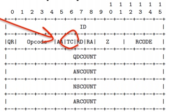
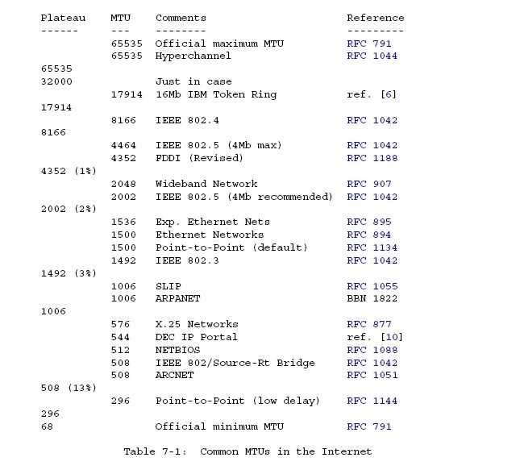

[toc]

# DNS

## What's IP packet size

RFC 791: maximum packet 576 octets.
RFC 1123: Limited by UDP, DNS record type size < 512 bytes, so resolvers and name servers should implement TCP services as a backup.

IPv4 UDP packet

* 20 bytes IP header
* <= 40 bytes IP options
* 8 bytes UDP header
* payload

IP header ∈ [28, 68] bytes while all hosts accept a 576 byte IP packet, so maximum UDP payload is 512 bytes. `??? 不是512-68=508吗`

If the reply is 

* <= 512 bytes, send a response over UDP
* > 512 bytes, send a response over UDP with TRUNCATED bit in DNS payload
	* trigger the client to re-query using TCP
		

RFC 2671: sender's UDP payload size is the number of octets that cal be reassembled and delivered in the sender's network stack. Note that path MTU, with or without fragment, may be smaller than this.

```
Datagram = Data block + Datagram header = 512 + 64 = 576 octets
Datagram header = typical internet header + margins for higher level protocols = 20 + 44 = 64
```

## Why UDP 512 bytes


Internet大多数网络接口`MTU < 512`，若`size > MTU`可能导致IP分片。由于只有1片带端口号信息，其他分片可能被防火墙拒绝导致通信障碍，为了保证信息通畅无阻需要

```
DNS报文 + UDP + IP < MTU
```

即

```
DNS报文 < MTU - UDP - IP = 512 - 8 - 20 = 484
```

取整

```
DNS报文 < 512
```

## Why 13 dns root domains

Nameserver starts up getting a list of root nameserver IP addresses to validate or update the built-in list.

DNS packet

* Header 12 bytes
* Question Section 5 bytes
	* root-label 1 byte
	* class 2 bytes
	* qtype 2 bytes
* Resource Record 31 bytes
	* root-label 1 byte
	* ttl 4 bytes
	* class 2 bytes
	* type 2 bytes
	* rdlength 2 bytes
	* nameserver name 20 bytes `<1>a<12>root-servers<3>net<0>`
* Other Record 15 bytes
	* root-label
	* ttl
	* class
	* type
	* rdlength
	* compression 4 bytes `<1><letter><compression pointer>`
* A Record 20 bytes ( with compression 16 bytes)
	* nameserver name 20 bytes
	* ttl 4 bytes
	* class 2 bytes
	* types 2 bytes
	* rdlength 2 bytes
	* address 4 bytes

DNS packet size

```
12       ;; ->>HEADER<<-
 5       ;; QUESTION SECTION:
31 + 15n ;; ANSWER SECTION:
     16m ;; ADDITIONAL SECTION:
```

Usually m = n, so the equation becomes

```
48 + 31n = 512
       n = 464 / 31 = 14.96
```


## Reference

https://ripe67.ripe.net/presentations/112-2013-10-16-dns-protocol.pdf

