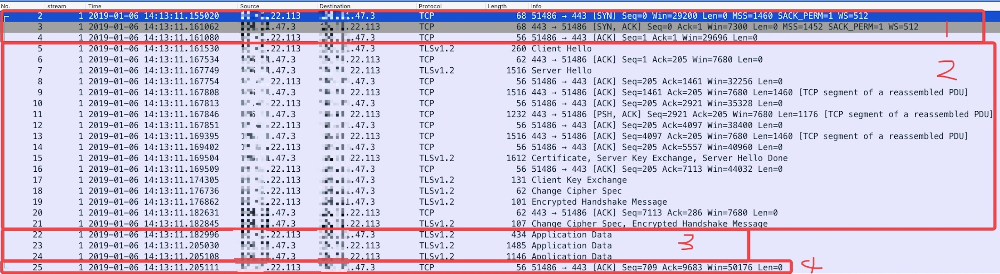
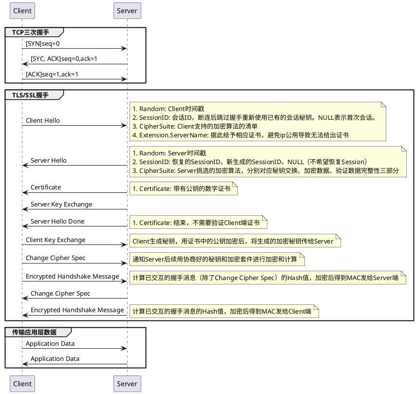

[toc]

# HTTPS请求偶发超时10s

问题

* 通过域名调用外网接口超时10s，占比30%

链路

* DNS解析 -> HTTPS请求

思路

1. 看整体，有没有特征
2. 顺着链路捋，有没有异常

原因

* Client没管理空闲连接，虽然Client和Server接入层的连接还保留着，但Server接入层和Server服务层已经超时断连
* Client连接数设置600，qps又过低，导致连接利用率过低，第一次请求几乎都取到无效连接，触发Client超时上限10s，第二次请求新建连接都处理成功

## 整体

机器：单机房16台，每台都有问题
时间：随机出现，占比约30%

Peace。

事后发现有特征，但是当时没注意。

## DNS解析

那看DNS吧，随机两台机器dig。

```
[root@core simulation_300]# dig +stats +question api.youku.com

; <<>> DiG redhat <<>> +stats +question api.youku.com
;; global options: +cmd
;; Got answer:
;; ->>HEADER<<- opcode: QUERY, status: NOERROR, id: 14486
;; flags: qr rd ra; QUERY: 1, ANSWER: 3, AUTHORITY: 2, ADDITIONAL: 1

;; OPT PSEUDOSECTION:
; EDNS: version: 0, flags:; udp: 4096
;; QUESTION SECTION:
;api.youku.com.			IN	A

;; ANSWER SECTION:
api.youku.com.		310	IN	CNAME	ipv6-aserver-heyi.m.taobao.com.
ipv6-aserver-heyi.m.taobao.com.	310 IN	CNAME	ipv6-aserver-heyi.m.taobao.com.gds.alibabadns.com.
ipv6-aserver-heyi.m.taobao.com.gds.alibabadns.com. 40 IN A 106.11.208.145

;; AUTHORITY SECTION:
alibabadns.com.		149745	IN	NS	ns1.alibabadns.com.
alibabadns.com.		149745	IN	NS	ns2.alibabadns.com.

;; Query time: 43 msec
;; SERVER: 127.0.0.1#53(127.0.0.1)
;; WHEN: Sun Jan 06 20:30:14 CST 2019
;; MSG SIZE  rcvd: 195
```

啥意思？？

### DNS

### DIG

#### 返回

1. 域名解析请求的信息

	```
	; <<>> DiG 9.9.4-RedHat-9.9.4-18.el7 <<>> +stats +question api.youku.com
	;; global options: +cmd	
	```

2. 返回内容概述

	```
	;; Got answer:
	;; ->>HEADER<<- opcode: QUERY, status: NOERROR, id: 14486
	;; flags: qr rd ra; QUERY: 1, ANSWER: 3, AUTHORITY: 2, ADDITIONAL: 1
	```
	
3. UNKNOWN

	```
	;; OPT PSEUDOSECTION:
	; EDNS: version: 0, flags:; udp: 4096
	```	

4. 解析结果106.11.208.145

	```
	;; ANSWER SECTION:
api.youku.com.		310	IN	CNAME	ipv6-aserver-heyi.m.taobao.com.
ipv6-aserver-heyi.m.taobao.com.	310 IN	CNAME	ipv6-aserver-heyi.m.taobao.com.gds.alibabadns.com.
ipv6-aserver-heyi.m.taobao.com.gds.alibabadns.com. 40 IN A 106.11.208.145
	```
	
5. 哪个nameserver解析的

	```
	;; ANSWER SECTION:
api.youku.com.		310	IN	CNAME	ipv6-aserver-heyi.m.taobao.com.
ipv6-aserver-heyi.m.taobao.com.	310 IN	CNAME	ipv6-aserver-heyi.m.taobao.com.gds.alibabadns.com.
ipv6-aserver-heyi.m.taobao.com.gds.alibabadns.com. 40 IN A 106.11.208.145
	```

6. UNKNOWN

	```
	;; AUTHORITY SECTION:
alibabadns.com.		149745	IN	NS	ns1.alibabadns.com.
alibabadns.com.		149745	IN	NS	ns2.alibabadns.com.

	;; ADDITIONAL SECTION:
ns1.alibabadns.com.	198	IN	A	140.205.122.66
ns1.alibabadns.com.	198	IN	A	198.11.138.254
ns2.alibabadns.com.	198	IN	A	140.205.67.254
ns2.alibabadns.com.	198	IN	A	106.11.35.18
	```
	
7. 统计信息

	```
	;; Query time: 43 msec
	;; SERVER: 127.0.0.1#53(127.0.0.1)
	;; WHEN: Sun Jan 06 20:30:14 CST 2019
	;; MSG SIZE  rcvd: 195
	```

#### 其他

1. 流程

	1. 解析请求参数`@server`指定的nameserver
	2. 解析`/etc/resolv.conf`中配置的servers
	3. 请求localhost

2. 其他

	4. 只输入dig，请求`.`域名根服务器
	5. 默认使用UDP请求nameserver，可以通过参数`+tcp`改为TCP
	6. 想看更多信息，使用参数`+trace`

3. 返回码含义

	0 好使
	1 姿势不对
	8 打不开文件（高级玩法，忽略）
	9 没响应（DNS解析有问题）
	10 域名解析服务器有问题（DNS解析有问题）

### 验证

crontab跑dig记录dns解析结果，解析结果虽然有变化但每个ip都好使，小概率是dns解析的问题。

接下来抓包排除dns解析问题，并且分析HTTPS请求是否有问题。

## Https建连



### TLS 1.2



### TBC


