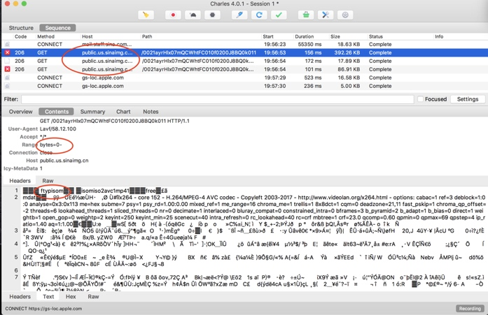
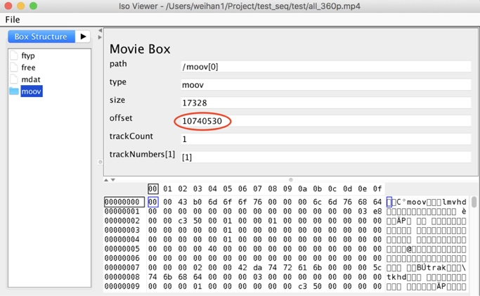
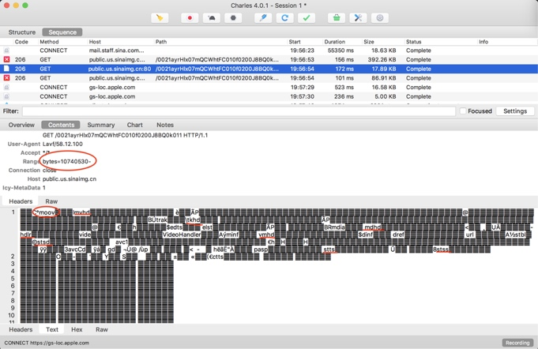
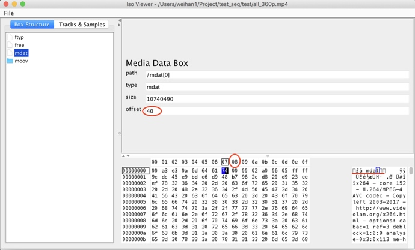
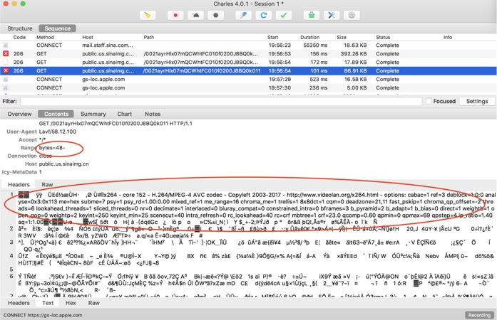
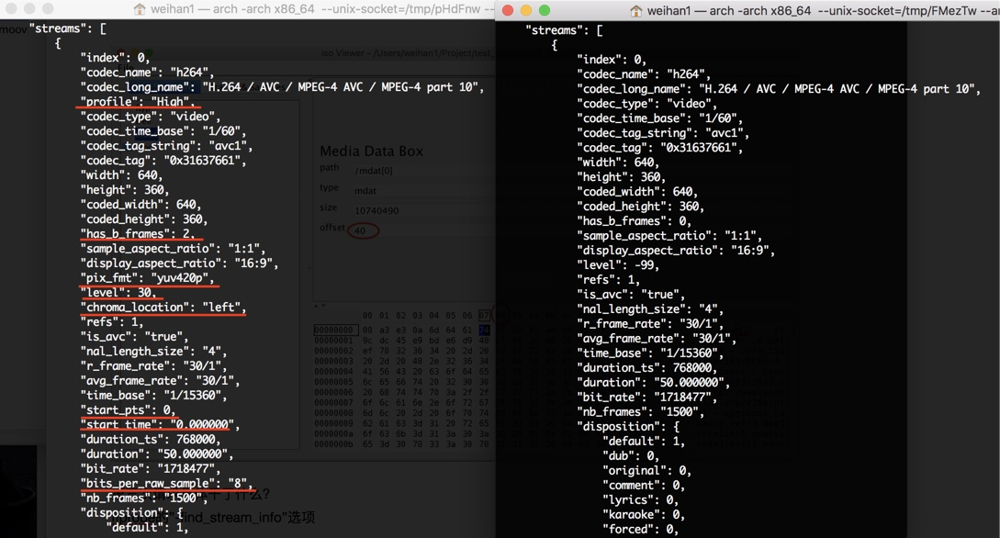
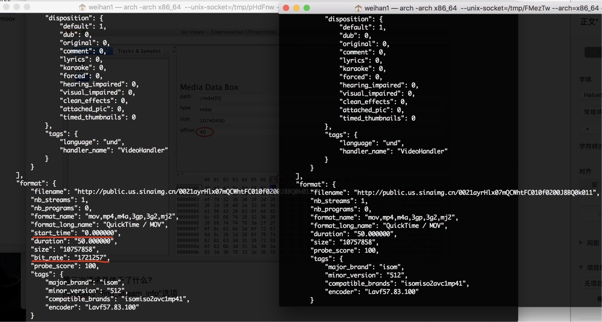
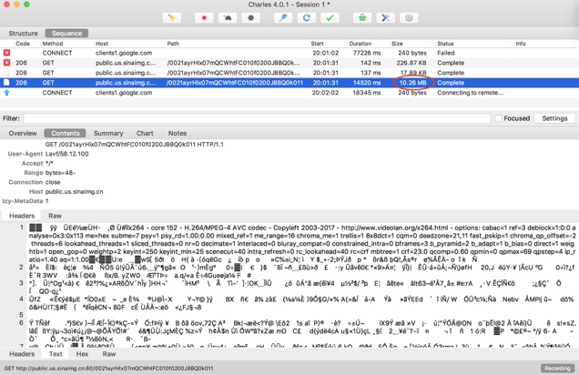

# Probe速度慢分析

1. 问题现象
   在使用ffprobe获取视频信息时，如果视频的moov box位于文件末尾，ffprobe请求数据量大，导致信息返回时间过长。

2. 目前ffprobe命令及使用该命令的目的
	1. 为了得到视频的格式和stream基本信息，使用如下命令
		ffprobe -show_format -show_streams -hide_banner -print_format json xxx

	2. 获取视频帧信息（视频每三秒返回一帧），使用如下命令
		ffprobe -select_streams v -show_frames -read_intervals "%00:03" -print_format json xxx 

3. 具体的请求过程
   这里首先使用抓包工具分析命令2.(1)请求的过程。（分析的mp4文件，其moov box位于末尾）
	1. 首次请求，ffprobe不知道mp4文件的情况，因此从头开始请求文件，并且不断对缓存的文件进行分析。
		
		
	2. 经过分析之后，发现文件的moov box在末尾，因此跳过中间的mdat数据，直接请求moov所在的位置。
		
		

	3. 分析完moov的信息后，ffprobe输出format和streams所需要的一些编码信息仍然没有得到，因此，再次请求mdat部分。
		
		

		最后一次请求，获取的信息如下图中红色下划线所示。
		
		

		至此，输出format和streams的信息完全获取到，完成这次命令的执行。
		命令2.(2)的执行过程与上面一致，只是最后一次请求，需要获取每一帧视频的信息，因此遍历了整个mdat数据。请求的数据量更大，更耗时。
		

4. 导致时间过长的原因
	1. HTTP请求次数比实际需要的多：第三次请求的信息并不需要。
	1. HTTP单次请求数据多于需求量：第一次请求不需要几百k的数据来确定moov是否在尾部。
	3. 命令使用不准确，请求了多余数据：我们需要的是第3秒的视频编码信息，但是命令2.(2)获取的是每隔3秒的视频帧信息，进而请求了所有帧的视频信息。
5. 未来优化方向
	1. 取消命令2.(1)的第三次请求。
	2. 减少第一次请求的数据量。
	3. 修改命令2.(2)，并且优化代码，未来能够快速获取某一时刻视频的帧信息。
	

